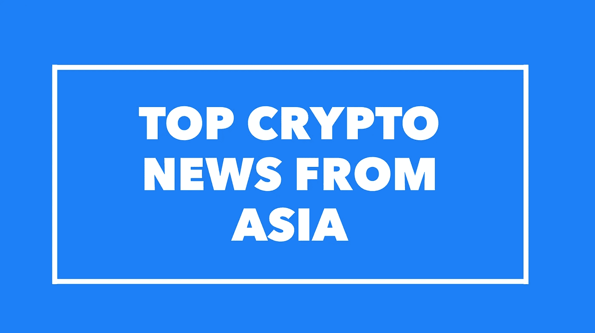
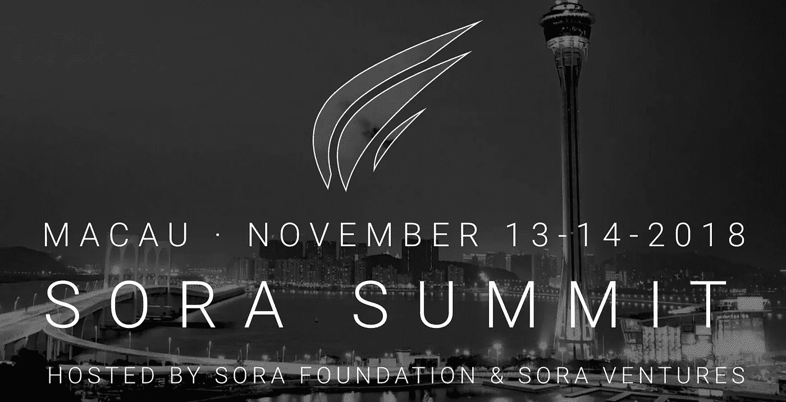

# 10 月 7 日至 10 日的亚洲顶级加密新闻

> 原文：<https://medium.com/hackernoon/top-asia-crypto-news-from-oct-7-10th-a52ff964b0dc>

*新加坡帮助加密公司开设当地银行账户；74%的 hashrt 由中国资金池控制；日本公司推出稳定币*

**密码业内人士对亚洲的解读。**

**周一至周三亚洲要闻**

普林斯顿/佛罗里达研究人员发表的一份有趣的白皮书指出，比特币网络上 74%的哈希值都在中国管理的矿池中。[http://bit.ly/2yt8bMx](https://globalcoinresearch.us17.list-manage.com/track/click?u=859b0d423a7f7baa4cdb46f26&id=1b9acb1f97&e=e8de32e54d)

**中国政府支持的组织正致力于发布关于智能合同、隐私和存款的三项区块链标准，**以便更好地指导中国区块链行业的发展:[http://bit.ly/2ytrxBk](https://globalcoinresearch.us17.list-manage.com/track/click?u=859b0d423a7f7baa4cdb46f26&id=eb4b622638&e=e8de32e54d)

日本 GMO 互联网集团将于 2019 年推出与日元挂钩的稳定货币，以国际汇款为目标:[http://bit.ly/2C7msC7](https://globalcoinresearch.us17.list-manage.com/track/click?u=859b0d423a7f7baa4cdb46f26&id=792763edbd&e=e8de32e54d)

韩国通讯巨头 **Kakao Corp 在 Q1 2019 发布会前发布区块链平台 testnet:**[http://bit.ly/2ywTZ56](https://globalcoinresearch.us17.list-manage.com/track/click?u=859b0d423a7f7baa4cdb46f26&id=63820cd100&e=e8de32e54d)

**http://bit.ly/2yvHdDZ 将字节币、聊天、图标经济**和**触发**全部退市

**新加坡金融监管机构愿意帮助在设立本地银行账户方面遇到问题的加密货币公司，**但不打算放松规则以吸引更多的加密初创公司进入新加坡:[http://bit.ly/2yt5EC1](https://globalcoinresearch.us17.list-manage.com/track/click?u=859b0d423a7f7baa4cdb46f26&id=4ad283e9f5&e=e8de32e54d)

印度政府-“**我们正在评估政府支持的加密货币**和加密令牌”。http://bit.ly/2yvKseD

交易和基金

http://bit.ly/2ybPYUy蜻蜓资本合伙公司是一家新的**1 亿美元风险投资基金，旨在帮助加密初创企业搭建中国和硅谷的桥梁**

**http://bit.ly/2yxsDvB[币安实验室投资数百万投资区块链审计平台 CertiK，](https://globalcoinresearch.us17.list-manage.com/track/click?u=859b0d423a7f7baa4cdb46f26&id=84c16fc7fc&e=e8de32e54d)**具体金额未透露

**a16zcrypto、Accel、币安实验室、潘迪拉资本和 Polychain Capital 联合 Oasis 推出 Oasis Startup Hub** 以推动开发者构建隐私优先的应用:[http://bit.ly/2yt8W8k](https://globalcoinresearch.us17.list-manage.com/track/click?u=859b0d423a7f7baa4cdb46f26&id=b32080b1ee&e=e8de32e54d)

硬币和代币新闻

**Terra 的目标是通过与亚洲领先的电子商务平台建立合作伙伴关系，利用平台庞大且不断增长的交易量，推动 stablecoins 在电子商务中的更广泛应用:[http://bit.ly/2ypOkOi](https://globalcoinresearch.us17.list-manage.com/track/click?u=859b0d423a7f7baa4cdb46f26&id=19d8609cea&e=e8de32e54d)**

XRP 可能是加密货币历史上第一个被采用为 2020 年东京奥运会官方货币的 T21。[http://bit.ly/2yqZeU0](https://globalcoinresearch.us17.list-manage.com/track/click?u=859b0d423a7f7baa4cdb46f26&id=9fd037fcae&e=e8de32e54d)

共和协议持有 3400 万美元的 ICO。其 22 岁的首席执行官是如何经营的:[http://bit.ly/2yrYJZZ](https://globalcoinresearch.us17.list-manage.com/track/click?u=859b0d423a7f7baa4cdb46f26&id=21901b164c&e=e8de32e54d)

基于 DAG 的分布式账本 Perlin 已经将其测试网**alpha**用于私人测试:[http://bit.ly/2yt3xOB](https://globalcoinresearch.us17.list-manage.com/track/click?u=859b0d423a7f7baa4cdb46f26&id=c53e3c567d&e=e8de32e54d)

开发区块链支付设备的 Pundi X 公司开发了世界上第一款区块链手机“XPhone”。[http://bit.ly/2ywYBbq](https://globalcoinresearch.us17.list-manage.com/track/click?u=859b0d423a7f7baa4cdb46f26&id=daf5e6e874&e=e8de32e54d)

交换新闻

**Digibyte 创始人贾里德·泰特抨击币安上市费:**[http://bit.ly/2OUajae](https://globalcoinresearch.us17.list-manage.com/track/click?u=859b0d423a7f7baa4cdb46f26&id=3aeca5427c&e=e8de32e54d)

Bitfinex 现在拥有第二富有的钱包:[http://bit.ly/2ydPOvQ](https://globalcoinresearch.us17.list-manage.com/track/click?u=859b0d423a7f7baa4cdb46f26&id=0bc22b726c&e=e8de32e54d)

**首个法定货币到加密货币的交易所**eureka pro 将在新加坡推出:[http://bit.ly/2ILhgoI](https://globalcoinresearch.us17.list-manage.com/track/click?u=859b0d423a7f7baa4cdb46f26&id=3a888fee8a&e=e8de32e54d)

韩国国家警察厅已编制了一份过去 3 年所有黑客事件的报告；**共有 7 个密码交换机和 158 个钱包被黑:**[http://bit.ly/2yqKkgD](https://globalcoinresearch.us17.list-manage.com/track/click?u=859b0d423a7f7baa4cdb46f26&id=60f3a8851f&e=e8de32e54d)

监管新闻

**台湾立法者提出了一项对国家洗钱控制法案**的修正案，以涵盖加密货币:[http://bit.ly/2C6nj5W](https://globalcoinresearch.us17.list-manage.com/track/click?u=859b0d423a7f7baa4cdb46f26&id=b703033b8d&e=e8de32e54d)

**泰国向区块链学习知识产权和贸易融资申请:**[http://bit.ly/2IOne8j](https://globalcoinresearch.us17.list-manage.com/track/click?u=859b0d423a7f7baa4cdb46f26&id=23fbe5ee86&e=e8de32e54d)

**中国男子因窃取火车动力开采比特币获刑 3.5 年**:【http://bit.ly/2ywK53o】T2

商业新闻

中国海南省**成为该国“首个”正式许可的“试验区”:**[http://bit.ly/2QFdTSX](https://globalcoinresearch.us17.list-manage.com/track/click?u=859b0d423a7f7baa4cdb46f26&id=63e3e27ef7&e=e8de32e54d)

**印度受攻击的路由器数量**翻了一番，达到近 3 万台:[http://bit.ly/2OfdsCj](https://globalcoinresearch.us17.list-manage.com/track/click?u=859b0d423a7f7baa4cdb46f26&id=9b40fee4e2&e=e8de32e54d)

韩国食品巨头农心的子公司利用区块链实现牛肉的端到端可追溯性:[http://bit.ly/2C9hp4d](https://globalcoinresearch.us17.list-manage.com/track/click?u=859b0d423a7f7baa4cdb46f26&id=8c74650252&e=e8de32e54d)

**以防你错过**

我们与黑脸田鸡风险投资公司 Jason Fang 的新播客发布了！

在这一集里，来自全球硬币研究公司的 Joyce Yang 加入了风险投资公司的执行合伙人 Jason Fang 的行列，这是一家专注于区块链和加密投资的亚洲风险投资公司。该基金的使命是投资于能够利用区块链技术为我们的世界带来积极变化的企业家。他们的投资包括迅雷、Urbit、Mithril、Alphaslot 等等。

此外，[黑脸田鸡峰会](https://globalcoinresearch.us17.list-manage.com/track/click?u=859b0d423a7f7baa4cdb46f26&id=4edc0773ae&e=e8de32e54d)将于 11 月 13 日至 14 日在澳门举行。请在 28:41 收听 Jason 关于为什么峰会将在澳门举行的播客，并查看演讲者和与会者的阵容。

**使用折扣代码 SORAMEDIA2018 享受八折优惠**

Jason 是 Fenbushi Capital 最早的员工之一，并在 2017 年 Mainland China 禁止 ico 时创办了黑脸田鸡风险投资公司。当我最初与 Jason 交谈时，我发现他非常有想法，他的投资方法在我见过的加密投资者中非常独特。在我们的对话中，我们讨论了黑脸田鸡如何投资加密项目，Jason 对加密领域的展望，以及他对东西方加密发展的看法。

[**我们采访讨论的时间和话题**](https://globalcoinresearch.us17.list-manage.com/track/click?u=859b0d423a7f7baa4cdb46f26&id=e912763193&e=e8de32e54d)

1:24-介绍杰森、黑脸田鸡风险投资公司及其背景
3:59-中国禁止 ICOs 后黑脸田鸡风险投资公司是如何起步的
6:09-尽管总部位于中国上海，为什么黑脸田鸡不投资中国项目
7:55-黑脸田鸡如何看待投资区块链和加密空间
19:46-你为什么喜欢反向 ICOs 模式？
21:34-衡量反向投资成功的标准-ICOs
22:54-亚洲和西方之间的区块链空间会融合吗？
28:41-查看即将于 11 月 13 日至 14 日举行的[黑脸田鸡峰会](https://globalcoinresearch.us17.list-manage.com/track/click?u=859b0d423a7f7baa4cdb46f26&id=60e21f0b49&e=e8de32e54d)，使用 **SORAMEDIA2018** 获得 80%的门票折扣
33:06-亚洲当前的基金环境以及有多少基金已经停止投资加密
34:47-您认为加密领域的赢家会是谁？
35:20-深思熟虑投资的实用方法

*你也可以在这里阅读 Jason 关于他的媒体文章的想法，在那里他展示了黑脸田鸡的投资论点和他对亚洲的展望:*
[黑脸田鸡风险投资公司对区块链投资的哲学](https://globalcoinresearch.us17.list-manage.com/track/click?u=859b0d423a7f7baa4cdb46f26&id=2436da8364&e=e8de32e54d)
[了解中国的秘密投资者](https://globalcoinresearch.us17.list-manage.com/track/click?u=859b0d423a7f7baa4cdb46f26&id=72ec2f99b6&e=e8de32e54d)

[订阅](https://globalcoinresearch.us17.list-manage.com/track/click?u=859b0d423a7f7baa4cdb46f26&id=c6ca5150a0&e=e8de32e54d)