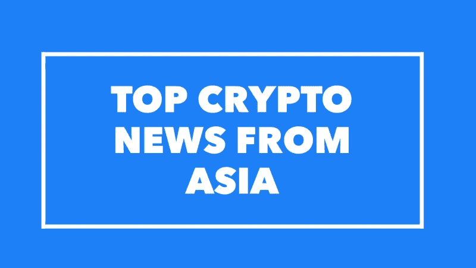

# 10 月 17 日至 20 日亚洲顶级加密新闻综述

> 原文：<https://medium.com/hackernoon/top-asia-crypto-news-roundup-from-oct-17-20-b875d126f61f>

密码业内人士对亚洲的解读。

🙏**谢谢**

全球硬币研究自豪地宣布，我们已经加入了[信息](https://www.theinformation.com/)加速器。

我们从 19 个国家的 100 名申请者中被选中，成为 2019 届的一员，我们很荣幸能够与 Nina Xiang 的[中国货币网](https://www.chinamoneynetwork.com/)、David Skok 的 [The Logic](https://thelogic.co/) 和 Sherrell Dorsey 的 [ThePLUG](https://medium.com/theplug) 一起加入。

你可以在这里阅读关于所有班级成员和出版物的所有信息[。](http://cio.theinformation.com/e/c/eyJlbWFpbF9pZCI6IlpKSDNBZ0FCWnBJQk90c0VkZXJ2N1lDWC1VSnQiLCJocmVmIjoiaHR0cDovL3RoZWluZm9ybWF0aW9uLmNvbS9hY2NlbGVyYXRvcj91dG1fbWVkaXVtPWVtYWlsXHUwMDI2dXRtX3NvdXJjZT1jaW8iLCJsaW5rX2lkIjoxNjI2MzIyNDgsInBvc2l0aW9uIjoxNX0/381bffdf5900b6f394e6d7de94bc12a1cecef7c752538a6c0c2f66a0fc7f3915)

GCR 的成立有一个简单的使命，即成为社区最可靠的新闻来源，这些社区希望了解亚洲加密和区块链的最新动态，并分享你在其他地方不会读到的故事和独家新闻。

我们将继续努力，每天都做到最好，感谢您迄今为止的所有支持。

[与朋友分享](mailto:?subject=Check%20out%20this%20Asia%20crypto%20newsletter&body=GlobalCoinResearch.com%0A%0A)

🌟**周三至周五亚洲要闻**

💰交易和基金

总部位于泰国的区块链和在线支付初创公司**错过了一轮未披露的融资，由日本风险投资公司 Global Brain** 牵头，三井富士山的企业风险投资部门 31VENTURES 和现有支持者印度尼西亚风险投资公司 Sinar Mas Digital Ventures 参与。[http://bit.ly/2J8e86G](http://bit.ly/2J8e86G)

TAP 获得了 Alphabit 和 FBG 资本的投资。[http://bit.ly/2Je0rmN](http://bit.ly/2Je0rmN)

**F2Pool 创始人的加密货币钱包初创公司 Cobo 融资 1300 万美元**A 轮进入美国和东南亚，来自 NEO Global Capital 的 Danhua。[http://bit.ly/2J6HuSE](http://bit.ly/2J6HuSE)

**NEO Global Development 与领先的量子抵抗技术项目 Arqit** 合作:【http://bit.ly/2yoUbnF】T2

💰硬币和代币新闻

**【上次链接错误】**亚马逊网络服务中国事业部与 http://bit.ly/2yk189K[公共区块链项目 Qtum 合作](http://bit.ly/2yk189K)

关于 ICON 如何看待它与政府及其不同部门的关系，这是一个有偏见但有趣的观点。如何在像韩国这样的国家取得成功的生动视角。[http://bit.ly/2J74XmQ](http://bit.ly/2J74XmQ)

马来西亚到西班牙:**亚洲金融科技公司完成瑞波区块链 API** 付款:[http://bit.ly/2Jd40JX](http://bit.ly/2Jd40JX)

据报道，Tron 区块链上发布的第一款游戏 **DApp 将会** **大受欢迎，**据报道在第一天就有超过 10，000 的播放量:[http://bit.ly/2yrnS7X](http://bit.ly/2yrnS7X)

💸交换新闻

Zebpay 是印度最大的交易所之一，**在马耳他注册了一个办事处**，不仅为这个岛国的公民和居民服务，也为其他欧洲国家服务:[http://bit.ly/2PfXLuk](http://bit.ly/2PfXLuk)

**http://bit.ly/2J6bdLL 币安烧掉 160 多万 BNB 硬币**但价格下降

http://bit.ly/2PINcwB 首席财务官称**加密交易所寻求增加新的稳定账户:**

🎌监管新闻

日本一个税收政策委员会举行了一场旨在**简化加密货币税的辩论:**[http://bit.ly/2PKNHq0](http://bit.ly/2PKNHq0)

在席卷中国女演员范冰冰的**税务丑闻之后，区块链科技如何改善税务系统的未来？；[http://bit.ly/2R0iQWE](http://bit.ly/2R0iQWE)**

一份由世界银行集团相关专家撰写的新论文提议发展一个区块链网络**以提高全球政府采购系统的效率**:【http://bit.ly/2NOWYeU】T2

http://bit.ly/2PJRTWW**中国独特的加密模式——**解释中国禁令的系列文章之首

💼商业新闻

三星**推出了其 7 纳米低功耗 Plus 工艺节点**的新生产工艺，该工艺可将采矿能耗降低高达 50%:[http://bit.ly/2P9FqPb](http://bit.ly/2P9FqPb)

**埃森哲和 Digital Ventures 在泰国[http://bit.ly/2S4SXpQ](http://bit.ly/2S4SXpQ)共同开发并推出首款区块链解决方案**

日本电力公司**与银行、大学合作进行区块链研究**:[http://bit.ly/2ypEmNP](http://bit.ly/2ypEmNP)

在熊市中，**二手比特币挖矿机的价格暴跌至 10-30 美元——相当于中国的人民币:**[http://bit.ly/2yqAj3Q](http://bit.ly/2yqAj3Q)

**同一群拥护者，不同的盛传；关于那些被与区块链有关的欺诈所利用的个人投资者的后续报道:[http://bit.ly/2S2IueD](http://bit.ly/2S2IueD)**

🎉我们的新播客出来了！与 Neo Global Capital 的创始合伙人 Roger Lim**🎉**

**在这一集里，全球硬币研究公司的乔伊斯·杨在新加坡会见了[近地天体全球资本](https://www.linkedin.com/in/limroger/)的创始合伙人之一罗杰·林。罗杰是一位经验丰富的天使和区块链投资者。他是 Bluzelle、Qlink、CoinFi、Selfkey、TheKey、Tomocoin、0Chain、nOS、Open Platform 的顾问。在进入 crypto 之前，Roger 是一名成功的企业家，他创建并出售了云托管公司 Webvisions。**

**在这一集中，Roger 和 Joyce 讨论了 NGC 如何将其来自新加坡和中国的 4 亿美元基金部署到世界各地的项目中，即近地天体生态系统基金，以及亚洲团队如何看待亚洲和美国的加密生态系统。**

**[关于 NEO Global Capital](https://www.ngc.fund/):NEO Global Capital 是 NEO 基金会的战略投资工具。该公司通过两个基金进行投资，其中一个是 NEO 生态系统基金，旨在支持 NEO 及其 dApps 和项目的生态系统。另一只基金投资于与区块链有关的鼓舞人心的项目。该团队由新加坡和上海两地组成。Neo Global Capital 最近的投资包括 SKALE Labs、Muzika、Contentos。**