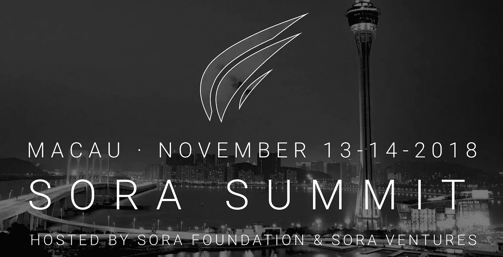

# 10 月 9 日至 10 月 13 日亚洲顶级加密新闻综述

> 原文：<https://medium.com/hackernoon/top-asia-crypto-news-roundup-from-oct-9-oct-13th-64efa5abba78>

密码业内人士对亚洲的解读。

[与朋友分享](mailto:?subject=Check%20out%20this%20Asia%20crypto%20newsletter&body=GlobalCoinResearch.com%0A%0A)

🌟**周三至周六亚洲头条新闻**

**Jehan Chu，Kenetic 联合创始人兼管理合伙人**谈投资区块链项目、适当的尽职调查以及主流区块链采用的考虑因素。[http://bit.ly/2PwPGhD](http://bit.ly/2PwPGhD)

中国的秘密矿池 viaBTC 通过 ICO 在 2.2 小时内筹集了 3000 万美元:[http://bit.ly/2QNX0Wu](http://bit.ly/2QNX0Wu)

**日本 Infinity Ventures 年目标是 maiden global crypto fund**(日本没有任何大型加密基金)，由大和证券、KDDI 和 Line 等合作伙伴支持。[http://bit.ly/2PwGg5J](http://bit.ly/2PwGg5J)

**比特大陆最新挑战者** MicroBT 计划 2019 年申请 IPO:[http://bit.ly/2ITh1Ii](http://bit.ly/2ITh1Ii)

http://bit.ly/2A6ndKn，币安新任慈善负责人经营着一家工厂，那里的工人每月收入不到 50 英镑

💰交易和基金

**http://bit.ly/2C9JrfQ 的数字资产基金在 2018 年下跌 72%** 比特币“仅”下跌 50%

**投资银行 CLSA 推出专注于亚洲的早期金融科技基金** AlphaLabs，投资包括区块链科技。[http://bit.ly/2PvKElm](http://bit.ly/2PvKElm)

💰硬币和代币新闻

新加波初创公司 GCOX 宣布计划推出**http://bit.ly/2pRx8NL**曼尼·帕奎奥[加密货币](http://bit.ly/2pRx8NL)

**http://bit.ly/2A9b0V7[币安币现在可以通过平台 Propy](http://bit.ly/2A9b0V7)** 购买房产

💸交换新闻

被黑的 http://bit.ly/2CFiT71 密码交易所 Zaif **发布客户资产金融支持计划:** [日](http://bit.ly/2CFiT71)

加密交易所 **Bitfinex 暂停法定存款**，预计“一周内”恢复:【http://bit.ly/2RHInVM】T2

http://bit.ly/2Cdw1zf 整形外科医生以 3 . 53 亿美元收购 T4 Bithumb 加密货币交易所

韩国密码交易所**被起诉价格操纵令牌方案**:[http://bit.ly/2OlykHW](http://bit.ly/2OlykHW)

🎌监管新闻

**印度总理全力支持分布式账本技术**:[http://bit.ly/2IZ7TlD](http://bit.ly/2IZ7TlD)

扼杀比特币后，**印度可能推出自己的加密货币**:[http://bit.ly/2pOYYdq](http://bit.ly/2pOYYdq)

尽管呼吁合法，南韩仍然坚定的禁止 ICO:[http://bit.ly/2OSgWKf](http://bit.ly/2OSgWKf)

💼商业新闻

在中国一家大型招聘服务提供商最近的报告中，中国对区块链人才的需求增加了六倍。[http://bit.ly/2PyTONV](http://bit.ly/2PyTONV)

**尽管处于熊市，但加密货币企业家现在是中国最富有的人**:[http://bit.ly/2yyezSB](http://bit.ly/2yyezSB)

新加坡将**帮助** **密码公司设立本地银行账户:**[https://bloom.bg/2EhP9yM](https://bloom.bg/2EhP9yM)

**以防你错过**

[我们来自黑脸田鸡风险投资公司的 Jason Fang 的新播客出来了！](https://globalcoinresearch.us17.list-manage.com/track/click?u=859b0d423a7f7baa4cdb46f26&id=e77852a0f5&e=a1f04d06bc)

在这一集里，来自全球硬币研究公司的 Joyce Yang 加入了黑脸田鸡风险投资公司的执行合伙人 Jason Fang 的行列，这是一家专注于区块链和加密投资的亚洲风险投资公司。该基金的使命是投资于能够利用区块链技术为我们的世界带来积极变化的企业家。他们的投资包括迅雷、Urbit、Mithril、Alphaslot 等等。

此外，[黑脸田鸡峰会](https://globalcoinresearch.us17.list-manage.com/track/click?u=859b0d423a7f7baa4cdb46f26&id=22a7a29099&e=a1f04d06bc)将于 11 月 13 日至 14 日在澳门举行。请在 28:41 收听 Jason 关于为什么峰会将在澳门举行的播客，并查看演讲者和与会者的阵容。

**使用折扣代码 SORAMEDIA2018 享受八折优惠**

Jason 是 Fenbushi Capital 最早的员工之一，并在 2017 年 Mainland China 禁止 ico 时创办了黑脸田鸡风险投资公司。当我最初与 Jason 交谈时，我发现他非常有想法，他的投资方法在我见过的加密投资者中非常独特。在我们的对话中，我们讨论了黑脸田鸡如何投资加密项目，Jason 对加密领域的展望，以及他对东西方加密发展的看法。

[**我们采访中讨论的时间和话题**](https://globalcoinresearch.us17.list-manage.com/track/click?u=859b0d423a7f7baa4cdb46f26&id=fdf830cab6&e=a1f04d06bc)

1:24-介绍杰森、黑脸田鸡风险投资公司及其背景
3:59-黑脸田鸡风险投资公司是如何在中国禁止 ICOs 后起步的
6:09-为什么黑脸田鸡尽管总部位于中国上海却不投资中国项目
7:55-黑脸田鸡如何看待投资区块链和秘密空间
19:46-你为什么喜欢反向 ICOs 模式？
21:34-衡量 reverse 成功的标准-ICOs
22:54-亚洲和西方之间的区块链空间会融合吗？
28:41-查看即将于 11 月 13 日至 14 日举行的[黑脸田鸡峰会](https://globalcoinresearch.us17.list-manage.com/track/click?u=859b0d423a7f7baa4cdb46f26&id=6058315485&e=a1f04d06bc)，使用 **SORAMEDIA2018** 获得 80%的门票折扣
33:06-亚洲当前的基金环境以及有多少基金已经停止投资 crypto
34:47-您认为 crypto 的赢家在哪里？
35:20-深思熟虑投资的实用方法

*你也可以在这里阅读 Jason 在他的媒体文章中的想法，在那里他展示了黑脸田鸡的投资论点和他对亚洲的展望:*
[黑脸田鸡风险投资公司对区块链投资的哲学](https://globalcoinresearch.us17.list-manage.com/track/click?u=859b0d423a7f7baa4cdb46f26&id=862823a228&e=a1f04d06bc)
[了解中国的秘密投资者](https://globalcoinresearch.us17.list-manage.com/track/click?u=859b0d423a7f7baa4cdb46f26&id=6ff3295a71&e=a1f04d06bc)

[订阅](http://globalcoinresearch.com/)