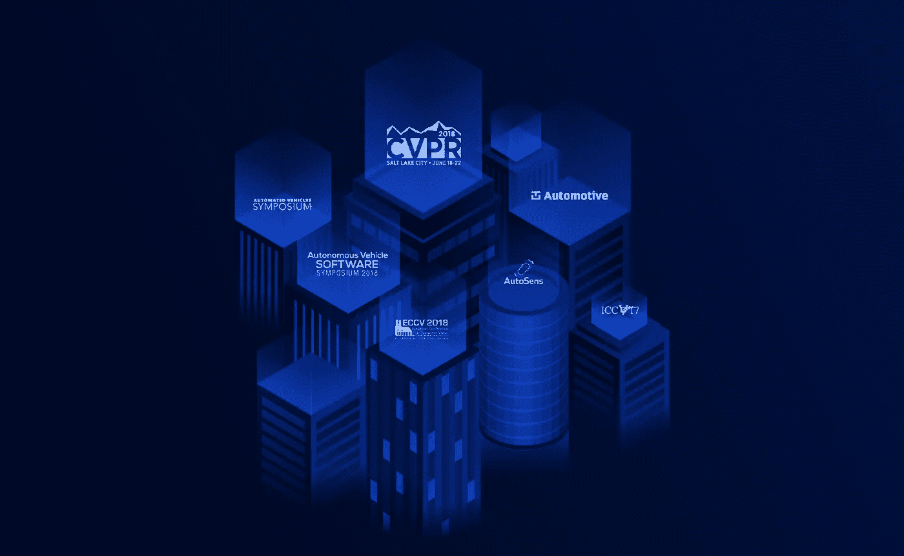

# 将于 2018-19 年参加的顶级自动驾驶汽车会议

> 原文：<https://medium.com/hackernoon/top-autonomous-vehicle-conferences-to-attend-in-2018-19-d3a526a41a9a>

随着自动驾驶技术、计算机视觉和深度学习的普及，人工智能的潜力一次又一次被证明是巨大的。这个蓬勃发展的行业已经产生了有影响力的人、研究人员和一些会议。对于研究人员来说，会议是提交论文、举办研讨会和与志同道合的人建立联系的最谨慎的方式之一。

以下是您应该考虑参加的全球顶级自动驾驶汽车会议(按先后顺序排列):

# [自动驾驶汽车软件研讨会](http://www.autonomousvehicle-software.com/en/)

6 月 5 日至 7 日 **|** 德国斯图加特

自动驾驶汽车软件研讨会——与自动驾驶汽车技术世界博览会、自动驾驶汽车测试和开发研讨会以及自动驾驶汽车内部设计和技术研讨会同时举行——将在**讨论、强调和辩论自动驾驶汽车软件编程所涉及的挑战**，并研究如何**大幅缩短开发时间，同时提高安全性**并有效应对人工智能挑战和决策过程。

**演讲嘉宾**:弗洛里安·鲍曼(Adasens Automotive GmbH 技术总监)、赫尔曼·库曼斯(Amazon Web Services 高级解决方案架构经理)、托马斯·沙恩霍斯特(AUTOSAR 开发合作伙伴发言人)、Vignesh Radhakrishnan(AVL 高级 ADAS/AD 系统工程师)、赵露(BestMile 首席技术官)

# [图汽车底特律](https://automotive.knect365.com/tu-auto-detroit/)

6 月 6 日至 7 日 **|** 密歇根州底特律市

TU-Automotive Detroit 是世界上最大的会议和展览，展示互联和自动驾驶汽车的未来。今年将有关于 ADAS &自动驾驶汽车、智能城市&城市移动性、互联服务等的**深度跟踪。来自汽车制造商、一级市场、初创企业、投资者、tsp、软件开发人员等的 3250 名高管将出席会议，不要错过这个宝贵的交流机会。**

**演讲者**:扎克·希克斯(丰田互联公司总裁兼首席执行官)、艾莉森·帕斯卡尔(美国奥迪公司高级政策战略家)、拉多万·米乌契奇(长安美国研发中心技术专家)、约瑟夫·巴克(通用汽车公司产品网络安全总监)

# [CVPR 2018 年奥运会(计算机视觉和模式识别)](http://cvpr2018.thecvf.com/)

6 月 18 日至 22 日 **|** 犹他州盐湖城

CVPR 是顶级的年度计算机视觉盛会，由主会议和几个共址研讨会和短期课程组成。凭借其**的高质量和低成本，它为学生、学者和行业研究人员提供了非凡的价值**。超过 3300 篇主要会议论文提交和 979 篇被接受的论文，CVPR 2018 提供了一个令人兴奋的计划，涵盖了计算机视觉领域的各种最新工作。除了主项目，CVPR 2018 还包括 **21 场辅导课，48 场研讨会，一年一度的博士联盟，以及超过 115 家公司参加的工业展览。**

**演讲嘉宾**:迈克尔·S·布朗博士(加拿大计算机视觉研究主席教授)、Bryan S. Morse(杨百翰大学计算机科学教授)、Shmuel Peleg(希伯来大学计算机科学教授)、Aude Oliva(首席研究科学家，CSAIL | MIT-IBM Watson AI 实验室执行主任)、Deva Ramanan(卡耐基梅隆大学机器人研究所副教授)

# [自动化车辆研讨会](http://www.automatedvehiclessymposium.org/home)

7 月 9 日至 12 日|加利福尼亚州旧金山

该会议聚集了来自世界各地的行业、政府和学术界，以解决复杂的技术、运营和政策问题。它旨在**告知、参与和支持安全和自动化移动的进展**。本次会议的主题包括法律、基础设施、人为因素、共享移动性、网络安全、公共政策和消费者接受度。该研讨会已经是第四届了，是世界上最大的专用自动车辆会议。

**演讲嘉宾**:Hajime Amano(ITS 日本总裁兼首席执行官)、Thomas A. Dingus 博士(弗吉尼亚理工大学交通研究所所长)、Iain Forbes(英国交通部联网和自动驾驶汽车中心主任)、Neil Pedersen(交通研究委员会执行董事)、Kristin Kolo dge(j . d . Power 公司驾驶员交互和人机界面执行董事)

# [ECCV(欧洲计算机视觉会议)](https://eccv2018.org/)

9 月 8 日至 14 日|德国慕尼黑

**ECCV** ，即**欧洲计算机视觉会议**，是两年一次的研究会议，会议记录由施普林格科学+商业媒体出版。与 ICCV 在范围和质量上相似，ICCV 没有举办。

像其他顶级计算机视觉会议一样，ECCV 有**辅导讲座、技术会议和海报会议**。会议通常持续五到六天，中间三天是主要的技术项目，在会议开始和结束时会举行针对特定主题的辅导和研讨会。

**演讲者**:待定

# [AutoSens 布鲁塞尔](https://auto-sens.com/autosens-brussels/)

9 月 17 日至 20 日 **|** 比利时布鲁塞尔

参加比利时布鲁塞尔汽车世界的 450 多名工程师和技术专家，参加这一世界级会议的国际版——旨在改变车辆感知技术未来的领先技术讨论。AutoSens 将汽车感知所有学科的技术专家联系在一起，进行交流、合作、解决共同的挑战，并更快地推进 ADAS 技术。

该活动汇集了来自多个工程学科的工程师，包括汽车成像、激光雷达、雷达、图像处理、计算机视觉、车内联网、测试和验证、认证和标准。AutoSens 是一个面向支持工程活动的协作环境。

演讲者:待定

# [IROS(智能机器人国际会议)](https://www.iros2018.org/)

10 月 1 日至 5 日 **|** 西班牙马德里

该会议为全球机器人界提供了一个国际论坛，以探索智能机器人和智能机器的科学和技术前沿，并激发创新思想，交流技术观点和评估未来方向。除了技术会议和多媒体演示，IROS 会议还举行小组讨论，研讨会，教程，展览和技术参观，以加强与会者之间的技术交流。

**发言人**:待定

# [SAE 2018 ADAS 至自动驾驶研讨会](https://www.sae.org/attend/adas/)

10 月 9 日至 11 日 **|** 密歇根州底特律市

这一高度技术性的活动支持该行业努力增加高级驾驶辅助系统(ADAS)和全自动驾驶的采用。这一焦点活动带领工程师、系统开发人员和管理人员了解 ADAS 技术在未来向自动驾驶汽车过渡时的演进步骤。

2018 年的活动将专注于自动驾驶和主动安全，以更全面地了解这项进化技术。请听来自欧洲、亚洲和北美的专家讨论这项技术面临的挑战和机遇，如消费者接受度、政府监管和全球协调。

演讲者:待定

# [图欧汽车](https://automotive.knect365.com/tu-auto-europe/)

10 月 30 日至 31 日|德国慕尼黑

TU-Automotive Europe 是欧洲最大的会议和展览，展示互联汽车和汽车的未来。本次会议有 750 名与会者、80 多名发言人和 40 多场演讲，是联网汽车和自动驾驶汽车领域最具创新思维的中心。对于那些想要体验颠覆性技术和不可错过的网络的人来说，这个会议是必须参加的。

**演讲嘉宾**:海科·胡特尔(大众汽车联网汽车负责人)、莎莉·莱泽斯(阿斯顿·马丁·拉贡达有限公司电气首席工程师)、克里斯蒂安·克劳斯(宝马汽车数据部经理)、卡洛·亚科维尼(当地汽车公司营销总监)、尼古拉·波恰尼(兰博基尼联网汽车数字化负责人&)、塞巴斯蒂安·佩克(InMotion Ventures 董事总经理)

# ICCV(计算机视觉国际会议)

**ICCV** ，**计算机视觉国际会议**，是由电气和电子工程师协会(IEEE)主办的研究会议，每两年举行一次。它和 CVPR 一起被认为是计算机视觉领域的顶级会议。

本次会议旨在汇集领先的学术科学家、研究人员和研究学者，交流和分享他们在计算机视觉各个方面的经验和研究成果。它还为研究人员、从业人员和教育工作者提供了一个主要的跨学科平台，以展示和讨论计算机视觉领域的最新创新、趋势和关注点，以及遇到的实际挑战和采用的解决方案。

我们在 Playment，旨在参加上述会议，更深入地了解[自动驾驶汽车](https://playment.io/adas/)的世界。请注意我们在会议中的摊位！

如果你对人工智能和机器学习感兴趣，我们挑选的[顶级人工智能会议](https://blog.playment.io/ai-conferences/)可能会有用。