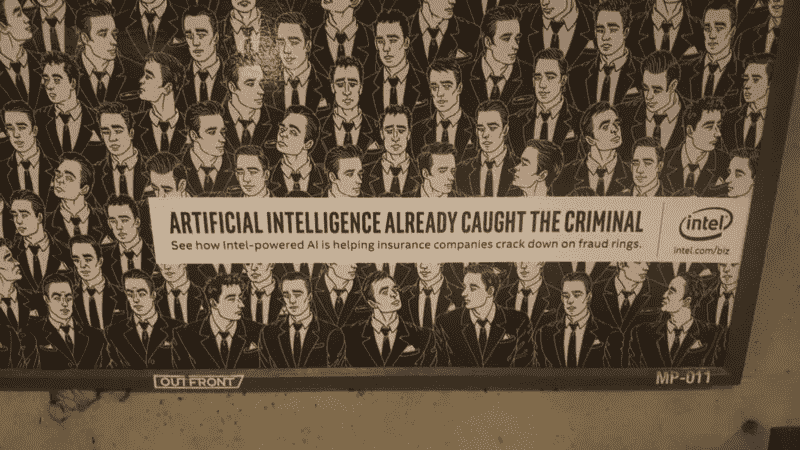

# 推动 2018 年增长的顶级 B2B 营销趋势

> 原文：<https://medium.com/hackernoon/top-b2b-marketing-trends-set-to-drive-growth-in-2018-464f585d1a18>

## 精英中的精英今年关注的是什么。

*我最初在 Quora* *上写了这个* [*帖子的一个更短的版本——根据反馈，我决定在这里创建一个更长、更深入的版本，在媒体上很容易找到。*](https://www.quora.com/What-are-the-digital-marketing-trends-for-2018)

[营销](https://hackernoon.com/tagged/marketing)有很多不同的风格，取决于你的目标受众。我想先说一下，这篇文章关注的是 B2B 企业营销策略，可能不适用于 B2C 或生活方式公司。

# LinkedIn 将取代脸书的广告预算

营销人员越来越意识到顾客的意图以及环境对转化率的影响。LinkedIn 是一个工作平台，这意味着那里的用户专注于与工作相关的项目。相比之下，脸书是一个家庭和社交平台，人们可以浏览他们朋友、孩子、宠物、假期和食物的照片。

如果你得到了客户的许可，他们不会介意广告，但是断章取义或过度侵扰的广告会损害品牌声誉，让人觉得受到了侵扰，并最终损害客户关系。

# 基于客户的定位

营销人员已经选择质量胜于数量。我相信，今年我们将看到营销人员采取以客户为基础的营销策略。这些策略增加了每次收购的成本，但提高了成交率，缩短了成交时间。

除了达成更多交易之外，采用超针对性方法的营销组织能够消除大量时间、支出和能源浪费。从而形成精干、敏捷的团队，产生可持续的高质量销售线索流。

# 增长黑客之死

营销机构已经开始意识到‘增长黑客’90%是炒作，0%是执行，10%是 BS。“增长黑客”的角色将被淘汰，因为投资回报率和组织价值都很低。

我相信，我们将看到营销界开始形成两种截然不同的角色，广告商和需求生成。广告商将专注于创意、社交、品牌和内容。需求生成将关注将销售线索纳入漏斗的活动。这包括活动、付费广告、播客、影响者营销、潜在客户培育、列表购买、电子邮件营销等等。

我在 LinkedIn 上看到了 Sales Hacker 的营销副总裁 Gaetano Nino dinar di[的一篇很棒的帖子:](https://www.linkedin.com/in/officialg/)

 [## 加埃塔诺·尼诺·迪纳迪在 LinkedIn 上写道:“想知道为什么增长黑客吗...

### 想知道为什么增长黑客不起作用吗？(至少从长期来看)，因为这是一个走捷径的过程…

www.linkedin.com](https://www.linkedin.com/feed/update/urn:li:activity:6367149064890441729) 

# 销售和营销之间的界限很模糊

由于首席收入官(cro)所扮演的统一角色，销售/营销协调这一经典问题在组织中不再普遍。销售和营销变得越一致，划分两者就变得越不重要，越成为日常活动和技能的简单区分。

随着需求生成角色的增加(如上所述)，营销将开始掌控销售流程的早期阶段，包括安排约会和确认呼入销售线索。

# 微时刻的兴起

强大的品牌是通过成百上千次与客户的微观互动建立起来的。而微时刻则略有不同。微时刻专注于抓住潜在客户的全部注意力，并在 2-7 秒内从混乱中抽离出来。

一个例子是，英特尔如何通过人工智能广告吸引 DC 地铁乘客的注意力，吸引他们等待火车。

# 视频内容继续占据主导地位

2017 年，视频成为几乎所有社交平台上最主要的原生内容形式。早期采用者发现了这一点——现在是其他人效仿的时候了。

今年，我们将看到公司投入时间制作大量的视频内容。像 Gary V .这样的社会影响者已经证明，视频内容不需要高质量，但必须有数量，并且必须以全新的方式呈现。

密切关注 iPhone 质量的视频内容，这些内容每天都由品牌知名度高的个人发布。

 [## 8 场精彩的鼓舞人心的 B2B 视频营销活动

### 三月初，第 90 届奥斯卡金像奖将表彰过去一年电影的最高成就。这个年度…

business.linkedin.com](https://business.linkedin.com/marketing-solutions/blog/best-practices--content-marketing/2018/8-inspiring-b2b-video-marketing-campaigns-that-played-beautifull) 

# 播客主导影响者营销

我们开始触及有意影响者营销的表面。2017 年标志着一些史诗般的失败、大诉讼和大量金钱浪费。今年，品牌将会变得聪明起来。

简单的事实是，顾客不在乎卡戴珊们用什么。他们名气很大，有数百万的追随者，但信任度为零。卡戴珊完全不真实，消费者正在赶上。

另一方面，播客创造了一种媒介，听众可以通过这种媒介与主持人建立长期的信任。当谈到成为一个有影响力的人时，播客也有一个独特的进入壁垒。主持人需要对某个特定主题有深入的了解，这使得产品推荐更有价值。

# B2B 营销中的深度个性化

电子邮件营销平台中的个性化标志已经存在很长时间了，但今年，我认为我们将看到它进入下一个阶段。

大多数营销自动化平台开始允许公司在同一个通信爆炸中建立多个级别的定制。忘记名字、公司和基本操作…我们正在谈论基于复杂的分段拼凑整个电子邮件正文。发出 50-100 封完全不同的电子邮件来传达一条信息并不罕见。

这里有一个关于这个的很棒的帖子:

 [## B2B 电子邮件中的表层与深层个性化

### Litmus 最近发布了一份免费报告(见本文末尾的链接),其中包含了专家对…

www.b2bleadnurture.com](http://www.b2bleadnurture.com/superficial-vs-deep-personalization-in-b2b-emails/) 

除了能够基于增强的数据添加无限级别的个性化之外，像 [ExecVision](http://execvision.io) 这样的工具允许组织将对话转化为可用的数据。对于营销人员来说，这意味着你的 SDR 或 ldr 与潜在客户的对话可以转化为数据，并用于增强个性化，以至于几乎不可能看出它们是大量电子邮件宣传的一部分。

# 聊天机器人 2.0 版

现实点吧，聊天机器人很酷，直到它们不再酷。当你需要它们的时候，它们会帮你找到你想要的东西，但在其他时候，它会把互联网变成一场无休止的打地鼠游戏。

我祈祷今年公司能增加一些基本的逻辑来决定聊天机器人何时以及是否应该吸引访客。我预计今年晚些时候才会出现这种情况，如果我们开始看到一些关于聊天机器人为什么正在损害 UX 的内容，我也不会感到惊讶。

# AR 和 VR 带来身临其境的体验

自从互联网发明以来，有一个主要的缺陷——屏幕。屏幕分辨率已经变得非常好，网站开始建立自己，以满足游客的设备要求。但是，说到底，人类不是通过一种或两种感官来体验世界的。

AR 和 VR 弥合了基于屏幕的互联网的局限性所造成的差距。几年前，在旧金山的一次微软会议上，我第一次与 AR 互动，当时他们发布了他们的 Hololens。他们能够在自己的展位上创造一种身临其境的体验——现在想象一下，能够在你的客厅里穿过一个度假出租屋。天空是这些技术的极限，我们仅仅触及了它的表面。

# 员工宣传

去年，我们看到了积极和消极员工倡导的力量——想想优步…

 [## 苏珊·福勒在博客上发表了一篇关于优步有毒兄弟文化的文章，她证明了一个人可以成为…

### 是老子说的“千里之行，始于足下。”在完全和…的情况下

www.recode.net](https://www.recode.net/2017/6/21/15844852/uber-toxic-bro-company-culture-susan-fowler-blog-post) 

不管雇主承认与否，员工都有发言权，而且他们不怕使用它。员工宣传是与潜在客户建立信任的最佳方式，因为这能让他们了解公司的内部情况，并建立强有力的联系。归根结底，公司是由像你我一样的人组成的，他们有家庭、爱好、梦想和感情，客户知道这一点，并希望支持重视员工的公司。

聪明的营销人员将学会如何利用积极的员工宣传来建立自己的品牌声誉，并与潜在客户产生共鸣。

# 超级 SaaS

现在，营销人员为了建立一个合适的堆栈而拼凑起来的平台数量简直多得令人应接不暇。更不用说，一旦你拼凑了一个堆栈，这些工具并不总是像宣传的那样通信，并在你的数据中留下缺口。

为了解决一些工具疲劳的问题，清理数据，并最终创造更容易的销售，请留意 SaaS 平台开始联合营销“交钥匙”解决方案包。

**关于作者:** [*【杰斯·威廉姆斯】*](/@j_r_wi11iams) *是一位年轻的企业家、丈夫、父亲、技术专家，也是 SaaS 的营销专家。你可以在*[*Twitter*](http://twitter.com/j_r_wi11iams)*或*[*LinkedIn*](https://www.linkedin.com/in/jessewilliams1/)*上关注他，在这里* *了解更多关于他和他的项目的信息。*

 [## 我们在开源引擎上建立了我们的营销栈

### 今年在评估我们的营销组合时，我们决定做一个大的改变。事实上，老实说，我们正在做一个…

blog.markgrowth.com](https://blog.markgrowth.com/we-built-our-marketing-stack-on-an-open-source-engine-5483d9e90f75)  [## 你没有任何用户的真正原因

### 如何利用用户意图并扩大用户群

artplusmarketing.com](https://artplusmarketing.com/the-real-reason-you-dont-have-any-users-7448ab61d985)  [## 年轻的营销人员，这些技能会让你被聘用

### 如果你花过时间看求职公告板，你会很清楚有成千上万的营销人员列表…

www.forbes.com](https://www.forbes.com/sites/forbescommunicationscouncil/2018/02/06/young-marketers-these-skills-will-get-you-hired/#130901526d23)