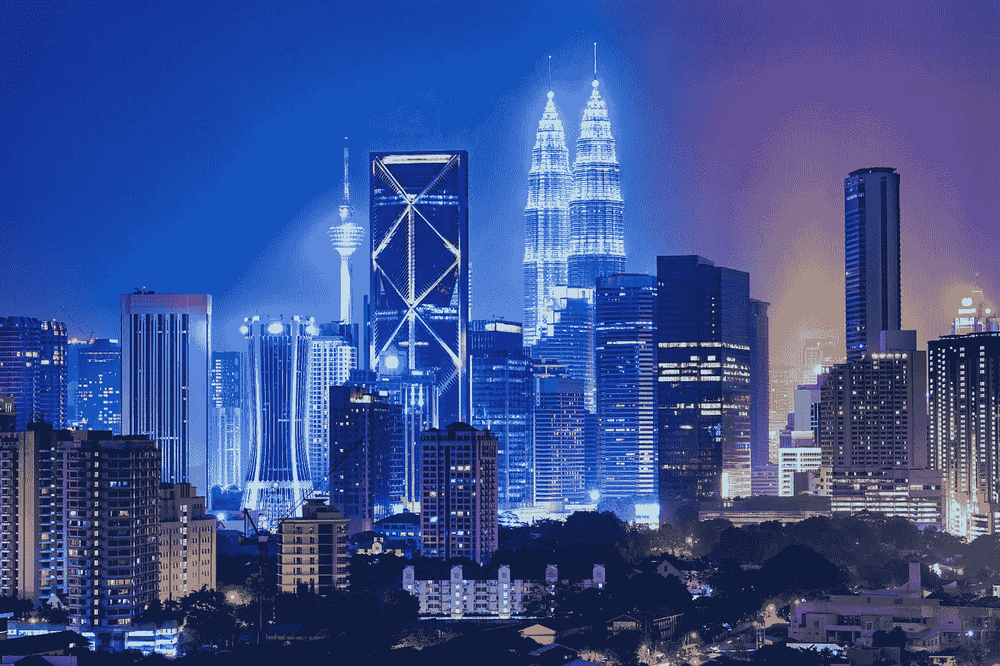

# 2019 年顶级区块链会议和活动

> 原文：<https://medium.com/hackernoon/top-blockchain-conferences-and-events-for-2019-f2041a9f83da>

2019 年将是区块链社区激动人心的一年。在经历了非常动荡的 2018 年后，我们都在为我们的尖端[区块链](https://guerrillabuzz.com/term/blockchain/)技术和广泛的社区寻找一个更光明的未来。

下面列出的事件按日期排序，从 2019 年初，一直到年底。

## 如果您想添加您的活动，请随时联系我:

**电报:**[https://t.me/fybish](https://t.me/fybish)
**邮件:**asaf@guerrillabuzz.com **领英:**[https://www.linkedin.com/in/asafybish/](https://www.linkedin.com/in/asafybish/)

## [区块链连接大会:学术 2019](https://goblockchainconnect.com/index.html)

活动将汇聚全球最权威的区块链教授、技术最先进的公链项目、技术专家，共同探讨最前沿的区块链学术研究、问题、解决方案。通过包括主题演讲和小组讨论，涵盖从研究到应用的主题，会议将探索区块链行业的下一个重大机遇。

**日期:**2019 年 1 月 11 日。
**地点:旧金山**万豪侯爵酒店。
**主题演讲嘉宾**:维塔利克·布特林、大卫·乔姆、李峻、黎明歌、米克·鲍曼等等！

## [**北美比特币大会**](https://btcmiami.com/)

欢迎参加迪拜世界数字资产和区块链大会 DAIBC 系列大会。我们将创造一种社交网络体验，在迪拜将全球投资者和企业家联系在一起。同时，我们将讨论全球区块链技术的未来，以及区块链技术在不同行业的创新应用。30 个热点话题将为您带来最全面的创新项目展示案例，帮助您预见未来几年区块链的发展趋势。

日期:2019 年 1 月 16 日至 18 日。
**地点:迈阿密市区**，詹姆斯·l·奈特中心。
**主题演讲人**:希夫·马丹、本·斯旺、内比尔·本·艾莎、约翰·哈里斯等等！

## [**加密金融会议**](https://crypto-finance-conference.com/en/)

加密金融会议为与会者提供行业专家的教育主题演讲、关于当前和未来趋势的富有洞察力的小组讨论，以及在远程和私人环境中与其他精心挑选的参与者进行交流的独特机会。此外，投资者有机会了解更多新的加密业务。加密金融会议是一个学习，联系和投资最好的地方。

**日期:**2019 年 1 月 16 日至 18 日。
**地点:**圣莫里茨，**瑞**。
**主题演讲嘉宾**:查尔斯·霍金森、伊娃·凯丽、海伦·海、安迪·布罗姆伯格等！

## 

**EmTech Asia 不是一个普通的科技会议。这是世界领先的科技高管，科学家和投资者的策展。机器人、人工智能、生物医学、区块链、虚拟和增强现实、计算、能源、可持续发展(以及更多)领域最聪明的头脑将来自世界各地，与学术界、工业界和金融界的精英分享突破性的研究和发现。**

****日期:**2019 年 1 月 22 日至 23 日。
**地点:**滨海湾金沙展&会议中心，三层，Heliconia and Cassia Ballrooms，**新加坡**
**主题演讲嘉宾** : Kimberly Powell，Poppy Crum，Henk Rogers，Mike North 等！**

## **[**区块链事件**](https://www.theblockchainevent.com/east/)**

**参加区块链活动的企业家、开发者、行业领袖和投资者。了解区块链商业模式将如何利用这种分布式账本技术来颠覆从航运到商业的所有市场。听取各行各业公司的真实案例研究，并从他们的成功和失败中学习。行业专家和前沿的全球创业公司将讨论从广告的影响到潜在的监管和安全问题的一切。最后，我们将关注区块链的未来，以及贵公司现在如何从中受益。**

****日期:**2019 年 1 月 30 日—2 月 1 日。
**地点:大劳德代尔堡** /布劳沃德县会议中心。
**主题演讲嘉宾**:安迪·扎诺夫斯基、普拉莫德·阿坎塔、加里·戴维斯、李翀等等！**

## **[区块链经济伊斯坦布尔峰会 ](https://www.blockchaineconomy.istanbul/EN/)**

**总部位于荷兰的银行业巨头 ing 最近发布了一份客户报告，其中宣布土耳其是所有欧洲国家中领先的加密货币所有者。事实上，土耳其人民正在走向更多的技术创新和当前的经济环境是一个越来越多的因素。对区块链感兴趣并处理加密货币的投资者和工程师将参加此次会议，他们大多来自欧洲、中东和中亚国家。你会更好地理解区块链，这是 21 世纪最伟大的技术和金融革命，通过领域内专家演讲者的表达。**

****日期:**2019 年 2 月 20 日。
**地点:**哈利斯会议中心，**伊斯坦堡**。
**主题演讲嘉宾**:汤姆·李、蒂姆·德雷珀、塞尔吉·波波夫等！**

## **[**NFT。纽约—探索不可替代的区块链生态系统**](https://www.nft.nyc/)**

**行业领袖、有影响力的人、开发者和粉丝齐聚纽约市标志性的时代广场，分享所有不可替代的东西。享受来自区块链领先品牌的辩论、思想领袖讲座、研讨会和行业简报。**

****日期:**2019 年 2 月 20 日。
**地点:**时代广场 PlayStation Theater， **NYC。主题演讲人:** Richard Titus，Michael J Casey，Benny Giang，Virgil Griffith 等等！**

## **[**世界区块链峰会**](https://kl.worldblockchainsummit.com/)**

**世界区块链峰会是一个全球性的精英聚会系列，在全球 15+个目的地举行。该峰会的特色是企业用例、政府用例、鼓舞人心的主题演讲、小组讨论、技术讲座、区块链展览、创业推介比赛和一系列网络机会。**

****日期:**2019 年 2 月 28 日。
**地点:新加坡滨海大道 10 号 M** arina Bay Sands 酒店**。
**主题演讲嘉宾**:栗原康平、蔡志勇、Mastura Ishak、Samson Lee 等！****

## ****[**DC 区块链峰会 2019**](http://dcblockchainsummit.com/)****

****DC 区块链峰会是世界上最杰出的区块链活动之一，汇集了世界领先的区块链高管和技术专家、公共政策制定者和学者，他们都对区块链技术有着共同的兴趣或热情。****

******日期:**2019 年 3 月 6 日–7 日。
**地点:**乔治城大学——拉菲克·b·哈里里楼，洛尔芬克礼堂。DC 华盛顿州西北 37 街和 O 街 20057 **美国**
**主题演讲嘉宾** : Brad Garlinghouse、Tom Jessop、Anoop Nannra、Morgan Ortagus 等！****

## ****[**令牌 2049**](https://www.token2049.com/)****

****见见先行者，早期信徒，极具影响力且已确立的意见领袖。来自领先加密项目和数字资产基金的人士将来到香港分享他们的知识和故事，为日益扩大的加密生态系统提供独特的见解。全球媒体、思想领袖、监管者和 2000 多名参与者将参加为期两天的富有成效和深刻见解的交流活动。****

******日期:**2019 年 3 月 13 日–14 日。
**地点:**香港九龙红磡湾鸿联道 38 号嘉里酒店**。**
**主题演讲嘉宾**:查理·李、贾斯汀·孙、马克斯·科尔德克、雅尼斯拉夫·马拉霍夫等等！****

## ****[曼谷区块对冲会议](https://www.block-hedge.com/bangkok-thailand-2019/)****

****Block Hedge 据说是区块链领域的顶级会议之一。在这里加入将是一个独特的机会，连接世界各地的世界领先的思想领袖，投资者和创新者。这是一个国际平台，展示最新的区块链创新，当代行业趋势，最热门的股票等等。时间块对冲将于 3 月 29 日在泰国曼谷举办第二届年度大型区块链和加密会议。您将有机会会见 500 多名与会者、40 多名国际演讲人、20 多名风投、50 家媒体合作伙伴等等。那么，为什么要等呢？立即注册，利用这个平台结识志同道合的专业人士，以前所未有的方式发展您的业务。****

******日期:**2019 年 3 月 29 日
**地点:**曼谷四面佛君悦酒店、**泰国**
**主题演讲嘉宾** : Jason Hsu、Giang Le Ngoc、Reuben Yap、Dennis Trawnitschek、J.L Velde 等！****

## ****[**Anon 区块链峰会奥地利**](https://www.blockchainsummitaustria.com/)****

****奥地利区块链峰会将是一个为期两天的综合性会议，重点关注区块链在金融、政府、保险、医疗保健、能源、供应链以及移动领域的实际应用。经验丰富的演讲者、敏锐的投资者和意见领袖将审视这一新兴技术的机遇和威胁。他们将分析现状，并对我们未来可能的期望做出预测。****

******日期:**2019 年 4 月 2 日。
**地点:**维也纳。
**主题演讲嘉宾**:玛利亚·盖博、海伦·海、托马斯·恩德雷斯博士、乔兰达·特尔·马腾等！****

## ****[安全令牌峰会— LA](https://securitytokensummit.com/)****

****安全令牌峰会是一个高端，安全令牌和数字证券的重点活动。它有一个强大的议程，涵盖各种主题，如托管、合规、监管、投资、营销、令牌化、标准、发行和房地产。****

******日期:**2019 年 4 月 8 日。
**地点:**丽思卡尔顿，**洛杉矶。**
**主题演讲嘉宾**:阿米·本·大卫、约尔·劳、阿米·万、塔尔·伊利亚舍夫等！****

## ****[2019 年加密投资峰会](https://cryptoinvestsummit.io/)****

****Crypto invest summit 是专注于区块链技术可持续投资的领先会议和峰会。这是一场由世界上一些最重要的创新者举办的独家、精心策划、影响力大、信息丰富、发人深省的活动。****

******日期:**2019 年 4 月 9 日–10 日。
**地点:**洛杉矶会议中心，加利福尼亚州洛杉矶市南菲格罗亚街 1201 号。
**主题演讲嘉宾:**安德鲁·迪克斯、大卫·威尔德四世、艾米·万、p·巴特·斯蒂芬斯等等！****

## ****[巴黎区块链周峰会 ](https://parisblockchainweeksummit.com/)****

****巴黎区块链周峰会是巴黎区块链周的旗舰活动。该峰会是聚集了 3000 多名与会者和 100 名演讲人的高峰活动。在两天的时间里，我们将在主舞台上讨论欧盟监管、稳定的硬币、分散的交易所、安全令牌、可扩展性问题、共识机制的最新进展等等！来自世界上最好的区块链和数字资产公司的知名演讲者将分享他们对市场及其前景的故事和见解。****

******日期:**2019 年 4 月 17 日。
**地点:** 5 帕维斯艾伦图灵，75013 **巴黎法兰西。**
**主题演讲嘉宾**:布鲁诺·勒梅尔、伊娃·凯丽、亚瑟·布莱特曼、周卫、张秀坤·希内尔等等！****

## ****[纽约令牌化资产](https://thefutureof.finance/tokenized/new-york)****

****本次会议提供了关于将区块链技术应用于真实资产令牌化和安全令牌创建的整个过程的全面见解。对发行者来说，资产证券化意味着降低成本，但也意味着提高现实世界资产的透明度、效率和流动性。实物资产的虚拟化使获得新投资机会的途径民主化，并允许部分清算和方便与其他投资者交换。****

******日期:**2019 年 5 月 12 日。
**地点:**威斯汀时代广场 270 西 43 号**纽约**
**主题演讲嘉宾**:瑞安·汉利、比瑟·迪米特洛夫等！****

## ****[共识 2019](https://www.coindesk.com/events/consensus-2019)****

****CoinDesk 荣幸地于 2019 年 5 月 13 日至 15 日在纽约希尔顿中城和纽约时代广场喜来登酒店举办第五届年度区块链技术峰会。来自领先行业初创公司、投资机构、金融服务巨头、全球品牌、学术机构和政策团体的专业人士将返回纽约，讨论区块链技术不断发展的现实应用。Consensus 将针对最重要的商业发展、技术创新和公共政策问题进行为期三天的演示、交流和专家讨论。它将有 8000 多名与会者、200 多名赞助商和 125 多名演讲者，他们正在构建区块链和数字资产生态系统的基础。****

******日期:**2019 年 5 月 13 日–15 日
**地点:纽约**希尔顿中城
**主题演讲嘉宾**:待定****

## ****[**【数字资产峰会】**](https://www.digitalassetsummit.io/)****

****数字资产峰会(DAS)是一个面向数字资产领域机构参与者的会议。5 月 15 日，最具影响力的家族办公室、首席信息官、基金经理和监管机构将齐聚一堂，讨论市场基础设施的发展和加密生态系统中的监管障碍。立即注册，与我们由合作伙伴、高管和创新者组成的精心策划的网络联系并向其学习。****

******日期:**2019 年 5 月 15 日**** 

## ****[***马耳他 AI &区块链峰会***](https://maltablockchainsummit.com/)****

****在 2018 年的开创性活动中，超过 8，500 名与会者会见了区块链开拓者和杰出的贵宾，如 Scott Stornetta，John McAfee 和文克莱沃斯双胞胎，今年的马耳他人工智能和区块链峰会预计将有超过 10，000 名参观者，400 名参展商和 1000 名投资者，加入人工智能和区块链行业的世界领先思想。****

******日期:**2019 年 5 月 22 日–25 日
**地点:**马耳他希尔顿、**马耳他圣朱利安**
主题演讲嘉宾:罗杰·维尔、托尼·维斯、蒂姆·德雷珀、约瑟夫·马斯喀特、陈伟群、大卫·欧尔班、亚历山德拉·米克博士等等！
***七五折优惠券代码:* AIBC25GUERRILLABUZZ******

## ****[**区块链日新加坡**](https://theblockchainday.com/)****

****区块链日旨在为创新世界的资本搭建桥梁，以创建一个共同推动变革的全球网络。
除了来自亚洲市场的商业领袖之外，关键的政治决策者和风险投资家将齐聚一堂，分享他们在行业中应用区块链的经验、挑战、障碍和优势。不同形式的会议将允许进行动态交流，涉及监管、治理和应用等问题。****

******日期:**2019 年 6 月 10 日–11 日
**地点:**丽思卡尔顿酒店，**新加坡千禧酒店。**
**主题演讲嘉宾**:JJ·彼得森、卢克·瓦格曼(钱币市场大盘股)、尤里·洪、杜安·斯托亚诺维奇等等！****

## ****[2019 年 EventHorizon 峰会](http://www.eventhorizonsummit.com/)****

****EventHorizon 是世界领先的能源和区块链峰会。该领域最进步的思想聚集在一起，展示能源供应的未来，并解决我们如何才能实现 100%可再生能源和负碳。在为期两天的 80 多场会议中，1500 名与会者将进行陈述、辩论和交流，并以现场音乐和舞蹈音乐会达到高潮。峰会在历史悠久的发电厂乐团柏林举行，这座经过改造的 Vattenfall 发电站将再次成为能源中心。****

******日期:**2019 年 6 月 19 日–20 日。
T3 地点:发电厂乐团，**柏林。**
**主题演讲嘉宾**:玛特里马克、大卫·马丁、玛利亚麦克卡瓦纳、乔-乔哈伯德、安娜特博维奇、艾德黑塞、玛齐亚扎法尔、克里斯托夫弗雷等等！****

## ****[罗马尼亚区块链峰会](http://romaniablockchainsummit.com/?coupon=guerillabuzz2019)****

****罗马尼亚区块链峰会有望成为东南欧地区致力于创新技术的最重要会议之一，汇集了公共部门、政治决策者、开发人员、研究人员、全球企业家、领导者和创新者。该活动由罗马尼亚通信和信息社会部与区块链行业的代表共同主办，并有欧洲区块链观察站和论坛的参与。****

******日期:**2019 年 6 月 21 日–22 日。
**地点:**布加勒斯特议会宫，**罗马尼亚。**
**主题演讲人**:蒂姆·德雷珀、法比奥·卡内辛、Boby Lee、Mihai Alisie、戴夫·帕利斯、帕斯卡尔·b·范·克尼夫等等！****

## ****[世界区块链论坛—新加坡&世界区块链奖](https://www.eventbrite.com/e/world-blockchain-forum-singapore-world-blockchain-awardasia-tickets-55681877996)****

****本次大会将汇聚来自政府、监管机构、协会、机构、区块链公司、fintech、媒体等超过 5000 位行业精英，探讨行业趋势和创新，表彰行业先锋和贡献，共同推动行业健康有序发展。****

******日期:**2019 年 6 月 22 日–23 日。
**地点:**滨海湾金沙酒店，**新加坡**。
**主题演讲嘉宾**:参孙·莫、保罗·布罗迪、杜军、汤姆·门纳、富兰克林·理查兹、许海波等等！****

## ****[区块链峰会 ](https://www.blockchainsummitlondon.com/)****

****伦敦区块链峰会(Blockchain Summit London)是欧洲最大的区块链专用活动，汇集了 5000 名行业领袖、商业决策者、技术创新者和投资者。基于无与伦比的内容和实用的“如何做”案例研究，200 多位有远见的演讲者将探讨我们区块链未来的挑战和机遇。互动会议、研讨会和圆桌会议为纯粹关注区块链的观众提供了绝佳的交流机会。****

******日期:**2019 年 6 月 25 日–26 日。
**地点:**奥林匹亚西、**伦敦**
**主题演讲嘉宾**:鲍勃·克罗泽、阿米特·瓦尔马、梅·温尼菲尔德、马扬·德拉廷等等！****

## ****[生物经济博览会](https://bloconomic.com/)****

****Bloconomic 将于 2019 年重返马来西亚，举办最大的区块链博览会。Bloconomic Expo 讨论了区块链在区块链新现实中的真实使用案例和未来前景，以及应对未来的机遇和挑战。Bloconomic 旨在在区块链经济的新曙光中创建一个庞大的区块链领导者网络，探索区块链世界中新的商业模式和未被认识的机会，并创建一个平台，将区块链行业的领导者聚集到东南亚的中心吉隆坡。****

******日期:**2019 年 8 月 15 日–16 日。
**地点:**联系会议&活动中心，**马来西亚曼谷。**
**主题演讲嘉宾** : Amarjit Singh、Stefano Virgilli、Kennth Hu、Rafael Schult、Harpreert Singh Maan、KC Seow、Xanne Leo 等等！****

## ****[2019 年硬币基金研讨会](https://blockworksgroup.io/coinalts2019)****

****CoinAlts 旨在汇集加密货币投资领域的思想领袖，讨论加密货币作为一种新的资产类别的投资、法律和运营问题。****

******日期:**2019 年 9 月 26 日。
**地点:**芝加哥艺术学院，**美国伊利诺伊州芝加哥。**
**主题演讲人(前几位演讲人):** Tim Draper，Draper Associates
Olaf Carlson-Wee，Polychain Capital，Mark Yusko，Morgan Creek Capital。
**% 10 折扣的促销代码:** GBUZZ10****

## ****[DAS:2019 年市场](https://blockworksgroup.io/dasmarkets2019)****

****DAS: Markets 是唯一一个专门为交易所、保险公司、银行、贷款机构和投资者设计的会议，它允许市场为机构参与者而存在。与会者将是金融市场、投资和区块链行业的领袖。****

******日期:**2019 年 11 月 13 日。
**地点:**纽约州纽约市西普里亚尼南街**。**
**主题演讲嘉宾(之前的演讲嘉宾):**马科斯·韦雷米斯、吉姆·罗宾逊、安珀·巴尔代特、罗布·帕拉特尼克等等！
**% 10 折扣的促销代码:** GBUZZ10****