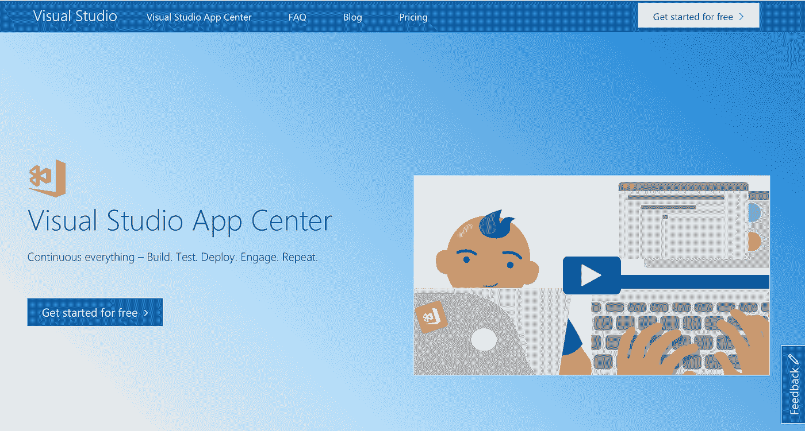

# 最佳詹金斯替代品。适用于您的 Android 和 iOS 项目的顶级 CI/CD 工具

> 原文：<https://medium.com/hackernoon/top-ci-cd-tools-for-your-android-and-ios-projects-8d356b983b3b>

> 有几个顶级的 CI/CD 工具可以用于你的 Android 和 iOS 项目。所有这些 CI/CD 工具都会以某种方式完成这项工作。对于非常流行的开源 CI 工具 Jenkins 来说也是如此。然而，免费詹金斯 **的** [**维护方面很快就会变成一场昂贵的噩梦！**你需要雄厚的财力和时间来支持高度定制和丰富的功能——所有这些极其宝贵的资源都可以得到更好的利用。](https://nevercode.io/)

因此，尝试不同的 CI/CD 工具并留意 Jenkins 替代工具可能会极大地促进您的 Android 和 iOS 应用程序开发，这可能是一个好主意。

所以，让我们开始吧。我们决定试试詹金斯的替代方案。了解这些 CI/CD 工具及其主要功能、集成、客户和定价。最重要的是，我们自己测试了所有这些 Jenkins 备选方案，以找出哪一个最能减少麻烦，我们会给你真实的结果！

查看[我们在分析 75k CI/CD 版本时了解到的有关移动应用持续集成的信息。](https://nevercode.io/blog/what-we-learned-about-ci-cd-tool-analysing-75k-builds/)

# 将 CI/CD 工具用于 spin:什么和如何

在我们开始之前，请注意，本文的目的不是推荐特定的服务，而是为移动应用程序开发人员提供市场上现有 Jenkins 替代产品的广泛概述。每个项目都有其独特的方式，这些是我们在当前时间框架内的一个具体项目的结果。

那么，我们做了什么？

首先，我们采用了一个基本的应用程序，并决定在 Jenkins 替代品上进行测试。幸运的被选中的应用是[意大利香肠](http://getpepperoni.com/)，“一个免费和开源的蓝图，启动你在 Android 和 iOS 上的移动产品开发，由 React Native 提供支持”，并由 [Futurice](https://futurice.com/) 提供支持。

第二，我们将这份[顶级移动 CI 工具列表](https://code-maze.com/top-mobile-continuous-integration-tools/)与 Circle CI 和 Travis CI 相结合，并使用意大利香肠应用程序对其进行了测试，以了解它们将如何应对这一挑战。

现在，让我们向您介绍一下我们试用的移动 CI/CD 工具。

# 供移动设备考虑的顶级 CI/CD 工具

# [Nevercode.io](https://nevercode.io/)

Nevercode 是一个基于云的持续集成工具，用于您的 **Android、iOS、React Native、Cordova、Flutter、Ionic & Flutter** 项目。建立一个新项目非常简单，所有项目都是自动配置的。Nevercode 为每次提交构建项目，并运行所有的单元& UI 测试。自动构建分发使您的团队和客户能够及时了解应用的最新状态。

** Nevercode 在 Flutter Live 上推出了一款名为 [Codemagic](http://codemagic.io) 的专门针对 Flutter 项目的 CI/CD 工具。

# 主要特性:

*   自动配置和设置
*   与 Bitbucket、GitHub、GitLab 和任何其他源代码库集成
*   并发构建
*   使用仿真器或实际硬件的定制单元和 UI 测试
*   使用 Firebase / Amazon 设备群和测试并行化实现测试自动化
*   自动发布到 Google Play、iTunes Connect、HockeyApp、Crashlytics、TestFairy
*   计划的构建
*   所有敏感数据的数据加密
*   一流的客户支持
*   易于理解的文档

**集成:** GitHub、BitBucket、GitLab、 *fastlane* 、Slack、email、HipChat、AWS、Firebase 测试实验室、TestFlight、Crashlytics、Cocoapods、TestFairy、Relution、Jasmine、HockeyApp、iTunes Connect、Gradle Build Tool、Espresso、Robotium、Robolectric、Arma、量角器等。

**客户:**第四频道、丰田、宝马集团、沃尔玛、Mooncascade、Sainsbury's、ingogo、Thunderhead 等。

**我们使用 Nevercode CI/CD 工具的体验:** Nevercode 是在考虑移动设备的情况下创建的，它真正体现在产品的各个方面。在 Nevercode 上从头开始构建一个适用于 Android 和 iOS 的基本 RN 应用大约需要 7 分钟，这对于一个移动 CI/CD 来说是一个坚实的结果(对于这个测试项目，我们自动配置了构建设置)。与列表中的许多其他 CI/CD 工具不同，Nevercode 可根据客户需求高度定制，这使他们成为灵活的 CI/CD 合作伙伴。

> 然而，可定制性是有代价的，这使得 Nevercode 更适合快速发展和重视快速结果的大公司。

**定价:**每月 99 美元起/按年支付

[免费试用 never code](http://nevercode.io/)

# [特拉维斯·CI](https://travis-ci.org/)

**Travis CI** 是另一个非常受欢迎的托管分布式持续集成服务，用于构建和测试 GitHub 托管的软件项目。虽然没有严格关注移动需求，但它在开源项目中非常受欢迎，因为它不收取任何费用。Travis CI 托管服务器支持不同的开发人员在不同的环境、运行不同操作系统的不同机器上测试项目。

# 主要特性:

*   对所有开源项目免费
*   易于设置和配置
*   实时构建设置
*   拉请求支持
*   预装数据库服务
*   通过构建的自动部署
*   用于定制管理的扩展 API 和 CMD 工具
*   讨论和提供教程的广泛社区
*   用于私有存储库和个人支持的 TravisPro
*   大量文档

**集成:** GitHub，Heroku，AWS CodeDeploy，Slack， *fastlane* ，TestFairy，Testmunk，Sauce Labs 等。

客户: Zendesk，Heroku，BitTorrent，Moz，Engine Yard

**定价:**开源计划和前 100 个版本免费，其他的都是付费计划

**我们使用 Travis CI/CD 工具的经验:** Travis CI 是一款优秀的 CI/CD 工具，但对于您的移动应用项目来说可能不是最好的。无缝移动应用程序开发缺少几个关键方面。首先，Travis CI 不支持 BitBucket 或 GitLab 项目。其次，它缺乏构建设置自动化、自动分发和自动代码签名，这可能会产生许多令人头痛的问题，而这些问题可以通过专门用于移动应用的 CI 工具来避免。例如，要自动配置构建设置，Travis 需要 60 行的 YAML 配置。Travis 似乎也没有存储构建工件，关于如何将应用发布到 iTunes Connect/Google Play/hockey app/Crashlytics/relation 的信息也很有限。最后但同样重要的是，似乎没有办法使用 Xcode 测试版。

[免费试用 Travis CI](https://travis-ci.org)

# [圈 CI](https://circleci.com/)

**Circle CI** 是我们列表中的下一个基于云的 CI/CD 工具。它使您能够自动化您的构建、测试和交付过程。Circle CI 的使命是让世界各地的人们能够以想象的速度构建和交付软件。为了实现这一点，Circle CI 提供了快速设置、与一系列工具的集成、对所有测试框架的支持以及轻松配置整个设置的能力。最终，它允许用户更快、更安全、更大规模地发布健康的代码。

# 主要特性:

*   时尚直观的用户界面
*   多达 16 路并行
*   能够同时测试许多代码推送
*   支持 Docker
*   全面的缓存依赖关系
*   所有配送也通过*快车道*

I **整合:** Bitbucket，GitHub，GitHub Enterprise，酱实验室，工作服，Heroku，Docker，Firebase，Compose，Slack，吉拉，HipChat 等。

**客户:**脸书、Segment、Kickstarter、Spotify、GoPro

定价:定价是每个集装箱的价格。第一个容器是空的。每增加一个集装箱每月 50 美元。

**我们使用 CircleCI/CD 工具的经验:**像 Travis CI 一样，circle CI 不是为移动需求量身定制的，这将在您想要快速构建高质量应用时带来一些困难。首先，很难理解如何设置和配置一切，但经过一番努力，我们发现 CircleCI 在某种程度上确实提供了自动设置。虽然 CircleCI 提供了大量的集成，使用户的工作环境真正灵活，但建立工作流是一个耗时的项目。对于这个 React 本地项目，我们未能完成设置。从好的方面来说，CircleCI 检测并运行 *fastlane* 自动构建一个 app，这是非常好的！

# [比特莱斯](https://www.bitrise.io/)

Bitrise 是詹金斯备选名单中的另一颗宝石。针对移动需求定制的持续集成和交付，为您喜爱的服务提供 180 多种集成。一个伟大的生产力工具，为您的 iOS，Android，Xamarin，Ionic，Cordova 和 React 原生移动应用程序开发。

# 主要特性:

*   灵活的配置和直观的设置
*   有用的安装向导
*   直观的用户界面，易于使用
*   可定制的工作流程
*   托管环境
*   自动代码签名
*   快速完成智能缓存
*   不打折扣的安全性
*   Firebase 测试实验室集成
*   快速可靠的仿真器

**集成:** iOS、Android、React Native、Android SDK、Apache Cordova、Xamarin、GitHub、Bitbucket、GitLab、Xamarin 测试云、Slack、亚马逊 S3、Ruby、JIRA、gulp、Gradle、Crashlytics、TestFlight、Codecov、 *fastlane* 、Flowdock、Raygun、TestFairy、AWS Device Farm、HipChat、Twilio、HockeyApp、Parse、Mailgun、covers、Bower 等。

**用户:**维珍移动、TNT、Zeplin、Duolingo、Starva、Wunder 等

**定价:**免费。付费计划的起价为每个并发月 36 美元

**我们使用 Bitrise CI/CD 工具的体验:** Bitrise 绝对是一款 Android & iOS 友好的 CI/CD 工具。广泛的集成列表是 Bitrise 真正的超能力。所有的工作流程步骤都是开源的，这样你就可以随心所欲地修改和分享它们，或者创建新的步骤，并且它与你喜欢使用的服务相集成，使它可以针对每种情况进行定制。

# [Visual Studio 应用中心](https://visualstudio.microsoft.com/app-center/)

微软的 [**Visual Studio 应用中心**](https://appcenter.ms/) 是最近发布的 [HockeyApp](https://www.hockeyapp.net/) 的升级版，它将移动开发者常用的多种服务组合成一个单一的集成产品。您可以构建、测试、分发和监控您的移动应用。它允许您在每次推送至存储库时自动创建可安装的应用程序包。Visual Studio 应用程序中心支持 Bitbucket 和 Visual Studio Team Services (VSTS)上的 GitHub 或 Git repos，无需额外的构建硬件。

# 主要特性:

*   酷炫的用户界面和 UX
*   完美的虚拟机
*   用于诊断和分析的 SDK
*   对 400 多种独特的设备配置进行自动化 UI 测试
*   开源 SDK 和 API

**集成:** GitHub、Bitbucket、Visual Studio Team Services、Slack、微软团队、Appium、Espresso、XCUITest、苹果应用商店、Google Play、微软 Intune、Cocoapods

客户: Quora，Fox Sports，Highrise，Good Food，FreshDirect，Ring

**定价:**起价为每月每构建并发+40 美元

**我们使用 Visual Studio 应用中心 CI/CD 工具的体验:**

乍看之下，配置过程简单且自动化，但这可能会成为更复杂应用程序的劣势，因为缺少一些关键选项。例如，不可能更改 iOS 版本的目标配置。此外，对于每个项目和工作流，必须从零开始建立不同的项目。它还缺少 Xcode 测试版。

> 所有这些给人的印象是，Visual Studio 应用中心还不是大型项目的最佳解决方案。

# 总结

如果你正在寻找 Jenkins 的替代品，那么你已经向无障碍移动应用开发迈出了第一步。有时候免费只是伴随着高得惊人的成本。

我们这篇文章的目的是深入研究顶级 CI/CD 工具，并给出市场上 Jenkins 替代品的广泛概述。请看下图，了解我们的结果汇总。

如上所述，每个项目都是不同的，都有独特的需求。用最好的工具武装您的开发人员，让他们能够更快地构建五星级项目！

请告诉我们您使用 Jenkins 替代产品的体验——请在下面留下您的评论！

*免责声明:最佳 Jenkins 替代品由来自*[*never code . io*](http://nevercode.io)*的移动应用专家拍摄。*