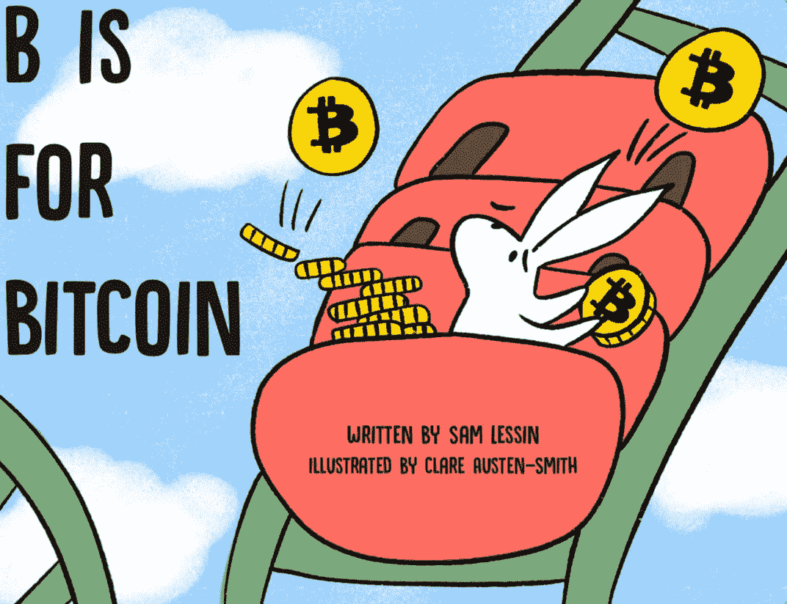

# 来自亚洲的顶级加密新闻—7 月 30 日-8 月 1 日

> 原文：<https://medium.com/hackernoon/top-crypto-news-from-asia-july-28th-august-1st-cf09119c28c1>

> 密码业内人士对亚洲的解读。

**我们与山姆·莱辛和来自** [的团队合作，支持早期儿童教育。](https://globalcoinresearch.us17.list-manage.com/track/click?u=859b0d423a7f7baa4cdb46f26&id=699160c19e&e=e8de32e54d)

在 Global Coin Research，我们非常热衷于加密货币教育。因此，我们启动了区块链学校项目，这是一个针对高中生的加密货币研究暑期项目。今年夏天，我们有幸邀请到了来自纽约市公立高中的学生劳纳克·乔杜里和来自施托伊弗桑特高中的李坤雨，以及来自布鲁克林理工学院的杰里·于参加我们的暑期项目。看看他们在 BlockchainsforSchools.com 做了什么很酷的事情和他们的研究项目！

《全球硬币研究》很自豪地支持山姆·莱辛(Sam Lessin)在他的新书《从算法到零知识证明》中的观点。Sam 现任 Slow Ventures Fin Partner 的首席执行官，之前是脸书的产品副总裁。

**如果你买了“** [B 是为了比特币](https://globalcoinresearch.us17.list-manage.com/track/click?u=859b0d423a7f7baa4cdb46f26&id=16ea52cd9b&e=e8de32e54d)**”-****要知道这本书的所有利润都要捐给幼儿教育非营利组织**。可以在这里 **购买[这本书。](https://globalcoinresearch.us17.list-manage.com/track/click?u=859b0d423a7f7baa4cdb46f26&id=f30eb9b67a&e=e8de32e54d)**也一定要在你的社交媒体上分享。

事实上，在这整整一周里，我们也在为全球硬币研究的读者进行抽奖。

**赢得一本书的签名本，并获得八月初由信息和区块链主办的旧金山“比特币的 B”私人发布会的邀请。**你所要做的就是发这条[推文](https://globalcoinresearch.us17.list-manage.com/track/click?u=859b0d423a7f7baa4cdb46f26&id=d75422f489&e=e8de32e54d)或者你自己的版本，但是一定要给我们加标签，这样我们就知道你是谁了！

**周一至周三的头条新闻**

加密交易所**币安在第一笔收购交易中收购信托钱包**。[https://tcrn.ch/2vmabVn](https://globalcoinresearch.us17.list-manage.com/track/click?u=859b0d423a7f7baa4cdb46f26&id=3cb4c448ce&e=e8de32e54d)

Litecoin 联合创始人**Charlie****Lee 将担任 HTC Exodus** 的顾问，HTC Exodus 是区块链消费电子公司 HTC 开发的本土智能手机。[http://bit.ly/2NYYhZ5](https://globalcoinresearch.us17.list-manage.com/track/click?u=859b0d423a7f7baa4cdb46f26&id=9faabe1b33&e=e8de32e54d)

随着北美业务的继续扩张，比特大陆将在得克萨斯州开设新的数据中心。[http://bit.ly/2vpsOrh](https://globalcoinresearch.us17.list-manage.com/track/click?u=859b0d423a7f7baa4cdb46f26&id=ef209a8d14&e=e8de32e54d)

中国农业银行在区块链试点发放了一笔价值 30 万美元的农田贷款。[http://bit.ly/2O1eBZz](https://globalcoinresearch.us17.list-manage.com/track/click?u=859b0d423a7f7baa4cdb46f26&id=80d00edf9b&e=e8de32e54d)

由于未能与银行续约并建立合同，韩国交易所 Bithumb 已暂停发行新的 KYC 银行关联虚拟账户。[http://bit.ly/2vo3Fxt](https://globalcoinresearch.us17.list-manage.com/track/click?u=859b0d423a7f7baa4cdb46f26&id=f96bc03b72&e=e8de32e54d)

**日本 SBI 集团将收购掉期交易场所 Clear Markets**12%的股份，作为其在加密货币领域扩张努力的一部分。[https://on.ft.com/2NYM5aU](https://globalcoinresearch.us17.list-manage.com/track/click?u=859b0d423a7f7baa4cdb46f26&id=22b67602dc&e=e8de32e54d)

谷歌计划在中国审查搜索，审查维基百科和关于自由的信息。http://bit.ly/2KgxAx1

硬币和代币新闻

8 月 2 日，尼奥将迎来一场 **AMA！**(欢迎向我们发送问题，我们将为您提问)[http://bit.ly/2O1HTr1](https://globalcoinresearch.us17.list-manage.com/track/click?u=859b0d423a7f7baa4cdb46f26&id=d096bc5868&e=e8de32e54d)

**0x 礼宾团队首次正式访华**-8 月 2 日北京 meetup。[http://bit.ly/2vpjYtB](https://globalcoinresearch.us17.list-manage.com/track/click?u=859b0d423a7f7baa4cdb46f26&id=6a197a5997&e=e8de32e54d)

ICONex for iOS 的**移动版现已上市。[http://bit.ly/2vmt9Lp](https://globalcoinresearch.us17.list-manage.com/track/click?u=859b0d423a7f7baa4cdb46f26&id=6343aea130&e=e8de32e54d)**

创公司正在印度设立第一个办事处。[http://bit.ly/2O0a0GT](https://globalcoinresearch.us17.list-manage.com/track/click?u=859b0d423a7f7baa4cdb46f26&id=c3bcefaec0&e=e8de32e54d)

**Ultrain Technology 募集 2000 万美元**基石投资来自丹华资本、FBG 资本、BlueRun Ventures、8 Decimal Capital、OK Gang Capital。[http://bit.ly/2vpK6EG](https://globalcoinresearch.us17.list-manage.com/track/click?u=859b0d423a7f7baa4cdb46f26&id=1f0e02a957&e=e8de32e54d)

**Tron 推出 TRON 虚拟机和项目图集**“一个加强 TRON 基础使其更高效的项目”。[http://bit.ly/2vmBWgp](https://globalcoinresearch.us17.list-manage.com/track/click?u=859b0d423a7f7baa4cdb46f26&id=dea3e4af18&e=e8de32e54d)

**CertiK 宣布获得经纬中国战略投资**。经纬中国是区块链领域最早的投资机构之一。[http://bit.ly/2NYKh1C](https://globalcoinresearch.us17.list-manage.com/track/click?u=859b0d423a7f7baa4cdb46f26&id=05695f98dc&e=e8de32e54d)

数据显示，价值约**520 万美元的 Innosilicon 采矿设备已经通过 Blockstream** 从中国进口到美国。http://bit.ly/2vpEZEM

交换新闻

我认为最好的公关帖子之一:“我仍然很惊讶有这么多的人想要**和我这样一个无聊的家伙自拍。**”—CZ。[http://bit.ly/2vmZdPn](https://globalcoinresearch.us17.list-manage.com/track/click?u=859b0d423a7f7baa4cdb46f26&id=2ae83adede&e=e8de32e54d)

商业新闻

**腾讯发行数字代币传闻不实**。[http://bit.ly/2NZAFDP](https://globalcoinresearch.us17.list-manage.com/track/click?u=859b0d423a7f7baa4cdb46f26&id=72bb526686&e=e8de32e54d)

**香港市民担心经济形势下行**，23%考虑转投虚拟货币。[http://bit.ly/2O0nrGY](https://globalcoinresearch.us17.list-manage.com/track/click?u=859b0d423a7f7baa4cdb46f26&id=8cce38fe61&e=e8de32e54d)

**JD.com 收购安联中国区块链保险服务 30%的股份**。[http://bit.ly/2O0eVaH](https://globalcoinresearch.us17.list-manage.com/track/click?u=859b0d423a7f7baa4cdb46f26&id=c02f5c83e6&e=e8de32e54d)

泰国最大的电影院连锁店将接受加密货币 Rapidzpay。[http://bit.ly/2O0KDEV](https://globalcoinresearch.us17.list-manage.com/track/click?u=859b0d423a7f7baa4cdb46f26&id=37a91ae14d&e=e8de32e54d)

越南一家加密采矿公司首席执行官涉嫌携带 3500 万美元投资者和公司资金潜逃。[http://bit.ly/2O0aKfc](https://globalcoinresearch.us17.list-manage.com/track/click?u=859b0d423a7f7baa4cdb46f26&id=56f1f35fbe&e=e8de32e54d)

**IDG 研究列出了东南亚的区块链创新创业公司**。[http://bit.ly/2vpAgTt](https://globalcoinresearch.us17.list-manage.com/track/click?u=859b0d423a7f7baa4cdb46f26&id=7cc77253d9&e=e8de32e54d)

监管新闻

负责审查国内媒体输出的国家级中国政府机构可能很快就会有一名密码破译员。http://bit.ly/2NViIX1

**中国 18000 名受害者在骗局中损失 2500 万美元。[http://bit.ly/2NZ6koG](https://globalcoinresearch.us17.list-manage.com/track/click?u=859b0d423a7f7baa4cdb46f26&id=a1203acc1e&e=e8de32e54d)**

第二代华裔美国人杨安泽将于 2020 年作为民主党人竞选美国总统，他已经宣布接受加密货币和 Venmo 作为捐赠形式。[https://on.china.cn/2vsuUae](https://globalcoinresearch.us17.list-manage.com/track/click?u=859b0d423a7f7baa4cdb46f26&id=83f1723923&e=e8de32e54d)

*中国传媒* **区块链技术在中国雄安地区**下进行了多方面的探索。[谷歌翻译新闻](https://globalcoinresearch.us17.list-manage.com/track/click?u=859b0d423a7f7baa4cdb46f26&id=0968a95f51&e=e8de32e54d)

我们的第三个播客已经在 iTunes 商店发布了。[来看看](https://globalcoinresearch.us17.list-manage.com/track/click?u=859b0d423a7f7baa4cdb46f26&id=949c810dfb&e=e8de32e54d)！

**在我们即将播出的播客第**集里，我们的嘉宾将是[Zac Cheah、](https://globalcoinresearch.us17.list-manage.com/track/click?u=859b0d423a7f7baa4cdb46f26&id=c47ceb9932&e=e8de32e54d)**[Pundi X](https://globalcoinresearch.us17.list-manage.com/track/click?u=859b0d423a7f7baa4cdb46f26&id=b484a71d23&e=e8de32e54d)**、**的首席执行官，他将分享他对东南亚加密市场(新加坡、泰国、马来西亚、印度尼西亚)的观察，以及他对加密货币市场发展和采用的见解。一定要在 [Twitter](https://globalcoinresearch.us17.list-manage.com/track/click?u=859b0d423a7f7baa4cdb46f26&id=66103e63a6&e=e8de32e54d) 上关注他，了解更多关于 Pundi X 的信息。**

**请发送您希望我们的客人在我们即将到来的播客中讨论的任何问题或话题。**

****

**如果你还没有，请帮助我们的播客在[苹果播客](https://globalcoinresearch.us17.list-manage.com/track/click?u=859b0d423a7f7baa4cdb46f26&id=1976f604be&e=e8de32e54d)上被发现。也可以在脸书、推特或 Linkedin 上与你的朋友分享。谢谢大家！**

**在我们的最后一集里，来自全球硬币研究公司的乔伊斯·杨和杰克·史密斯、迈克·马利一起，他们都是 bitcoin.com 的顾问[。杰克和迈克都是在美国长大的，但他们在亚洲，尤其是中国和日本，已经生活了超过 30 年。有趣的事实——杰克是 2013 年中国第一个用比特币进行零售交易的人。](http://bitcoin.com/)**

**在我们的谈话中，我们涉及的话题包括美国、日本和中国加密货币社区和文化的差异、日本本地的采用率增长以及比特币现金的国际采用率。[看看这个](https://globalcoinresearch.us17.list-manage.com/track/click?u=859b0d423a7f7baa4cdb46f26&id=ee950e1834&e=e8de32e54d)！**

****

**查看我们过去的 6 篇每周文章:[亚洲加密基金/投资者指南](https://globalcoinresearch.us17.list-manage.com/track/click?u=859b0d423a7f7baa4cdb46f26&id=4b10e22d95&e=e8de32e54d)、[Techcrunch Zug](https://globalcoinresearch.us17.list-manage.com/track/click?u=859b0d423a7f7baa4cdb46f26&id=bbec3a0988&e=e8de32e54d)、 [Cryptokitties](https://globalcoinresearch.us17.list-manage.com/track/click?u=859b0d423a7f7baa4cdb46f26&id=e537dc9c98&e=e8de32e54d) 、[币安](https://globalcoinresearch.us17.list-manage.com/track/click?u=859b0d423a7f7baa4cdb46f26&id=711a5745ba&e=e8de32e54d)、[比特大陆](https://globalcoinresearch.us17.list-manage.com/track/click?u=859b0d423a7f7baa4cdb46f26&id=ba121efcac&e=e8de32e54d)和[中国加密获奖者](https://globalcoinresearch.us17.list-manage.com/track/click?u=859b0d423a7f7baa4cdb46f26&id=27ffa94a04&e=e8de32e54d)**

****

# **[订阅](https://globalcoinresearch.us17.list-manage.com/subscribe?u=859b0d423a7f7baa4cdb46f26&id=3419cb7d6e)**