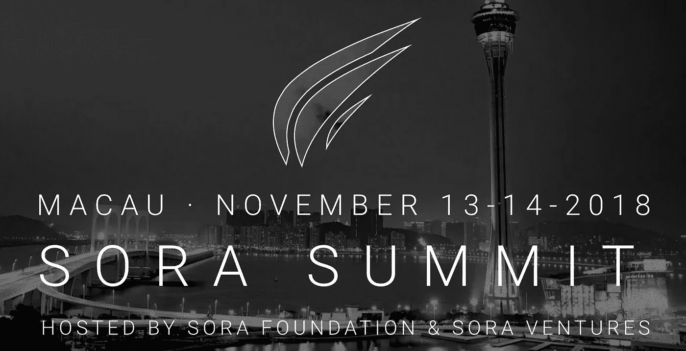

# 10 月 3 日至 6 日亚洲顶级加密新闻

> 原文：<https://medium.com/hackernoon/top-crypto-news-in-asia-from-oct-3rd-6th-1ae5096eb29e>

**密码业内人士在读什么。**

🎉[我们来自黑脸田鸡风险投资公司的 Jason Fang 的新播客出来了！](https://itunes.apple.com/us/podcast/jason-fang-sora-ventures-on-firms-unique-investing/id1399033937?i=1000421196465&mt=2) 🎉

在这一集里，来自全球硬币研究公司的 Joyce Yang 加入了黑脸田鸡风险投资公司的执行合伙人 Jason Fang 的行列，这是一家专注于区块链和加密投资的亚洲风险投资公司。该基金的使命是投资于能够利用区块链技术为我们的世界带来积极变化的企业家。他们的投资包括迅雷、Urbit、Mithril、Alphaslot 等等。

此外，[黑脸田鸡峰会](http://sorasummit.com/)将于 11 月 13 日至 14 日在澳门举行。请在 28:41 收听 Jason 关于为什么峰会将在澳门举行的播客，并查看演讲者和与会者的阵容。

**使用折扣代码 SORAMEDIA2018 享受八折优惠**

Jason 是 Fenbushi Capital 最早的员工之一，并在 2017 年 Mainland China 禁止 ico 时创办了黑脸田鸡风险投资公司。当我最初与 Jason 交谈时，我发现他非常有想法，他的投资方法在我见过的加密投资者中非常独特。在我们的对话中，我们讨论了黑脸田鸡如何投资加密项目，Jason 对加密领域的展望，以及他对东西方加密发展的看法。

[**采访时间和话题**](https://itunes.apple.com/us/podcast/jason-fang-sora-ventures-on-firms-unique-investing/id1399033937?i=1000421196465&mt=2)

1:24-介绍杰森、黑脸田鸡风险投资公司及其背景
3:59-黑脸田鸡风险投资公司是如何在中国禁止 ICOs 后起步的
6:09-为什么黑脸田鸡尽管总部位于中国上海却不投资中国项目
7:55-黑脸田鸡如何看待投资区块链和秘密空间
19:46-你为什么喜欢反向 ICOs 模式？
21:34-衡量 reverse 成功的标准-ICOs
22:54-亚洲和西方之间的区块链空间会融合吗？
28:41-查看即将于 11 月 13 日至 14 日举行的[黑脸田鸡峰会](http://%20https//www.eventbrite.com/e/sora-summit-2018-tickets-49331537958)，使用 **SORAMEDIA2018** 获得 80%的门票折扣
33:06-亚洲当前的基金环境以及有多少基金已经停止投资 crypto
34:47-您认为 crypto 的赢家在哪里？
35:20-深思熟虑投资的实用方法

*你也可以在这里阅读 Jason 在他的媒体文章中的想法，在那里他展示了黑脸田鸡的投资论点和他对亚洲的展望:*
[黑脸田鸡风险投资公司对区块链投资的哲学](http://bit.ly/2P2x3Se)
[了解中国的秘密投资者](http://bit.ly/2P2Dq8n)

[与朋友分享](mailto:?subject=Check%20out%20this%20Asia%20crypto%20newsletter&body=GlobalCoinResearch.com%0A%0A)

🌟**周三至周五亚洲要闻**

据接近比特大陆的内部人士透露，韩吉的目标是带领公司实现弯道超车，成为下一个英伟达。[http://bit.ly/2BWi9tf](http://bit.ly/2BWi9tf)

韩国加密交易所 Bithumb 将在未来几个月推出分散式交易所。[http://bit.ly/2QwB7ut](http://bit.ly/2QwB7ut)

**首尔将通过一个 1000 亿韩元的基金和一个将容纳 200 多家公司的大型区块链综合体来宣传区块链。[http://bit.ly/2OaTQir](http://bit.ly/2OaTQir)**

💰交易和基金

**Youtube 对火币集团投资部门火币资本负责人**的采访，重点关注区块链和加密资产投资。【http://bit.ly/2C1HTEK】

[SKALE Labs，Inc.](https://www.skalelabs.com/) **一家专注于可扩展性基础设施的**区块链公司宣布获得 965 万美元融资，由 Multicoin Capital、Aspect Ventures、Blockchange Ventures、Boost 领投。风险投资，迦南风险投资伙伴，银河数码，防洪门基金，黑客。风投，Neo 全球资本。[https://prn.to/2BW4BxX](https://prn.to/2BW4BxX)

💰硬币和代币新闻

由 61 家日本银行组成的财团负责日本 80%以上的银行资产，**已经开始使用以消费者为中心的零售支付应用，该应用采用了 Ripple 区块链技术。**[http://bit.ly/2y0Se0G](http://bit.ly/2y0Se0G)

**泰国暹罗商业银行将率先使用 RippleNet 的“多跳”功能。**[http://bit.ly/2NrMSQQ](http://bit.ly/2NrMSQQ)

**Tron 的 uTorrent Web 已经打破了 100 万日活跃用户的记录。**[http://bit.ly/2BYxBVH](http://bit.ly/2BYxBVH)

另一款 EOS 去中心化应用程序严重搞砸了一次空投，这一次，羽翼未丰的赌博平台 se7ens 成为了焦点，此前**一名社区成员利用其制作拙劣的智能合同成功地为自己赢得了 10 亿代币**。[http://bit.ly/2EbdTcf](http://bit.ly/2EbdTcf)

Justin Sun 说，Tron 的账户总数比 EOS 多 20%。他还提到创的账户总数是以太坊的 13 倍。[http://bit.ly/2Cs3V4i](http://bit.ly/2Cs3V4i)

**Neo 的霓虹交易所【NEX】宣布与 nOS** 建立独家合作关系。[http://bit.ly/2y0F5ov](http://bit.ly/2y0F5ov)

💸交换新闻

新的研究声称，印度的交易平台 bit bns**伪造了相当数量的交易量**，并且继续定期这样做。[http://bit.ly/2BYUdVW](http://bit.ly/2BYUdVW)

总部位于中国的加密交易所 Coinex 向 BCH 支付利息。http://bit.ly/2NqYkMw

**Mt. Gox 用户，瑞穗银行寻求延迟诉讼以等待赔偿结果**，因为该金融机构被起诉在 Mt. Gox 崩溃前后给用户造成交易困难。[http://bit.ly/2zT9hDp](http://bit.ly/2zT9hDp)

🎌监管新闻

**韩国国家政策委员会主席呼吁首次硬币发行合法化**，前提是监管框架到位。[http://bit.ly/2ygBGB4](http://bit.ly/2ygBGB4)

💼商业新闻

**阿里巴巴旗下的淘宝禁止其平台上的加密货币和 ICO 服务**。[http://bit.ly/2yhkWcV](http://bit.ly/2yhkWcV)

**中国能源公司 Risen Energy 与西班牙一家加密货币采矿场合作**开发高达 300 兆瓦的光伏发电能力。[http://bit.ly/2Rzamae](http://bit.ly/2Rzamae)

科技巨头 IBM 正与新加坡最大的托运商之一太平洋国际航运公司合作，将海运中最重要的文件之一——提单数字化。[http://bit.ly/2pJIe7H](http://bit.ly/2pJIe7H)

**加密劫持流行病蔓延到印度各地的 30K 路由器。**[http://bit.ly/2y20TA0](http://bit.ly/2y20TA0)

[订阅](http://globalcoinresearch.com/)