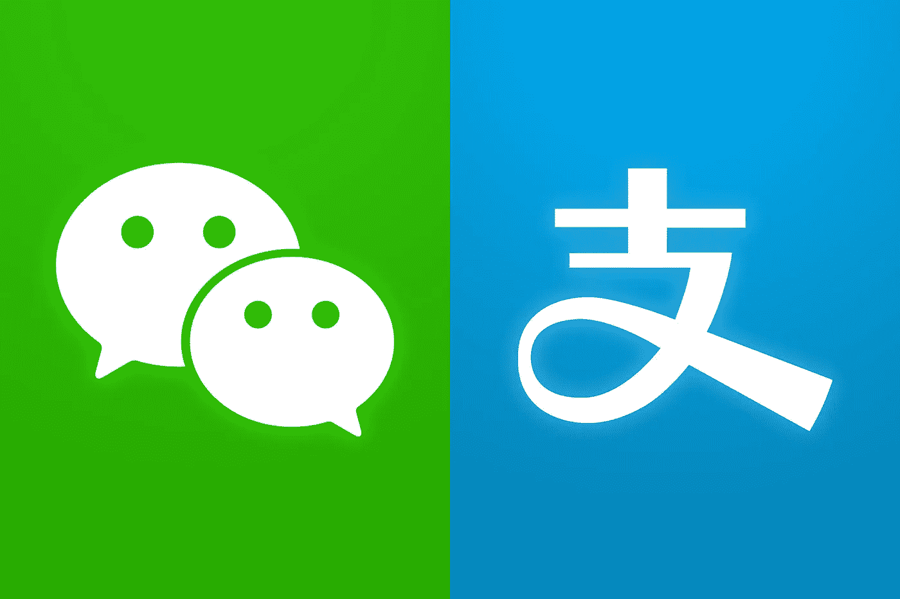

# 亚洲顶级加密新闻—8 月 22 日至 8 月 25 日

> 原文：<https://medium.com/hackernoon/top-crypto-news-on-asia-aug-22rd-aug-25th-59c6b578ac1>

*韩国在民主进程中使用区块链；中国的禁令；比特大陆·KYC；币安实验室孵化器；95%的 ICO 交易低于 ICO 价格*

🎊我们与加密投资者李灿明和迈克·陈的第五次播客出来了。[来看看](https://itunes.apple.com/us/podcast/gbic-co-founders-richard-lee-mike-chen-on-investing/id1399033937?i=1000418459706&mt=2) [！](https://itunes.apple.com/us/podcast/pundix-ceo-zac-cheah-on-southeast-asia-cryptocurrency/id1399033937?i=1000417610942&mt=2)🎊

在这一集里，Joyce 加入了加密投资人[、【全球区块链创新资本】创始合伙人](https://www.linkedin.com/in/richard-lee-18555786/)(左)和创始合伙人兼 block 72 CEO[Mike Chen](https://www.linkedin.com/in/minhui-chen-1639a049/)(右)。理查德和迈克都是经验丰富的加密投资者，他们关注亚洲和美国的公司。他们的投资包括 Logos Network、强子云、Origo、Airswap 等。

🤔**播客** [中的时间戳和讨论点](https://itunes.apple.com/us/podcast/gbic-co-founders-richard-lee-mike-chen-on-investing/id1399033937?i=1000418459706&mt=2)

1:45-来自和 Mike Chen 的和 Block72 介绍
6:50-中国和美国的市场，如超大型 ico、估值、亚洲的反向 ico、进入市场的风险投资
16:14-亚洲项目与美国项目的投资、差异以及如何看待它们
31:00-作为一家在不同国家都有业务的全球基金，如何在动荡的市场中获得优势
34:45-中国的大型科技公司正在进行反向投资

GBIC 是一家多策略加密基金，在纽约、上海和首尔设有办事处。 [Block72](https://block72.io/) 是一家专注于区块链和分布式账本技术的全球咨询公司，在世界各地设有办事处，包括纽约、上海、北京、首尔和旧金山。

# [订阅](https://globalcoinresearch.us17.list-manage.com/subscribe?u=859b0d423a7f7baa4cdb46f26&id=3419cb7d6e)

🌟本周中国的禁令

本周，中国政府发布了一系列公告，禁止在大陆进行各种加密活动。我来简单介绍一下这些禁令:

1.  北京禁止商业场所举办加密货币活动主要是为了清除非法货币。在中国有很多这样的 T2 人
2.  阻止[访问大陆 120 多个离岸交易所网站](https://globalcoinresearch.us17.list-manage.com/track/click?u=859b0d423a7f7baa4cdb46f26&id=ae120fd3eb&e=6931f8cc37)可以很容易地通过 VPN 绕过(许多人已经使用 VPN 绕过访问脸书/谷歌)
3.  许多媒体的微信账号被封禁了,( T7)——许多账号原本只是先令硬币，好的账号将被解除封禁，坏的账号会想出其他方法来锁定市民
4.  用于购买密码的大型支付宝和微信交易也被禁止，但我认为这只会对市场产生短期影响，产生巨大的价差，直到中国人找到另一种方式

要更详细地理解我的想法，请点击这里查看全文

🌟**周三至周五亚洲要闻**

WSJ- **中国正在加强对加密货币的打击，近一年前，政府对本地交易所和数字货币融资实施了广泛的禁令。[https://on.wsj.com/2Lri9m2](https://on.wsj.com/2Lri9m2)**

打击行动仍在继续:**中国当局对“非法”地下集资发出联合警告。**[http://bit.ly/2P6bEHJ](http://bit.ly/2P6bEHJ)

币安实验室向每个项目参与者发放 50 万美元，以换取 10%的业务股份。[https://tcrn.ch/2LpbYPn](https://tcrn.ch/2LpbYPn)

比特大陆引入强制性 KYC。[http://bit.ly/2P39sAz](http://bit.ly/2P39sAz)

超过 95%在中国主要加密交易所上市的 ICO 令牌**在 2018 年上半年的交易价格低于 ICO 价格**。http://bit.ly/2P45oAd

韩国政党正在讨论**使用区块链技术作为民主进程**的一部分的想法，支持者呼吁引入区块链供电的投票系统。[http://bit.ly/2P1Va3f](http://bit.ly/2P1Va3f)

新加坡央行与德勤、纳斯达克就区块链资产结算展开合作。http://bit.ly/2P3PXI1

**菲律宾、泰国和韩国正朝着创建下一个加密谷的方向前进**。[http://bit.ly/2LpwvDi](http://bit.ly/2LpwvDi)

💰交易

总部位于新加坡的金融科技公司 X Infinity 在一轮私人销售中筹集了 2050 万美元，以创建一个用于处理全球交易的加密货币钱包。[http://bit.ly/2MtukV1](http://bit.ly/2MtukV1)

区块链互动广告和营销的开放协议 Atlas Protocol 已经筹集了由软银中国风险投资、百度风险投资、丹华资本和分步世数码牵头的种子轮投资，投资金额未披露。[http://bit.ly/2Mw1PWG](http://bit.ly/2Mw1PWG)

股票和加密货币跟踪应用 Spiking 的母公司 Aly 已经完成了其 88 万美元的融资。[http://bit.ly/2MwS4Hu](http://bit.ly/2MwS4Hu)

💰硬币和代币新闻

区块链首尔 2018-B7 首席执行官峰会将于 9 月 17 日举行—**Tezos 首席执行官凯瑟琳·布赖特曼和 Oasis Labs 首席执行官唐·宋**将谈论区块链的发展方向和技术轨迹。[http://bit.ly/2MsRL0o](http://bit.ly/2MsRL0o)

来自的吴:“**我认为 ico 是一种不可持续的金融泡沫。最终还是会爆的。**[http://bit.ly/2OXZhNN](http://bit.ly/2OXZhNN)

💸交换新闻

韩国最大的加密交易所 Upbit 在第三季度收入**1 亿美元**，Bithumb 在 2018 年第三季度收入 3900 万美元>比去年减少 20】。【http://bit.ly/2OYNy1k 号

**韩国交易所 Bithumb** 向新用户退还 70%的交易费，以示感谢和友好。[http://bit.ly/2P16o7Y](http://bit.ly/2P16o7Y)

🎌监管新闻

朝鲜黑客用 Windows 和 macOS 的恶意软件感染了一家加密货币交易所。[http://bit.ly/2OXrnIX](http://bit.ly/2OXrnIX)

**世界银行在澳洲发行全球首只区块链公共债券**。[http://bit.ly/2MwS4Hu](http://bit.ly/2MwS4Hu)

新任命的日本最高金融监管机构负责人表示，他认为没有必要对该国的加密货币行业进行“过度”监管。[http://bit.ly/2MrAFAd](http://bit.ly/2MrAFAd)

朝鲜将在 9 月底举行国际区块链会议。[http://bit.ly/2P4VVsk](http://bit.ly/2P4VVsk)T21

上海证券时报称**中国国家金融科技风险整治办公室迄今已发现 124 个交易平台拥有海外 IP 地址**但仍可在国内使用。[http://bit.ly/2MyHG2k](http://bit.ly/2MyHG2k)

随着中国继续清理首次硬币发行(ICO)活动，腾讯的超级应用**微信关闭了许多促进 ICO 和加密货币交易的官方账户**。[http://bit.ly/2MyaBn5](http://bit.ly/2MyaBn5)|[阿里巴巴的支付宝](https://news.8btc.com/alibabas-ant-financial-continues-to-closely-monitor-crypto-otc-trading)紧随其后。

**北京市朝阳区发布官方通知，禁止该区的办公楼、**酒店和所有其他可能的场所举办与加密货币相关的活动。[http://bit.ly/2MwoMck](http://bit.ly/2MwoMck)

💼商业新闻

在**日本的 Bitpay 钱包用户可以将比特币和比特币现金变成亚马逊**的礼品卡。http://bit.ly/2LpvP10

🌹🌹🌹

到目前为止，你们觉得我们的[全球硬币播客](https://apple.co/2yX1oOB)怎么样？关于亚洲，你想读些什么或了解更多？

查看我们过去 7 周的文章，关于[东南亚加密货币发展](http://bit.ly/2vPGfRT)、[亚洲加密基金/投资者指南](https://globalcoinresearch.substack.com/p/a-guide-to-asia-crypto-fundsinvestors-binances-quarterly-burn-sequoia-invests-in-nervos-network)、【Techcrunch Zug 的亚洲加密摘要、 [Cryptokitties](https://us17.admin.mailchimp.com/reports/show?id=298641) 、[币安](https://globalcoinresearch.substack.com/p/global-coin-weekly-cz-binance-coin-will-be-worth-more-than-binance-lab-s-investment-binance-researchs-arm-and-international-relations)、[比特大陆](https://globalcoinresearch.substack.com/p/global-coin-weekly)和[中国加密获奖者](https://globalcoinresearch.substack.com/p/chinas-true-crypto-giants-tencent-baidu-alibaba-and-jd)

[订阅](https://globalcoinresearch.us17.list-manage.com/subscribe?u=859b0d423a7f7baa4cdb46f26&id=3419cb7d6e)