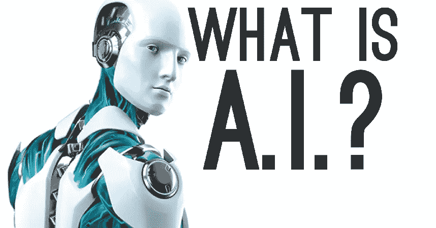
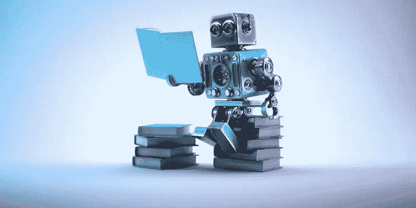
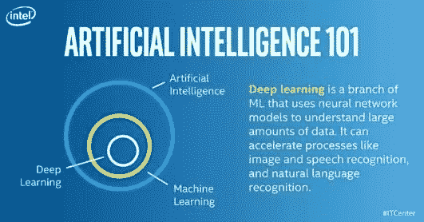

# 人工智能、机器学习和深度学习之间的主要区别

> 原文：<https://medium.com/hackernoon/top-differences-between-artificial-intelligence-machine-learning-deep-learning-d39cb6f6feaa>

Courtesy: Web

人工智能是科技足球的未来，现在一些世界上最先进的人工智能和机器学习可以在几个小时内在一台具有开源框架的个人电脑上开发出来，人工智能将变得比现在更加普遍和普遍。随着自然语言处理、计算机视觉、推荐系统等领域的最新发展，软件将变得更加智能和多功能，变得像 CMS 一样容易开发。

如今，人工智能在我们的日常生活中扮演着重要的角色；从我们的智能手机到其他电子设备，技术给了我们改变游戏规则的机会，这将有助于你的工作和生活方式。很少有像《终结者》、《变形金刚》和《这个时代的最新》这样受欢迎的科幻电影——2009 年的 Avtar 是人工智能、机器学习和深度学习的最佳例子。

# 什么是人工智能(AI)？

Courtesy: Web

计算机系统的理论和发展，能够执行通常需要人类智能的任务，如视觉感知、语音识别、决策和语言间的翻译。

# 什么是机器学习？

Courtesy: Web

**机器学习**是计算机科学领域人工智能的一个子集，它经常使用统计技术来赋予计算机利用数据“学习”(即逐步提高特定任务的性能)的能力，而无需显式编程。1959 年，阿瑟·塞缪尔在人工智能之后不久创造了这个短语，将其定义为“无需明确编程就能学习的能力。”

# 什么是深度学习？

深度学习是人工智能(AI)中机器学习的一个子集，它具有能够从非结构化或无标签的数据中进行无监督学习的网络。也称为深度神经学习或深度神经网络。下面用 AI 进化的链接来解释:【https://twitter.com/ipfconline1/status/1013810896399945728】T2

> 现在，知道人工智能、机器学习和深度学习之间的区别很重要

Courtesy: Web-(Intel)

***人工智能——机器所展示的人类智慧***

回到 1956 年夏天的会议，那些人工智能先驱的梦想是建造复杂的机器——由新兴的计算机实现——拥有与人类智能相同的特征。这就是我们认为的“通用人工智能”的概念——拥有我们所有的感官(甚至更多)、所有的理性，并像我们一样思考的神奇机器。你已经在电影《朋友-C-3PO &敌人-终结者》中无休止地看到了这些机器。一般的人工智能机器仍然留在电影和科幻小说中是有充分理由的；我们做不到，至少现在还不行。

我们能做的属于“狭义人工智能”的概念。能够像我们人类一样或者更好地完成特定任务的技术。狭义人工智能的例子包括 Pinterest 等服务上的图像分类和脸书上的人脸识别。

这些都是实践中狭义人工智能的例子。这些技术展示了人类智慧的某些方面。但是怎么做呢？这种智慧从何而来？这让我们进入下一个循环，机器学习。

***机器学习——实现人工智能的一种途径***

机器学习最基本的是使用算法来解析数据，从中学习，然后对世界上的一些事情做出决定或预测。因此，机器不是用一组特定的指令手工编写软件例程来完成特定的任务，而是使用大量的数据和算法来“训练”它，使它有能力学习如何执行任务。

机器学习直接来自早期人工智能人群的思想，多年来的算法方法包括决策树学习、归纳逻辑编程。聚类、强化学习和贝叶斯网络等等。正如我们所知，没有一个实现了通用人工智能的最终目标，即使是狭义的人工智能也是早期机器学习方法无法达到的。

事实证明，多年来机器学习的最佳应用领域之一是计算机视觉，尽管它仍然需要大量的手工编码来完成这项工作。人们可以进去编写像边缘检测过滤器这样的手动编码分类器，这样程序就可以识别一个对象在哪里开始和停止；形状检测以确定它是否有八个边；识别字母“S-T-O-P”的分类器。从所有这些手动编码的分类器中，他们将开发算法来理解图像，并“学习”确定它是否是一个停车标志。

很好，但不令人费解。尤其是在雾天，标志看不清，或者被树遮住了一部分。直到最近，计算机视觉和图像检测才接近人类，这是有原因的，它太脆弱，太容易出错。

时间和正确的学习算法让一切变得不同；这就把我们带到了下一个圈子，**深度学习**。

***深度学习——一种实现机器学习的技术***

早期机器学习人群中的另一种算法方法，人工神经网络，出现了，并在几十年内基本消失。神经网络的灵感来自于我们对大脑生物学的理解——神经元之间所有的相互联系。但是，与任何神经元都可以在一定物理距离内连接到任何其他神经元的生物大脑不同，这些人工神经网络具有离散的层、连接和数据传播方向。

例如，你可以拿一幅图像，把它分割成一堆小块，输入到神经网络的第一层。在第一层的单个神经元，然后将数据传递到第二层。第二层神经元完成它的任务，以此类推，直到产生最后一层和最终输出。

每个神经元都为其输入分配一个权重——它相对于正在执行的任务的正确或不正确程度。最终输出由这些权重的总和决定。所以想想我们的停车标志的例子。一个停车标志图像的属性被分割开来，由神经元进行“检查”——它的八角形形状，它的消防车红色，它独特的字母，它的交通标志大小，以及它的运动或不运动。神经网络的任务是判断这是否是一个停车标志。它会根据权重得出一个“概率向量”，这实际上是一个经过高度训练的猜测。在我们的例子中，系统可能有 86%的信心认为图像是一个停止标志，7%的信心认为它是一个限速标志，5%的信心认为它是一个卡在树上的风筝，等等——然后网络架构告诉神经网络它是否正确。

甚至这个例子也超越了它本身，因为直到最近人工智能研究社区都在回避神经网络。它们在人工智能的早期就已经存在，并且在“智能”方面产生的东西很少。问题是，即使是最基本的神经网络也是计算密集型的，这并不是一种实用的方法。尽管如此，由多伦多大学的 Geoffrey Hinton 领导的一个小型异端研究小组坚持不懈，最终实现了超级计算机运行的并行算法，并证明了这一概念，但直到 GPU 被部署在这项工作中，承诺才得以实现。

深度学习已经实现了机器学习的许多实际应用，并扩展到人工智能的整个领域。深度学习分解任务的方式让各种机器辅助看起来可能，甚至有可能。无人驾驶汽车，更好的预防性医疗保健，甚至更好的电影推荐，都在今天或即将到来。人工智能是现在和未来。在深度学习的帮助下，人工智能甚至可能达到我们长期以来想象的科幻小说状态。你有 C-3PO，我要了。你可以留着你的终结者。

Courtesy: Google.com

# *结束*

## 人工智能和物联网错综复杂地联系在一起！

在过去的十年里，深度学习正在被企业用来解决业务层面的挑战。从人脸检测到产品推荐、客户细分、数字识别、机器翻译、商业智能、物联网、网络安全等等，深度和机器学习作为一个过程的使用已经完全改变了我们今天生活的世界。

最后，如果你正在寻找技术创新和先进的 IT 解决方案提供商。我们有一个坚实的技术专家团队，他们在开发尖端创新解决方案方面拥有深入的知识和丰富的经验。如果您正在寻找人工智能顾问的 IT 开发合作伙伴或机器学习应用程序开发服务的开发合作伙伴