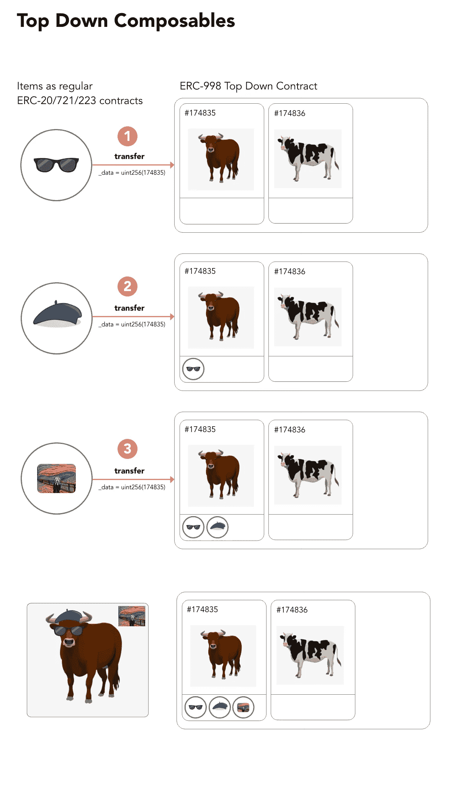
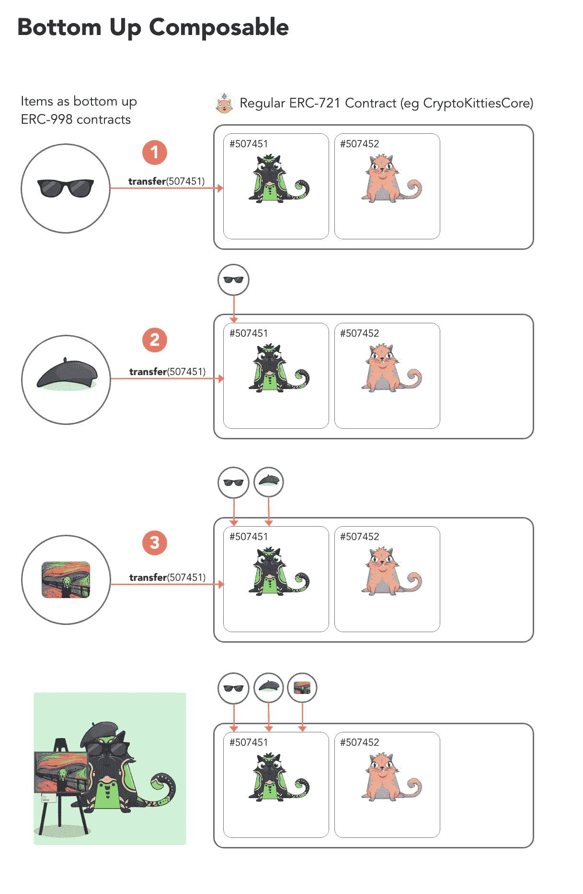

# 自顶向下和自底向上的 Composables，有什么区别，应该使用哪一个？

> 原文：<https://medium.com/hackernoon/top-down-and-bottom-up-composables-whats-the-difference-and-which-one-should-you-use-db939f6acf1d>

可组合令牌是一种不可替换的令牌(或唯一的数字资产)，它可以拥有其他不可替换的令牌或被其他不可替换的令牌拥有。可组合体可以组合成由所有权链接的聚合结构。

ERC998 标准是关于可组合令牌的两种不同方法。两种不同的可组合组件是**自顶向下的可组合组件**和**自底向上的可组合组件**。

这两种组件[都实现](https://hackernoon.com/tagged/implement)ERC721 标准(ERC721 令牌也是如此)，并扩展该标准，使它们能够拥有其他 ERC 721 令牌或被其他 ERC 721 令牌拥有。它还为 ERC721 令牌提供了一种拥有/拥有 ERC20 令牌的方式。

你可以想象一个拥有 20 个 ERC721 令牌的可组合体，或者一个拥有一个拥有一个可组合体的可组合体；或者任何由组件和 ERC721 令牌组成的所有权树。

有两种不同的方法(自顶向下和自底向上),因为它们有不同的优缺点。这篇博客文章概述了两者的优点和缺点，这样你就能理解它们之间的区别。我希望这篇文章可以帮助你决定使用哪种 composable 来做你想做的事情。

# 自顶向下的组件

自顶向下的[可组合的](https://hackernoon.com/tagged/composable)存储关于其子令牌的信息。任何 ERC721 令牌都可以转移到自顶向下的可组合组件中。自顶向下的组件就像房子或容器一样“受欢迎”。你在里面放了 ERC721 代币。当然，您可以从其中转移 ERC721 令牌。自顶向下的组件本身就是 ERC721 令牌，因此您可以像对待常规 ERC721 令牌一样传递它们。想象一下，在一个容器里装满一堆单独的物品，然后把这个容器给别人。这就像将 ERC721 标记添加到自顶向下的可组合组件中，然后将该可组合组件转移给其他人。

**自上而下的优势:**

1.  任何 ERC721 令牌都可以转移到自顶向下的可组合组件。另一种说法是，任何 ERC721 令牌都可以是自顶向下可组合组件的子组件。
2.  很好地跟踪子令牌，因此如果可组合契约实现了枚举，那么您可以查询并获取自顶向下可组合契约的所有子契约和子令牌 id。

**自上而下的缺点:**

1.  自顶向下可组合不能是常规 ERC721 标记的子级。另一种说法是，自顶向下可组合的所有权不能转移到常规的 ERC721 令牌。另一种说法是，常规的 ERC721 令牌不能拥有自顶向下的可组合令牌。我说“常规 ERC721”标记是因为一个自顶向下可组合的*可以是另一个自顶向下可组合的*的子代。它不能是没有可组合功能的 ERC721 令牌的子级。
2.  不能在常规 ERC721 子契约中直接调用所有者/已批准身份验证的方法。例如，您不能在子令牌的子契约中直接调用“safeTransferFrom”函数。这不会起作用，因为该函数将检查您是否是子令牌的直接所有者，并且会失败，因为自顶向下的可组合组件是子令牌的直接所有者，而不是您。因此，您需要调用自顶向下的可组合契约中的方法来调用子契约中的方法，而不是直接调用子契约中经过身份验证的方法。例如，自顶向下的可组合契约有一个名为“safeTransferChild”的方法，该方法将为您调用子契约中的“safeTransferFrom”函数。如果您希望在子契约中调用其他经过身份验证的方法，但是在自顶向下的可组合组件中没有相应的方法，那么您就不走运了。您必须将子令牌从自顶向下可组合组件中转移出来，然后直接在子契约上调用这些方法。注意，这个缺点只适用于“常规 ERC721 子契约”。经过身份验证的方法*可以直接在子可组合契约上调用*。

下图展示了自顶向下的组件是如何工作的:

Graphic created by [Abhishek Chadha](/@abhishekchadha).

# 自底向上的组件

自底向上的可组合契约存储关于父令牌的信息。每个自底向上的可组合组件“知道”它的父令牌，如果它有一个父令牌的话。与自顶向下的组件不同，自底向上的组件不存储有关子令牌的信息。

自底向上组件将自己作为子令牌附加到其他 ERC721 令牌。他们是“粘人”类型的可组合。

自底向上的组件将常规的 ERC721 令牌视为容器。例如，可以将 20 个自底向上的组件转移到一个常规的 ERC721 令牌，然后可以通过将常规的 ERC721 令牌转移给其他人来简单地转移所有这些组件。

**自下而上的优势**

1.  自底向上的可组合组件可以被转移到任何 ERC721 令牌。另一种说法是，自底向上的可组合对象可以是常规 ERC721 标记的子对象。
2.  可以在子自底向上可组合契约上直接调用经过身份验证的方法。

**自下而上的缺点**

1.  常规 ERC721 标记不能是自底向上组件的子标记。我说“常规 ERC721 令牌”是因为自底向上组件可以是其他自底向上组件的子令牌。

我不会把自底向上的可组合枚举列为优点或缺点，因为它可能被视为两者都有。它是这样工作的:一个自底向上的契约被提供了一个父 ERC721 令牌，该契约返回它为该父提供的所有子令牌。这意味着要获得一个父令牌的所有子令牌，必须查询每个可能有子令牌的自底向上契约。

下图展示了自底向上的组件是如何工作的:

Graphic created by [Abhishek Chadha](/@abhishekchadha).

# 主要差异摘要

自顶向下和自底向上方法的主要优点和缺点是相互对立的。自顶向下组合的主要优点是自底向上组合的主要缺点，反之亦然。

这两种可组合类型的主要优点/缺点是它们处理常规 ERC721 令牌的方式。你可以在这里看到:

1.  常规 ERC721 标记不能是自顶向下组件的父标记，但它们可以是自底向上组件的父标记。
2.  常规 ERC721 标记不能是自底向上组件的子标记，但它们可以是自顶向下组件的子标记。

当只使用 composables(没有常规的 ERC721 令牌)时，这两种类型的主要缺点都消失了。

# 用哪种可组合的？

如果您想要将常规 ERC721 令牌转换为不可替换的令牌，那么请使用自顶向下的组件。

如果你想将不可替换的令牌转换成常规的 ERC721 令牌，那么使用自底向上的组件。

# 一个令牌可以同时是自顶向下和自底向上的组合吗？

是的，这意味着为同一个令牌实现两种方法的功能。

# 自顶向下的可组合体可以拥有自底向上的可组合体吗，反之亦然？

是的，这两种方法的当前 ERC998 实现可以互操作。

# 从哪里可以了解更多关于 ERC998 组件的信息？

阅读 Matt Lockyer 关于他们的博客。

[查看 composables 代码库中当前的实现。](https://github.com/mattlockyer/composables-998)

[查看 ERC998 的 EIP 草案，该草案基于 composables 的当前实现。](https://eips.ethereum.org/EIPS/eip-998)本文档解释了自顶向下和自底向上组合的技术细节。

在 NFTy 魔术师不和谐服务器中与我们聊天。

# 我如何帮助 ERC998 标准或实施？

是的，我们正在寻求帮助。[加入 discord 服务器。](https://discord.gg/uxkHy3)

***在***[***delegate call . careers***](https://delegatecall.careers/)***找到一份开发智能合同的工作。***