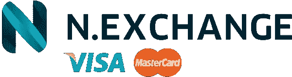

# 顶级黑客正午开发和加密故事

> 原文：<https://medium.com/hackernoon/top-hacker-noon-dev-crypto-stories-a5d9f5b2c19d>

[***n . exchange***](http://bit.ly/2OGeJi6)*是最简单的加密货币兑换方式，对个人和公司都一样。* [***现在用信用卡兑换或购买加密货币*** *。*](http://bit.ly/2OGeJi6)

# 嗨，黑客，是时候阅读伟大的科技故事了:-)周一快乐！

# 八月最热门的[开发](http://hackernoon.com/tagged/software-development)故事([至今](https://hackernoon.com/archive/2018/08))

## [基本颤振技巧](https://hackernoon.com/essential-flutter-skills-2466d91d3926)作者[尼克·曼宁](https://medium.com/u/369e2e1c1beb?source=post_page-----a5d9f5b2c19d--------------------------------)

## [在软件工程中寻找创造力](https://hackernoon.com/finding-creativity-in-software-engineering-5f20193ae54c)作者[高塔姆·达梅亚](https://medium.com/u/3308dd31324b?source=post_page-----a5d9f5b2c19d--------------------------------)

## [优秀程序员 vs 一般程序员](https://hackernoon.com/good-programmer-vs-average-programmer-4a398889fe68?source=collection_archive---------6---------------------)由 [javinpaul](https://medium.com/u/bb36d8439904?source=post_page-----a5d9f5b2c19d--------------------------------)

## [如何在没有充实作品集的情况下在 21 天内获得一份远程自由职业网站开发工作](https://hackernoon.com/remote-freelance-web-development-job-no-portfolio-2f871f298cbb?source=collection_archive---------4---------------------)作者[吴镇男·索佐](https://medium.com/u/b9375ead09e2?source=post_page-----a5d9f5b2c19d--------------------------------)

## [Python 戏法 101](https://hackernoon.com/python-tricks-101-2836251922e0?source=collection_archive---------0---------------------) 作者[高森·桑托什](https://medium.com/u/96ae15eefa1e?source=post_page-----a5d9f5b2c19d--------------------------------)

## [关于张量流你应该知道的 9 件事](https://hackernoon.com/9-things-you-should-know-about-tensorflow-9cf0a05e4995?source=collection_archive---------3---------------------)作者[凯西·科济尔科夫](https://medium.com/u/2fccb851bb5e?source=post_page-----a5d9f5b2c19d--------------------------------)

## [二十五年后，人们仍然对 Python 着迷](https://hackernoon.com/10-ways-to-make-python-a-dangerous-language-for-data-science-6b88566ac040)

## [在生产环境中运行 PM2&node . js](https://hackernoon.com/running-pm2-node-js-in-production-environments-13e703fc108a)作者[尼克·帕森斯](https://medium.com/u/2b4ad922cc1e?source=post_page-----a5d9f5b2c19d--------------------------------)

## [销售驱动开发的陷阱](https://hackernoon.com/the-trap-of-sales-driven-development-89e16c5e292f?source=collection_archive---------1---------------------)作者[马库斯·布兰肯希普](https://medium.com/u/7c9efa27ab52?source=post_page-----a5d9f5b2c19d--------------------------------)

## [Whatsapp 商业 API:聊天市场颠覆者？](https://hackernoon.com/whatsapp-business-api-a-chat-market-disruptor-250476574fed)作者[穆罕默德·沙赫巴兹·谢里夫](https://medium.com/u/59f2f6d0031e?source=post_page-----a5d9f5b2c19d--------------------------------)

# 八月的顶级[隐秘](http://hackernoon.com/tagged/cryptocurrency)故事([至今](https://hackernoon.com/archive/2018/08))

## [ASIC 抵抗不过是](https://hackernoon.com/asic-resistance-is-nothing-but-a-blockchain-buzzword-b91d3d770366?source=collection_archive---------2---------------------)[stopandcrypt](https://medium.com/u/cbbfa20339f2?source=post_page-----a5d9f5b2c19d--------------------------------)的区块链流行语

## [深入以太坊:以太坊是如何存储数据的？](https://hackernoon.com/getting-deep-into-ethereum-how-data-is-stored-in-ethereum-e3f669d96033?source=collection_archive---------7---------------------)由[瓦萨](https://medium.com/u/2bfdd6540157?source=post_page-----a5d9f5b2c19d--------------------------------)

## [如何在智能合约中不毁掉数百万(Pt。1)](https://hackernoon.com/how-to-not-destroy-millions-in-smart-contracts-pt-1-bdefac3656b7) 由[奥梅尔·戈德堡](https://medium.com/u/49b16006351c?source=post_page-----a5d9f5b2c19d--------------------------------)

## [慢慢走向认可:加密货币正在融入主流金融服务。](https://hackernoon.com/inching-towards-recognition-crypto-currencies-are-integrating-into-mainstream-financial-services-ce12b124d921)由[aist veberait](https://medium.com/u/8342f9f8995b?source=post_page-----a5d9f5b2c19d--------------------------------)

## [最佳区块链/加密学习资源索引](https://hackernoon.com/index-of-best-blockchain-crypto-learning-resources-3351907ca6cd)作者[Arun agr hri](https://medium.com/u/7ff8b7d388c1?source=post_page-----a5d9f5b2c19d--------------------------------)

## [NVT 比率(加密货币的市盈率)](https://hackernoon.com/network-value-to-transactions-ratio-cryptocurrencys-answer-to-p-e-c3743e700929)作者[布莱恩·奎利万](https://medium.com/u/221094b161ee?source=post_page-----a5d9f5b2c19d--------------------------------)

## 《涟漪:不是一种加密货币》作者[大卫·吉尔伯森](https://medium.com/u/f735d3b0f2f3?source=post_page-----a5d9f5b2c19d--------------------------------)

## [Storage pedia:5 个区块链存储平台的百科全书](https://hackernoon.com/storagepedia-an-encyclopedia-of-5-blockchain-storage-platform-8aa13c630ace)作者 [vasa](https://medium.com/u/2bfdd6540157?source=post_page-----a5d9f5b2c19d--------------------------------)

## 骑士资本的兴衰——高买低卖。冲洗并重复。由[比什尔·塔巴](https://medium.com/u/44df6d5bc9e3?source=post_page-----a5d9f5b2c19d--------------------------------)

## [为什么企业家会免费空投代币？](https://hackernoon.com/why-do-entrepreneurs-airdrop-tokens-for-free-93f3993f2b28)由[霍华德马克](https://medium.com/u/612939bd0962?source=post_page-----a5d9f5b2c19d--------------------------------)

直到下一次，不要把世界的现实想当然。

亲切的问候，

大卫·斯穆克

**p . s .**[***n . exchange***](http://bit.ly/2OGeJi6)***，*** *我们的每周赞助商，是兑换加密货币最简单的方式，对个人和公司一视同仁。* [***现在用信用卡兑换或购买加密货币。***](http://bit.ly/2OGeJi6)

