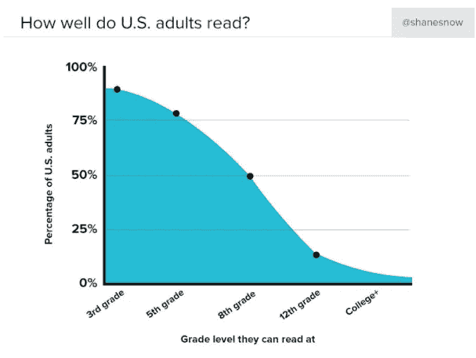
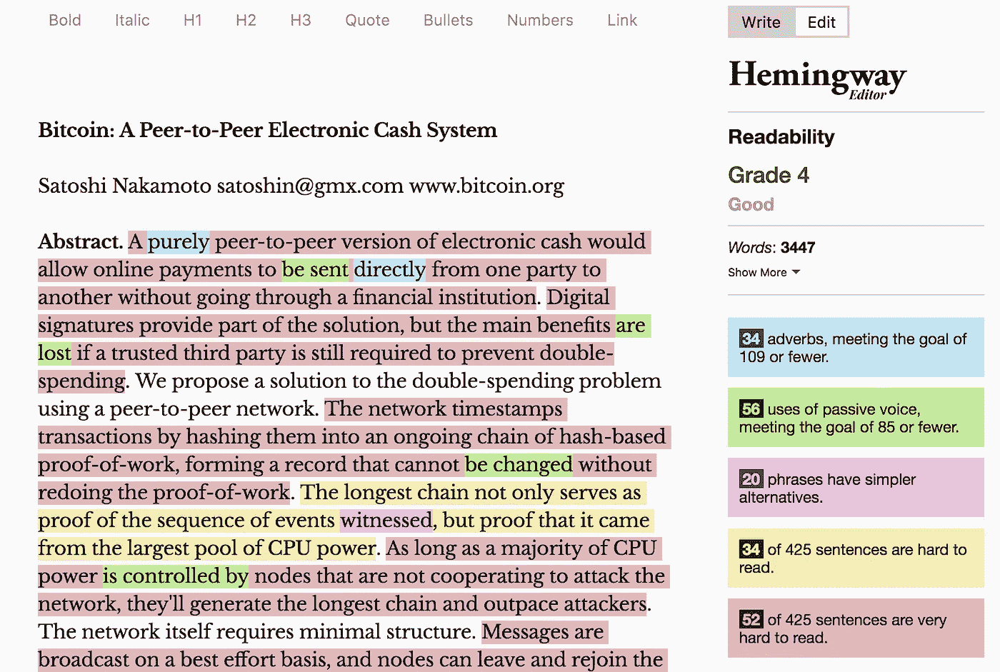
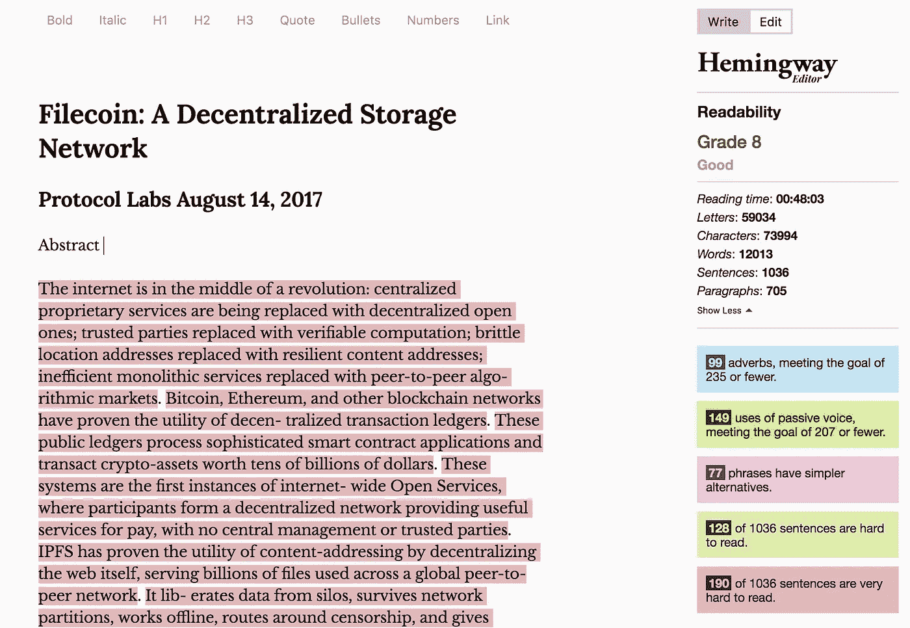
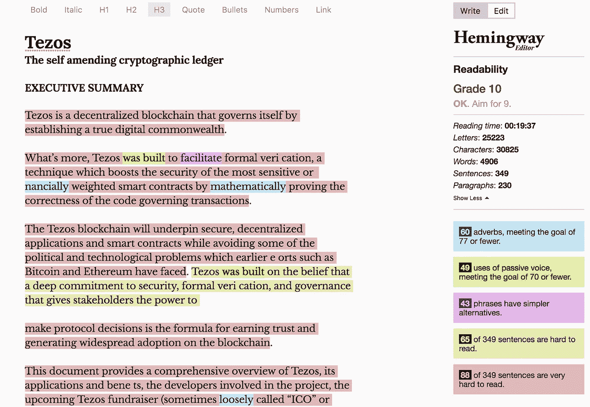
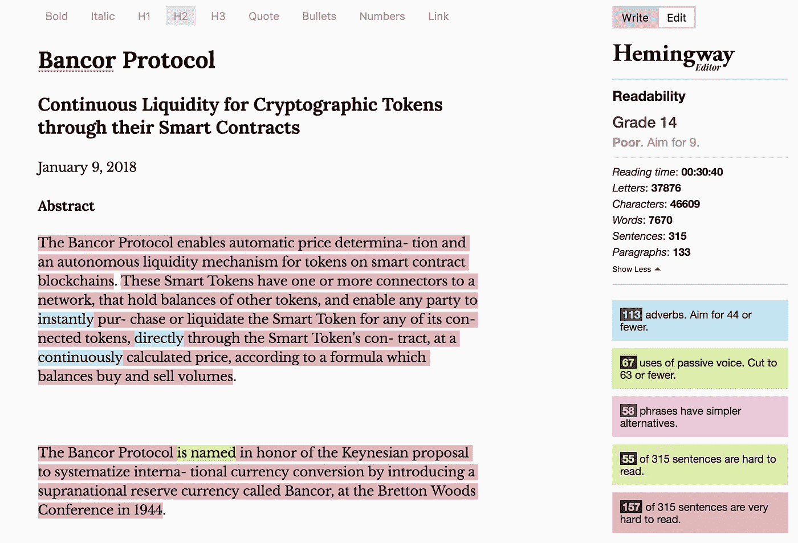
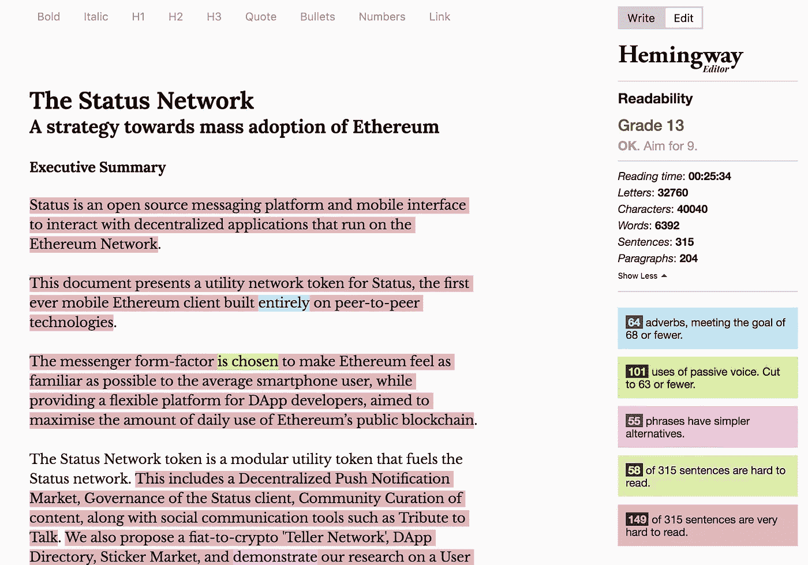
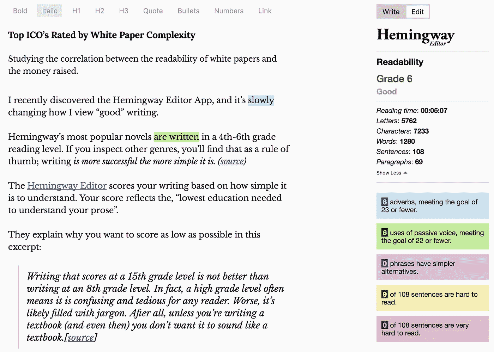

# 根据白皮书复杂性评定的顶级 ICO

> 原文：<https://medium.com/hackernoon/top-icos-rated-by-white-paper-complexity-a7d2a2fda93d>

## 研究白皮书的可读性和筹集到的资金之间的相关性。

我最近发现了[海明威编辑器应用](http://hemingwayapp.com)，它正在慢慢改变我对“好”写作的看法。

## **海明威最受欢迎的小说是以 4-6 年级的阅读水平写成的。**

如果你考察其他流派，你会发现这是一个经验法则；写*越简单越成功。(* [*来源*](https://contently.com/strategist/2015/01/28/this-surprising-reading-level-analysis-will-change-the-way-you-write/) *)*

海明威编辑根据你的文章理解的简单程度来评分。你的分数反映了“理解你的文章所需的最低教育水平”。

他们解释了为什么你想在这个节选中得到尽可能低的分数:

> 15 年级水平的写作成绩并不比 8 年级水平的写作成绩好。事实上，高年级水平往往意味着它是令人困惑和乏味的任何读者。更糟糕的是，它可能充满了行话。毕竟，除非你正在写一本教科书(即使那样)，否则你不会希望它听起来像一本教科书。[ [来源](http://www.hemingwayapp.com/help.html)

来自 GQ 的文章大约是六年级的阅读水平。而 Buzzfeed 的文章——比 GQ 的文章分享得更多——处于第三等级。

当你想到只有 50%的美国人能够阅读八年级水平的文章时，这是有道理的。当你注意到只有 15-20%的美国人能够理解 12 年级水平的写作时，这就更有意义了。

如果我们想要大量采用区块链技术，我们需要让加密变得更加简单。

## 可读性与筹集的资金

这让我想知道这里是否有任何关联。在白皮书的可读性和筹集的资金之间。

*“白皮书”本质上是区块链项目面向消费者的商业计划书。大多数硬币将允许潜在投资者从他们的官方网站下载白皮书。在决定一个项目是否是一项可靠的投资时，白皮书也是你应该首先考虑的因素之一。*

我并不是说一个 ICO 比另一个 ICO 好是基于他们的分数。完美的 *ICO 配方*有无数的成分。

然而，一些 ICO 隐藏在技术白皮书和深奥的术语后面。好像他们能用花里胡哨的话骗走读者的钱。

几个月前，我开始着手确定“ICO 发布最佳实践”——从白皮书设计到代币供应。我与 BlockchainWarehouse 合作，我所做的一部分工作是审查向我们寻求支持的项目。我们是区块链项目的加速器，所以作为一个密码迷，这是一个非常棒的工作。我帮助公司从“餐巾纸创意”一直到他们的代币生成活动，并有机会见到一些我见过的最有才华的人。无论是我在 BlockchainWarehouse 的团队，还是我们帮助创立的公司。

我想确定可量化的指标来帮助衡量 ICO 或令牌销售成功的机会，这样我就可以将它们应用于我们合作的公司。不太乐观的是，我也很想知道是否有一种方法可以解释这种疯狂，因为如果没有，这可能表明我们确实处在一个泡沫中。

让我们看看一些最大的 ICO 的排名与好欧内斯特。

> *保证排名的公平性；我删除了白皮书中除散文以外的所有文字。没有列表，团队成员的名字，数学方程式，或者任何没有用正确的句子结构写出来的东西。*

# 海明威实验

**又名海中老人行动**

# 比特币

**评分:**四年级阅读水平
**难度:** 20%的句子很难或非常难阅读。
**篇幅:** 9 页

我理解比特币从未有过初始硬币发行(ICO)。我在这里把它作为一个参考框架。作为所有加密货币之父，记住我们来自哪里很重要。

比特币白皮书是我看过的最短的。当我意识到它是如此短暂时，我真的吃了一惊。

比特币正在颠覆 100 年的行业，它用 9 页纸解释了自己。8 如果不算“参考”页的话。

无论你是比特币的最大化者，还是只是想赚快钱的人，你都不能否认比特币是迄今为止最成功的加密货币。

# FileCoin

**得分:**八年级阅读水平
**募集金额:**2.57 亿美元

难度:39%的句子“很难”或“非常难”阅读。
**篇幅:** 36 页

# 泰佐斯

得分:十年级阅读水平
**募集金额:**2.32 亿美元

**难度:** 43%的句子“很难”或“非常难”阅读。
**篇幅:**二十页

# 班科尔

**分数:**14 年级阅读水平
**募集金额:**1.53 亿美元

**难度:** 67%的句子“很难”或“非常难”读懂。
**篇幅:** 22 页

# 状态

**成绩:**13 年级阅读水平
募集金额:1.07 亿美元

**难度:** 65%的句子“很难”或“非常难”阅读。
**长度** : 35 页

# 外卖食品

## 简单性和筹集到的资金之间似乎没有太大的关联。

## 阅读困难的含义

在这个**有限的样本量**中，白皮书越简单——筹集的资金就越多。Filecoins 的白皮书乍一看是技术性的。进一步考察，你会发现它的技术方面主要是数学方程/证明。

我认为 Tezos 会因其白皮书的结构而得分较高。简单的工作流程很漂亮。我认为它会比 Filecoin 做得更好。我发现 Filecoins 白皮书的设计令人不快。

然而，围绕这些“复杂方程”的文章很容易理解。

Bancor 和 Status 都用非常深奥的语言来解释他们的概念。请记住，这两个都是非常成功的 ICO。两者都在加密货币涨幅最大的前 2%之内。

然而，1 亿美元和 2.57 亿美元之间的差距在任何参照系中都是相当大的。

## 简单就是速度

重申一下，我不认为这种有限的研究真正代表了一种趋势。我写这篇文章是为了开始理解是什么造就了一个成功的 ICO。我选择评分的 ICO 都是 2017 年的前 10 名 ICO；关于筹集的资金总额。

我想知道好的**和好的**的区别。****

****在当前的市场环境下，一个 ICO 的质量不如它推销自己的能力重要。****

****我见过一些可怕的 ICO 一眨眼就被资助了。我也看到过可能改变世界的颠覆性概念，因为没有得到足够的关注而失败。****

****我的目标是确定“完美 ICO 配方”中每个变量的权重。为即将出现的 ICO 确定一个有效的分级方法，可以进行定量测试。****

****我不相信上面的任何一个项目推出的不好。我提到一些公司使用技术语言来隐藏他们不知道他们在谈论什么的事实。这些项目都不属于那一类(据我所知)。****

****区块链技术需要向使用更容易理解的散文过渡。如果我们想实现大规模采用，我们必须使我们的阅读材料不那么可怕！****

****我向所有想要撰写白皮书的人和区块链首席执行官发出挑战，要求他们表明立场，让加密变得简单。****

****如果你不能用几句话向街上的普通人解释你的商业模式。你凭什么认为你有时间向重要的人解释？****

****每次我向投资者推销一项业务，我都能在头 30 秒内看出他们是否感兴趣。因为我通常花 30 秒或更少的时间来解释这个概念。****

****白皮书并不是要用你的技术知识“惊艳”人们。它们是关于以一种简单的方式分享你的概念，当你第一次想到它的时候，读者会经历同样的“啊哈”时刻。****

# ****你认为是什么造就了一个“伟大”的 ICO？请在下面评论您的 ICO 分级标准！****

## ****— — — — — — — — — — —****

## ****以防你好奇。****

****这篇文章是以一个 6 年级的阅读水平写的，8%的句子“很难读”。****

****我来找你了，聪！****

********

****希望你喜欢！****

## ****如果你喜欢这篇文章，并想了解更多关于区块链——一个密码极客的密码/随机漫谈——看看我的其他文章。****

**** [## 不熟悉加密货币？从这里开始

### 加密货币、比特币和区块链速成班

medium.com](/swlh/new-to-cryptocurrency-start-here-44cc5a6d6626)  [## 了解加密货币市场周期，以便更好地投资

### 为什么以太币、莱特币和其他替代币会在比特币创下新高时下跌，以及如何利用这一点

medium.com](/swlh/understanding-cryptocurrency-market-cycles-for-better-investments-c6cc4bc80099)  [## 加密货币的未来

### 鸟瞰是什么导致了加密市场的兴起

medium.com](/swlh/on-the-future-of-cryptocurrency-e8ff9e171be9)  [## 关于 Facebooks 加密货币你需要知道的一切(Libra 项目)

### 我阅读了 Project Libra 白皮书，所以你不必这样做。

medium.com](/swlh/facebook-crypto-d13449171a9f)****