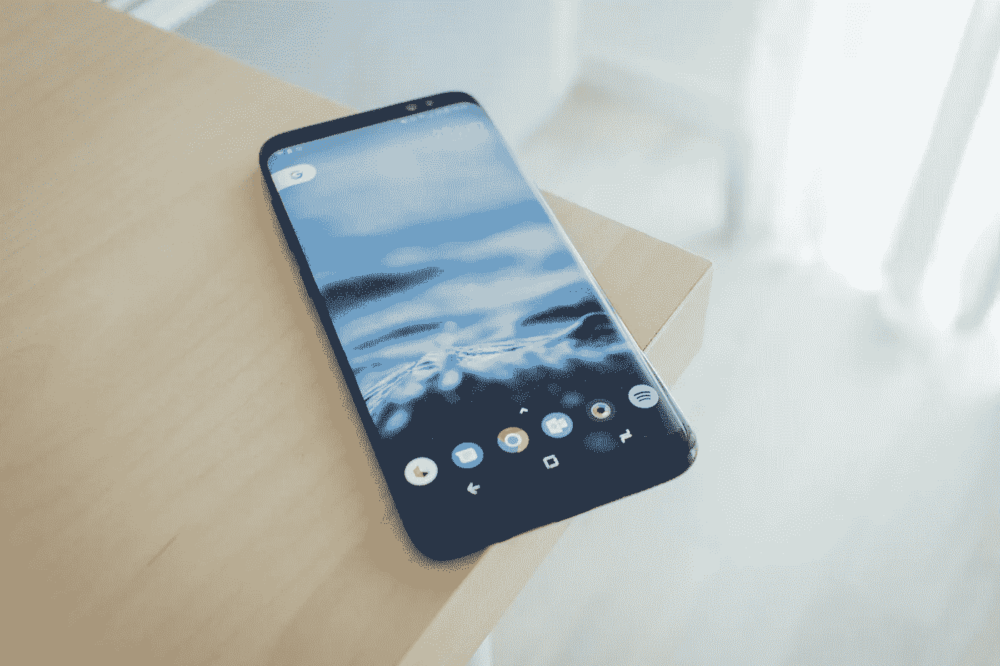

# 10 倍的创造力和提高你的注意力[在 2018 年]

> 原文：<https://medium.com/hackernoon/top-morning-routine-to-10x-creativity-boost-your-focus-in-2018-a695dce201fe>

一年前，我被手机的嘟嘟声吵醒。

早上七点半。

我在夏威夷的大学攻读市场营销学士学位，那天我的课程表排得满满的。

我懒洋洋地翻阅我的 Instagram，因为我模糊的眼睛慢慢适应光线。我检查了我的电子邮件，点击了被称为脸书的黑洞。

我抬头看了看时间，“上午 7 点 59 分”，不知怎么的，30 分钟过去了，我快要迟到了，因为我要去上 8 点的课。我扯掉被子，穿上几件衣服，沿路飞奔而去。

**不吃早餐。**

坐在课堂上，我的小组被告知要为当地的快餐车想出一个有创意的营销计划。我知道这个项目已经有一段时间了，但没有太多的考虑。

我盯着那张白纸看了几分钟，但我脑海中闪现的唯一想法是经典、普通和无聊的。

突然，我们组的一个女孩提出了一个伟大的计划。她把最近听到的一些新想法和自己的创意结合了起来。我们很喜欢它，老师也很喜欢它，后来我把它告诉了一个朋友，他决定用他最近在瓦胡岛北岸开的快餐车来实现这个想法。

# 头脑空白的解决方案

[Unsplash](https://unsplash.com/photos/PoD5OldJQMQ)

我们都经历过我那天早上那种尖叫和大脑空白的时刻。为什么我想不出新的、有趣的或有创意的东西？我可能不是爱因斯坦，但我过去做过。

我给你这个秘密。这与我如何开始我的一天有很大关系，自从弄清楚如何正确开始，我每天的创造性产出增加了 10 倍。

下面我创建了一个循序渐进的指南，告诉你如何正确地开始新的一天——同时提升你的[创造力和解决问题的能力。](https://hackernoon.com/tagged/creativity)

# 不要看手机

[Unsplash](https://unsplash.com/photos/VD9Hsvg3DVQ)

早晨是独处和思考的大好时光。你的头脑清新整洁，充满了新的想法。

我每天早上做的第一件事就是查看我的手机。如果你想拥有创造力，这是一个错误。德勤的一项研究显示，61%的人在起床后 5 分钟内查看他们的智能手机。

> 很久以前的心理学研究证明了我们大多数人从经验中知道的事情:频繁的干扰分散了我们的思想，削弱了我们的记忆，并使我们紧张和焦虑
> 
> *——尼古拉斯·卡尔浅滩*

早上第一件事就是查看手机，这会分散你的注意力。你失去了宝贵的最佳大脑清晰度和活动。不要早上第一件事就心烦意乱，把手机放在一边，做以下事情:

# 沉思你的每日目标

[Unsplash](https://unsplash.com/photos/NTyBbu66_SI)

神经科学研究表明，当我们冥想并向内聚焦时，我们的大脑会发现新的思维网络，我们的神经联系也会改变和改善。这让我们的大脑有机会从不同的角度思考我们的问题或目标，让我们有更新更有创意的解决方案。

每天冥想 5-10 分钟可以有多种形式。对我来说，这是祈祷。对其他人来说，这是安静的思考。专注于感恩和寻找解决方案将会打开你的思维，用新的和创造性的方法来处理你的日常任务。

一项[关于 NCBI 的研究](http://www.ncbi.nlm.nih.gov/pmc/articles/PMC3887545/)将冥想与众多认知和心理益处联系起来，包括:

*   提高任务专注度
*   持续的关注、同理心和自省
*   增强的记忆
*   改进的学习

# 思想倾倒和日志记录

[Unsplash](https://unsplash.com/photos/-UUGr3txNuc)

**思想倾倒**是将你脑海中闪现的任何想法写在一张纸上的做法。不受干扰，你让你的大脑做它最擅长的事情:

**想。**

就在你醒来之后，当你的头脑清新而放松的时候，当你只是简单地“听”和写的时候，让思想流动。打开一本日记，用大约 5-10 分钟写下你想到的任何事情。

当涉及到个人创造力时，这种实践是有益的，因为它训练你的大脑适应漫游和发展独特的思想。

许多你允许流入“思想垃圾场”的想法、目标、想法和梦想都有不可思议的潜力，但是如果它们被遗忘了，它们就不会变成现实，所以:

**把它们写下来！**

思想倾倒的目的不仅仅是在遥远的未来回顾和阅读你的想法，而是在你的大脑中强化它们，这样它们就能持续地、下意识地影响你。

# 使用笔和纸

[Unsplash](https://unsplash.com/photos/xG8IQMqMITM)

要做到这一点，不要使用你的手机或笔记本电脑**——你需要纸和笔。使用一本日记和一支笔，或者简单的一张纸。这有助于以更持久的方式将这些想法刻入你的大脑。**

《科学美国人》发表了一篇关于手写笔记和电脑打字笔记的区别的文章。

> “用手记笔记比用笔记本电脑记笔记需要不同类型的认知过程，这些不同的过程会对学习产生影响。”

此外，他们解释了手写笔记的优势。

> 用手记笔记迫使大脑从事一些繁重的“精神提升”，这些努力培养理解和记忆。

# 结论

> 你的思想是你一天一天构建的生活蓝图。当你学会引导你的思维——无论是有意识的还是无意识的——你就创造了让你的目标不可避免地实现的条件。
> 
> 本杰明·哈代

你的想法决定了你的行动，而行动决定了你的命运。当你专注于采取这些有形的和物理的行动时，你会发现增加你头脑的清晰度和[创造力的力量](https://www.fiund.com/creativity-checklist1/)。

# 使用清单

如果你对创造力很认真，我已经创建了一个免费的清单，让你进入巅峰[生产力](https://hackernoon.com/tagged/productivity) &创造力。如果你每天都这样做，你就能优先考虑你的生活，积极创造你想要的生活。

[点击此处获取清单！](https://www.fiund.com/creativity-checklist1/)