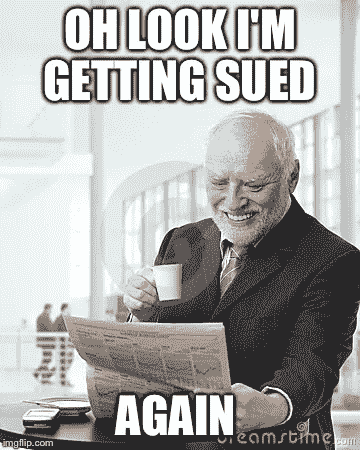
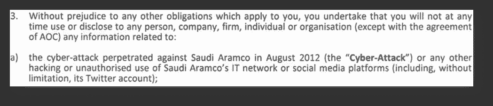

# 审查和起诉安全研究人员和黑客的顶级策略

> 原文：<https://medium.com/hackernoon/top-strategies-for-censored-and-sued-security-researchers-and-hackers-4760d7f63f8c>

This is my life now

邮件已经发出，我们大多数人都害怕邮箱里藏着任何可能的账单。然而，作为一名安全研究员，有一个更大的恐惧。来自律师、大公司或国家的法律威胁、停止和终止以及其他愤怒的信件。在阅读了 Zack Whittaker 最近为 Zero Days 撰写的题为 [***的文章后，诉讼威胁着 InfoSec 的研究——就在我们最需要它的时候***](http://www.zdnet.com/article/chilling-effect-lawsuits-threaten-security-research-need-it-most/) 。一个后续行动，一些经历过诉讼威胁的人的策略似乎很好分享。

不要惊慌，世界还没有结束！

信件或电子邮件被打开，也许你也被送达了。当你通读法律术语时，你的财务生活在你身边闪过。手在发抖，心在喉咙里砰砰直跳。坐下来，深呼吸，遵循道格拉斯·亚当斯的明智建议，“不要惊慌！”法律信函大多是反动的、攻击性的。这就像监狱电影，在那里避免得到，你知道…你第一天在院子里表现得像个最疯狂的婊子，所以你不容易被惹毛。这通常是前几封法律信函的内容。请正确看待此事。

**检查法律**

在你停止颤抖并能说话后，对照实际法律检查信中提到的内容。

**第一种情况:**

我第一次愤怒的停止来自贝克·麦坚时律师事务所通过荷兰优利系统公司。信中写道，我计划在美国做的演讲题目是淫秽的，并把我正在演讲的会议称为犯罪场所。律师事务所的一名律师还口头威胁我的合伙人，说她会起诉我们。一周前，我们的房子被大火烧毁，没有任何保险。快乐的日子，但记住不要惊慌。

1.淫秽的定义是由美国的三层米勒测试建立的。这个演讲题目没有涉及任何定义。

2.标题[互联网是色情的](https://youtu.be/4bNzxYDnfLg)也是百老汇音乐大道 q 的一首歌的标题。演讲的地点在离纽约百老汇几个街区远的地方。

3.这一年是第九次以反审查为主题的会议。[地球上最后一个 H.O.P.E 黑客](https://en.wikipedia.org/wiki/Hackers_on_Planet_Earth)，不违法，不是罪犯的巢穴。书呆子生活！

4.荷兰反对审查的法律通常比美国更强。法律立场是站不住脚的。

**经验丰富的专业人士**

关于 2012 年沙蒙袭击事件，Saudi Aramco 和沙特王国对我的[黑帽美国谈话](https://youtu.be/WyMobr_TDSI)被接受并不高兴。在我最初为演讲被接受而欢欣鼓舞后不久。我的收件箱里有一封来自 Saudi Aramco 律师的礼貌但却咄咄逼人的法律威胁。这些信陈述了各种项目，如我无权。仿佛为阿美家族工作剥夺了我的基本权利。各种信件列出了我无权公开表达我的观点，不允许讨论众所周知的攻击因素，其他众所周知的攻击，未遂事件或列出我与他们的雇佣关系。许多人没有听说过 2012 年沙穆恩袭击事件的原因是，沙特政府发出愤怒、措辞严肃的威胁性法律信函，以产生寒蝉效应。有额外的要求，他们批准任何演示，我必须获得他们的许可。我是一名黑客，我不太擅长不合逻辑的规则和权限。

1.第一个案例编号 4

2.在维加斯发生的事就留在那里，我不是在说维加斯。如果纽约时报报道了这件事，任何人都可以谈论。保密协议不包括在主要媒体上公开的内容。

Don’t even think about discussing public knowledge!

3.我的地理位置不再是沙特，而是美国和荷兰。这两个国家的人民都有权发表自己的意见。

4.我们强调讨论私人信息是职业自杀，并使用逻辑进行辩论。

**不要亲自回应，找律师**

无论你做什么，不要自己回信。问律师，法律类型的朋友，不要雅虎回答。或者你在自讨苦吃。在最激烈的时候，你是一个积极的参与者。你的想法不会没有偏见，可能会因为害怕经济崩溃而变得有点不理智。请你能负担得起的最好的律师。我的第一个律师是贝克·麦坚时律师事务所/Unisys NL 的律师，他们几个月前刚毕业，很恐慌。其中一个法律保险律师。让我关闭博客，诸如此类的事情。有时你可能需要第二个律师，比如在可怕的医学诊断后的第二个意见。当阿美开始寄信时，我花光了所有的积蓄，尽我所能请到了最好的律师。

**做好人，及时用善意杀死他们**

我在阿美石油公司陷入困境时找到的律师给了我很好的建议。友好点，超级友好点。在沙特阿美的案例中，我曾经和一些给我写信的律师共事过。友善更容易，因为我在那里工作期间，我们有着良好的工作关系。原因是，如果你看起来有礼貌和合作，它会看起来更好，如果它到了法官。合作意味着确保你的律师及时回复每一封邮件。不超过一个工作周。这将使你成为一个愿意妥协并表现专业的一方。

**处理可能的骚扰**

一旦收到一封信，你会期待更多的信、电话和一些黑名单。不，它可能反而感觉像一个严重的疱疹，或闪光。在许多情况下，组织将使用外部律师事务所。外部律师事务所的业务是赚钱，他们为每一次沟通或他们考虑案件的每一分钟赚钱。要记住的一点是，在这种情况下，唯一的赢家是律师，因为他们浪费了所有这些收费时间。深呼吸，试着保持冷静。然后，我建议找朋友聊聊。

1.在离开荷兰参加我的反审查演讲之前，我和一名记者 [Brenno De Winter](https://bigwobber.nl/tag/censuur/) 分享了我的演讲草稿。在听说法律威胁后，写下了这一情况，使其成为荷兰的全国性新闻。

2.一个主要的要求是，我删除了所有提及这次谈话的内容，清除了互联网上对它的提及。一个东西一旦上了网，就永远无法删除。相反，关于我演讲的新闻变成了史翠珊效应，被发布到数百个网站和论坛上。

3.阿美石油公司支付了昂贵的女律师飞越拉斯维加斯，旅行，并购买了黑帽美国简报通行证。就在我开始演讲的前一刻，她过来介绍自己，告诉我她不仅代表阿美石油公司，还代表沙特阿拉伯王国，她将坐在前排观看我的演讲。有些事情太他妈的有趣了，15000 英镑到 20000 英镑，让我烦恼了一个小时。它反而给了我力量。

4.后来，我在伦敦做了同样的演讲。在类似的喋喋不休的介绍之后，我在我的发言开始时宣布，沙特阿拉伯王国的一名代表出席了会议，并将非常乐意在会议结束时回答任何问题。她很快离开了房间和整个会议。

5.在欧洲的一个核安全会议上做了一个完全与阿美无关的演讲。其中一个主要赞助商威胁说，如果我在巴拿马报纸的律师事务所客户门户网站上做关于安全弱点的[报告，他们将取消所有赞助。会议组织者，像专家一样处理和调解。据推测，保荐代表人已经与 Saudi Aramco 新任首席执行官谈过话，王储本人在一周前的一次会议上提到了我的名字。我心想，我很受皇室欢迎，布耶。我提到，如果一家欧洲国防制造商被发现应沙特政府的要求在欧洲审查一个人，这可能会是什么样的负面报道，而我的谈话与阿美石油公司或 KSA 毫无关系。](https://hackernoon.com/happy-osint-hacking-fun-with-the-panama-papers-law-firm-mossack-fonseca-post-breach-89698c39f256)

**这很可怕，但你可以做到，利用你内心的愤怒**

压力，一切邪恶的神圣母亲。是的，你将承受巨大的压力，这是法律压力策略的一部分。有时候，压力会让你完全跳出框框思考。在我的最后一次 H.O.P.E 演讲中，我打电话给一个朋友，他同意做我的幽灵演讲者。另一个朋友建议我提供一个折中的办法，我要么站着说话，嘴上蒙着黑胶布什么也不说，要么找一个幽灵演讲者，他可以讲完他们认为令人反感的所有部分。我处于一种悲伤的状态，来自法律威胁的压力，再加上几周前我的房子着火了，我也在里面。勉强出院，吸入浓烟受伤，失去了猫，勉强活着出来。我的鬼音箱 JK47 只好给我带衣服。我承受着巨大的压力离开，这似乎更容易。但如果我会后悔一辈子就不会了。这是我做过的最糟糕的演讲。勉强阻止自己在舞台上呕吐。从长远来看，后悔侵蚀你的内心并不容易。有人会想象我，一个美国退伍军人，轻易地将我来之不易的权利交给任何形式的审查，这让我很生气。现在任何尝试都让我恼火。

**结论**

做一名安全研究员并不容易，尤其是在当前的环境中，隐私威胁、大型组织的技术整合以及律师渴望获得一些甜蜜的可收费绿色的似乎过剩。如果你受到了威胁，还有其他选择:

1.一些国家有数字防御法律组织可以提供帮助，看看吧。

2.不幸的是，业内的朋友可能有过这样的经历。

3.US CERT 有一个 45 天的负责任的披露政策。如果是一个漏洞，也要向他们披露。MITRE，您当地的国家或地区证书也可能有类似的政策，这取决于具体情况或供应商。

4.如果你认为你可能会被起诉，Bug 赏金程序是公布漏洞的好方法。另一个策略是在 Bug Bounty 程序中交叉报告，因为多个报告可能会在提供一些法律保护的同时迫使进行修复。

5.万不得已，你认识什么记者吗？对记者说话可能是一把双刃剑。它可能给我一个快乐的好莱坞结局，也可能给你带来更多的麻烦。请注意，小心处理并使用加密。

6.我可能会因为写这个☹而被起诉