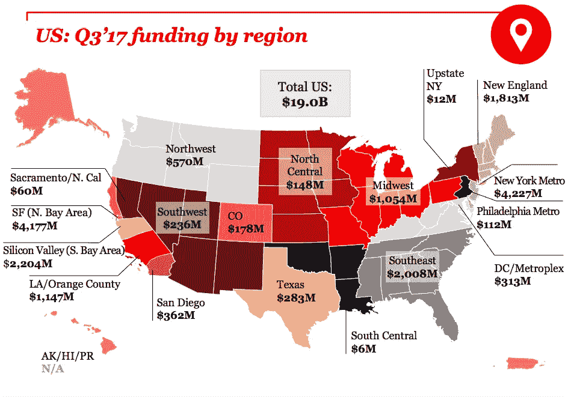
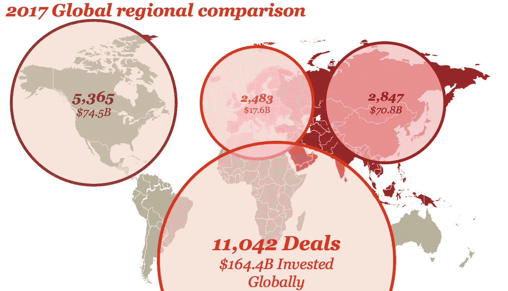

# 关于在硅谷之外投资的十大访谈

> 原文：<https://medium.com/hackernoon/top-ten-interviews-on-investing-outside-silicon-valley-b85ee38bcbe2>

硅谷已经改变了风险投资的世界，被许多人视为创新的中心。虽然对消费互联网公司来说这可能是真的，但科技世界正变得越来越多样化。

2017 年第三季度，纽约市的风险投资总额超过了旧金山(这在很大程度上要归功于 [WeWork](https://medium.com/u/52d87163016d?source=post_page-----b85ee38bcbe2--------------------------------) )。随着越来越多的企业家和投资者加入竞争，这种趋势将会持续下去。

Source: CB Insights

虽然世界正在做出回应，并越来越多地建立(和资助)早期创业公司，但加州仍然占据主导地位，仅在 2017 年第三季度就获得了 79.5 亿美元的资金。

Source: CB Insights

我们都听说过这个山谷。今天，让我们看看其他生态系统和投资者，了解关于早期投资回报的所有信息。以下是一些精英投资者在《T4》采访辛迪加时说的话:

# [埃丝特·戴森](https://medium.com/u/72bb9d5292c3?source=post_page-----b85ee38bcbe2--------------------------------)谈天使投资脸书和 Square，抗击美国医疗危机

埃丝特·戴森是一个脚踏实地的超级天使，几乎发明了这个类别。她令人难以置信的作品包括脸书、 [Square](https://medium.com/u/589d4400b6a4?source=post_page-----b85ee38bcbe2--------------------------------) 、 [23andMe](https://medium.com/u/a9663627c243?source=post_page-----b85ee38bcbe2--------------------------------) 、Flickr、 [Evernote](https://medium.com/u/cc5554e706bb?source=post_page-----b85ee38bcbe2--------------------------------) 等等。

埃丝特现在跑去威尔维尔，这是一家专注于治疗美国健康危机的非营利机构，重点是教育和早期预防保健。她是 Evernote、 [Meetup](https://medium.com/u/49cf3ccf2c84?source=post_page-----b85ee38bcbe2--------------------------------) 和 23andme 的董事会成员，也是一名训练有素的宇航员！

## 听和学:

*   埃丝特如何在俄罗斯投资大获成功
*   埃丝特没有废话投资标准
*   美国的医疗保健出了什么问题，我们该如何解决
*   为什么这个超级天使不成立一个辛迪加
*   为什么 Esther 投资的企业必须有强大的商业模式
*   区块链被过度宣传的原因

# 为什么风投应该是行业不可知论者，避开硅谷和前沿风险投资伙伴的菲尔·纳德

Phil Nadel 是 Forefront Venture Partners/Barbara Corcoran Venture Partners 的管理合伙人和辛迪加负责人，他领导着 [AngelList](https://medium.com/u/5f84314adf6?source=post_page-----b85ee38bcbe2--------------------------------) 上最大、最活跃的天使投资辛迪加之一。除了是一位成功的投资者和 Shark Tank style Pitch 播客的特色投资者之外，Phil 还是一位出版作家，经常在会议上发言，是早期创业投资领域的思想领袖。

## 听和学:

*   为什么 Forefront Ventures 是行业不可知的
*   YC 公司和科幻总的来说被夸大和定价过高的原因
*   如何防止辛迪加风险投资中的利益冲突
*   西海岸投资者的大问题是
*   获得早期交易的好方法
*   何时对估值敏感，当交易失败时该怎么做

# 以 500 万美元的价格出售脸书 1/4 的股份[卢·肯纳](https://medium.com/u/b01056393401?source=post_page-----b85ee38bcbe2--------------------------------)在以色列、社交媒体和加密货币方面

Lou Kerner 是 Flight.vc 的以色列创始人基金和社交互联网基金的创始人和管理合伙人。在此之前，娄是当时最大的社交媒体公司 Bolt 的社交媒体先驱，后来被 Myspace 征服。从那以后，娄投资了像帕兰蒂尔、、克劳特、镀 T8 和 T9 等公司。

## 听和学:

*   社交媒体的秘密故事
*   关于交易流程，风投永远不会告诉你什么
*   为什么以色列是投资的地方
*   特拉维夫与旧金山相比如何
*   为什么加密货币正在颠覆我们所知的世界
*   验证牵引力和市值的方法

# ICOs、以太坊、意大利山脉和戴夫·麦克卢尔的影子与斯特凡诺·贝尔纳迪

斯特凡诺·贝尔纳迪坐在桌子的两端。作为 YC 支持的创始人和初创公司 hustler，Stefano 很早就进入了风险和天使投资领域，并且从未回头。Stefano 喜欢在阿尔卑斯山漫步，投资并写关于 crypto 和区块链的博客，帮助欧洲创始人找到他们的最佳状态并取得成功。

## 听和学:

*   天使需要了解 ico 的哪些知识
*   为什么欧洲正在经历一场创业革命
*   如何在 Twitter 上寻找创业交易
*   为什么投资者不需要住在创业中心就能成功
*   加密货币和金融科技的未来

# [尼克·莫兰](https://medium.com/u/58befbc7432d?source=post_page-----b85ee38bcbe2--------------------------------)讲述为什么物联网是第一创业领域，中西部是公司的最佳选择

尼克·莫兰是前 M&A 人，后来成为天使投资人和风险资本家。三年前，他创建了第一个风投播客(the Full Ratchet)，并利用这个平台建立了 Angellist 上的顶级辛迪加之一。自从开始投资以来，他的公司没有一家失败过，他还筹集了一只基金，专注于中西部处于早期阶段的物联网。

## 听和学:

*   为什么中西部是创业公司和投资者的天堂
*   物联网的未来以及为什么它是最值得关注的行业
*   如何建立一致的、经过审核的交易流程
*   为什么播客改变了风险投资
*   辛迪加与风险投资基金的差异与动态
*   为什么创业公司离开旧金山去中西部

# 中国正在挑战现状，接管创业领域

本周和 [Benjamin Joffe](https://medium.com/u/11dc07b68156?source=post_page-----b85ee38bcbe2--------------------------------) 在一起，他是 [HAX](https://medium.com/u/9730bd863678?source=post_page-----b85ee38bcbe2--------------------------------) 的合伙人，HAX 是早期硬件创业公司的头号全球投资者，拥有超过 200 项投资。在 HAX 之前的 18 年里，他主要在亚洲(中国、日本、韩国)的各种高科技行业工作:航空航天、电信、互联网、移动、游戏。并经营了自己的跨国研究&咨询公司。

## 听和学:

*   中国和亚洲的创业生态系统与西方有何不同
*   全球消费技术和硬件的未来是什么样的
*   为什么中国是建立硬件公司的最佳地点
*   如何评价硬件创业公司
*   风险投资组合投资的非常规方法
*   为什么不同的生态系统和市场会有不同的发展
*   中国何时会在创新方面超过美国
*   关于中国创新的“反广告”商业模式

# 为什么下一个大型科技公司可能会带着赛义德·拉赫曼走出中国

作为 fitmob 和 T2 Shyp 等公司的投资者，赛义德·拉赫曼是一名高管级别的领导者，在新兴市场拥有行业领先的经验，帮助公司进行国际扩张和亚洲创业。他在孟加拉国启动了第一个科技加速器项目，经营着一个 AngelList 辛迪加，是董事会成员，为许多初创公司提供咨询，他自己也是一名活跃的天使投资人。

## 听和学:

*   天使投资者应该如何看待亚洲
*   为什么新兴市场推动巨额回报
*   新硅谷是全球性的
*   AngelList 正在做什么来改变早期阶段
*   为什么下一个大型科技公司来自中国

# 底特律如何与[的 Ted Serbinski](https://medium.com/u/35ac552dba1?source=post_page-----b85ee38bcbe2--------------------------------) 和[的 Techstars](https://medium.com/u/d12b11b4aabd?source=post_page-----b85ee38bcbe2--------------------------------) 一起定义移动和交通的未来

Ted Serbinski 是一名企业家和早期投资者，在底特律的汽车主导地位和企业家复兴的交汇点上经营。他是 Techstars Mobility 的董事总经理，这是美国第一个专注于下一代移动技术的创业加速器计划。此前，他是底特律风险投资公司(Detroit Venture Partners)的合伙人和创始团队成员，该公司拥有 5500 万美元的种子期基金，已投资了 25 家公司。

在从旧金山搬到底特律之前，Ted 是 ParentsClick 的联合创始人兼首席技术官。作为第四大社交网络和最大的妈妈博客网络，Lifetime Television 在 2008 年收购了 ParentsClick。

## 听和学:

*   自治如何影响移动性的未来
*   传统的天使投资者有什么问题
*   为什么底特律实际上是一个成长中的科技中心
*   区块链意味着更多的运输行业
*   什么样的旅行可以教会风投投资
*   为什么指数投资是创业公司的最佳选择

# 阿尔兰·汉密尔顿在无家可归时筹集第一笔风险投资基金，以解决高科技领域的白人多元化问题

阿尔兰·汉密尔顿不是典型的风投。她是一位聪明、斗志昂扬的创始人和斗士，相信包容性和多样性能带来丰厚的回报。她的公司 Backstage Capital 投资于像她这样代表性不足的创始人:有色人种、LGBT 和任何 SF 通常不会给予公平待遇的人。她热情似火，她攻击传统，她在专注于巨大投资回报的同时改变着科技世界。享受吧。

## 听和学:

*   无家可归时如何筹集你的第一笔风险投资基金
*   联系创始人和投资者的力量
*   硅谷的大男孩俱乐部会发生什么
*   为什么代表性不足的创始人能带来超额回报
*   风险资本的巨大差异
*   为什么硅谷没有管道问题

# 加密货币和区块链的未来圆桌会议

我们的专家小组成员包括:[吉尔·潘奇纳](https://medium.com/u/ca7d5a12c0ef?source=post_page-----b85ee38bcbe2--------------------------------)，安迪·布罗姆伯格，卢·肯纳和[乔伊·克鲁格](https://medium.com/u/29c759230b77?source=post_page-----b85ee38bcbe2--------------------------------)

吉尔·潘奇纳是有史以来最顶尖的超级天使之一，投资了 [Ripple](https://medium.com/u/951c695df315?source=post_page-----b85ee38bcbe2--------------------------------) 、Brave、 [Polychain](https://medium.com/u/4df822acbecd?source=post_page-----b85ee38bcbe2--------------------------------) 、Paypal、Filecoin、Civic、Linkedin、Cruise Automation、Dollar Shave Club、 [Wealthfront](https://medium.com/u/5a23996c5db9?source=post_page-----b85ee38bcbe2--------------------------------) 、Discord、Fastly 以及一个名副其实的名字。在此之前，他在 Ebay 工作，负责 IPO 过程，现在他在 Angellist 上经营着 20 多个辛迪加，拥有数百万资金支持。今天，他与 Pryze 一起冒险来到桌子的另一边，这是一个致力于 ICO 预售的分散式抽奖系统。关于 Gil 的更多信息，请查看他在辛迪加播客上的采访，我们在采访中讨论了 Gil 如何试图赔钱并击中 5 只独角兽以及加密货币的未来

乔伊·克鲁格在 2013 年建立比特币销售点系统之前，于 2011 年涉足比特币挖矿。2014 年，他从波莫纳学院(Pomona College)退学，参与创建了以太坊的首批项目之一，名为[auger](https://medium.com/u/f4d568271227?source=post_page-----b85ee38bcbe2--------------------------------)，2015 年，他们在[以太坊](https://medium.com/u/d626b3859bc9?source=post_page-----b85ee38bcbe2--------------------------------)进行了首次众筹。今年，他加入了潘迪拉资本公司，担任联席首席投资官，管理他们的数字资产基金……哦，他还管理着十大(通过支持)AngelList 辛迪加之一。要了解更多关于 Joey 的信息，请听我们的采访(播客的第一期)，关于加密货币、ico 和公共市场的未来。

安迪·布罗姆伯格是创新的 ICO 发布平台和合规公司 [CoinList](https://medium.com/u/88ecffe5cb1?source=post_page-----b85ee38bcbe2--------------------------------) 的首席执行官，该公司为 Filecoin 的 2 . 05 亿美元 ICO 成功做出了贡献。从 Angellist 中分离出来的 Coinlist 已经是令牌领域的领导者，并且已经建立了信任，成功地推动了合法的、改变世界的 ico。在 Coinlist 之前，安迪联合创立了 [Sidewire](https://medium.com/u/c6ad3ee65435?source=post_page-----b85ee38bcbe2--------------------------------) ，这是一家筹集了约 500 万美元的初创公司，旨在联系专家，在 more 上就政治进行发人深省的对话。

Lou Kerner 是 Flight.vc 的以色列创始人基金和社交互联网基金的创始人和管理合伙人。在此之前，娄是当时最大的社交媒体公司 Bolt 的社交媒体先驱，后来被 Myspace 征服。从那以后，娄投资了像 Palantir，脸书，Meetup，Klout，Plated 和更多。如果你错过了 Lou 在播客上的对话，这是必须的。

我们将涵盖 ico、加密货币的未来、区块链的影响和破坏等广泛的主题。此外，最后将会有现场问答环节，邀请所有尊贵的来宾。

# 结束语

每个城市都想成为“下一个硅谷”。每年都有数十亿美元投入风险投资。有用吗？创新的中心在转移吗？

虽然可以说纽约、波士顿、伦敦、柏林和新加坡等新的中心正在崛起，但硅谷似乎是最赚钱的地方。

如果你可以选择，你会住在哪里？你会在哪里投资？世界将走向何方？

想法？

请在下面的评论中分享你的观点、猜测和行业见解。

# 学到了什么？单击👏说“谢谢！”并帮助他人找到这篇文章。

*如果你喜欢内容，请按住鼓掌按钮！它帮助我获得曝光率。*

***鼓掌 50 次！***