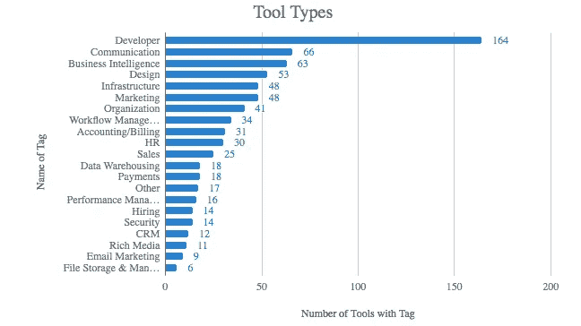
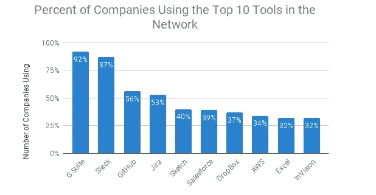
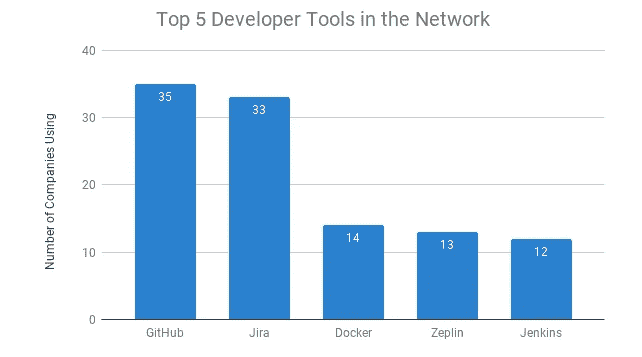
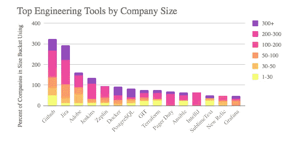
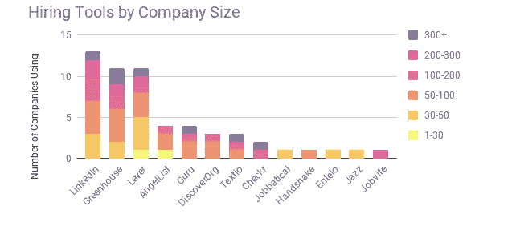
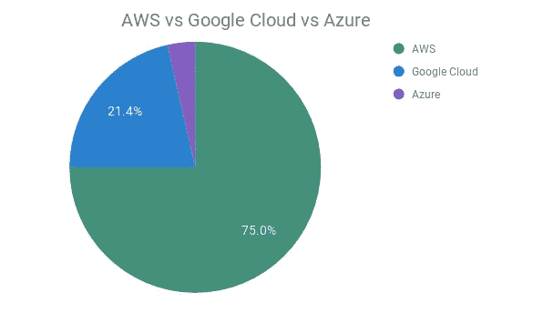

# Union Square Ventures 网络中使用的顶级工具

> 原文：<https://medium.com/hackernoon/top-tools-being-used-in-the-union-square-ventures-network-a8a229801c30>

今年夏天，我有幸在 USV 实习，以支持 [*网络团队*](https://usv.com/network) 。

通过我在 Slack 的社区管理工作以及参加 USV [网络](https://hackernoon.com/tagged/network)活动，我注意到网络中最常见的问题之一是其他公司使用什么[工具](https://hackernoon.com/tagged/tools)。

为了着手这个研究项目，我们收集了 64 家公司使用的 450 多种软件工具，代表了我们活动产品组合的大约 86%。我们首先根据部门和工具类型标记每个工具，然后探索公司规模如何影响使用。

以下是我们发现的一些观察结果和趋势。

# 报告的工具类型

正如您在下面看到的，开发者工具在该项目的报告工具类别中排名第一，总共报告了 164 个工具。我们也看到了大量用于交流、商业智能和设计的工具

# 最流行的工具

报道最多的工具是 G Suite、Slack、GitHub、吉拉、Sketch、Salesforce、DropBox、AWS、Excel 和 InVision。这些顶级工具(尤其是 G Suite、Slack 和 GitHub)被跨多个部门使用，或者倾向于向开发人员工具倾斜。

# 网络中的开发工具

下面的图表显示了网络中最流行的开发工具。在 Github 和吉拉之后，有所下降，这可能是因为有许多免费/开源选项，导致个人和公司探索和青睐不同的选项。

# 尺寸突破

公司规模在开发人员、招聘和沟通工具之间形成了一个层次。作为这在工程中如何发挥作用的一个例子，你可以看到所有的大小括号都使用 Github 或吉拉，但在此之后，差异就出现了。例如，较小的公司不太可能使用安全软件。在沟通方面，较小的公司更可能使用 Calendly、GoToMeeting 和 Rocketchat 等内部工具，而包括 Docusign、脸书、Medium、Sendgrid 和 Twitter 在内的外部工具在所有规模的公司中都存在。

至于招聘工具，LinkedIn、Lever 和 Greenhouse 是网络中最受欢迎的，但这些工具主要只用于拥有 30 多名员工的公司。Guru、Textio、DiscoverOrg 和 Checkr 等工具用于超过 50 名员工的公司，而 Jobbatical、Entelo、Jazz 和 AngelList 则用于较小的公司。

# 按类别划分的市场主导工具

虽然 AWS 似乎仍然是我们产品组合中最受青睐的云平台，但谷歌云似乎尤其受到更多关注。正如你在下面看到的，10%的公司在使用谷歌云或者微软 Azure。

市场份额占主导地位的其他工具包括 Slack 和 Salesforce。虽然 92%的公司报告使用 Slack，但一些公司选择使用 Hipchat(最近被 Slack 收购)、Beekeeper 和 Rocket Chat。

对于销售管理 CRM，42%的公司使用 Salesforce，但是，一些公司使用 Google Streak、Insightly 或 Close.io 等替代产品。在任何这些情况下，规模似乎都不会影响公司的选择。

# 结束语

参与这个项目最有趣的部分之一是学习网络中使用的新工具。事实上，报告的工具中有 52%是由我们投资组合中的一家公司独家使用的，这暴露了一些新工具，如 [Jell](https://jell.com/) 和 [Perdoo](https://www.perdoo.com/) (都是工作流管理工具)以及 [Sapling](https://www.saplinghr.com/vg?utm_expid=.tFdFqok8SeGHa5CIrW7wcg.1&utm_referrer=) (为 G Suite 构建的人力资源平台)。看到我们投资组合中 78%的公司使用我们投资组合中的公司开发的工具(包括 [Code Climate](https://codeclimate.com/) 和 [Cloudflare](https://www.cloudflare.com/) 、[以及其他](http://www.usv.com/portfolio))也很棒。)

虽然我们投资组合中的公司平均使用 7 种工具，但我们的一家大型公司报告使用了 77 种不同的工具，这让我意识到工具之间的转换可能是初创公司成长烦恼的来源。随着我们的产品组合继续扩展，我们希望通过在内部聚集和共享这个列表(我们甚至为我们的网络构建了一个 Slack Bot 来搜索这些工具)，我们可以更容易地为每个用例选择最佳工具。