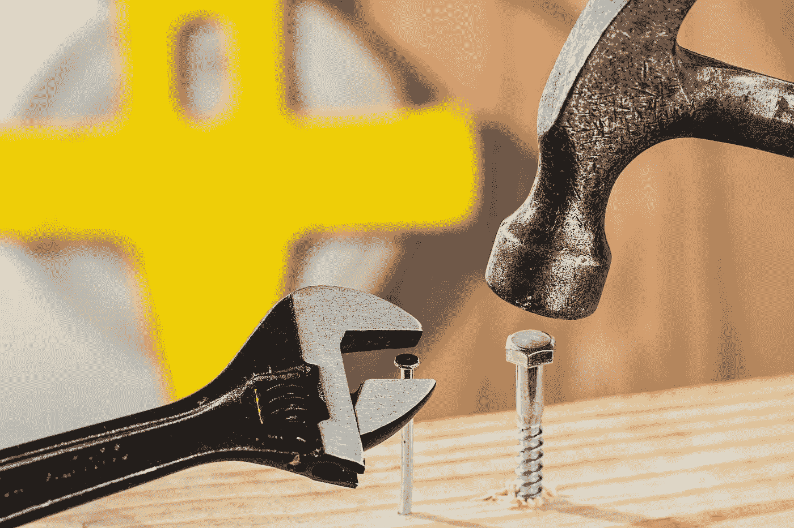

# 成为最好的自己的顶级工具

> 原文：<https://medium.com/hackernoon/top-tools-for-becoming-the-best-version-of-yourself-33e9cdd17b3e>

## 变得伟大是一项艰苦的工作，但是这些工具让这个过程变得更容易。

成为最好的自己很难。有无数的障碍阻止我们到达我们想去的地方。你需要合适的工具来帮助你越过甚至摧毁那些障碍。

有三件事经常会限制你的个人发展。更确切地说，这三样东西的缺乏才是问题所在。它们是:

*   时间
*   知识
*   焦点

# 时间

一天只有那么几个小时，我们不得不花大量的时间吃饭和睡觉。这使得我们剩下的时间变得格外宝贵。

## 托格尔

Toggl 是一个设计用来记录花费在项目或某些业务任务上的时间的工具。尽管它是为商业设计的，但它也可以非常有效地用来跟踪和优化你的个人生活。

[这篇文章](https://blog.toggl.com/increased-my-productivity-238-toggling-activities/)展示了跟踪你的时间是如何大大提高工作效率的。作者减少了 46%的浪费时间，增加了 27%的收入，每小时增加了 238%的收入！

要做到这一点，你需要记录你做的每一件事，你花了多长时间发电子邮件、做项目或者拥有*“5 分钟社交媒体休息时间”。利用你收集的所有信息，你可以看到哪些地方可以节省时间，哪些地方需要花更多时间去做。*

将这些与每一项活动的收入信息结合起来，可以突出你的时间将最有效地花在哪里。

## 音乐变速器

首席执行官平均每年阅读 50 本书。他们怎么有时间？

在通勤、锻炼或做其他琐碎工作时，有声读物是一种很好的*【阅读】*方式。这是让你更接近一年 50 本书目标的好方法。

不幸的是，有些很长。史蒂夫·乔布斯传记已经超过 25 小时了！这意味着每天要听 3 个半小时，一年要读 50 本书。这就是音乐变速器的用武之地。

这个智能的小程序可以让你加快或减慢音乐的速度。虽然以 250%的速度听你最喜欢的歌曲很有趣，但它在有声书中独树一帜。提高速度可以节省你几个小时的时间，同时仍然易于理解。

以 150%的速度(对大多数人来说很舒服)播放史蒂夫·乔布斯的有声读物，可以为自己节省大约 8 个半小时。将这一比例提高到 180%，您将节省超过 11 个小时。如果你能应付，你可以尝试 200%或更高，但我发现 180%是节省时间和保持清晰的一个很好的平衡。

[安卓](https://play.google.com/store/apps/details?id=com.smp.musicspeed&hl=en)和[iOS](https://itunes.apple.com/us/app/music-speed-changer/id572454164?mt=8)

# 知识

音乐变速器应用程序非常好地链接到这一部分。缺乏关于某个主题的一般知识或具体知识会限制你的个人和专业成长。

首席执行官们阅读如此之多的一个原因是增加他们对世界的视角。这让他们更好地理解他人和他们的观点。

## 盲目的

虽然有声书很棒，但他们仍然需要一周的时间来听完，而且找到好的有声书可能很难。

Blinkist 是一款允许用户收听或阅读大量书籍的 15 分钟摘要的应用程序。最好的部分是他们让你每天听一本免费的书。他们选择了这本书，但这是一件好事。

最近，我听了《iki Gai》——日本人快乐健康生活的秘诀》和《T2》——佛教是真的——冥想和启蒙的科学和哲学。如果我可以从他们的图书馆里选择的话，我永远也不会听或读这两本书，但是我很高兴我选择了。他们拓展了我的知识面和视野。

最棒的是，如果你找到一本你真正喜欢的书，并想了解更多，你可以去买它。拿到自己想看的书，而不只是大家建议的书。

## 中等

这是另一个在短时间内增长知识的好方法。几乎所有的帖子都不到 10 分钟，涉及广泛的话题。这意味着你可以在公共汽车上、喝咖啡或在浴室里阅读整篇文章。分三部分阅读永远不会令人愉快。

从艺术到项目管理技巧，从旅行故事到操作指南，你都能找到。这意味着你可以提高你已经掌握的技能或者学习新的东西。

# 焦点

专注是一种广泛的技能，从 5 分钟的高度专注，到一天的专注，再到一生的目标。不幸的是，时间跨度越大，聚焦就越难。这些工具旨在使对焦更容易。

## 日记

这是列表中最基本的工具，但可能是最有效的。写日记可以帮助你分清任务的轻重缓急，组织你的时间表，确保你朝着你的人生目标前进。

有很多日记方法，但这是我使用的一个。这是一个非常基本的子弹日记，但简单性确保你不会花比工作更多的时间来准备和组织。

1.  写下这个月的每一天，每行一天。放入要记住的关键事件或事情。
2.  月度回顾——回顾上个月过得如何，有哪些亮点和不足，以及你学到了什么和需要改进的地方。然后写下下个月的 2-3 个个人目标和 2-3 个职业目标。
3.  每周回顾—回顾上周，但时间稍短。这些更多的是对上周的追踪，而不是反思
4.  每日日志——日期和当天你想完成的 2-5 个关键任务，旁边有方框。

每天早上，我写下我的日志，当我完成一天的工作时，就把它们填进盒子里。如果我有前一天的空盒子，我可以把它们移到今天，或者决定不需要做。

## 哈比布尔

习惯是我们生活中最强大的力量之一。这个工具通过清晰地跟踪它们来帮助你坚持下去。一旦你走上正轨，你会非常努力地确保不被打破。心理学上讲，一项任务每天重复 66 次，习惯才会变得自然。

你应该小心使用这些工具，开始时引入一两个小习惯，然后随着你的发展引入更复杂的习惯。如果你一个月增加一个新的积极习惯，它就会累积起来。如果每个习惯只让你进步 2%，一年后你会进步 26.8%，两年后会进步 60%。

这种效率的指数级增长是因为利益的叠加。你变得越好，就越容易变得更好。

# 摘要

有一些工具可以帮助你节省时间，增长知识，提高注意力。使用这些工具会让你最大限度地发挥你的潜力，取得比你想象的更多的成就。