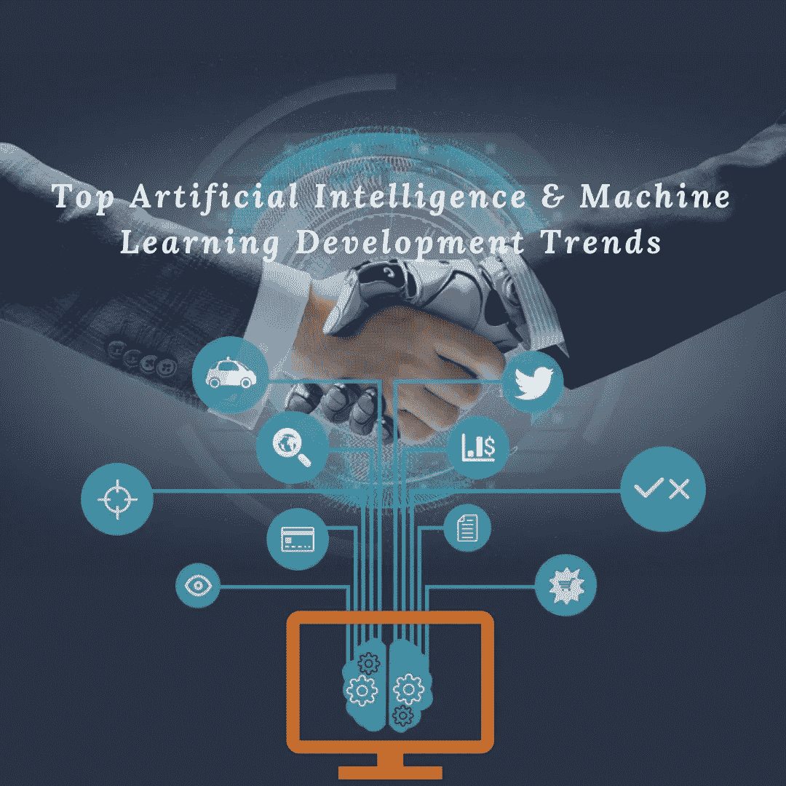
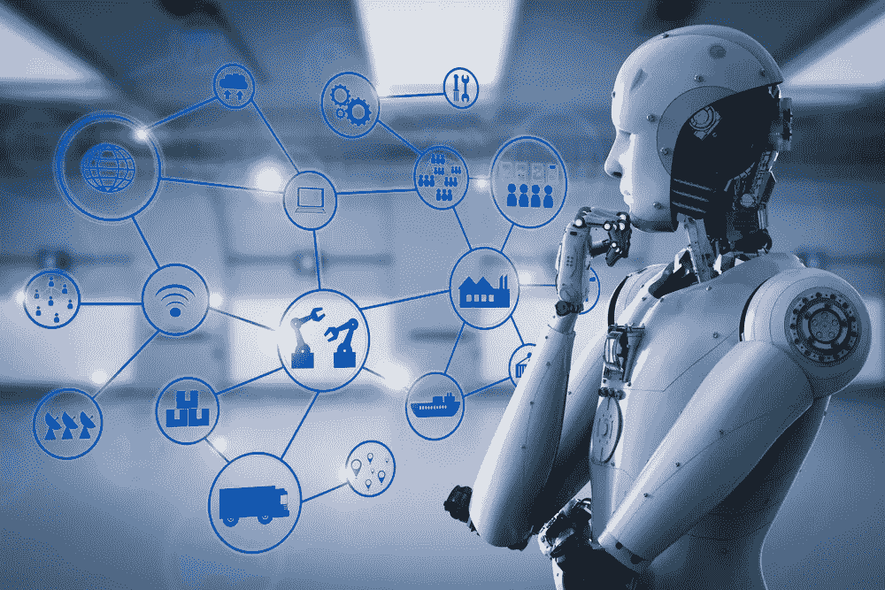
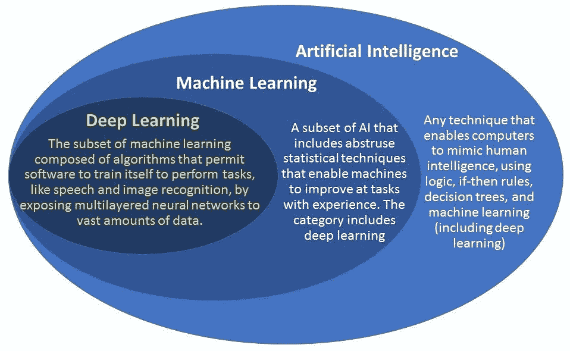

# 对于人工智能和机器学习的发展，你应该考虑的顶级人工智能趋势

> 原文：<https://medium.com/hackernoon/top-trends-in-2018-you-need-to-follow-for-artificial-intelligence-machine-learning-development-dfeee0eabb5f>

**Source: By Author**

**人工智能**；人工智能的可能性数不胜数，它们很容易超越我们最丰富的艺术想象力。我们真的很接近生活在某种科幻小说中，所以看看最有可能和最有前途的机器学习和即将到来的 2019 年的[人工智能趋势，并问问我们自己是否准备好了，这是一个好主意。我们在科幻小说中读到的或者在《黑客帝国》这样的电影中看到的，有一天可能会变成现实。](http://usblogs.pwc.com/emerging-technology/top-10-ai-tech-trends-for-2018/)

在科幻小说中，[人工智能(AI)系统经常致力于推翻人类文明](https://www.businessnewsdaily.com/9542-artificial-intelligence-businesses.html)，或者它们是我们物种的仁慈看护者。事实上，机器学习已经与我们同在，它从谷歌这样的搜索引擎中发展出来，并悄悄地渗透到我们的日常生活中。

人工智能是 360 解决方案，为企业和政府领导人审查正确的举措。但是在实验室里发生了什么，学术和企业研究人员的发现将为人工智能在未来一年甚至更久的时间设定路线？来自人工智能实验室的研究团队专注于技术专家和商业领袖都应该密切关注的领先发展。

Courtesy: Google.com

> 微软创始人比尔·盖茨曾说过‘人工智能可以成为我们的朋友’，这对社会是有好处的。

## 让我们来看看 2018 年人工智能的[趋势](https://dashbouquet.com/blog/artificial-intelligence/machine-learning-and-ai-trends-for-2018-what-to-expect)将在未来几年产生巨大影响。

原发布:[https://www . pw chk . com/en/industries/telecom munications-media-and-technology/publications/top-10-ai-technology-trends-for-2018 . html](https://www.pwchk.com/en/industries/telecommunications-media-and-technology/publications/top-10-ai-technology-trends-for-2018.html)

***深度学习理论:信息瓶颈原理解释了深度神经网络如何学习。***

**它是什么:**模仿人脑的深度神经网络已经证明了它们从图像、音频和文本数据中“学习”的能力。然而，即使在使用了十多年之后，我们仍然有很多关于深度学习的知识，包括神经网络如何学习或为什么它们表现如此好。这可能正在改变，这要归功于一种将信息瓶颈原理应用于深度学习的新理论。本质上，它表明在初始拟合阶段之后，深度神经网络将“忘记”并压缩有噪声的数据——即包含大量额外无意义信息的数据集——同时仍保留有关数据代表什么的信息。

**为什么重要:**准确理解深度学习的工作原理能够使其得到更大的发展和使用。例如，它可以洞察最佳网络设计和架构选择，同时为安全关键或监管应用提供更高的透明度。期待看到更多将该理论应用于其他类型深度神经网络和深度神经网络设计的探索成果。

***胶囊网络:新型深度神经网络，通过保留关键的层次关系，以更少的错误和更少的数据进行学习。***

**是什么:**胶囊网络，一种新型的深度神经网络，处理视觉信息的方式与大脑非常相似，这意味着它们可以保持层级关系。这与卷积神经网络形成鲜明对比，卷积神经网络是最广泛使用的神经网络之一，它未能考虑简单和复杂对象之间的重要空间层次，导致误分类和高错误率。

**为什么重要:**对于典型的识别任务，胶囊网络通过减少误差(减少多达 50 %)来保证更好的准确性。他们也不需要那么多数据来训练模型。期待看到胶囊网络在许多问题领域和深度神经网络架构中的广泛使用。

***深度强化学习:该技术将*** [***强化学习与深度神经网络***](http://www.pradjna.in/blogs/) ***相结合，通过与环境的交互进行学习。***

**它是什么:**一种神经网络，通过观察、动作和奖励与环境交互来学习。深度强化学习(DRL)已被用于学习游戏策略，如雅达利和围棋——包括击败人类冠军的著名 AlphaGo 程序。

**为什么重要:** (DRL)深度强化学习是所有学习技术中最通用的，因此它可以用于大多数商业应用。与其他技术相比，它需要更少的数据来训练其模型。更值得注意的是，它可以通过模拟来训练，这消除了对标记数据的需要。鉴于这些优势，预计在未来一年将会看到更多结合 DRL 和基于代理的模拟的商业应用。

***生成对抗网络:一种无监督的深度学习系统，实现为两个竞争的神经网络，使机器学习能够在更少的人工干预下进行。***

**它是什么:**生成式对抗网络(GAN)是一种无监督的深度学习系统，实现为两个竞争的神经网络。一个网络，即生成器，创建看起来与真实数据集一模一样的假数据。第二个网络，鉴别器，接收真实的和合成的数据。随着时间的推移，每个网络都会改进，从而使这两个人能够了解给定数据集的整个分布。

**为什么重要:** GANs 将深度学习开放给更大范围的无监督任务，在这些任务中，标记的数据不存在或过于昂贵而无法获得。它们还减少了深度神经网络所需的负载，因为这两个网络分担了负担。预计将会看到更多的商业应用，如网络检测，采用 GANs。

***精益&增强数据学习:使模型能够从较少数据或合成数据中学习的不同技术。***

**是什么:**机器学习(尤其是深度学习)最大的挑战，是有大量的标注数据来训练系统。两种广泛的技术可以帮助解决这个问题:(1)合成新数据和(2)将一个任务或领域的模型转移到另一个任务或领域。技术，如转移学习(将从一个任务/领域学到的见解转移到另一个任务/领域)或一次性学习(将转移学习发挥到极致，学习只发生在一个或没有相关示例的情况下)——使它们成为“精益数据”学习技术。类似地，通过模拟或插值合成新数据有助于获得更多数据，从而增加现有数据以改善学习。

**为什么重要:**使用这些技术，我们可以解决更广泛的问题，尤其是那些历史数据较少的问题。期待看到更多不同的精益和增强数据，以及应用于广泛业务问题的不同类型的学习。

***概率编程:一种高级语言，方便开发者定义概率模型。***

**它是什么:**一种高级编程语言，使开发人员能够更容易地设计概率模型，然后自动“求解”这些模型。[概率编程](http://probabilistic-programming.org/wiki/Home)语言使得重用模型库成为可能，支持交互式建模和形式验证，并提供必要的抽象层，以促进通用模型类中通用、高效的推理。

**为什么重要:**概率编程语言有能力适应商业领域中常见的不确定和不完整的信息。我们将看到这些语言被更广泛地采用，并期待它们也被应用于深度学习。

***混合学习模型:将不同类型的深度神经网络与概率方法相结合，对不确定性进行建模的方法。***

**它是什么:**不同类型的深度神经网络，如 GANs 或 DRL，在不同类型的数据的性能和广泛应用方面显示出巨大的前景。然而，深度学习模型不像贝叶斯或概率方法那样对不确定性建模。混合学习模式结合了这两种方法，以利用各自的优势。混合模型的一些例子是贝叶斯深度学习、贝叶斯 GANs 和[贝叶斯条件 GANs](https://arxiv.org/pdf/1706.05477.pdf) 。

**为什么重要:**混合学习模型使得扩展各种商业问题以包括具有不确定性的深度学习成为可能。这可以帮助我们实现模型更好的性能和可解释性，这反过来可以鼓励更广泛的采用。期待看到更多的深度学习方法获得贝叶斯等价物，同时概率编程语言的组合开始纳入深度学习。

***自动化机器学习:自动化机器学习标准工作流程的技术。***

**是什么:**开发机器学习模型需要一个耗时且由专家驱动的工作流程，其中包括数据准备、特征选择、模型或技术选择、训练和调整。AutoML 旨在使用许多不同的统计和深度学习技术来自动化这一工作流程。

**为什么重要:** AutoML 是人工智能工具民主化的一部分，使商业用户能够在没有深厚编程背景的情况下开发机器学习模型。它还将加快数据科学家创建模型的时间。期待看到更多的商业 AutoML 包和 AutoML 在更大的机器学习平台中的集成。

***数字孪生:一种虚拟模型，用于方便对物理或心理系统的详细分析和监控。***

**它是什么:**数字双胞胎是一种虚拟模型，用于促进对物理或心理系统的详细分析和监控。数字双胞胎[的概念起源于工业世界](https://www.youtube.com/watch?v=2dCz3oL2rTw)，在那里它被广泛用于分析和监控像风车农场或工业系统这样的事情。现在，使用基于代理的建模(模拟自主代理的行为和交互的计算模型)和系统动力学(计算机辅助的政策分析和设计方法)，数字双胞胎正在被应用于非物质对象和过程，包括预测客户行为。

**为什么重要:**数字双胞胎有助于刺激物联网(IoT)的发展和更广泛的采用，提供一种可预测的诊断和维护物联网系统的方法。展望未来，预计会看到数字双胞胎在物理系统和消费者选择建模中的更大应用。

***可解释的人工智能:在保持高性能的同时产生更多可解释模型的机器学习技术。***

**它是什么:**今天，有许多机器学习算法在各种不同的应用中感知、思考和行动。然而，这些算法中有许多被认为是“黑箱”，很少(如果有的话)提供关于它们如何达到结果的洞察力。可解释的人工智能是一场开发机器学习技术的运动，这些技术在保持预测准确性的同时产生更多可解释的模型。

**为什么重要:**可解释、可证明和透明的人工智能对于建立对该技术的信任至关重要，并将鼓励更广泛地采用机器学习技术。在开始广泛部署人工智能之前，企业将把可解释的人工智能作为一项要求或最佳实践，而政府可能会在未来将可解释的人工智能作为一项监管要求。

Courtesy: Google.com

# 结论

总的来说，人工智能对于全世界的科学家和开发人员来说是一个绝佳的机会，可以创造一个可持续的生态系统，在多种用途上更加高效。机器出错的几率比人类出错的几率小得多；多个领域的发展状态将转移到一个全新的水平。
像[医疗保健](http://www.masa-sci.com/)、电子商务、物流行业&一样，自主工厂是少数几个合乎逻辑地在全球范围内接受和实施人工智能和物联网趋势的例子。如果你正在寻找任何类型的顾问&机器学习&人工智能的开发资源，你可能会得到帮助。