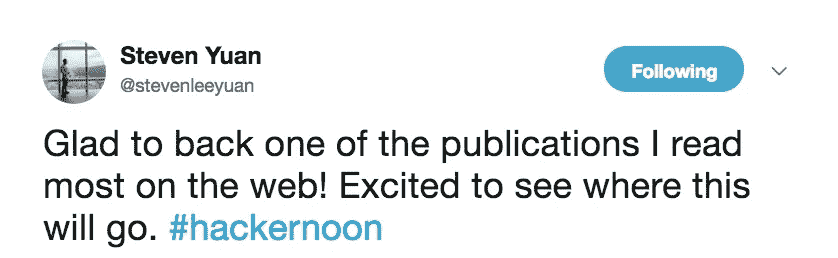
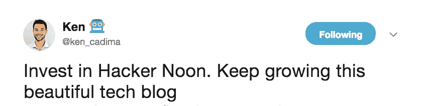

# 本周二十大科技新闻

> 原文：<https://medium.com/hackernoon/top-twenty-tech-stories-this-week-197c2d585715>

因此，在过去的两周内，比特币 ( [BTC，4226.75 美元](https://coinmarketcap.com/currencies/bitcoin/))下跌了 30%以上，[以太坊](https://hackernoon.com/ethereum/home) ( [ETH，119.13 美元](https://coinmarketcap.com/currencies/ethereum/))下跌了 45%以上，而 [FAANG](https://hackernoon.com/what-tech-startups-can-learn-from-the-faang-companies-best-business-practices-878c422249db) 在 6 周内损失了[约 1 万亿美元](https://www.cnbc.com/2018/11/20/techs-popular-faang-stocks-have-lost-945-billion-and-counting-from-highs-amid-tech-rout.html)的价值。这是一个多么好的筹集科技资金的时机啊！一定要看看 [Hacker Noon 股权众筹活动](http://bit.ly/HNshares)——我们在 3 周内从 542 名投资者那里获得了超过**65 万美元的资金**。

# 以下是本周的二十大科技新闻:

## 种子基金

[**【193 天，1482 封电子邮件，59 万美元:揭露我们种子轮**](https://hackernoon.com/193-days-1-482-emails-590-000-dollars-exposing-the-nitty-gritty-details-of-our-seed-round-61d0bbef9404)**[安迪·库克](https://medium.com/u/a9abc94b5724?source=post_page-----197c2d585715--------------------------------)**

## **风险资本**

**[**团队第一的方法成功登陆 A 系列**](https://hackernoon.com/the-team-first-approach-to-landing-a-successful-series-a-9b29c5286da0) 作者[约翰·弗里奥尼斯](https://medium.com/u/e348dfaaf495?source=post_page-----197c2d585715--------------------------------)**

## **人工智能**

**[**专访 Fast.ai 联合创始人、研究员:雷切尔·托马斯博士**](https://hackernoon.com/interview-with-the-co-founder-and-researcher-at-fast-ai-dr-rachel-thomas-b00e1702a28a) 作者[桑雅姆·布塔尼](https://medium.com/u/a08b1e531f9c?source=post_page-----197c2d585715--------------------------------)**

## **使工程师的职责多样化**

**[**为什么软件工程师要从事产品开发**](http://Why Software Engineers Should Engage in Product Development) 作者[克日什托夫·切内克](https://medium.com/u/1d6240d7bf01?source=post_page-----197c2d585715--------------------------------)**

## **@重新发明**

**[**AWS IN spaaaaaaceeeeee**](https://hackernoon.com/aws-launches-ground-station-and-lockheed-martin-launches-verge-43ebed88b31b)**作者 [Jay Zalowitz](https://medium.com/u/26404b72aeb4?source=post_page-----197c2d585715--------------------------------)****

## ****技术[工作岗位](http://jobs.hackernoon.com)****

****[**四箱作业搜索网格**](https://hackernoon.com/the-4-box-job-searching-grid-54827224130d) 由[贝瑟尼水晶](https://medium.com/u/7dbada15a681?source=post_page-----197c2d585715--------------------------------)****

****[**12+软件工程师和计算机程序员的高薪技术工作**](https://hackernoon.com/12-high-paying-technology-jobs-for-software-engineers-and-computer-programmers-8d72b6b1861c) 由 [javinpaul](https://medium.com/u/bb36d8439904?source=post_page-----197c2d585715--------------------------------)****

****… *还查看了* [*黑客午间求职板*](http://jobs.hackernoon.com) *…*****

## ****技术营销****

****[**为什么(以及如何)在我们的 28 人创业公司**](https://hackernoon.com/why-and-how-we-started-a-growth-team-at-our-28-person-startup-849dcd8da554) 中成立一个成长团队 [Graham McCarthy](https://medium.com/u/bbb8e801468d?source=post_page-----197c2d585715--------------------------------)****

****[**成长心态的重要性……甚至连孩子都注意到了这一点**](https://hackernoon.com/the-importance-of-a-growth-mindset-2440b21a9657) 加里·沃茨****

## ****打击假新闻****

****70%的人担心假新闻——以及谷歌如何打击假新闻****

## ****隐秘的冬天****

****[**加密货币没有死**](https://hackernoon.com/cryptocurrency-is-not-dead-80922ed3d0e4) 作者[奥利弗·罗素](https://medium.com/u/a31067a741f1?source=post_page-----197c2d585715--------------------------------)****

## ****产品管理****

****[**自作自受的混乱**](https://hackernoon.com/self-inflicted-chaos-389793eaaed9) 作者[约翰·卡特勒](https://medium.com/u/4c3f4fe11e6b?source=post_page-----197c2d585715--------------------------------)****

## ****数据科学****

****[**如何让您的数据科学团队获得最大投资回报的技巧**](https://hackernoon.com/tips-on-how-to-maximize-your-data-science-teams-roi-370ab230a1d5) 作者 [SeattleDataGuy](https://medium.com/u/41cd8f154e82?source=post_page-----197c2d585715--------------------------------)****

## ****科技活动****

****这些年轻人在科罗拉多大学的破坏性创业课上发言****

## ****开发黑客****

****[**如何减少开发时间？嘲笑你的 API**](https://hackernoon.com/how-to-reduce-development-time-mock-your-apis-f0c81072fad6)**作者 [Rohit Jacob Mathew](https://medium.com/u/53c2ce10e4a9?source=post_page-----197c2d585715--------------------------------)******

## ******学习他们如何制造汽车******

******[**丰田如何引领我们基础设施的发展(并让我欣赏吉拉)**](https://hackernoon.com/how-toyota-guides-the-evolution-of-our-infrastructure-and-makes-me-appreciate-jira-bcb766822a3e) 作者[马克·霍普森](https://medium.com/u/c8c58e712c80?source=post_page-----197c2d585715--------------------------------)******

## ****阅读体验****

****[**抓住读者注意力的最佳数据可视化**](https://hackernoon.com/the-best-data-visualizations-for-grabbing-readers-attention-19dec3b8fc9) 作者[本杰明·黑斯廷斯](https://medium.com/u/b8547cc4195d?source=post_page-----197c2d585715--------------------------------)****

## ****与巨人一起工作****

****[**实现谷歌的 Pagerank 算法**](https://hackernoon.com/implementing-googles-pagerank-algorithm-88069314fb3d) 作者[理查德·梅西](https://medium.com/u/d9a0af710d6d?source=post_page-----197c2d585715--------------------------------)****

## ****DevOps****

****[**2019 年需要注意的 8 个 DevOps 趋势**](https://hackernoon.com/8-devops-trends-to-be-aware-of-in-2019-b4232ac8f351)**by[Pavan Belagatti](https://medium.com/u/9f42342c1fb5?source=post_page-----197c2d585715--------------------------------)******

## ******未来******

******[**我整理了一份科技“下一件大事”的清单，这样你就不必… 2030 年将会很怪异**](https://hackernoon.com/i-compiled-a-list-of-techs-next-big-things-so-you-wouldn-t-have-to-d98ea9cac4bd) 作者:艾德里安******

****直到下一次，不要把世界的现实想当然。****

****亲切的问候，****

****大卫·斯穆克****

******p . s .**[Hacker Noon 股权众筹活动](http://bit.ly/HNshares)在 3 周内从 542 名投资者那里获得高达**65 万美元+的资金**。[趁早拥有股份](http://bit.ly/HNshares)。****

********