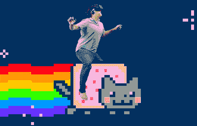

# 2018 年顶级 UI 设计趋势

> 原文：<https://medium.com/hackernoon/top-ui-design-trends-for-2018-771e529d1d69>

功能性推动网络应用和任何软件使用的日子已经一去不复返了，开发者不再关心软件的外观。软件主要是由它做什么驱动的，很少是由它的外观驱动的。

然而，事情已经发生了变化，技术已经发展，用户体验现在变得非常重要。用户已经变得非常重要，所以软件必须看起来足够好，使用起来没有麻烦。另外，软件没有用户是没有用的。

随着 2018 年的进展，UI 设计将继续改进。因此，如果能看看我们预计今年 UI 设计会经历的一些趋势，那就太好了。

# 巅峰时期的全屏视频

在这个时间宝贵的世界里，几乎每个人都试图在短时间内获取大量信息，视频的使用为人们节省了更多时间，提高了生产率。

在过去，只有文字报道是传递信息的主要手段，那么图像似乎是一个更好的选择。现在，视频似乎更好，今年将被用作在网站上传递信息的手段。

视频是互动的，极具活力和吸引力。它们很容易吸引浏览者的注意，从设计者的角度来看，它们在单页网站上非常漂亮。

# 渐变很美

渐变有助于创建非常漂亮的设计，并且它们对于开发高质量的用户界面非常重要。

随着 Spotify 等网站开始挖掘渐变设计的潜力，用不了多久，其他网站和软件就会开始挖掘这一潜力。

真的，没有什么东西比完美的颜色组合更漂亮了。

2018 年将带来明亮和冷色的完美混合，适当的对比度和混合水平，让用户想要更多的伟大设计。

# 长表格很糟糕，但它们会留下来

如前所述，今天的用户很少有或没有时间通读成千上万的单词，所以我们都跳过长内容，搜索对我们真正重要的内容。

几乎没有人阅读条款和条件或 EULA，我们所做的只是滚动和搜索接受按钮被点击。

但是，有时候确实需要很长的书面内容。他们需要传递详细的重要信息，这种内容会导致无意识的滚动和忽略长格式的信息。

2018 年，这个问题应该得到解决。随着新的 UI 设计的进展，一个考虑到这一点的设计肯定会受到欢迎。

这就引出了下一个问题:

# 卡片在这里停留

自从卡片的使用变得流行以来，它在 UI 设计中的使用已经获得了广泛的认可。

在一个用户将更多地从移动设备而不是电脑屏幕上访问软件的世界里，卡片设计将继续对用户体验产生巨大影响。

回顾一下长表单的情况，卡片可能有助于解决这个问题，特别是如果用户能够像一包卡片一样浏览内容，而不是像许多网站那样进行传统的滚动。

预计 2018 年卡片设计会有更多改进，只要移动界面仍然重要，卡片将继续享有高水平的接受度。

# 向电网做最后的告别

网格为在网站和其他软件上创建漂亮的用户界面做出了巨大贡献，因为它允许简单的导航。

然而，现状肯定受到了(你知道是谁)苹果公司的挑战，他们一直在推动无网格显示器的接受。

这显然是一个好的发展，因为无网格方法没有像担心的那样对用户体验产生负面影响，而且它也给了设计师一个更好的机会来展示创造力，并在开发用户界面时释放出最好的设计技术。

诚然，网格仍然有很大的作用，因为它为用户界面提供了一致性和平衡性，一如既往地为用户提供了良好的现场体验。

# 字体越粗越好

印刷术在创建伟大的用户界面中扮演着重要的角色，这已经不是什么新闻了。

无论内容类型是文章、图像还是视频，字体都是非常必要的，因为它们不仅传递信息，也是为显示增添美感的一种方式。

既然字体如此重要，让它们变得更大、更粗、更漂亮是合乎逻辑的，这也正是今年将要发生的事情。

UI 设计将会经历比以前更大的排版。这种发展对 UI 设计师来说绝对不是全新的，因为平面设计的使用在过去的三年中已经变得流行，而更大字体的使用只是对这种设计的一种改进。

# 材料设计仍在游戏中

材料设计大约在 4 年前开始流行，因为谷歌在 Android KitKat 用户界面中使用了这种设计。由于其简单、锐利和轻便，它获得了广泛的认可。

考虑到它已经在 UI 设计环境中存在了四年多，人们会认为它会很快消亡。

然而，事实并非如此。谷歌今年正在改进它，我们都将拭目以待，看看它是热门还是失败。

或许那时，一个材料设计会获得“九命猫”的标签。

# 虚拟现实和增强现实出现了

虚拟现实和增强现实的使用率与日俱增。各公司的首席技术官都在想方设法挖掘这项伟大技术的巨大潜力。

预计今年 VR 和 AR 的使用将会增加，因此为这些平台制作优秀设计的需求也会增加。

VR 和 AR 将吸引更多人的注意力，并为产品设计师展示他们的创造力创造更多机会。

# 结论

最后，很多因素将决定今年什么样的 UI 设计会流行。

所以我们真的不能确定最终的趋势是什么，但有一点是肯定的，那就是很多东西会被实验，UI 设计在 2018 年肯定会有所改进。

随着新 UI 设计工具的开发，人们只能期待 2018 年发生最好的事情。

[亚历克斯·米库利克撰写](https://www.behance.net/mikulik1298615)