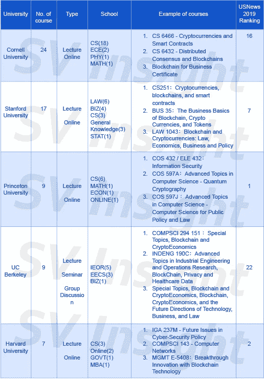
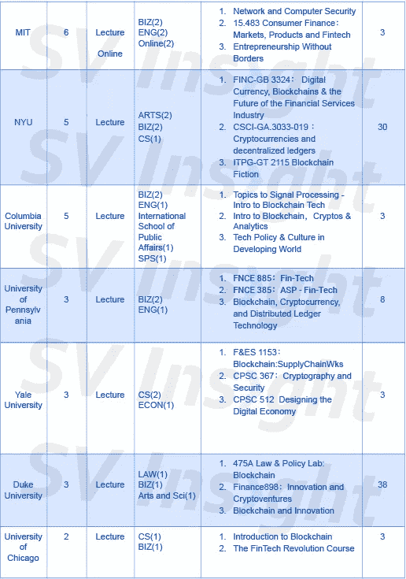

# 2018 年顶级大学区块链课程排名

> 原文：<https://medium.com/hackernoon/top-university-blockchain-curriculum-rankings-of-2018-d3807b513dc8>

过去两年，比特币价格的飙升引发了对区块链科技的关注。事实上，比特币、区块链和加密货币等关键词已经成为大学关注的学术热点。

今年 10 月，Coindesk 公布了全美十大开设区块链课程的大学。这些大学可以说是世界顶尖大学，包括斯坦福大学、加州大学伯克利分校、哈佛大学、麻省理工学院。

**顶尖大学开设的区块链课程**

这些学校开设的课程有什么特点？有哪些学院开设相关课程？ [SV Insight Research](https://www.us.svinsight.com/) 结合 Coindesk 的榜单，分析了 2019 年美国新闻排名前 30 位的北美大学，向您展示这些大学在哪些方面关注区块链科技，以及学生的反馈。

[SV Insight Research](https://www.us.svinsight.com/) 使用“区块链”和“加密”等关键词搜索大学课程网站。根据提供的课程数量，康奈尔大学以 24 门课程位居全国大学之首，其次是斯坦福大学的 17 门课程，然后是普林斯顿大学和加州大学伯克利分校的 9 门课程。《美国新闻 2019》排名前 10 的大学中，每所大学都至少开设两门与区块链相关的课程。

从下表可以看出，各大高校主要以课堂课程为主，开设网络课程的高校并不多。但是提供在线课程的学校，比如普林斯顿大学，很早就开始了这些课程。在线课程“比特币和加密货币技术”自 2015 年开始运营。

从开设课程的院系来看，计算机系或工程学院是开设这些课程的主要院系。例如，在加州大学伯克利分校的 9 门课程中，有 8 门是由工程学院提供的。同样，哈佛大学 7 门区块链课程中有 3 门是由计算机科学系提供的。

但也有例外:斯坦福大学教授的大多数区块链课程都是由法学院提供的。在哥伦比亚大学、宾夕法尼亚大学和麻省理工学院，大多数课程都是由商学院提供的。我们可以看出，STEM 和金融是区块链最关注的两个领域，而法律和政策层面的监管也紧随其后。从法学院和公共政策管理学院开设的课程就可以看出这一点。

top university courses

**学生和行业的反应**

学生对区块链课程的反应如何？哥伦比亚大学计算机科学助理教授容晖·顾告诉 [SV Insight Research](https://www.us.svinsight.com/) 记者，哥伦比亚大学目前有四门课程与区块链直接相关，许多接触过的学生都对区块链和科技行业有着浓厚的兴趣。除了课程之外，许多美国一流大学还成立了各种由学生自发组织的与区块链相关的协会。

除了正式课程，举办学术会议、形成校企合作也成为区块链相关领域探索的新趋势。

据谷教授介绍，哥大和哈佛大学都召开过关于的会议，或者在相关会议议程中设立了模块。哥伦比亚大学和 IBM 区块链和数据透明中心与业界密切合作，上个月成立了两个针对学生和企业家的新项目。顾教授认为，“在哥伦比亚-IBM 区块链和数据透明中心的全力支持下，处于不同阶段的企业将获得宝贵的研讨会、导师和业务网络……整个社区都在专注于建设面向未来的可持续公司。”

[SV Insight Research](https://www.us.svinsight.com/) 将跟踪趋势，并在未来在我们的官方账户中发布更多更新。

如果你有兴趣了解更多关于研究思路和发现的信息，你可能想看看 1 月 11 日在旧金山举行的 [**区块链连接大会(Academic 2019)**](http://www.goblockchainconnect.com) 。

该活动强调区块链空间的教育，将聚集全球最权威的区块链教授、最先进技术的公共链项目和技术专家，讨论最前沿的区块链学术研究、问题和解决方案。

以上提到的一些大学的教授将出席此次活动，包括加州大学伯克利分校的 Dawn Song 教授；伊莱恩·施，康奈尔大学副教授；顾，哥伦比亚大学助理教授；Raj Jain，圣路易斯华盛顿大学教授，仅举几例。你可以在[这里](http://www.goblockchainconnect.com)找到演讲者的完整名单。