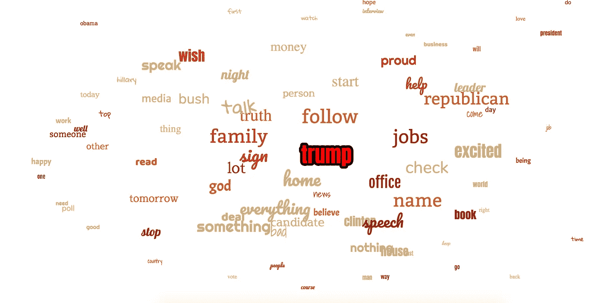
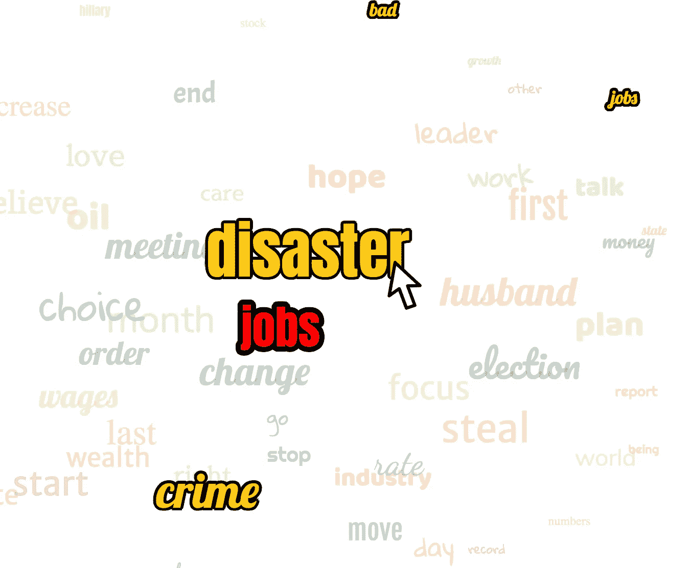
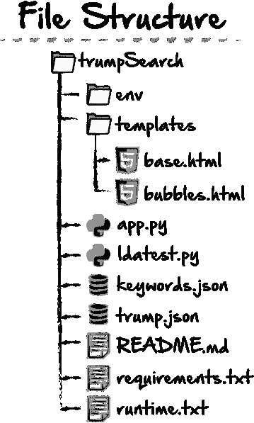
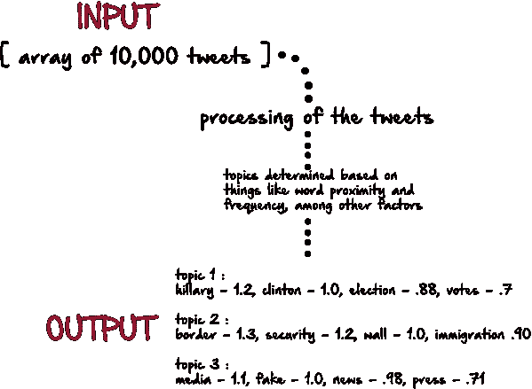
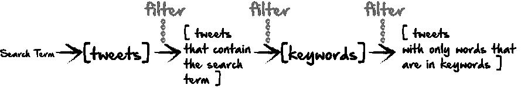
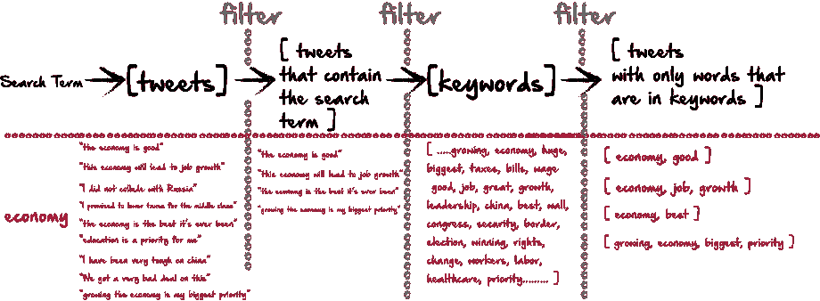
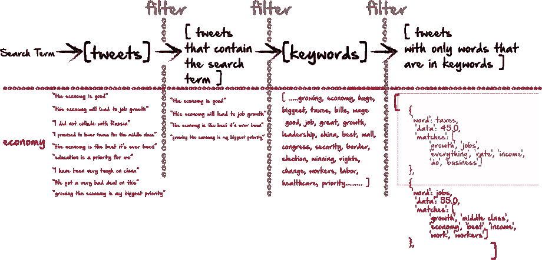
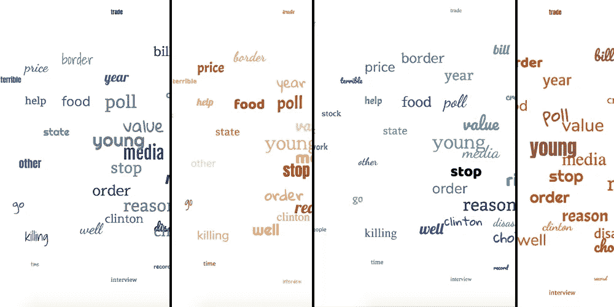

# 用 Python/Flask 进行主题建模和数据可视化

> 原文：<https://medium.com/hackernoon/topic-modeling-and-data-visualization-with-python-flask-b93c236e22c6>



我最近对 Python 中的数据可视化和主题建模产生了兴趣。大量数据的一个问题是，尤其是主题建模，通常很难快速消化。我想做的是创建一个小的应用程序，它可以快速地制作数据的可视化表示，用户可以在几秒钟内理解数据。

上面的截图是我最近制作的一个网站的例子，我认为它完成了这个任务。在本例中，您可以搜索任何单词。当您搜索时，python 会搜索超过 10，000 条唐纳德·特朗普的推文，并找到与搜索查询最相关的主题。权重较大或与搜索词关系更密切的词会显得更大，在页面上更居中。关系不太密切的单词更小，离中心更远。

要了解这一点，下面是现场版本:

[http://trumpsearch.herokuapp.com/](http://trumpsearch.herokuapp.com/)

这个网站的另一个方面是，每个词本身可能不是一个单独的主题，但几个词一起可以构成一个主题。然而，按主题对单词进行分组可能是困难的，并且如果页面上有很多单词，用户可能很难看到哪些单词属于同一个主题。同样，我们可以只制作一个表格，并按列对它们进行分组，但这样就违背了让这些内容快速易读的目的。在上面的例子中，如果你访问 live 网站，每次你将鼠标放在一个单词上，它就会高亮显示属于那个主题的所有单词。比如你搜索“经济”，结果之一会是“灾难”。鼠标悬停在它上面会显示“希拉里”、“税收”和“就业”等相关词汇。



因此，在几秒钟内，用户可以进行搜索，并看到所有的主题，以及组成每个主题的单词。

现在，有很多 Python 的库和包非常适合主题建模。然而，其中一些可能非常沉重和麻烦，特别是如果最终目标是一个简单的数据可视化。因此，对于这一点，我使用了依赖最小的 Python。

对于数据可视化，我读过很多关于 D3 的文章，它似乎提供了一些很棒的可视化工具。然而，在这个例子中，我使用了纯 JavaScript/Jquery 和 CSS。我这样做的部分原因是，同样，D3 提供了一些很棒的工具，但也有一点学习曲线，在通读文档 5 分钟后，我决定我可以在没有附加组件的情况下获得我想要的外观。

这个站点框架的伟大之处在于它很简单，并且可以在任何数据集上重用。基本上只是即插即用的数据，它是好的，有一些小的调整。

如果您感兴趣，您可以关注下面我如何建立一个基本的 Python / Flask 站点，以及一些关于主题建模和数据可视化的想法。

# 文件结构

虽然我们还没有开始，但对我们的文件和数据的结构有个概念是个好主意。这将有助于在我们前进的过程中保持事物的有序性。这个项目的基本布局如下:



如果这是你第一次使用 Python/Flask 应用程序，你可以在这里看到，我们有 app.py 文件，它将处理我们不同 html 页面之间的路由。在这里，我们也可以接受来自前端表单的数据。我的主题建模虽然没有使用任何 NLTK 或 Gensim 库，但仍然遵循潜在的 Dirichlet 分配或 LDA 的一些基本思想。因此，我的网站这一部分的功能将放在一个 python 文件中，我将其命名为 ldatest.py。所有的环境内容和要求等我们不会马上讨论，但我现在将它放在那里，以便我们在开始讨论 flask 方面的内容时记住。我还将在这里包含两个 json 文件。因为我们的数据不会太大，所以我发现使用本地文件更容易，上传也更容易。另一种方法是进行 api 调用，但是我不打算在这里这样做。首先，我将在我的 ldatest.py 文件中进行主题建模，但是当然，您可以随意命名它。

另外，如果您想下载我将使用的 json 数据，您可以在这里下载，或者随意使用您自己的数据。

[](https://www.dropbox.com/s/2iqjqbjxj33jdyc/keywords.json?dl=0) [## 关键词. json

### Dropbox 是一项免费服务，可以让你将照片、文档和视频带到任何地方，并轻松分享。从不发电子邮件…

www.dropbox.com](https://www.dropbox.com/s/2iqjqbjxj33jdyc/keywords.json?dl=0) [](https://www.dropbox.com/s/pj767kvtrha4wb9/trump.json?dl=0) [## trump.json

### Dropbox 是一项免费服务，可以让你将照片、文档和视频带到任何地方，并轻松分享。从不发电子邮件…

www.dropbox.com](https://www.dropbox.com/s/pj767kvtrha4wb9/trump.json?dl=0) 

# 1.主题建模

我不会假装是主题建模的专家，因为我绝对不是。但我理解的前提是:



如果我们使用像 NLTK 和 Gensim 这样的 Python 库，这可能与我们将看到的类似。这个库和包基本上把所有的数据作为输入，把它们剥离出来，取出停用词，把它们转换成所有的词根和现在时态，这样每个词都可以更准确地进行比较。最终，无论数据集是什么，它都会确定最相关的主题。每个主题也有一组单词，有一个数字分数，代表每个单词在主题中的权重。在上面的示例站点中，如果用户搜索类似“政治”的内容，您可能会看到这些数据以更直观的方式呈现。输出中的所有单词都将出现在页面上，但 hillary、border 和 media 将最靠近中心。当你将鼠标放在每个主题中的每个单词上时，该主题中的其他单词会高亮显示。

# 2.没有库/包的主题建模

下面是我在不使用主题建模通常所需的所有依赖项的情况下获得上述类型的返回数据的思考过程。

## a)关键字列表

真正的自然语言处理能够获取任何数据集并从中提取主题。然而，在我的例子中，我的数据集相当有限。它聚焦于围绕唐纳德·特朗普的政治领域。所以我创建了一个关键词列表。我这样做的理由是，因为这个搜索集中在政治上，有许多词对用户来说是不相关的或无用的。例如，用户可能不会发现与篮球、足球、天气或网飞相关的词汇非常有用。然而，像政策、共和党、银行、工作、经济这样的词可以用来通知用户与搜索项相关的主题。我为自己下载了一份政治术语表，然后添加了几个我自己的。为了使搜索更加全面和有用，一个更大的关键词池(500+)可能会有所帮助。

如果你下载了我的 keywords.json 文件，你可能会注意到其中有相当一部分有宗教主题。这是因为我为另一个项目创建了这个关键字列表，使用了相同的网站框架，并发现关键字列表在这方面工作得很好，并进行了一些添加和调整。

这个过程是这样进行的:



基本上，这一切都始于一个搜索词。然后，我将遍历所有推文，删除所有不包含搜索词的推文。我只剩下包含搜索词的推文。这个想法是，在这里，我们将有很多关于一个搜索词的数据(主题)。然后，我根据我的关键词列表运行这些推文，并从每条推文中删除不在关键词中的词。这将删除不想要的词，如“是”、“和”…等，以及简单地偏离主题的词，如“体育”或“名人”等。这个过程可能是这样工作的:



在 Python 中，代码如下所示:

```
import json
from operator import itemgetter
import operator
from random import randint
import rewith open('trump.json') as f:
    trump = json.load(f)with open('keywords.json') as f:
    kwrds = json.load(f)def returnTopics(s1):
    data = []
    for t in trump:
        if s1 in t['text'].lower():
            data.append(t['text'].lower())
```

在这一点上，我们只是在图表中的第一个“过滤器”之后，只有包含 searchterm 的 tweets。

然后，我只想过滤掉关键字列表中的单词。Python 有一个很好的方法来做到这一点，这是两个集合的交集。这比遍历列表要快得多。

```
matchGroup = []
verify = []
for d in data:
    splitD = d.split(" ")
    matchedData = set(splitD) & set(kwrds)
    # print (matchedData)
    c = dict.fromkeys(matchedData, 0)
    matchedList = list(set(splitD) & set(kwrds))
```

在上面的代码示例中，set(splitD)和 set(kwrds)给出了两个集合中每个单词的 hash/dict。数据可能如下所示:

```
{'economy', 'jobs', 'america'.....}
```

我这样做的原因是为了避免循环。我可以简单地把每个单词当作它自己的对象，然后计算它们的频率。

然而，我也需要一个循环列表，我也将它存储为一个单独的变量。

变量“c”是我稍后将用来与其他数据一起发送到前端的散列。

# 我们可以就此打住…

如果我们停在这里，我们仍然能够将目前收集的数据发送到前端。我们仍然可以有一个所有关键字的列表，并按频率对它们进行排序。然而，我们缺少的元素是主题。比如上面的数据，返回的词中有一个是增长。在我们的图表中，我们希望看到与增长相关的其他词。一种简单但低效的方法是获取我们的最终列表，使用每个输出单词循环遍历原始数据，并查看哪些其他关键字与其非常接近。本质上，这就是我最终要做的，但是以一种稍微更有效的方式。

```
for m in matchedData:
            if m in verify:
                index1 = verify.index(m)
                matchGroup[index1]['count'] += 1
                for li in matchedList:
                    if li in matchGroup[index1]['matches']:
                        matchGroup[index1]['matches'][li] += 1elif m not in verify:
                hashArr = {
                    'word': m,
                    'count': 1,
                    'matches': c
                }
                matchGroup.append(hashArr)
                verify.append(m)
```

记住，我们的 matchedData 变量包含关键字列表和 tweet 本身中的每个单词。变量“m”包含匹配数据集中的每个单词。让我们看看在第二种情况下会发生什么，(如果 m 不在 verify 中)。

```
elif m not in verify:
                hashArr = {
                    'word': m,
                    'count': 1,
                    'matches': c
                }
                matchGroup.append(hashArr)
                verify.append(m)
```

Verify 是我创建的一个虚拟列表，只是为了将数据推送到其中，这样我就可以检查我是否已经遍历了它。如果循环中的当前单词是“growth”，而它不在 verify 中，那么这是我第一次循环这个单词。那样的话，我就做一份杂烩/字典。本词典包含 3 个关键词:

字，也就是字本身(m)。

数数，从 1 开始，因为这是我们第一次循环这个单词。

匹配，(c)。这将是键值对的散列。关键是数据集中的一个词，其次是到目前为止出现了多少次的数值。例如，如果搜索词是“hilary ”,其中一个哈希可能包括:

```
{'create': 0, 'do': 0, 'jobs': 0, 'clinton': 0, 'will': 0, 'hillary': 0}
```

最后，我们将这个散列添加到列表中(matchedGroup)

我们将单词本身添加到列表中(验证)

接下来，更复杂的是当前单词已经在验证列表中的事件:

```
if m in verify:
                index1 = verify.index(m)
                matchGroup[index1]['count'] += 1
                for li in matchedList:
                    if li in matchGroup[index1]['matches']:
                        matchGroup[index1]['matches'][li] += 1
```

首先，我们得到单词在校验列表中出现的索引。在 Python 中，这些列表将保持有序，所以由于我们同时向 verify 添加新单词和向 matchGroup 添加新散列，这些索引值应该是相同的。我们假设此时(matchedData 中的 m)代表单词“经济”。于是我们去验证，发现验证中的‘经济’指数是 250。接下来，我们去 matchedGroup[250]。这将是散列，它包含单词、计数和“经济”的匹配组。在这个散列中，我们选择计数，matchedGroup[250]['count']，并加 1。然后我们遍历列表 matchedList 中的每个单词。然后我们看看这个列表中的每个单词是否是 hash match group[index 1][' matches ']中的一个键。如果是，那么我们在散列值上加 1。

例如，如果我们最初的搜索词是经济，我们创建的散列之一将是“中国”，因为“中国”在我们的关键字列表中。下面是哈希的样子:

```
{'word': 'china', 'data': 6.0, 'matches': ['china', 'jobs', 'everything', 'rate', 'order', 'do', 'business']}
```

基本上，这表明在包含“经济”的推文中，“中国”这个词出现了 6 次。在包含“中国”的推文中，最常见的关键词是“中国”、“工作”、“一切”、“价格”、“订单”、“做”和“商业”。

对于包括经济在内的推特来说，中国可能不是一个很大的话题，但让我们来比较一下像“交易”这样的词。下面是这个单词的输出:

```
{'word': 'deal', 'data': 31.5, 'matches': ['deal', 'promise', 'seek', 'will']}
```

Deal 在关于经济的推文中出现了 31.5 次，包括“deal”在内的推文中最常提到的还有“deal”、“promise”、“seek”、“will”。

如果我们回到最初的站点，我们可以看到这些数据是如何表示的。如果我们搜索“经济”，那么“中国”这个词根本不会出现，因为它出现的频率很低。“交易”似乎更接近中心。如果我们将鼠标放在上面，单词“承诺”、“寻求”和“意愿”也会突出显示。

现在，经过过滤和解析的数据可能看起来像这样，其中，当搜索一个单词作为输入时，输出开始更接近我们前面看到的 LDA(潜在 Dirichlet 分配)类型的数据。每个单词都给我们一个计数，显示它出现在包含该搜索词的推文旁边的频率，我们还会得到与该单词或主题最相关的其他单词的列表。



现在，我们还没有完全完成。首先，我们需要按计数对数据进行排序。然后我们将只取前 80 个术语的一部分，这样我们就不必可视化不太相关的数据。

```
newlist = sorted(matchGroup, key=lambda k: k['count'])
    newlist.reverse()
    slicedList = newlist[:81]
```

最后，我们将基于新的分片列表构建完成的字典，该列表仅包含最相关的单词，并按频率排序。

```
dataArr = []
    for index, sort in enumerate(slicedList):
        if index <= 80:
            sorted_x = sorted(sort['matches'].items(), key=operator.itemgetter(1))
            sorted_x.reverse()
            wordArr = []
            xSlice = sorted_x[:10]
            for xS in xSlice:
                wordArr.append(xS[0])
            hash2 = {
                'word': sort['word'],
                'data': index/2,
                'matches': wordArr
            }
            dataArr.append(hash2)
    print (dataArr)
    return dataArr, s1
```

在这里，我们基本上重复排序每个哈希中单词列表的过程，保存在变量“matches”中。我们从列表中截取前 10 个单词。由于列表已经排序，这些将是每个子主题的 10 个最高频率的单词。这是一个好主意，尤其是如果我们的关键字列表非常大的话。这个列表中可能有 15 或 20 个单词，如果每次鼠标经过时整个页面都高亮显示，用户就很难理解任何独特的主题。

# 所有代码放在一起:

```
import json
from operator import itemgetter
import operator
from random import randint
import rewith open('trump.json') as f:
    trump = json.load(f)with open('keywords.json') as f:
    kwrds = json.load(f)def returnTopics(s1):
    data = []
    for t in trump:
        if s1 in t['text'].lower():
            data.append(t['text'].lower())
    data = [re.sub('\s+', ' ', sent) for sent in data]
    data = [re.sub("\'", "", sent) for sent in data]
    # print (data)
    matchGroup = []
    verify = []
    for d in data:
        splitD = d.split(" ")
        matchedData = set(splitD) & set(kwrds)
        # print (matchedData)
        c = dict.fromkeys(matchedData, 0)
        matchedList = list(set(splitD) & set(kwrds))
        for m in matchedData:
            if m in verify:
                index1 = verify.index(m)
                matchGroup[index1]['count'] += 1
                for li in matchedList:
                    if li in matchGroup[index1]['matches']:
                        matchGroup[index1]['matches'][li] += 1elif m not in verify:
                hashArr = {
                    'word': m,
                    'count': 1,
                    'matches': c
                }
                matchGroup.append(hashArr)
                verify.append(m)
    newlist = sorted(matchGroup, key=lambda k: k['count'])
    newlist.reverse()
    slicedList = newlist[:81]
    dataArr = []
    for index, sort in enumerate(slicedList):
        if index <= 80:
            sorted_x = sorted(sort['matches'].items(), key=operator.itemgetter(1))
            sorted_x.reverse()
            wordArr = []
            xSlice = sorted_x[:10]
            for xS in xSlice:
                wordArr.append(xS[0])
            hash2 = {
                'word': sort['word'],
                'data': index/2,
                'matches': wordArr
            }
            dataArr.append(hash2)
    print (dataArr)
    return dataArr, s1
```

我还没有谈到我创建的最终散列中的“数据”键。我最初的意图是让“数据”键的值成为那个单词的“计数”。然后，在前端，我可以通过计数来确定字体有多大。然而，这被证明是不可靠的，因为计数经常以难以预测的方式波动。

# 创建烧瓶模板:

如果我们已经用上面的代码创建了一个 Python 文件，我们可以运行代码，调用函数，并在命令行/终端中查看输出。如果这就是我们想要的，那我们就到此为止。但是，如果您确实希望能够可视化数据，我们将需要更进一步。如果您以前从未使用过 Flask，我将在这里介绍设置它的一些最基本的步骤。

我的项目文件夹叫 trump，我的文件叫 ldatest.py，上了命令行后，

## 1.从我们的工作目录创建一个新的 git repo。cd 放入目录。

```
$ git init 
```

## 2.接下来，我们将为我们的项目设置一个虚拟环境。

为此，我们需要知道我们正在运行的 Python 的版本。为此，我们可以在命令行中键入 py，或者 python3，它会让我们知道我们正在使用的版本。一旦我们知道了这一点，使用下面的行来设置它:

```
$ pyvenv-3.6 env
$ source env/bin/activate
```

现在，在命令行/终端中，我们应该在项目目录的左侧看到(env ),让我们知道我们在一个虚拟环境中。如果我们停止终端并重新启动，我们可以通过运行以下命令再次启动我们的虚拟环境:

```
$ source env/bin/activate
```

## 3.接下来，我们将在项目目录中添加一些必要的文件:

```
$ touch app.py .gitignore README.md requirements.txt
```

在我们的项目目录中，我们应该有我们的 python 文件，以及 app.py。gitignore、README.md 和 requirements.txt 都在我们目录树的同一层。

## 4.接下来，我们需要安装 Flask:

```
$ pip install flask
```

## 5.将我们用作依赖项的库添加到 requirements.txt

```
$ pip freeze > requirements.txt
```

如果在某个时候我们向我们的项目添加依赖项，我们可能会在运行它时得到一个错误，它不能定位一个特定的模块。如果发生这种情况，很可能我们已经安装了一个模块，但是没有更新我们的 requirements.txt 文件。只需再次运行上述命令，然后重试。

提醒一下，这是我们的树形结构。现在，我们已经完成了大部分工作，完成了 ldatest.py 文件和 app.py 文件。一旦我们调整了 app.py 文件，我们就可以进去创建我们的 base.html 和 bubbles.html，我们应该完成了。


## 6.修改 app.py

```
from flask import Flask
app = Flask(__name__)

@app.route('/')

if __name__ == '__main__':
    app.run()
```

在这一点上，我们可以运行我们的 flask 应用程序，但在此之前，导入我们的函数将是一个好主意。同样，我的文件称为 ldatest，该文件中的 def 称为 returnTopics。因此，我们将在 app.py 的顶部包含该导入。

```
from ldatest import returnTopics
```

在我们的@app.route('/)中，我们希望创建一个 def 来运行我们导入的函数。我们还没有制作任何模板或前端功能，但是因为我们希望基于用户输入运行该功能，所以最直接的方法就是使用表单。显然，我们还没有在前端创建表单，但是我们可以在这里创建功能来接受表单数据，并将用户输入作为参数传递给我们的函数。

由于主页将有表单，也需要考虑到这个页面上的 GET 和 POST 方法。这里有一种方法可以实现这一切:

```
from flask import Flask, request, render_template
from ldatest import returnTopicsapp = Flask(__name__)[@app](http://twitter.com/app).route('/', methods=['GET', 'POST'])
def searchTopic():
    return render_template('base.html')[@app](http://twitter.com/app).route('/bubbles', methods=['GET', 'POST'])
def searchResults():
    s1 = request.form['s1']
    output = returnTopics(s1)
    return render_template('bubbles.html', result=output)if __name__ == '__main__':
    app.run()
```

我们知道我们的函数只有一个参数，我们将把它作为变量' s1 '传入。在我们之前导入函数“returnTopics”的地方，我们也将在这里调用它，从该函数返回的内容将保存为变量“output”。最后，我们将渲染模板 bubbles.html，并将变量“output”和“result”一起发送到前端。所有这些都将通过我们的/bubbles 路线来完成，而我们的基本路线将只是登录页面。

现在，我们还没有创建这些，但是由于这个站点非常简单，只有两个页面和一个表单，我们可以在这里创建功能，然后创建页面和表单。

# 模板

## Base.html

首先，我们要制作基本模板。我喜欢将所有这些模板放在一个模板文件夹中，正如你在前面看到的树形结构。这是我们 base.html 文件的基本框架:

```
<!DOCTYPE html>
<html>
  <head>
    <meta charset="utf-8">
    <link href="{{ url_for('static', filename='styles.css') }}" rel="stylesheet">

    <script type='text/javascript'>

      </script>
      <style type="text/css">

      </style>
    <title>Trump Search</title>
  </head>
  <body>
    <div id="navBar1" style="display:flex;flex-flow:row wrap;justify-content:center;align-items:center;width:100%;background-color:#e1e9f7;height:45px;">

  </div>
    
  </body>
</html>
```

如果你以前写过一些 HTML，那么这个应该看起来很熟悉。你可能注意到了底部，但是在主体标签中，我们有这样一行:

```

```

在我们随后的 bubbles.html 文件中，我们将包括这个 skelton:

## bubbles.html

```

i{{ super() }}
  

---- content goes here -----
```

这些 html 模板的工作方式是，bubbles.html 只是扩展了基础。因为我们在基本文件中有导航条，bubbles.html 将扩展那个导航条。当 bubbles.html 被渲染时，导航条仍然会出现，所有 bubbles.html 的内容都会在 base.html 文件的``中被渲染。

## 回到 app.py

在我们的 app.py 文件中，我们包含了行`return render_template(‘bubbles.html’, result=output)`。现在，如果我们想要访问前端模板上的数据，我们可以简单地向我们的 bubbles.html 文件添加一个脚本标记，并设置一个保存返回数据的变量。我们可以这样做:

```

i{{ super() }}
   <style type="text/css"> 
  </style><script src="[https://ajax.googleapis.com/ajax/libs/jquery/3.3.1/jquery.min.js](https://ajax.googleapis.com/ajax/libs/jquery/3.3.1/jquery.min.js)"></script>
<script type='text/javascript'>
  $(document).ready(function(){
    var graphData = {{ result|tojson }};
    console.log(graphData);
</script>
<div id="display1"></div>
```

在这里，我已经包含了一个

标签、一个

从现在开始，就只剩下基本的 css 和 javascript 了。因为这篇博文已经持续了太长时间，所以我将在给出这个等式的数据可视化方面的一些关键想法之后，很快结束这篇博文。

# 数据可视化

## 1)字体大小

如果您还记得前面的内容，我们使用并发送到前端的最后一个“数据”键被设置为等于当前索引除以 2。因为我们只使用前 80 个结果，如果有 80 个结果，这意味着数据键将是 0 到 40 之间的最大值。在前端，我用这个值作为我的字体大小。我创建了一个模板表达式，然后将“data”键值作为变量传入，用作字体大小。然而，我们显然不希望字体大小为 0，所以我写了一个条件，如果索引小于 12，那么字体大小将是 12。因为我将把值按顺序放入前端，所以它们将具有一致的字体大小，逐渐减小。我发现这在前端效果最好，可以直观地向用户表达一些单词比其他单词更重要。否则，你会经常以所有单词大小几乎相同而告终，这没什么帮助。

## 2)页面上的间距

因为我想保留最重要的词，或者与最接近页面中心的搜索词关系更密切的词，而将其他词放在页面边缘，所以我使用了一个位置:固定所有词的 css 样式。第一个词，或者说搜索词，我给了一个 top:50%的值和一个 left:50%的值，把它放在页面的中心。我知道一定有更好的方法来做到这一点，但我最终做的是使用 for 循环，并根据索引值逐渐改变和间隔单词:

```
for (var i = 0; i < graphData.length; i++) {
      let fontSize = graphData[i].data;
      if (graphData[i].data > 40){
         fontSize = 40;
      }
      if (graphData[i].data < 12){
         fontSize = 12;
      }
        if (i == 80){
          top = 40;
          left = 50;
        }
        if (i == 79){
          top = 46;
          left = 65;
        }
        if (i == 78){
          top = 46;
          left = 35;
        }
        if (i == 77){
          top = 57;
          left = 47;
        }
```

这相当麻烦，因为我必须对所有 80 个指数都这样做。然而，其优点是，它们在页面上总是保持一致的间距，并且如果少于 80 个单词，则这些单词自动地与中心间隔得越来越远，从而在视觉上向用户指示当前搜索项产生了很少且松散相关的结果。

## 鼠标悬停效应

除了数据本身，最重要的部分可能就是鼠标悬停。为了实现这一点，每当鼠标经过一个单词时，我想突出显示相关的主题。我首先创建了一个 mouseenter 和 mouseleave 事件。如果你还记得，我们现在在前端的数据，对于页面上的每个单词看起来是这样的:

```
{'word': 'deal', 'data': 31.5, 'matches': ['deal', 'promise', 'seek', 'will']}
```

因此，在 mouseenter 事件中，我获得鼠标经过的当前单词的 html 值。然后，我遍历从 Python 函数返回的数据，找到匹配的单词。这个单词将在“matches”键中包含一个单词数组，我将根据页面上的其他单词对其进行测试。我首先将页面上属于这个类的所有元素存储在一个变量中。这个变量“allElements”现在是一个 HTML 元素数组。我将遍历这个数据，仍然在我的 mouseenter 事件中，如果这个数组中的任何 html()值匹配我们的“matches”键中的任何元素，我将那个元素的 css 类更改为一个新类，hightlighted 类。

然后，在 mouseleave 事件中，我简单地将任何被改变的元素恢复到原来的类。

```
var allElements = $(".hoverBtn");$( ".hoverBtn" ).mouseenter(function() {
      var currentWord = $(this).html();
      var currentList = [];
      for (var i = 0; i < graphData.length; i++) {
        if (graphData[i].word == currentWord){
          currentList = graphData[i].matches;
        }
      }
      $(this).removeClass('hoverBtn');
      $(this).removeClass('hoverBtn2');
      $(this).addClass('hoverBtn3');
      for (var i = 0; i < allElements.length; i++) {
        if( currentList.indexOf(allElements[i].innerHTML) > -1 || allElements[i].innerHTML == currentWord) {
          allElements[i].className = 'hoverBtn3';
        } else {
          allElements[i].className = 'opacity';
        }
      }});$( ".hoverBtn" ).mouseleave(function() {
      for (var i = 0; i < allElements.length; i++) {
        if (allElements[i].className != 'hoverBtn2'){
          allElements[i].className = 'hoverBtn';
        }
      }
```

## 造型:

最后，但并非最不重要的，造型。如果你访问了 live 网站，你会注意到每次你搜索时，即使是相同的术语，体验也会略有不同。



为了达到这个效果，我做了以下工作:

首先，我创建了一组我想使用的字体:

`var arrFonts = [‘Slabo 27px’, ‘Sawarabi Mincho’, ‘Baloo Tammudu’, ‘Nunito’, ‘Anton’, ‘Bitter’, ‘Fjalla One’, ‘Lobster’, ‘Pacifico’, ‘Shadows Into Light’, ‘Dancing Script’, ‘Merriweather Sans’, ‘Righteous’, ‘Acme’, ‘Gloria Hallelujah’];`

并从谷歌字体的链接标签中导入了这些字体:

```
<link href="[https://fonts.googleapis.com/css?family=Acme|Anton|Baloo+Tammudu|Bitter|Dancing+Script|Fjalla+One|Gloria+Hallelujah|Lobster|Merriweather+Sans|Nunito|Pacifico|Righteous|Sawarabi+Mincho|Shadows+Into+Light|Slabo+27px](https://fonts.googleapis.com/css?family=Acme|Anton|Baloo+Tammudu|Bitter|Dancing+Script|Fjalla+One|Gloria+Hallelujah|Lobster|Merriweather+Sans|Nunito|Pacifico|Righteous|Sawarabi+Mincho|Shadows+Into+Light|Slabo+27px)" rel="stylesheet">
```

然后，在 for 循环的每次迭代中，我从这个字体数组中选择一个随机字体:

```
var randFont2 = arrFonts[Math.floor(Math.random() * arrFonts.length)];
```

最后，在模板表达式中，我通过内联样式将这个变量作为字体的值传入，并将其附加到页面上:

```
var plot = `<a class="hoverBtn" style="Font-Family:${randFont2},sans-serif;position:absolute;top:${top}%;left:${left}%;font-size:${fontSize}px;color:${color9}">${graphData[i].word}</a>`;$('#display1').append(plot);
```

如您所见，我为颜色传递了类似的变量。我使用了相同的过程，根据十六进制值将多组配色方案组合在一起。然后，我随机选择一组颜色。在每个循环中，我从随机选择的颜色数组中选择一种颜色，这种颜色作为颜色变量传入。

```
var greens = ['#DAA520',  '#EEB422', '#CD950C', '#E6B426', '#CDAB2D', '#8B6914', '#8B6508', '#EEAD0E', '#FFCC11',  '#FFAA00', '#DC8909', '#ED9121'];
    var purples = ['#38B8B',  '#5F9F9F', '#2F4F4F', '#528B8B', '#388E8E', '#53868B', '#50A6C2', '#00688B', '#6996AD', '#33A1DE', '#4A708B', '#63B8FF', '#104E8B', '#344152', '#26466D', '#7EB6FF', '#27408B',  '#1B3F8B', '#1464F4', '#6F7285', '#0000FF'];
    var yellows = ['#2E0854', '#7F00FF', '#912CEE', '#71637D', '#BF5FFF', '#4B0082', '#BDA0CB', '#68228B', '#AA00FF', '#7A378B', '#D15FEE', '#CC00FF', '#CDB5CD', '#4F2F4F', '#DB70DB', '#EE00EE', '#584E56', '#8E236B', '#B272A6'];var colorArr = [blues, reds, oranges, greens, purples, yellows, skinTone1, griffindor, bluegray, downtown, lightblues, darkTones1, summertime, nightroses, coolcolors, winered, dustybeach, saltlamp, junkCarLot, autumnColors, cherrySoda];
    var randColors = colorArr[Math.floor(Math.random() * colorArr.length)];var color9 = randColors[Math.floor(Math.random() * randColors.length)];var plot = `<a class="hoverBtn" style="Font-Family:${randFont2},sans-serif;position:absolute;top:${top}%;left:${left}%;font-size:${fontSize}px;color:${color9}">${graphData[i].word}</a>`;$('#display1').append(plot);
```

# 感谢阅读。

如果你有任何想法，或建议，或批评，请随意在这里留下。感谢阅读。