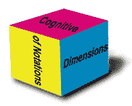

# 迈向更好的 GUI 编程基准

> 原文：<https://medium.com/hackernoon/towards-a-better-gui-programming-benchmark-397aca3542b8>

GUI [编程](https://hackernoon.com/tagged/programming)正在[挑战](/@eugenkiss/challenges-in-gui-programming-65d360466e3f)。我们努力寻找更好的方法来编程 GUI，我们确实取得了进展。无数 GUI 工具包以不同方式开发 GUI 的事实表明前面的路还很长。要是有一个基准来比较 GUI 程序就好了。那么识别好的想法会变得容易得多。

在本文中，我将介绍[7 GUI:一个 GUI 编程基准](https://eugenkiss.github.io/7guis/)。我对它进行了反思，并在下半年通过思考一个更好的 GUI 编程基准如何体现自己来展望未来。

# 7GUIs 回顾展

7 GUI 是我创建 GUI 编程基准的尝试。在传统的基准测试中，竞争的实现根据它们的资源消耗进行比较。在 7GUIs 中，根据它们的**符号**来比较实现。

为此，7 GUI 定义了代表 GUI 编程中典型挑战的七个任务。大量的[实现](https://eugenkiss.github.io/7guis/)已经存在，你的可能是其中之一。此外，7GUIs 提供了一组推荐的[评估维度](http://eugenkiss.github.io/7guis/dimensions/)。

The ‘Flight Booker‘ task from 7GUIs

这个项目是我 2014 年的硕士论文的副产品。从那时起，GUI 编程领域就不再发展了。四年后，我回首往事。

## 最近更新

很长一段时间，我对 GitHub 项目的结构并不满意。我也不擅长回应拉取请求。尽管如此，人们还是继续收藏存储库并添加实现。非常感谢所有的贡献者！

然后我的[论文导师](https://hci.uni-hannover.de/people/michael)给我发了一封电子邮件，询问他是否能帮忙处理这些请求。总之，这促使我决定改进这个项目。**目标**:使它的表示和所有权更加清晰，减少我这边的维护工作。

现在有一个专门的网站，而不是使用 GitHub Wiki 来获取文档。存储库(大部分)包含实现的链接，但不再包含实现本身。另一个新增功能是 React/MobX 中 7 个图形用户界面任务的 [live 版本](https://eugenkiss.github.io/7guis-React-TypeScript-MobX/)，这样你就可以在浏览器中方便地使用生成的图形用户界面。

我对一切的结果感到高兴，但是现在说目标是否已经达到还为时过早。无论如何，我欢迎反馈！

## 征集捐款

我希望看到更多有贡献的实现。

例如，我的 Elm 实现已经过时并且不完整。你不想展示一下牛逼的 Elm 是如何处理 7GUIs 任务的吗？在 React、Ember、Angular 或 Vue 等流行的 SPA 框架中实现呢？

我认为*你将无法*在 React/MobX 中创建一个比我的版本更好的实现。 ***证明我错了！***

## 影响

当我回顾这个项目时，我想知道:

> *对于框架设计者和 GUI 实现者来说，7 GUI 是否实现了其提高 GUI 编程方法可比性的目标？*

某种程度上肯定。但是很难给出一个明确的答案。贡献的实现数量、论坛讨论和我收到的一些电子邮件表明 7GUIs 满足了需求。

然而，据我所知，还没有*记录下来的*比较被创建。根据我的经验，我知道写一篇比较文章有多难。或者，根本不需要分析。也许这就是全部了。另一方面，我认为基准测试的某些方面可以做得不同，以吸引更多的比较(参见本文的其余部分)。

总而言之，尽管缺乏明显的比较，7GUIs 似乎还是有用的，但是拥有它们会更好，并且有潜在的方法使它们更有可能。

## 缺点

在 7GUIs 诞生后的四年里，我在构建 GUI 方面获得了更多的经验。我注意到一些重要的 GUI 编程挑战没有被 7 GUI 所涵盖。

7GUIs 将重点更多地放在传统的桌面应用上。不管你喜不喜欢，现在比以往任何时候，向用户提供图形用户界面的最重要的平台是浏览器和互联网络。

此外，我还研究了类似的项目，如 [TodoMVC](http://todomvc.com/) 和 [HNPWA](https://github.com/staltz/flux-challenge) ，并试图找出它们在哪些方面取得了成功。

澄清一下:我坚信*7 GUI 仍然有用*。

不过，我也相信有可能出现更好的基准。我思考的结果将在下一节介绍。

# 迈向更好的基准

如果我现在创建一个 GUI 编程基准，我会做哪些与 7 GUI 不同的事情？

Photo by [Matt Sclarandis](https://unsplash.com/photos/S_IV6KqGeso?utm_source=unsplash&utm_medium=referral&utm_content=creditCopyText) on [Unsplash](https://unsplash.com/?utm_source=unsplash&utm_medium=referral&utm_content=creditCopyText)

## 挑战

正如引言中所暗示的，7GUIs 并没有涵盖我作为软件工程师的职业经历中观察到的所有相关挑战。我将简单地列出我认为值得在更完整的基准中解决的挑战，而没有更深入的解释。请注意，这既不是一个完整的集合，也不是必需的集合，而是一个假设的新基准的良好起点:

*   处理脆弱而缓慢的远程 API。不仅是读取，还有变异操作(例如 POST 请求)。这意味着处理加载和错误场景，缓存和处理竞争条件。
*   以巧妙的方式装卸货物。例如，在一定时间后仅显示负载指示器。以最小的时间量显示它以防止闪烁。如果以前获取了部分数据，则在加载过程中显示这些数据。
*   乐观的更新
*   预取
*   变更传播
*   呈现可过滤或可搜索的大型项目列表，远程获取结果
*   撤消/重做。可能还有远程同步。
*   屏幕之间的导航/路由。阻止导航(例如，未保存的更改)
*   选项卡式内容
*   情态动词。可能需要像向导一样的几个步骤:对话框控件
*   分页或无限加载
*   适应性/响应性布局
*   约束(形式)
*   通知/祝酒。可能由远程事件或计划任务触发。
*   状态恢复
*   离线支持
*   相同数据的两个可选视图
*   Rx 通常适合的潜在工作:对过去事件的操作，协调多个相互依赖的请求。

Photo by [NASA](https://unsplash.com/photos/_SFJhRPzJHs?utm_source=unsplash&utm_medium=referral&utm_content=creditCopyText) on [Unsplash](https://unsplash.com/?utm_source=unsplash&utm_medium=referral&utm_content=creditCopyText)

> 您可能已经注意到，许多挑战都涉及到与远程 API 的通信。世界变得越来越紧密相连，这反映在当今构建和使用的应用程序中。一个好的基准应该考虑到这一点。

## 不自然

对于 7GUIs，我有意识地决定设置几个独立的任务。这种方法的副作用是增加了人工性。这本身并不是一件坏事——但这是一种权衡。

通过关注每项任务中的几个挑战，更容易看到它们是如何被解决的。此外，应该更容易比较解决方案。如上所述，问题是这是否重要。人为的一个缺点是，挑战或应对挑战的方法之间可能的相互作用可能会被忽略。

但是最大的缺点是写一个“真正的”应用程序只是简单地更有趣。如果你在解决相当抽象的挑战的同时创造了一些东西，你实际上可以在实践中玩和使用，你就更投入了。最终，任务越吸引人，人们投入的精力就越多，这导致了更多的思想交流——至少这是我的印象。

> 具体来说，一个电影浏览/回顾应用程序将很好地满足这些需求。它概括了所有相关的挑战，也足够真实有趣。

## 所需的努力

如果基准太小，就不能涵盖足够多的有趣挑战。它还可能鼓励非常专业化的解决方案。如果一个基准太大，完成它所需要的努力可能会阻碍人们编写一个实现。

现在我已经在 React/MobX 中重新实现了 7GUIs，我注意到它有点太大了。特别是任务“圈抽屉”和“细胞”可以成为他们自己的基准。

原始形态的 TodoMVC 感觉太小了。另一方面，HNPWA 感觉太大了。然而，如果基准测试涉及到创建一个非人工的应用程序，那么我相信在开发过程中增加的乐趣可以超过更高要求的努力。

> 因此，对我来说，理想的基准应该介于 TodoMVC 和 HNPWA 之间，但更接近 HNPWA。

## 标准的特异性

验收标准应该有多具体？

过于具体，你可能会引入对某些解决方案的偏见。这也会降低乐趣，因为您希望能够在您的实现上“打上您的标记”。太过宽松会使你很难比较那些没有达到基准的实现。

总的来说，我觉得你应该从具体开始，一旦人们开始抱怨某些标准妨碍了好的方法，放松他们。随着时间的推移，您应该会有一套好的验收标准。

## 衡量实施情况

当谈到有一套标准来比较彼此的实现时，我仍然是[符号的认知维度(CDs)](http://www.cl.cam.ac.uk/~afb21/CognitiveDimensions/) 框架的粉丝，这是“一种分析信息人工制品可用性的方法”。

The CDs logo

然而，我承认它的介绍是枯燥的。我试着让 7GUIs 的[更容易理解](https://eugenkiss.github.io/7guis/dimensions)，但是我觉得这些尺寸在实践中仍然不容易应用。

在我看来，每个维度都有具体的小 JavaScript 片段会有所帮助。对于一个小问题，一个好的和一个不太好的 JavaScript 版本。然后简短解释为什么根据讨论的维度，好的版本比不太好的版本好。

总的来说，以一种非主观、简单和有用的方式测量实现的源代码是一个困难的问题，所以我希望在这里看到进一步的想法。

## 邀请投稿

我注意到一些对 7GUIs 的贡献并没有给他们的表现带来多少价值。这完全没问题，因为这从来不是一个要求。尽管如此，更高的捐款要求实际上会导致更多的捐款。

> 这个想法是为了让它作为一个贡献被列出来有点声望。这反过来会让你的贡献更有吸引力。另外，相互比较实现应该变得更容易。

需求的一些具体想法:有如何运行你的项目的明确指示，有截图，有完整的实现，让你的源代码易于浏览(例如，在 GitHub 上托管它)，有一篇文章/文档描述你的实现有什么好/特别的，有其他人担保你的贡献，有陪审团评判你的贡献(“同行评审”)。在宽容和严格之间很难找到一个好的平衡，但更严格可能最终会更好。

应该明确你必须有一个高质量的参考实现:以身作则！

## Threadit。射流研究…

在我的研究中，我最近偶然发现了 [Threadit.js](https://github.com/koglerjs/threaditjs) 。我粗略地看了一下，这个基准测试似乎走对了方向。

这是一个“真正的”应用程序。它提供了一个易变的远程 API，从而迫使实现处理错误和加载状态。它提供了实用程序代码，因此您可以专注于核心挑战。它是基于网络的。

Threadit.js 有许多好想法，至少可以作为一个起点。不幸的是，http://threaditjs.com/的直播网站[关闭了。](http://threaditjs.com/)

# 结论

TodoMVC、HNPWA、7 GUI 等项目表明，GUI 编程基准是有需求的。7GUIs 很有用，但也有缺点。ThreadIt.js 大体上接近我所认为的更好基准的正确方向。不过，我不会是推动这样一个项目的人。在本文中，我只是设想了一个更好的基准。然而，我愿意支持创建基准的努力，因为我相信其结果将是有影响力的。你有什么想法？