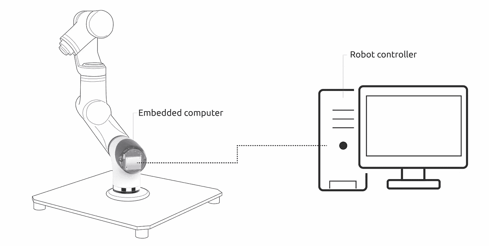
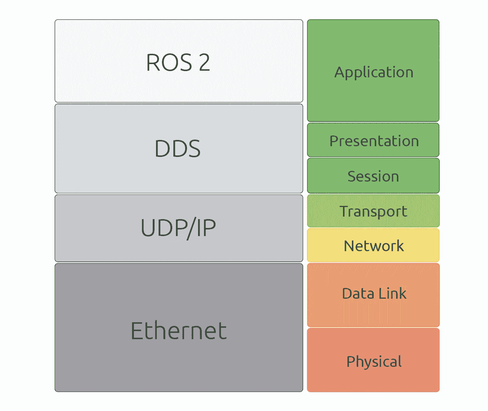
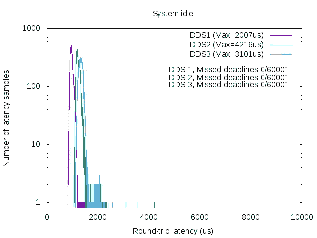
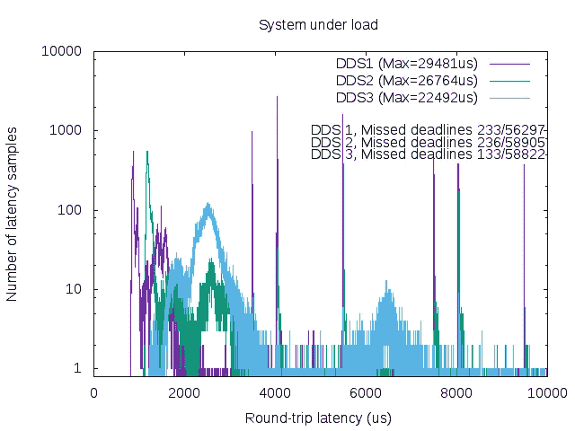
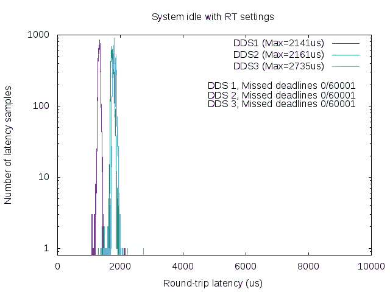
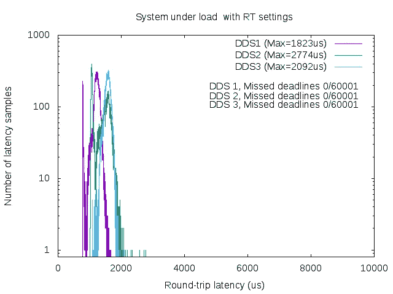

# 面向机器人的分布式实时框架

> 原文：<https://medium.com/hackernoon/towards-a-distributed-and-real-time-framework-for-robots-469ba77d6c42>

## 实时机器人应用的 ROS 2.0 通信评估

*本文内容来自“*实时 Linux 通信:实时机器人应用的 Linux 通信栈评估*”，可在 https://arxiv.org/pdf/1809.02595.pdf*获得。*同行的有卡洛斯·圣维森特·古铁雷斯、兰德·乌萨特吉·圣胡安和* [*伊拉蒂·扎马罗亚·乌加特*](https://medium.com/u/e9b73593e3f?source=post_page-----469ba77d6c42--------------------------------) *。*

Experimental setup overview.

> 在这项工作中，我们提出了一个实验设置，以显示实时机器人应用的 ROS 2.0 的适用性。我们公开了在 Linux 之上的机器人组件间(硬件)通信案例中对 ROS 2.0 通信的评估。我们对最差情况下的延迟和错过的截止时间进行了基准测试和研究，以表征实时应用的 ROS 2.0 通信。我们通过实验证明了计算和网络拥塞如何影响通信延迟，并最终提出了一种在特定条件下减轻这些延迟并获得有界流量的设置

# 介绍

在机器人系统中，任务通常需要在严格的时间要求下执行。例如，在移动机器人的情况下，如果控制器必须对外部事件做出响应，过度的延迟可能会导致不期望的后果。此外，如果机器人以一定的速度移动，需要避开障碍物，它必须检测到这一点，并在一定的时间内停止或纠正其轨迹。否则，它可能会冲突和中断所需任务的执行。这种情况在机器人中相当常见，必须在明确定义的时间限制内执行，通常需要实时能力。这种系统通常具有定时要求，以通过机器人的内部网络执行任务或交换数据，这在分布式系统的情况下是常见的。例如，机器人操作系统(ROS)[1]就是这种情况。不满足定时要求意味着，要么系统的行为将降级，要么系统将导致故障。

实时系统可以根据满足相应的时间约束的关键程度来分类。对于硬实时系统，错过截止日期被认为是系统故障。这种实时系统的例子是防抱死刹车或飞机控制系统。另一方面，公司实时系统更加宽松。在错过截止日期后交付的信息或计算被认为是无效的，但不一定会导致系统故障。在这种情况下，错过截止日期会降低系统的性能。换句话说，在失败之前，系统可以容忍一定量的错过截止日期。公司实时系统的示例包括大多数专业和工业机器人控制系统，如协作机器人手臂的控制回路、空中机器人自动驾驶仪或大多数移动机器人，包括自动驾驶车辆。最后，在软实时的情况下，错过最后期限——即使交付晚了——仍然有用。这意味着软实时系统不一定会因为错过最后期限而失败，相反，它们会降低实时任务在执行中的有用性。软实时系统的例子是任何种类的远程呈现机器人(音频、视频等)。).

随着 ROS 成为机器人应用程序开发的标准软件基础设施，ROS 社区越来越需要在框架中包含实时功能。作为回应，ROS 2.0 是为了能够提供实时性能而创建的，然而，正如之前的工作[2]和[3]所述，ROS 2.0 本身需要被适当的元素包围，以便为机器人提供完整的分布式实时解决方案。

对于分布式实时系统，通信需要提供服务质量(QoS)能力，以保证确定性的端到端通信。ROS 2 通信使用数据分发服务(DDS)作为其通信中间件。DDS 包含可配置的 QoS 参数，可针对实时应用进行调整。通常，DDS 发行版使用实时发布/订阅协议(RTPS)作为传输协议，该协议封装了众所周知的用户数据报协议(UDP)。在基于 Linux 的系统中，DDS 实施通常使用 Linux 网络堆栈(LNS)通过以太网进行通信。

在之前的工作[2]中，我们分析了第 2 层服务质量(QoS)技术的使用，如数据包优先级和时间敏感网络(TSN)调度机制，以限制以太网交换网络中的端到端延迟。在[3]中，我们分析了 Linux PREEMPT-RT 内核中 LNS 的实时性能，并观察了混合关键流量场景中 LNS 上确定性通信的一些当前限制。下一步是分析以太网上 preempt-RT 内核中 ROS 2.0 通信的实时性能。之前的工作[4]调查了 ROS 2.0 通信的性能，显示了有希望的结果，并讨论了未来的改进。然而，上述研究并未探讨 ROS 2.0 对实时应用的适用性，并且评估也不是在嵌入式平台上进行的。

在这项工作中，我们重点评估机器人组件间通信用例中的 ROS 2.0 通信。为此，我们将展示一个设置和一组基准，我们将测量在不同静态负载条件下运行的两个 ROS 2.0 节点的端到端延迟。我们将关注最坏情况下的延迟和错过的截止日期，以观察 ROS 2.0 通信对于实时应用的适用性。我们还将尝试展示不同压力条件对 ROS 2.0 流量延迟的影响。最终，我们试图找到一种合适的配置来提高 ROS 2.0 的确定性，并在嵌入式平台中建立这种设置的限制。

# 一点背景知识

Overview of ROS 2 stack for machine to machine communications over Ethernet

ROS 是一个开发机器人应用程序的框架。一个充满机器人实用程序的工具箱，如通信基础设施，包括标准消息定义、各种软件和硬件组件的驱动程序、诊断库、导航库、操纵库等等。总之，ROS 简化了在各种机器人平台上创建复杂和健壮的机器人行为的任务。ROS 2.0 是 ROS 的新版本，它扩展了最初的概念(最初是为了纯粹的研究目的)，旨在为涉及机器人团队、实时系统或生产环境等情况提供分布式和模块化的解决方案。在 ROS 2.0 引入的技术创新中，Open Robotics 探索了 ROS 2.0 通信系统的几个选项。与其他解决方案相比，由于 DDS 中间件的特点和优势，他们决定使用 DDS 中间件。如[5]中所述，使用 DDS 等端到端中间件的好处是需要维护的代码更少。DDS 在 ROS 2.0 中被用作通信中间件，它通常作为用户空间代码运行。即使 DDS 已经指定了标准，第三方也可以审查 audit，并以不同程度的互操作性实现中间件。

正如技术报告[6]中所指出的，要获得实时性能，确定性用户代码和实时操作系统都是必需的。在我们的例子中，我们将使用 PREEMPT-RT 修补的 Linux 内核作为实验操作系统的核心。遵循 PREEMPT-RT 的[编程](https://hackernoon.com/tagged/programming)指南，通过适当的内核配置，其他作者[7]证明了实现 10 到 100 微秒的系统延迟响应是可能的。

通常，默认情况下，DDS 实现使用 Linux 网络栈(LNS)作为传输层和[网络](https://hackernoon.com/tagged/network)层。这使得 LNS 成为 ROS 2.0 性能的关键部分。然而，网络堆栈不是针对有限的延迟而优化的，而是针对给定时刻的吞吐量而优化的。换句话说，由于网络堆栈的当前状态，会有一些限制。然而，LNS 提供了 QoS 机制和线程调整，这允许在内核级别提高关键流量的确定性。

Linux 内核中如何处理数据包的一个重要部分实际上与如何处理硬件中断有关。在普通的 Linux 内核中，硬件中断分两个阶段服务。首先，当一个中断触发时，一个中断服务程序(ISR)被调用，然后，硬件中断得到确认，工作被推迟到以后执行。在第二阶段，稍后执行软中断或“下半部分”,以处理来自硬件设备的数据。在 PREEMPT-RT 内核中，大多数 ISR 被迫运行在专门为中断创建的线程中。这些线程被称为 IRQ 线程[8]。通过将 IRQ 作为内核线程来处理，PREEMPT-RT 内核允许将 IRQ 作为用户任务来调度，设置优先级和 CPU 关联来单独管理。在线程中运行的 IRQ 处理程序本身也可以被中断，因此减少了中断引起的延迟。出于我们的特殊兴趣，由于我们的应用需要发送关键流量，因此可以将以太网中断线程的优先级设置为高于其他 IRQ 线程，以提高网络确定性。

普通内核和 PREEMPT-RT 内核的另一个重要区别是在软中断执行的上下文中。从内核版本 3.6.1-rt1 开始，软 IRQ 处理程序在产生该软 IRQ 的线程的上下文中执行[9]。因此，NET_RX 软 irq(用于接收网络数据包的软 IRQ)通常会在网络设备 IRQ 线程的环境中执行。这允许对网络处理环境的精细控制。但是，如果网络 IRQ 线程被抢占或者耗尽了它的 NAPI 权重时间片，它将在 ksoftirqd/n(其中 n 是 CPU 的逻辑号)中执行。

在 ksoftirqd/n 上下文中处理数据包对于实时来说很麻烦，因为该线程被不同的进程用于延迟工作，并且会增加延迟。此外，由于 ksoftirqd 线程使用 SCHED_OTHER 策略运行，它很容易被抢占。实际上，软 IRQ 通常在以太网 IRQ 线程和 ksoftirqd/n 线程的上下文中执行，用于高网络负载和高压力(CPU、内存、I/O 等)。).这里的结论是，在正常情况下，我们可以预期合理的确定性行为，但如果网络和系统负载过重，延迟可能会大大增加。

# 对结果的初步了解

在整个实验测试中，获得了以下结果。详情可在原始出版物中获得:

Impact of RT settings under different system load. a) System without additional load without RT settings. b) System under load without RT settings. c) System without additional load and RT settings. d) System under load and RT settings.

在 https://arxiv.org/pdf/1809.02595.pdf 阅读全文。

# 参考

[1] M. Quigley、K. Conley、B. Gerkey、J. Faust、T. Foote、J. Leibs、R. Wheeler 和 A. Y. Ng，“Ros:一个开源机器人操作系统”，ICRA 开源软件研讨会，第 3 卷，第 3.2 期。日本神户，2009 年，第 5 页。

[2] C. S. V. Gutiérrez，L. U. S. Juan，I. Z. Ugarte 和 V. M. Vilches，“机器人的时间敏感网络”，CoRR，第 abs/1804.07643 卷，2018 年。【在线】。可用:【http://arxiv.org/abs/1804.07643 

[3] C. S. V. Gutiérrez、L. Usategui San Juan、I. Zamalloa Ugarte 和 V. Mayoral Vilches，“实时 Linux 通信:实时机器人应用的 Linux 通信堆栈评估”，ArXiv 电子印刷，2018 年 8 月。

[4] Y .丸山、s .加藤和 t .少女杀手阿墨，“探索 ros2 的性能”，2016 年国际嵌入式软件会议(EMSOFT)，2016 年 10 月，第 1–10 页。

[5]“Ros 2.0 设计”，[http://design.ros2.org/,](http://design.ros2.org/,)访问时间:2018–07–27。

[6]《实时系统概论》，[http://design.ros2.org/articles/](http://design.ros2.org/articles/)Real time _ background . html，访问时间:2018–04–12。

[7] F. Cerqueira 和 B. B. Brandenburg，“linux、preempt rt 和 litmus rt 中调度延迟的比较”

[8] J. Edge，“将中断移动到线程”，2008 年 10 月，[访问时间:2018–04–12]。【在线】。可用:[https://lwn.net/Articles/302043/](https://lwn.net/Articles/302043/)

[9] J. Corbet，“软件中断和实时”，2012 年 10 月，[访问时间:2018–04–12]。【在线】。可用:【https://lwn.net/Articles/】T2520076/