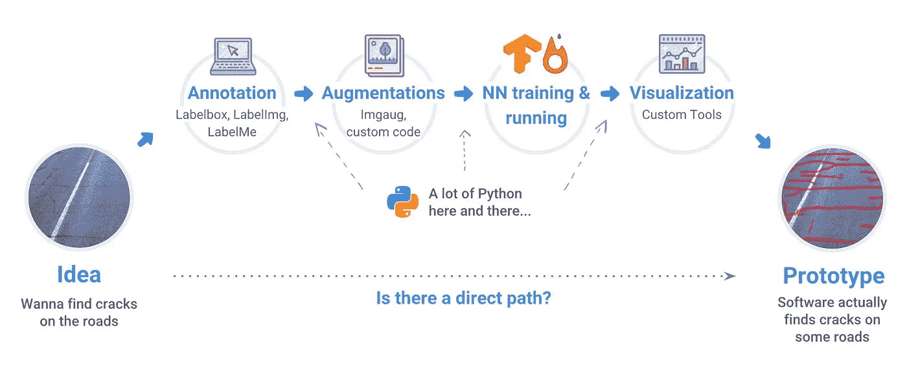
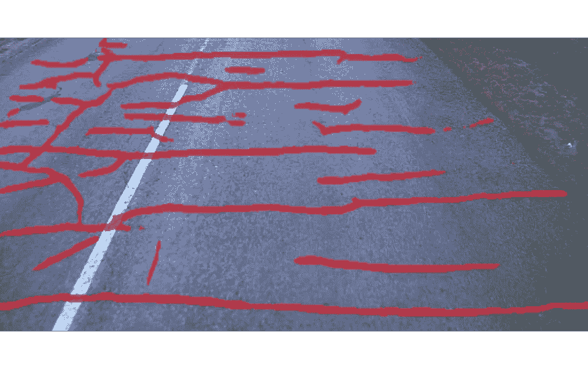
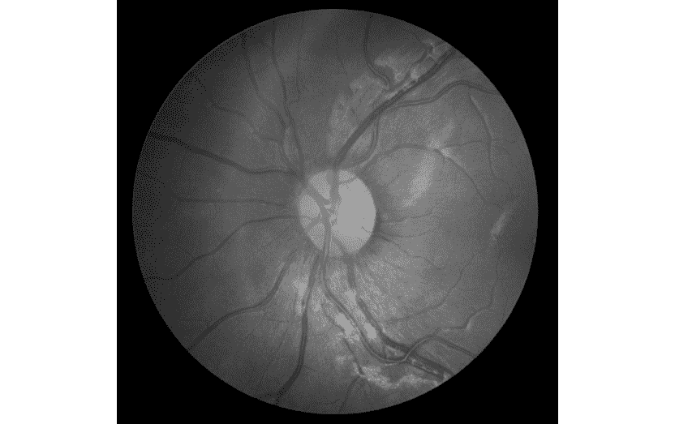

# 走向人工智能:从想法到工作原型，你需要多长时间？—一天，一个月？

> 原文：<https://medium.com/hackernoon/towards-ai-how-long-does-it-take-you-to-go-from-idea-to-working-prototype-a-day-a-month-8a03ffecca0a>

# 我们的案子

在 [DeepSystems](https://deepsystems.ai) ，我们已经经营咨询业务超过 5 年。我们专注于帮助其他公司利用人工智能来优化他们的运营。我们的绝大多数项目都在计算机视觉领域。

每当我们开始协商工作范围和价格时，拥有一些早期的、肮脏的和工作的原型是非常有益的。否则，很难估计所付出的努力并给出合适的价格。所以在我们的商业实践中，甚至在合同签署之前就建造一些东西是很常见的。

**但是在这篇文章中，我们建议少关注我们，多关注你们。**

# 你的案子

假设您有一个想法(或业务请求)来解决攻击特定业务需求的语义分割或对象检测任务。它可能是发现道路上的裂缝，眼睛上的血管，检测人群中的人或其他东西。

Person detection

Quality inspection: finding cracks on a road

Eye vessels automatic segmentation

**你将一个想法/商业请求变为现实需要多长时间？**

肯定的，答案要看背景。我们来考虑以下几类人。

**第一类。数据科学家**。使用 Python 作为主要语言，有使用 TensorFlow、PyTorch 的经验。有数学、统计学和机器学习背景。

**第二类。软件开发者**。使用 C++作为主要语言，也熟悉 Docker，RabbitMQ，SQL & NoSQL 数据库。拥有计算机科学学位。

**第三类。领域专家**。负责安全、质量、效率和降低成本，例如，在制造业、农业或建筑业。或者，在医学领域，我们可以考虑以医生为例。

为了让事情变得有趣，让我们把 **1 天限制为**来执行任务。

我们的经验答案是，平均而言，只有“数据科学家”才有机会在给定的时间限制内完成工作。实际上，并不是每个数据科学家都需要有计算机视觉方面的经验，以及在过去解决类似任务的经验。

我们的“理想数据科学家”有机会的主要原因是他有工作管道(或者至少对它有很好的理解)来处理这类任务。

所以他知道:

*   使用什么软件来标记数据

他有:

*   代码/库，用于从标记图像构建训练数据，例如，通过扩充标记图像
*   Pytorch / tensorflow 深度学习模型的实现，如 Unet、Mask R-CNN 或其他，他过去在他的项目中使用过这些模型
*   展示解决方案的可视化工具

换句话说，我们的数据科学家利用他的经验和生态系统在短时间内得到结果。

但是另外两类人呢？

时间限制对他们来说太苛刻了。在大多数情况下，他们不知道如何完成任务。

# 人工智能不仅仅是数据科学家的专利，每个人都应该使用它

实际上，**软件开发人员**非常熟悉各种开发工具，向数据科学过渡对他们来说是最自然的。在参加了几门在线课程、一些 kaggle 竞赛和个人项目之后，他们的状态非常好。但是转变过程仍然是艰难的，需要时间和动力。

至于**领域专家**，他们的情况最糟糕——他们大多数既没有计算机科学背景，也没有数据科学背景。但是尽管如此，这些人在某种程度上是非常强大的，他们是唯一每天面对人们/企业真正需求的人。参与医药、农业、建筑、生产管道的人们看到了效率低下，他们理解真正的痛苦，或者换句话说，需要解决的真正任务。所以这些人的想法非常有价值。

随之而来的问题是:“这种情况正常吗？”，“也许，每个人都应该管好自己的事吧？”、“让软件工程师开发软件，让建筑工人像过去一样建造桥梁？”

我们的答案是，今天的人工智能提供了如此多的东西，忽视它不是很聪明。从字面上看，每个行业都将受益于人工智能，因此，我们将活得更长、更快乐。

回到我们的主题，让我们做如下陈述:

**“我们相信数据科学家、软件工程师和领域专家现在就应该能够利用人工智能。”**

还有一个声明:

"**对于所有 3 类人来说，从想法到“肮脏原型”应该需要 2 个小时的时间**"

我们知道计算机视觉应用是可能的——回想一下我们之前对 DeepSystems 的政策的讨论，即在签署合同之前建立一个原型。

显然，我们不能对每一项任务都这样做，但对于计算机视觉中最常见的任务，如检测或分割，我们可以也确实这样做。

# 监管平台——迈向人工智能民主化的步骤

我们利用我们的 [Supervise.ly](https://supervise.ly) 平台，不仅可以快速制作原型，还可以进行主动学习，不断提高模型的质量。

该平台背后的想法是解决整个管道——从数据标记到在单一环境中训练和运行神经网络。Supervise.ly 的社区版是免费的，可以在网上获得，而且大部分是开源的。

最简单的方法是观看下面的视频:

它涵盖了我们在构建人工智能应用程序时必须处理的 3 个主要概念:

1.  数据标记
2.  数据准备
3.  模型结构

更重要的是，这里展示了构建原型的整个过程——构建语义分割模型来区分柠檬和猕猴桃。

您将在此处找到所有信息以重现视频中描述的实验。

看完之后，我们希望你意识到今天构建人工智能模型实际上很容易，你可以马上开始做(虽然，几年前不是这样)。

我们将继续每周发布新的视频，以吸引更多的人来开发人工智能。

我在这里放一个免责声明。我们认为深入理解人工智能技术是有益的，值得努力。例如，在[这篇博文](/machine-learning-for-humans/how-to-learn-machine-learning-24d53bb64aa1)中，你会找到关于如何更好地接近人工智能领域的伟大指南。

如果你觉得这篇文章很有趣，那么让我们也来帮助别人吧。如果你给它一些，更多的人会看到它👏。