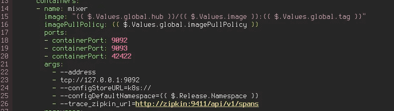

# Istio 追踪服务

> 原文：<https://medium.com/hackernoon/tracing-services-with-istio-e51d249da60c>

超级快速 post，当 istio 将 envoy 容器端 car 注入到您的 pod 中时，每个进出的请求都“附加”了一些 http 头，然后它们用于跟踪。

这是 istio 采用的“侧车注入”方法的众多好处之一，虽然有点侵入性，但迄今为止似乎效果不错。

好的，你可以通过在图表上启用它来快速部署 jaeger 和 zipkin:

 [## istio/istio

### istio -连接、管理和保护微服务的开放平台。

github.com](https://github.com/istio/istio/blob/master/install/kubernetes/helm/istio/values.yaml#L415) 

以防你还没有启用它。

然后，如果你稍微看一下图表，你会发现这样的参考:



那是从 mixer 来的，所以不需要太多的挖掘，你就可以看到 mixer 是如何将统计数据传递给 zipkin 的，记住 Mixer 可以看到一切。

所以如果我们转到耶格正在监听的地方:

```
kubectl port-forward -n istio-system istio-tracing-754cdfd695-ngssw 16686:16686
```

我们点击`http://localhost:16686`，我们会找到耶格:


这对于跟踪和了解可能需要很长时间来处理的服务非常有趣，我强制输入了一个错误，看起来像这样:


如果 pod `nginx`将调用额外的服务，它们也应该显示在那里，**因为记住所有的入口/出口流量都由 pod 内的特使边车捕获。**