# 跟踪您的加密货币交易和投资组合

> 原文：<https://medium.com/hackernoon/track-your-cryptocurrency-trades-and-portfolio-fa661b01c29>

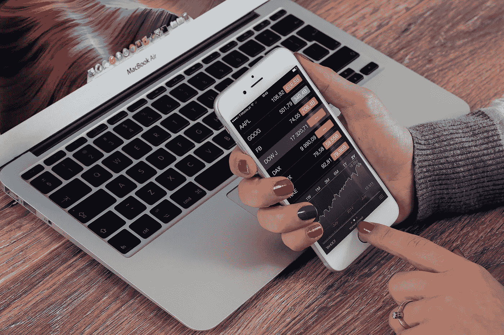

Track your trades

我第一次听说比特币是在 2011 年，并花了一些时间阅读它。我发现它很有趣，但从未考虑过投资它。同样在 2013 年，我和一个朋友讨论了关于从事与加密货币相关的创业公司的事情。我们做了一些初步研究，然后放弃了这个想法，因为印度对加密货币的监管不明确。我确实考虑过投资一些比特币，但我不太愿意把所有的钱都绑在一把私人钥匙上，因为我可能会把它放错地方。当时我没有听说过任何比特币交易所，所以当比特币的价格在 100 美元左右时，我放弃了进入比特币热潮的机会。终于在 2017 年 6 月投资了比特币。

# 临时流程和故障跟踪

当你进入加密货币市场时，你学到的第一件事就是比特币只是冰山一角，还有很多另类货币。你做了一些研究，意识到有不同的交易所，你需要在这些不同的交易所有帐户来交易不同的 alt 硬币。因此，你在不同的交易所创建账户，只是为了意识到你不能将你的比特币/以太转移到 ICOs，以获得尚未在任何交易所交易的新币。因此，在很短的时间内，你就拥有了 10 多个交易所的账户、比特币的离线钱包和以太网的离线钱包。如果你喜欢把你的备用硬币放在离线钱包里，那么你会有更多的离线钱包。

# 上路，寻找完美的加密货币投资组合经理

很快你就会意识到，跟踪你所有的加密货币投资并不是一件容易的事情，它不能通过在你的电子表格中输入条目来完成。大约两个月前，我遇到了类似的障碍。我做了一些谷歌搜索，阅读了各种加密货币投资组合。经过一番挖掘，我发现了硬币追踪。我花了一些时间挖掘他们的投资组合 web 应用程序，我确信这个投资组合应该足以满足未来两年的需求。因为自由账户有 200 笔交易的限制，所以我买了一年的会员资格。我发现了几个我经常使用的功能，并帮助我睡得更好，因为我可以处理我所有的加密货币投资。

如果在过去的几个月里，你曾经问过自己或者在任何论坛上提出过这些问题，那么请继续阅读

1.  最好的比特币追踪器是什么
2.  哪个加密货币投资组合跟踪器跟踪我所有的购买、转账和交易
3.  哪个比特币投资组合跟踪器能自动跟踪我的所有交易
4.  哪个比特币交易追踪器还会追踪所有替代比特币交易和余额
5.  哪个是加密货币交易/跟踪软件
6.  我如何跟踪我在各个交易所支付的费用

# 解说视频

如果你懒得继续读下去，那就看看视频，了解我所说的要点。

如果你看了视频，并且你已经确信你应该开始使用投资组合跟踪工具，使用这个推荐链接 [Cointracking](https://cointracking.info/?ref=G113475) 获得 10%的折扣。如果你使用比特币购买，你将获得额外的 5%的折扣。这是我喜欢硬币追踪的另一个原因。每个使用加密货币或围绕加密货币建立业务的人都应该遵循这种方法来促进他们的采用。

# 输入/跟踪您的交易

跟踪投资组合的第一步是确保所有的购买、提取和交易都从您使用的任何交易所/钱包导出，并导入到 Cointracking 应用程序中。这可以通过三种方式实现:手动输入、从交易所导入或通过 API 自动导入(如果您的交易所支持的话)。我不得不将这三者结合起来，以保持我的投资组合与时俱进。

1.  指南
2.  从 [Steemit](https://steemit.com/@gokulnk) 输入我的余额
3.  从交易所进口
4.  通过 API 自动导入
5.  钱包进口
6.  从我的以太钱包地址同步(主要用于 ICOs)
7.  我已经订购了[莱杰纳米](http://amzn.to/2f2DBjF)，一旦到货，我将需要检查如何与之同步。

## 手动输入

[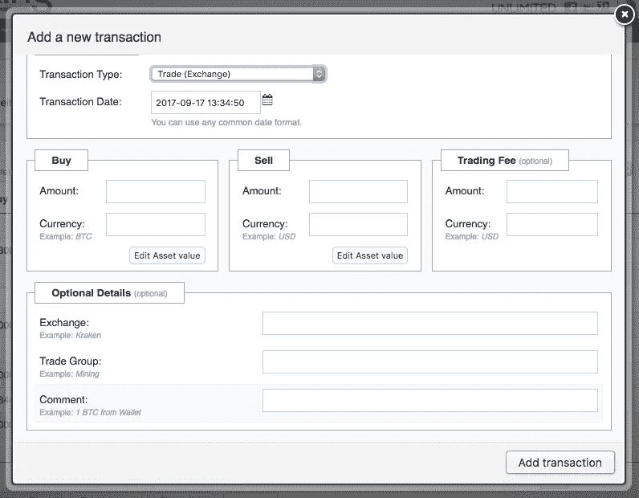](https://cointracking.info/enter_coins.php?ref=G113475)

确保输入所有相关的详细信息。记住输入所有的可选数据，当你试图删除或编辑交易时，这些数据可以帮助你。交易组帮助你的小组进行一种交易，并给出详细的注释，以便以后记住为什么你必须手工输入。努力遵循这个，你以后会感谢我的。

## 外汇进口

[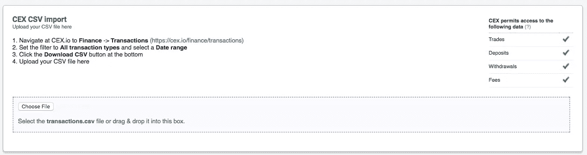](https://cointracking.info/import/cex/?ref=G113475)

在我的案例中，CEX 没有 API，因此我不得不使用 exchange 导入选项。Cointracking 做了一件很酷的工作，让您知道交易所提供的导出支持哪种交易。注意这个。有些交易所不为您提供存款和取款的详细信息。这可能会影响你的总结。您可能需要跟踪这些信息，并为其创建手动条目，以使您的仪表板保持最新。

[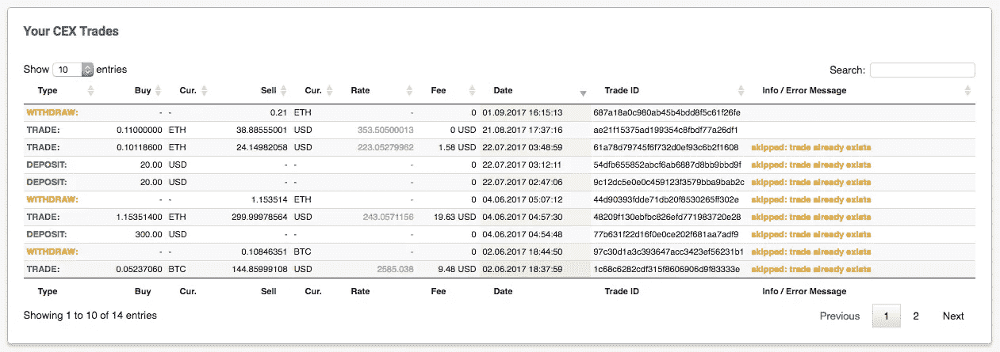](https://cointracking.info/import/cex/?ref=G113475)

你不必担心重复进口，因为每笔交易都有一个唯一的 tradeId，根据它，硬币跟踪将只进口新的交易。

## 自动化 API 导入

Cointracking 为您提供了 API 导入中支持的操作的详细信息。

[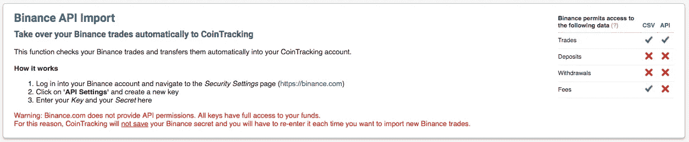](https://cointracking.info/import/binance_api/?ref=G113475)

如果你使用 API 来同步你的交易，要小心。我建议仅在启用双因素身份验证(2FA)之后才在交换中启用 API，并确保仅在 API 中启用读取访问。当我试图为币安启用 API 时，我意识到他们要么拥有全部访问权限，要么没有访问权限。因此，您的 API 要么同时具有读取和交易访问权限，要么没有。当我看到币安的 API 集成屏幕时，我可以看到 Cointracking 的粗体警告消息，称他们没有保存 API 密钥，因为它也有交易权限。这对我来说是个好兆头，这件事之后，我对硬币追踪的信心增加了。币安对他们的 API 没有访问限制，这仍然是愚蠢的。

## 钱包进口

我从来不喜欢离线钱包，因为我担心我会错过我的私人钥匙:P 我总是忍住不去创建一个钱包，因为如果你丢失了你的私人钥匙，就没有办法重新找回你的钱包。但是我必须为以太创建一个，因为我想参加几个 ico。

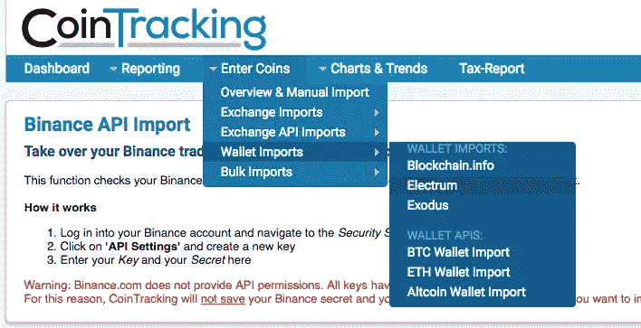

正如你从图片中看到的，Cointracking 支持 Electrum 和 Exodus 进口。我希望今后他们会增加对更多钱包的支持。

[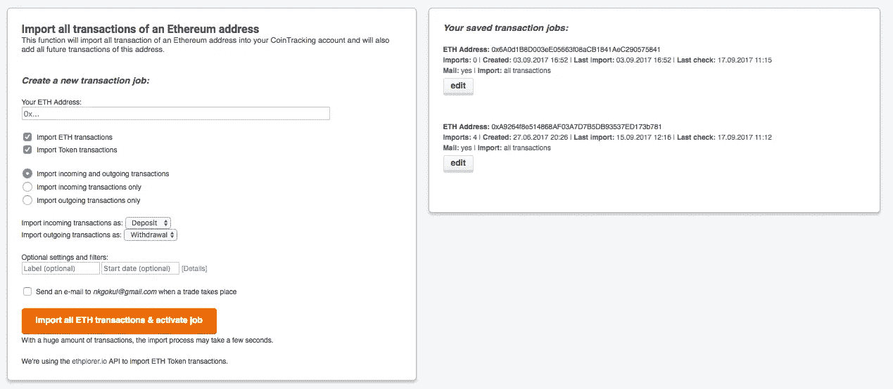](https://cointracking.info/import/eth_address/?ref=G113475)

它还支持监控你的比特币、Altcoin 和 Eth 地址，这意味着它可以跟踪钱包的转账，它还有一个漂亮的功能，当你的钱包发生交易时，它会向你发送通知。我认为这非常方便。

# 仪表板

一旦你有所有的集成设置和进口完成，你应该有仪表板，让你对你的投资组合和当前持有的总体想法。

[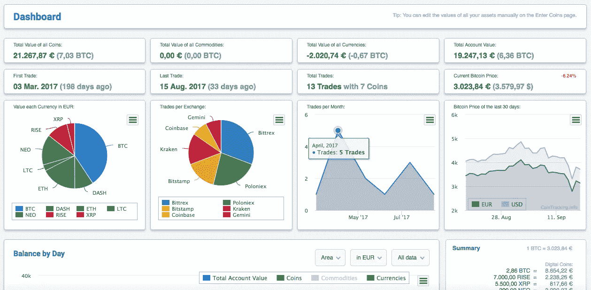](https://cointracking.info/dashboard.php?ref=G113475)

您还可以自定义您的控制面板，并为控制面板选择三种不同的模板，如图所示。我认为我们需要有更多的选项，我们应该能够在我们的仪表板中选择我们想要的每一个小部件，并能够将其保存为一个新模板。但是无论如何，目前的仪表板已经足够好了，我不想抱怨:)

[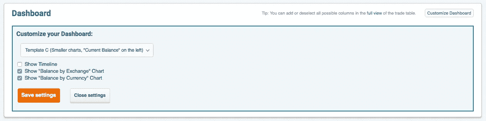](https://cointracking.info/dashboard.php?ref=G113475)

时间轴引起了我的注意。它给你一个在你的旅程中的重要里程碑的好的图表视图，给你一种去甲武的感觉。

[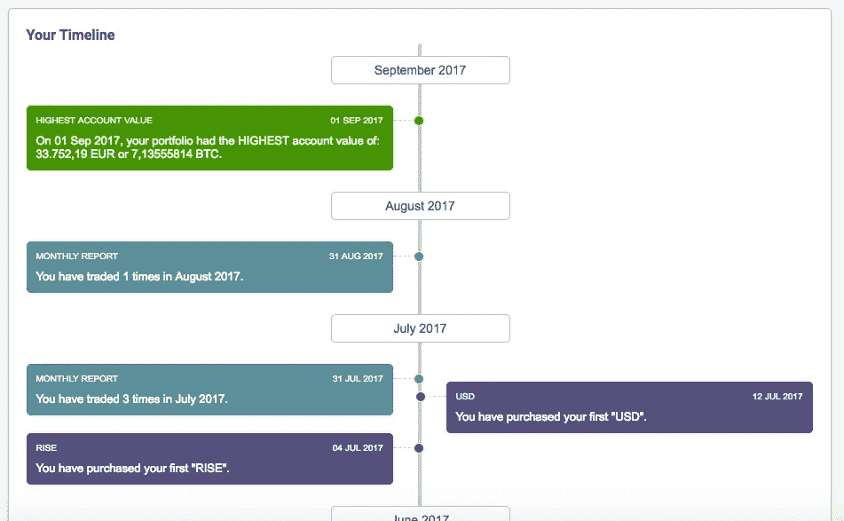](https://cointracking.info/dashboard.php?ref=G113475)

# 报告

Cointracking 提供了各种报告。我主要使用以下报告。

## 贸易清单

[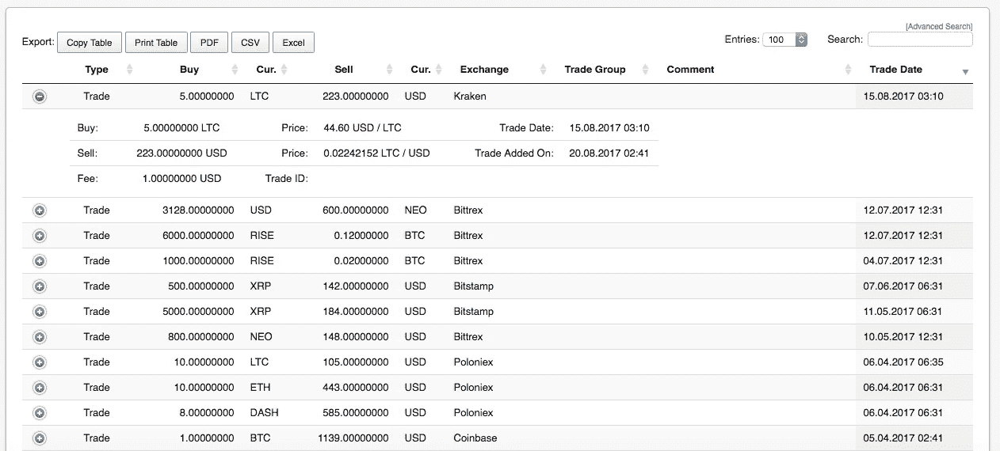](https://cointracking.info/trades.php?ref=G113475)

使用此报告来确保您的所有交易都存在。每当我做一笔交易，我都会在第二天检查，以确保它在那里。我更喜欢霍德勒，因此这不是问题。

## 汇兑差额

[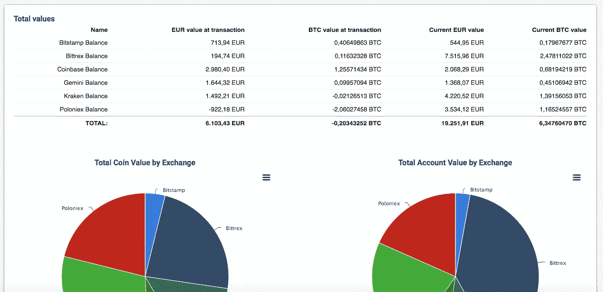](https://cointracking.info/balance_by_exchange.php?ref=G113475)

这能让你快速了解你的储备是如何在交易所中分配的。当出现问题或交易似乎丢失时，该视图可以让您快速了解丢失了哪些交易。

## 费用

[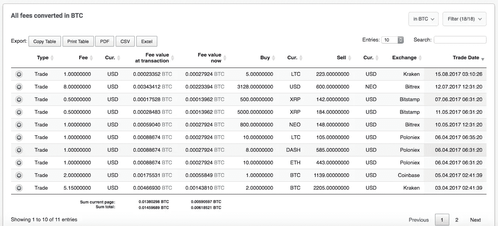](https://cointracking.info/fees.php?ref=G113475)

这是大多数人都忽略的。如果你是一个活跃的交易者，请留意这个数字，因为这个数字会很快增加，你甚至不会注意到。大多数人在计算盈亏时都犯了没有考虑这一点的错误。阅读这篇文章，了解在集中交易所交易的讽刺之处

## 已实现收益

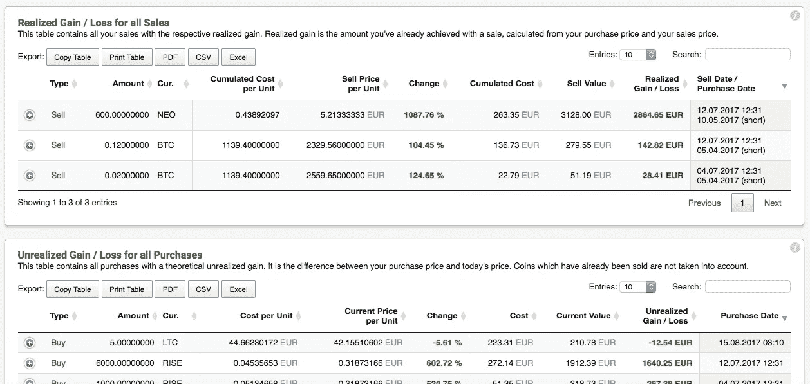

如果你以低价买进了一批硬币，并在每一个高点都卖出了，你就很难确定你的利润。有时你会想知道这个问题的答案，“如果我卖掉剩余的部分，我会赚到钱、亏损还是不亏不赚”。如果你以前遇到过这种情况，那么已实现和未实现收益报告可以给你很好的见解。

[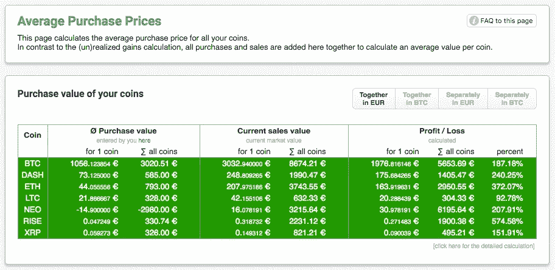](https://cointracking.info/balance.php?ref=G113475)

同样，如果你以不同的价格购买，然后平均，这份报告可以给你一个硬币的平均购买价格。

## 赋税

[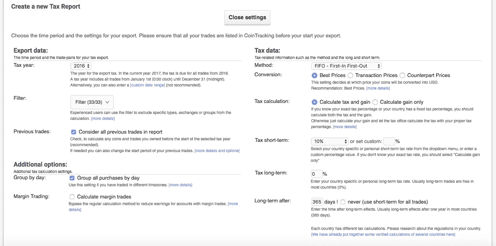](https://cointracking.info/tax/?ref=G113475)

是的，你需要缴纳加密货币收益税。我不确定现在是否有很多人在考虑这个问题，但这可能是一项艰巨的任务。看起来[硬币追踪](https://cointracking.info/?ref=G113475)也覆盖了这里。有能力为您的税务报告配置各种参数，我认为这可以派上用场。

如果你打算使用这个投资组合管理器，使用这个推荐链接 [Cointracking](https://cointracking.info/?ref=G113475) 获得 10%的折扣，如果你使用比特币支付，不要错过额外的 5%的折扣。

如果你遇到任何其他投资组合经理，一定要让我知道，这样我就可以挖掘它。

免责声明:这不是财务建议，你需要做自己的研究(DYOR)。文章包含参考链接。

The maximum you can clap is 50 times. Click and hold to clap multiple times.

如果你觉得这篇文章很有帮助，请在评论中分享你的反馈，不要忘记鼓掌。

如果你喜欢这篇文章，你可能也会喜欢

 [## “投资加密货币”入门指南

### 我开始投资加密货币已经一年多了。遵循沃伦·巴菲特的建议“永远不要…

hackernoon.com](https://hackernoon.com/beginners-guide-to-investing-in-cryptocurrencies-e2636d9c2fd9)  [## 为什么比较加密货币价格是错误的

### 价格是一个重要的指标。但在许多情况下，这也可能会产生误导。

blog.goodaudience.com](https://blog.goodaudience.com/why-comparing-cryptocurrency-prices-is-wrong-2054a9075878)  [## 比特币的统治地位和“其他人”的出现

### 隐球界有两个阵营。比特币最大化主义者和 Altcoin 冠军。我第一次看到下图…

hackernoon.com](https://hackernoon.com/bitcoin-dominance-and-the-emergence-of-others-64a7996272ad)  [## 保护您的加密货币资金安全

### 在神秘世界里，你永远不会太多疑。这可能看起来有点夸张，但是问问那些失去了…

hackernoon.com](https://hackernoon.com/keep-your-cryptocurrency-funds-safe-99be545b4b40)