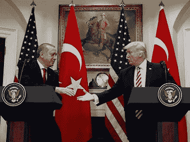

# 贸易战、土耳其不稳定和外汇传染:加密货币对新兴市场的重要性

> 原文：<https://medium.com/hackernoon/trade-wars-turkey-destabilization-and-forex-contagion-the-importance-of-cryptocurrencies-to-93f2f6818c95>

影响 [*经济*](https://hackernoon.com/tagged/economic) *体系的波浪式运动，周期性的繁荣之后是周期性的萧条，这是一次又一次试图通过信贷扩张来降低总市场利率的不可避免的结果。*

路德维希·冯·米塞斯

全球贸易战主要在美国和中国之间升级，但也蔓延到了其他经济体。美国对土耳其征收的关税是里拉最近波动的催化剂，2018 年里拉兑美元汇率已下跌 40%。尽管里拉的下跌是最近的事情，但自 2013 年抗议者声称埃尔多安政权在 1000 亿美元的丑闻中制定威权政策以来，土耳其经历了更广泛的经济困境。2013 年，土耳其的国内生产总值为 9500 亿美元，此后降至 8500 亿美元，按购买力平价计算，土耳其仍是世界上第 13 大经济体，也是欧洲、西亚和非洲之间的经济门户。土耳其的货币波动、通胀和地缘政治风险的脆弱性可能比 1997 年的泰铢危机规模更大，那次危机在当时高度互联的世界中产生了复杂的连锁反应。

**1997 年泰铢危机**

从 1985 年到 1996 年，泰国经历了平均每年 9%的经济增长率，部分是由大量的外国贷款推动的。尽管增长率很高，但由于泰铢兑美元汇率为 25 泰铢，通货膨胀率仍然很低。这种强劲增长的一个结果，也是危机的关键，是 20 世纪 90 年代以美元计价债务形式持续的大量外国投资，包括对泰国当地银行和公司的投资。1997 年 5 月 14 日，泰铢经历了投机性货币卖空，削弱了泰国联邦储备银行。由于无法支撑泰铢汇率，泰国政府开始浮动泰铢价格。1997 年 7 月 2 日，泰铢自由浮动后，不仅货币崩溃，不可避免的借贷成本迅速增加严重削弱了所有这些贷款人和借款人。1998 年 1 月，泰铢兑美元汇率跌至 56 点的低点，随之而来的是高通胀。金融、建筑和房地产行业的不稳定导致了泰国经济增长的终结。泰国最大的金融公司倒闭时，股市下跌了 75%。银行拒绝向陷入困境的公司发行债券和贷款，这些公司随后开始倒闭。这个故事的一个关键部分是，泰国经济从未完全复苏。

**亚洲危机蔓延**

20 世纪 90 年代，亚洲普遍遭受了非理性的大量借入美元再投资于当地市场的痛苦，这是该地区 GDP 增长的原因。对新兴市场的大规模贷款导致了不可避免的外债负担。

由于贸易经济相互关联的性质，泰国当时的 GDP 只有 1800 亿美元，在亚洲和俄罗斯引起了连锁反应。外国投资者变得不愿贷款给其他发展中国家，抑制了经济增长。石油等大宗商品面临价格大幅下跌，并向石油出口国蔓延。原油和金属需求下降的直接结果是俄罗斯的联邦储备严重减少，拖欠了工人的内债，停止了外债的支付，还被迫浮动卢布，无法维持 5.3-7.1 卢布兑 1 美元的汇率。一个月之内，卢布兑美元汇率暴跌至 21 卢布，导致经济崩溃，1998 年通货膨胀率超过 80%。阿根廷紧随其后，主权违约直到 2016 年才得到解决。同样，发放这些贷款的美国、日本和欧洲银行感到危机蔓延到了西方。最著名的美国对冲基金，长期资本管理公司，由至少 16 家市场领先的美国投资银行支持，在 4 个月内损失 46 亿美元后崩溃。纽约美联储银行组织了一次 36 亿美元的紧急救助，以及许多其他政府层面的紧急救助，包括国际货币基金组织的干预。

土耳其可能盖过泰国

土耳其经济已经挣扎了五年，始于 2013 年，当时 Erogan 镇压了反对他的非常规统治、宗教迫害、独裁政策和 1000 亿美元欺诈丑闻的抗议活动。自 2013 年以来，土耳其的国内生产总值下降了 1000 亿美元，目前为 8500 亿美元。1997 年泰铢危机开始时，泰国的 GDP 只有 1500 亿美元。单从 GDP 规模来看，土耳其的经济影响有可能扩散到更大的范围。泰铢在 1997 年下跌了 40%，里拉在 2018 年已经下跌了 40%，其中一半的跌幅发生在过去的七天里。随着南非兰特下跌 10%,亚洲外汇市场出现波动，危机已经在土耳其迅速蔓延。美联储加息已经重创了许多新兴市场，因为随着欠发达国家的主权和企业借贷成本上升，它们通常会首先感受到较高的利率。([阅读更多关于利率导致下一次衰退的信息](/arca-funds/the-next-recession-corporate-debt-2979b575c46c))更高的利率和关税相结合，会导致已经陷入困境的经济体突然通胀，并迅速蔓延到全球经济。

**数字货币**

广泛使用的加密货币这个词有点用词不当，这就是为什么我更喜欢“数字资产”。通常所说的加密货币可以代表任何东西，从分散或分布式[网络](https://hackernoon.com/tagged/network)数字货币，mainnet gas(使用区块链或网络的成本)，代表证券或主权法令的资产支持令牌，甚至是平台内奖励或令牌，如 Candy Crush 中的金条。比特币、比特币现金、莱特币或卡达诺等数字货币本应成为交易媒介。它们的价值在于，新兴市场经济体可以购买和持有这些货币，并在本国法定货币波动和贬值时用作交换媒介，例如在恶性通货膨胀的环境中，如 1920 年代的魏玛共和国、1990 年代的津巴布韦，或最近的土耳其、委内瑞拉和伊朗。数字货币的另一个使用案例是在政府严格控制或极权主义的国家，如中国或朝鲜。在中国，人民币汇率被严格盯住，中国公民在携带多少人民币出境或兑换成其他货币方面面临诸多限制。比特币和其他数字货币已被用作中国境外其他资产的价值储存手段或交易能力。

在讨论货币无国界时，所有这些都是重要的历史背景。比如，比特币在因对基础货币缺乏信心而经历恶性通胀的国家中的功效是巨大的，并将在未来几年的国际经济进程中发挥作用。通过其他跨境数字货币选项，存在潜在本币波动的安全网，这可以有效缓解土耳其里拉波动或泰铢危机等事件。尽管导致这些金融危机的许多潜在问题无法通过引入无国界数字货币来解决，但如果这种数字货币存在的话，随之而来的经济后果可能会得到抑制。

**希腊债务危机**

与因本国货币而面临危机的国家类似，一个国家也可能因依赖更强势的共享货币而面临经济萧条。在我职业生涯的早期，我是一名主权债务和新兴市场信用分析师。关于在小国投资，我学到的第一件事就是经济多元化程度较低的风险。他们可能只专注于几个经济部门，如石油、渔业、农业或旅游业，这可能导致经济周期缩短，衰退和通货膨胀的发生率和可能性增加。我见过的最毛的主权债权人之一是 2009 年的希腊。希腊是欧盟成员国，对于一个不符合欧盟放弃的许多准入标准的国家来说，这可以说是欧盟的政治举措，希腊放弃了德拉克马，以换取欧元，并承诺成为更强大的经济联盟和共同货币的一部分。欧盟中工业化程度更高的大型经济体，如德国、法国、意大利和比利时，由于全年稳定的出口商品生产，其 GDP 增长更具可预测性。然而，希腊与旅游业高度相关，旅游业在夏季达到顶峰，但在一年中的其他时间会慢慢升温。在加入欧盟之前，希腊可以通过在旅游季节提高通货膨胀率来控制自己的货币，然后在一年中的其他时间通货紧缩。采用欧元后，他们现在受制于德国的“稳定”。在过去的 8 年里，希腊经济一直处于违约的边缘。从 2009 年到现在，当世界其他地区正在经历一代人以来最大的牛市时，希腊 GDP 损失了 40%以上，从 3500 亿美元下降到 2000 亿美元。比较一下希腊和克罗地亚，另一个经济结构相似的巴尔干国家。克罗地亚加入了欧盟，但是仍然使用自己的货币库纳。克罗地亚的国内生产总值在同一时期仅从 630 亿美元下降到 550 亿美元，这是因为它能够浮动库纳。欧洲央行可能会提高利率来对抗欧洲潜在的通货膨胀，这将给希腊带来进一步的负面影响。

**全球货币行得通吗？**

比特币或其他数字货币的许多支持者表示，需要一种全球通用、不受政府控制的单一数字货币来解决中央货币问题，他们经常表示，问题源于自由浮动货币。毫无疑问，一个试图摆脱外汇挂钩投资和政府内部组织强加的紧缩和其他控制的集体问题的国家，虽然在全球层面上令人钦佩，但在一个国家的基础上可能是毁灭性的，可能会合法地转向加密货币。然而，这个论点有几个缺陷。第一个例子是上面提到的希腊。对于无法控制自身财政政策的较小经济体来说，多个经济体使用单一货币可能是危险的。正如泰铢所证明的，自由浮动的货币也不是问题；更确切地说，一种盯住汇率时间太长、开始立即自由浮动的货币会变得不稳定。最后，许多人对现有数字货币的一个问题是将控制权从政府手中转移到一小批早期采用者手中，他们持有比特币的大部分或 Zcash 或 Cordano 等替代货币。这就像从沙皇手中夺走权力，把它交给布尔什维克，我们新的“仁慈的”独裁者从波多黎各、马尔他和中国(特别是比特大陆)统治着全球经济。当然，每个已经创造了加密货币的人及其早期采用者都希望世界采用他们的区块链，从而为他们自己和他们的选民创造财富。比起布尔什维克的统治，我更喜欢民主和自由；因此，我支持继续努力创造具有多种用途、功能和分散(或分布式)控制的多种数字货币。

*我要特别感谢* [*艾玛·钱宁*](https://twitter.com/emschanning)*[*萨蒂丝集团*](http://satisgroup.io/) *对这部作品的贡献。Satis 研究团队致力于研究无边界数字货币如何运行。**

**披露:**

**本评论仅作为一般信息提供，绝不作为投资建议、投资研究、研究报告或建议。对本评论中讨论的证券进行投资或采取任何其他行动的任何决定可能涉及本文未讨论的风险，此类决定不应仅基于本文包含的信息。**

*本沟通中的陈述可能包括前瞻性信息和/或可能基于各种假设。此处表达的前瞻性陈述和其他观点或意见是在本出版物发布之日做出的。实际的未来结果或事件可能与预期的有很大不同，并且不能保证任何特定的结果会发生。本文中的陈述可能会随时更改。Theseus Capital 不承担更新或修改此处表述的任何声明或观点的任何义务。*

**在考虑本注释中包含的任何绩效信息时，应注意过去的绩效并不能保证将来的结果，也不能保证将来的结果会实现。此处提供的部分或全部信息可能是或基于观点陈述。此外，此处提供的某些信息可能基于第三方来源，这些信息虽然被认为是准确的，但尚未经过独立验证。Theseus Capital 和/或其某些关联公司和/或客户持有，并且将来可能持有与本评论中讨论的证券相同或基本相似的证券的财务权益。对于此类金融权益的盈利能力，无论是现在、过去还是将来，都不做任何声明，Theseus Capital 和/或其客户可以随时出售此类金融权益。此处提供的信息无意也不应被解释为出售或购买任何证券的要约。本注释未经任何监管机构审核或批准，且在编制时未考虑可能收到本注释的个人的财务状况或目标。特定投资或策略的适当性将取决于投资者的个人情况和目标。**