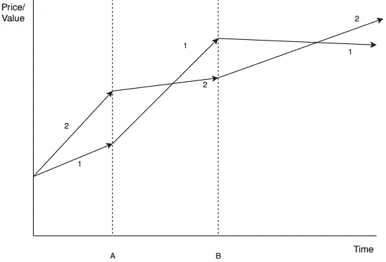

# 优化的加密货币交易算法

> 原文：<https://medium.com/hackernoon/trading-algorithms-to-maximize-profits-for-an-investor-planning-to-invest-in-an-ico-1e8ec74cd18d>

我为一个打算投资 ICO 的投资者设计了两个算法来实现利润最大化。这可以应用于投资者计划通过为用户提供仪表板界面的交易所公司进行投资的场景。

# 算法 1:

## **动机:**

这个算法背后的主要动机是我在高中微积分中读到的图形分析概念。我现在用一个简单的图表来解释这个算法。

## 解释:

让我们假设有 2 家公司，分别名为“1”和“2”。这是我想在仪表板上的设置。设横轴代表时间，纵轴代表价值。这张图上有三个时间段。它们是:

1)直到“A”的期间。

2)从“A”到“B”的时期。

3)超出“B”的周期。

现在，假设我们有一个客户“John ”,他在我们公司创建了一个帐户。现在约翰想投资他的钱。比如说，他计划投资 10 美元。我的全部目标是让约翰从他的投资中获得最大的利润。因此，我们将首先建议约翰把他的 10 美元投资于公司“2”。现在，我们将在后端进行预测，并对数值进行比较。总有一天这种趋势会逆转。我把那个点标为“A”。现在，我们将向 John 发送电子邮件或文本提醒，建议他现在投资公司“1”。然后我们将等待趋势再次反转(B 点)。我们现在将发送一个警报，以便 John 现在可以将他的钱投资到公司“2”中。

## 实施:

我们可以在仪表板上进行比较。通过对 ICO 在其 twitter 页面上大肆宣传的情绪分析以及 ICO 给我们的数据，我们可以做到这一点。当我们有趋势变化时，文本提醒和电子邮件服务可以自动化。在我的解释中，我决定进行两个 ico 的比较。但是我们可以让用户/投资者根据他们的兴趣选择 ICO。

## 优势:

如果实施得当，投资者总会有利润。由于人们投资于 ICO，ICO 的市场价值将会增加，它将会受到欢迎。因此，我们正在确保双方的基本需求得到满足。

# **算法二**:

## 动机:

加权背包问题是这个算法背后的主要动机。我将给出一个加权背包问题的小例子。比方说，我们必须用这些物品装满一个最多能装 10 公斤重的背包。每一项都有价值。因此，我们需要以这样一种方式来填充项目，即我们拥有它们的最大组合价值，同时不超过 10kg 的限制。我现在将解释我的算法。

## 解释:

在这个算法中，让我们假设我们有一个投资者。我们会向他建议一种投资方式，让他获得最大的投资回报。

现在让我们定义一个等式，

A*x + B*y + C*z = I

其中[A，B，C]分别是投资者将购买的三个 ico 的代币数量，而[x，y，z]是这些代币的价值。假设“I”是投资者计划投资的总金额。

设 A*X + B*Y + C*Z = O

其中[X，Y，Z]是代币的增值，而“O”是投资回报。

现在，我们将以这样一种方式建议上述组合，即当三种代币的价格升值时，我们获得最大的投资回报。

## 实施:

我们可以首先让投资者选择他计划投资的 ico 数量。一旦我们有了这个数字，我们就可以给他投资的最佳组合。如果投资者对组合有任何疑问，我们可以让他联系我们公司的投资顾问，帮助他做出决定。这种组合可以在我们数据库中 ICO 数据的帮助下进行选择。我们的数据库必须有代币的预测未来价格。这种预测可以通过我在实现我的第一个算法时提到的相同方式来实现，即通过对 ICO 在其 Twitter 页面上的宣传进行情感分析以及 ICO 给我们的数据来实现。

以下引文是我写这篇文章的灵感来源:

> 许多学者忘记了，作为一种职业，我们的目标不是发表论文。这是为了改变世界。”额敏·贡·西勒

感谢您阅读我的文章。

*如有任何问题，欢迎随时给我发* [*邮件*](mailto:pamanalionline@gmail.com) *。也可以通过*[*Linkedin*](https://www.linkedin.com/in/amanali1/)*联系我。也可以关注我的* [*推特*](https://twitter.com/aliandco) *。*

*为了区块链入门阅读我的* [*文章*](https://hackernoon.com/blockchain-learning-path-2019-e54d6763dd6c) *发表在*[*hacker noon*](https://hackernoon.com/)