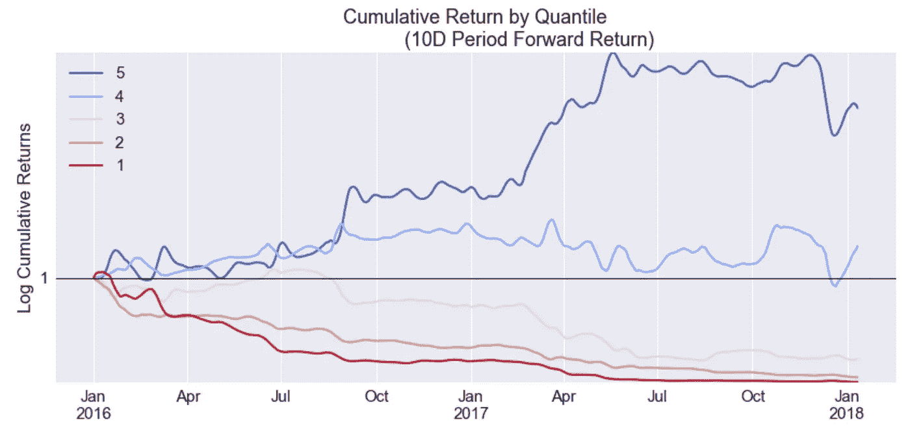
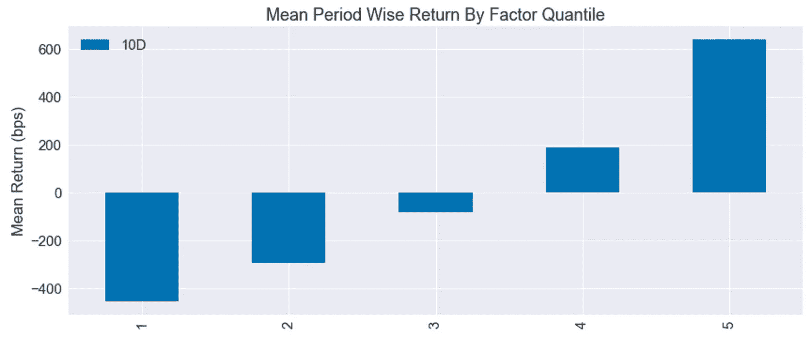
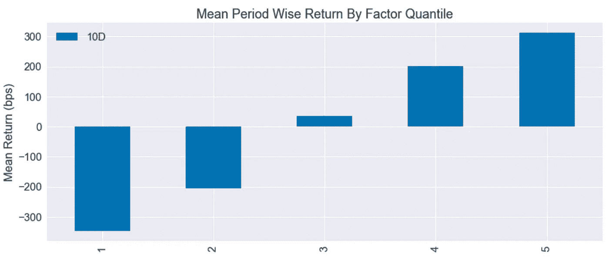
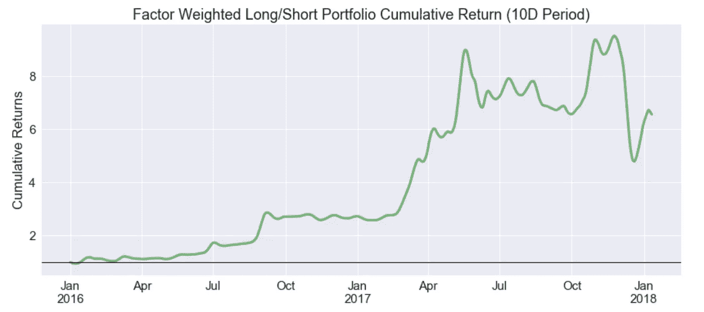

# 相对动量交易密码

> 原文：<https://medium.com/hackernoon/trading-crypto-with-relative-momentum-3f6fd8c26913>

## 相对动量策略的统计分析

*这是关于在* [*加密*](https://hackernoon.com/tagged/crypto) *资产类别中使用量化模型帮助投资决策的系列文章中的第二篇。* [*点击这里*](https://hackernoon.com/why-crypto-investors-should-pay-attention-to-price-momentum-aa94f00bf605) *先看。*

We explain this later, but essentially, in short-term: buy strong cryptos, sell weak ones

动量交易是一种交易策略，你买入价格上涨的资产，卖出价格下跌的资产。这个想法是，价格趋势可能会继续，因此，简单地在上涨趋势中买入资产，在下跌趋势中做空资产的策略是持续盈利的。

这种反常现象背后有三个主要的行为和结构原因:

*   市场参与者对信息的传播和反应都很慢
*   流动性迫使大型投资者随着时间的推移分散交易
*   人类推断最近的表现导致了从众心理

我的[上一篇文章](https://hackernoon.com/why-crypto-investors-should-pay-attention-to-price-momentum-aa94f00bf605)展示了一个相对简单的动量版本如何在过去 5 年中对一篮子 10 种加密资产的短期回报进行预测。具体来说，我们研究了时间序列动量(TMOM)，它只是孤立地研究资产的价格。本质上，如果资产的价格增加了，资产的 TMOM 为正，反之，如果价格降低了，资产的 TMOM 为负。

**相对动量**

本文将更进一步，看看相对动量模型。相对动量模型将一项资产的表现与其同类资产进行比较，以确定动量，而不是简单地孤立地看待该项资产。这稍微复杂一点，因此更有希望预测。

我们将与前一篇文章保持一致，并使用相同的十种加密资产:[比特币](https://hackernoon.com/tagged/bitcoin)，莱特币，以太币，Ripple，Dash，NEM，Dogecoin，Monero，Vertcoin 和 Bitshares。我们还将使用相同的窗口来计算动量(过去 10 天的表现)，并在每日滚动的基础上进行计算。

相对动量不同于时间序列动量，因为它需要将宇宙中的资产排列到不同的篮子中。然后，我们比较一段时间内每个篮子的平均未来 10 天回报率。其逻辑是，顶部篮子(即动量最高的资产)将持续胜过底部篮子(动量最差的资产)。

我们将宇宙分成五个篮子(也称为分位数)。顶部篮子(分位数#5)代表前 2 种资产的平均未来 10 天回报率，而底部篮子(分位数#1)代表最弱的两种资产。2017 年运行该测试的结果如下:

正如我们所见，结果与假设非常一致。动量最高的分位数比平均值多跑赢 639 个基点(即 6.39%)，而动量最低的分位数跑输了 4.53%。

这意味着购买前 10 天价格表现最高的两种资产，并做空底部的两种资产，将在 2017 年为我们的宇宙获得 10.39%的平均 10 天回报率(假设没有成本！).这是一个在传统股票市场上永远看不到的巨大回报差。

在 2016 年对我们的宇宙重复这一测试会带来类似的结果:

同样，顶部动量分位数的表现超过 3.12%，而最弱动量分位数的表现低于 3.47%，导致 10 天的多空价差为 6.59%。有趣的是，在这两年中，随着动量的增加，平均回报在分位数之间单调增加。这是一个重要预测因素的迹象。

将所有这些放在一个实际的多空策略中，投资组合的股票线会是这样的:

一个因子加权的多空投资组合(即多头强势和空头弱势)会产生 540%的 2 年回报率。虽然以正常标准衡量，2017 年末下跌 50%的波动性相当高，但相对于简单的多头加密，波动性实际上较小。

这是有道理的，因为这种势头蔓延的存在是由于长期的行为/结构原因，而加密资产是基于大量的投机。既想投资于加密资产又想投资于动量异常的投资者可以忽略等式的短边，做多高动量加密资产。

**结论**

与上一篇关于时间序列动量的文章类似，结果的一致性令人惊讶，相对动量和平均未来回报之间几乎是一对一的关系。

这一信息再一次清晰可见:预计表现优异的加密资产将继续表现优异，表现不佳的资产将继续表现不佳。

我们认为加密市场的效率低得令人难以置信，这意味着像这样的简单策略实际上是市场参与者进行交易的高利润途径。长期投资者可以利用这些类型的模型，以更好的时间进入和退出点，并改善他们的风险管理。

我将在这个量化密码系列中探索更多领域:将时间序列和相对动量结合为一(即[双动量](https://www.amazon.ca/Dual-Momentum-Investing-Innovative-Strategy/dp/0071849440))，更高级的[剩余动量](https://www.google.ca/search?q=residual+momentum&oq=residual+momentum&aqs=chrome.0.0l6.2677j1j7&sourceid=chrome&ie=UTF-8)，链上交易[估值模型](http://valuation models)，使用社区规模测量的替代估值模型，将情绪与动量结合，等等。这些都是我们已经在收集的供自己内部使用的数据集和模型，我们用它们来帮助我们做出个人投资决策。