# 用信任带交易加密货币

> 原文：<https://medium.com/hackernoon/trading-cryptocurrency-with-confidence-bands-cffd523f3e4b>

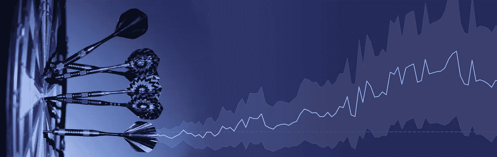

创建置信区间带，为比特币和其他加密货币的技术交易分析增加价值。

在 [Gatsiva](https://gatsiva.com) ，我们构建了一个分析 API，帮助[加密货币](https://hackernoon.com/tagged/cryptocurrency)交易员在交易中变得更加自信，尤其是在使用技术指标来确定买入或卖出信号的时候。以下文章概述了我们常用的置信带图是如何构建的，以及为什么在使用技术指标进行加密货币交易时，它可以成为额外信息的良好来源。

**TLDR；**我们可以使用 [Gatsiva API](https://gatsiva.com) 来创建一个预测，利用置信区间预测事件发生后加密货币价格可能会发生什么。这些置信区间是风险可调的，几乎可以为任何技术交易指标创建。通过利用它们，交易者可以掌握更好的信息，以便做出明智的买入或卖出决定。

*记住:加密货币交易伴随着损失风险。以下文章并非投资建议，也不支持或倡导任何特定的加密货币。*

## 置信区间的案例

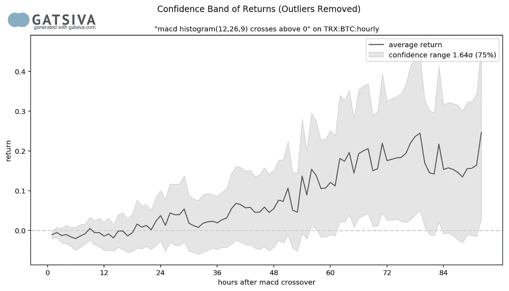

Example of a Gatsiva Confidence Band

今天，Twitter 对话、交易室戏谑和其他社交渠道并不缺乏，成千上万的人就如何最好地交易和选择购买或出售加密货币的时间交换想法。

上升到这些建议顶端的是各种技术分析方法。通过观察价格和交易量的模式，这些技术分析指标显示超卖或超买的指标。我们同意，由于加密货币是一个缺乏基本面的情绪化市场，像这样的情绪化市场往往主要根据价格信号进行交易。

但是，在评估来自这些来源的建议时，有两个关键问题往往没有得到回答:

1.*这在过去真的有效吗？*

2.*该指标或事件与您可能感兴趣的特定加密货币的相关程度如何？*

回答这些问题是盖茨比的切入点。

通过使用和比较我们的置信区间来显示事件后的回报，我们相信交易者可以更好地了解事件的潜在可预测性。

## 看一个例子

我们认为最好用最近发生的一个事件来说明这种方法。如果你想一步一步地了解这出戏，你可以关注我们的 Twitter 账户的历史。

1 月 17 日凌晨(日本时间)，我们看到一条推文，声称 RSI(相对强弱指数)和 MACD 交叉(移动平均收敛/发散)都是 Tronix (TRX)准备涨价的良好指标。

> *[*RSI*](http://stockcharts.com/school/doku.php?id=chart_school:technical_indicators:relative_strength_index_rsi)*和* [*MACD*](http://stockcharts.com/school/doku.php?id=chart_school:technical_indicators:moving_average_convergence_divergence_macd) *都是技术指标，交易者通常使用它们来指示何时可能是买入或卖出的好时机。要了解更多，请查看 Stockcharts.com 的教程。**

*在 Twitter 上相信交易者的话是一回事，但是知道这些指标是否真的有效不是很好吗？*

*通过创建和利用置信带来测试该指标，我们可以更好地了解是否应该关注这样的信号。所以让我们开始吧。*

## ***找出要查看的数据***

*要开始创建一个信任带，首先看一下有问题的加密货币的一般价格是有帮助的。利用 Gatsiva API 获取价格和一点 Python 知识，我们首先来看看 Tronix 在其整个历史上以每小时为基础(TRX:BTC:每小时)定价的整体价格行为。*

*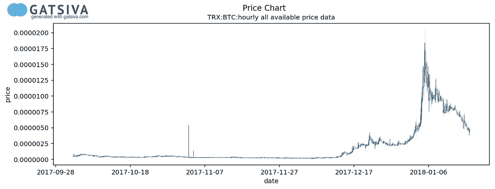*

*Price History of Tronix*

> ***Tronix 为什么用比特币定价？**许多加密货币在交易所以各种配对交易。然而，并不是所有的银行都直接交易美元或欧元。比特币中 Tronix 的价格交易更加活跃，流动性也更强，所以我们选择它进行分析。也是原交易商标注的那对。*

*有趣的是，直到 12 月中旬，Tronix 的价格还相当不明显。谷歌趋势快速搜索显示，在价格飙升之前，公众对 Tronix 的兴趣也相对较低。(仅这种关系可能就值得进一步分析。)*

*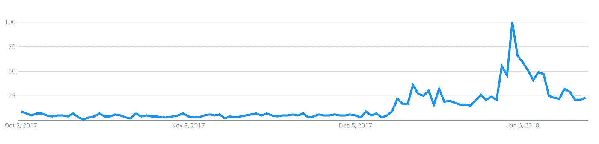*

*Google Trends Data for Tronix*

*我们可以假设 12 月中旬之前的价格变动可能不会对我们预测当前价格有很大帮助。因此，我们决定只对 12 月 14 日以后的价格行为感兴趣。*

> ***为什么忽略 12 月 14 日之前？**最好选择最能反映当前价格行为的一组数据。在这种情况下，12 月 14 日之前的数据看起来和表现起来都不像之后的价格，所以我们做出判断，选择忽略它。*

*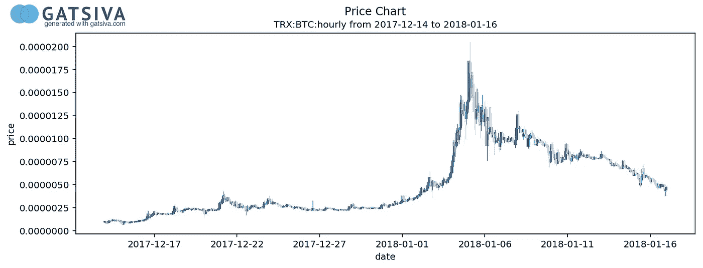*

*Price History of Tronix December 14th, 2017 through January 16th, 2018*

*删除 12 月 14 日之前的价格数据后，我们可以更清楚地看到当前价格。在这里，我们看到在 1 月 4 日左右价格上涨的早期有一些变化，在接下来的 3 天里价格大幅上涨期间有一些波动，然后价格波动向下。从 12 月 14 日到 1 月 16 日每小时的数据给了我们 816 个数据点(34 天 x 24 小时)来查看和分析各种起伏。*

## ***寻找信号***

*Gatsiva API 允许任何用户用一种非常简单的语言定义交易者使用的技术指标，我们称之为 Gatsiva 语言。所以我们要做的第一件事是定义我们的盖茨比语言中的 MACD 交叉条件。幸运的是，这很容易做到:*

***macd 柱状图(12，26，9)在 0 上方交叉***

*既然我们已经用自己的语言定义了信号，我们就进行 API 调用，并请求 Gatsiva API 条件历史事务告诉我们，在我们感兴趣的时间段内，这个事件何时为真。在我们的示例中，我们用 Python 处理这个结果，并创建一个事件发生时间的图示。*

*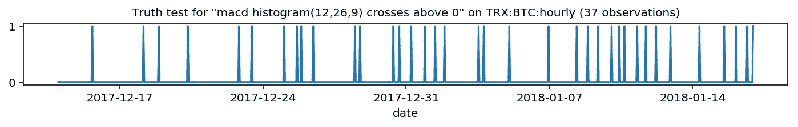*

*Truth Values for MACD Crossover Condition on Tronix*

*从这个信息中我们了解到，在我们感兴趣的 34 天(816 小时)中，这个规则有 36 次是正确的。此外，这个事件简介有一些非常积极的特点。*

*首先，在我们选择的价格历史过程中，这一事件的发生是相当均匀的，表明它通常是有用的。其次，我们很少看到事件的“聚集”，即事件在一段时间内重复发生的区域。这是一个很好的迹象，表明我们在事件后得到的结果很好地代表了总体结果，而不仅仅是由于一个单一的事件。*

## ***分析信号***

*那么我们如何处理这些数据呢？*

*记住我们的第一个问题。我们真正感兴趣的是创建置信带的问题的答案:“*每个事件发生后会发生什么？*“要开始回答这个问题，先看看在我们感兴趣的时间段内，即 12 月 15 日 16:00 UTC，第一次发生该事件后发生了什么会有所帮助。*

*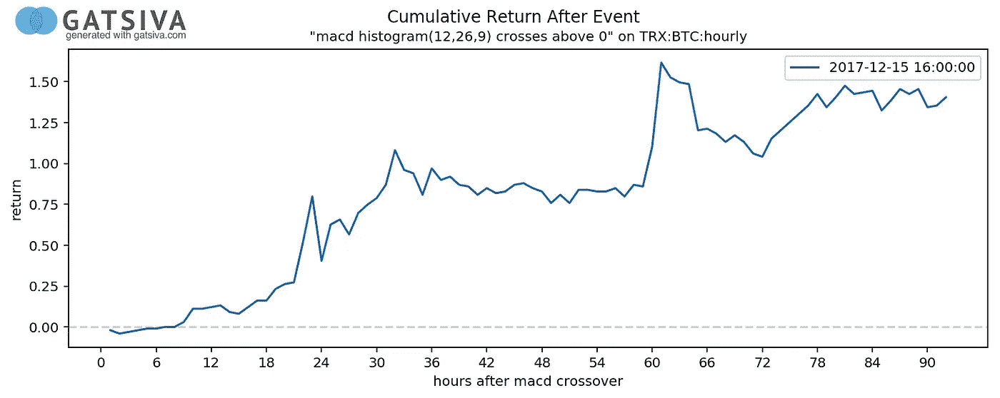*

*Return Result after First MACD Crossover Event*

*上图在 x 轴上显示了事件发生后的小时数，在 y 轴上显示了总体回报。我们可以看到，24 小时后，这笔交易的回报率超过了 25%。如果你坚持了 48 小时，你上涨了大约 75%，72 小时后，它开始了另一次上涨，最终在头 90 个小时里超过了 125%。*

*还不错。让我们更进一步。接下来的两次 MACD 交叉是怎么发生的？*

*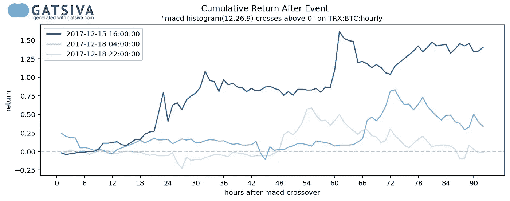*

*Return Result after First 3 MACD Crossover Events*

*这里您可以看到接下来的两个事件，都发生在 12 月 18 日。Tronix 的价格变化在 12 月 18 日 4:00 UTC 的第二场比赛中基本保持正值。世界协调时 12 月 18 日 22:00 发生的第三起事件在大约 18 小时后最初为阴性，但在大约 48 小时后恢复。*

## ***以不同的方式看待数据***

*现在开始解释我们如何建立我们的置信区间，这有助于开始以稍微不同的方式来看待这些数据。首先，让我们将这些数据视为一系列点，而不是每个事件的连接线。*

*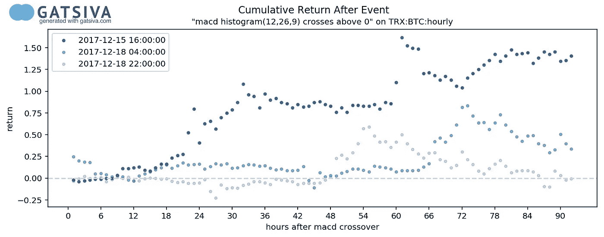*

*Return Result after First 3 MACD Crossover Events (Dot Plot)*

*我们可以看到，我们根本上看的是同样的数据。每小时的每个回报都绘制为一个点，而不是一系列的连线。以这种方式查看数据开始让我们能够比较每个小时内的结果。*

*为了更好地理解我们的意思，让我们来看看以相同方式发生的所有 36 个事件的完整返回集，在每个事件后的每个小时绘制一个点。*

**

*Return Results for All MACD Crossover Events*

*现在我们可以看到发生的所有 36 个事件的所有返回。它变得有点拥挤，但即使现在我们可以开始对这些数据进行一些简单的分析。*

*我们可以做的第一件事也是最简单的事，就是看看每小时的平均回报率是多少。*

*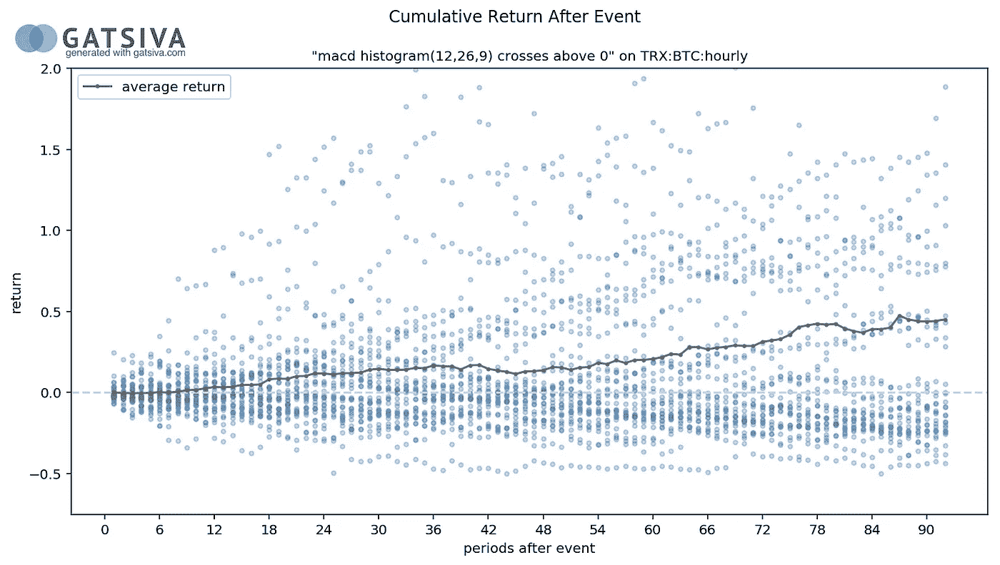*

*Average Return for All MACD Crossover Events By Hour*

*在这里，我们画了一条穿过每个小时的灰线，计算该小时内观察到的平均回报。这是非常简单的，最终表明，平均来说，如果你在 MACD 交叉事件发生时购买了 TRX，一小时又一小时，如果你全部投资 36 次，你会看到回报增加。*

*然而，你也会看到从-50%到超过 200%的相当不稳定的回报范围。即使是现在，我们也越来越接近理解 MACD 交叉是否是我们应该注意的事情。*

## ***深挖***

*现在让我们看看我们是否能从这些数据中提取更多的见解。为了说明我们是如何做到这一点的，我们首先将只放大到前 20 个小时，并特别关注一组回报。*

*在下图中，我们放大并突出显示了 12 小时后的回报，作为该数据的任意部分。现在，让我们使用这些数据来说明创建置信区间的方法。*

*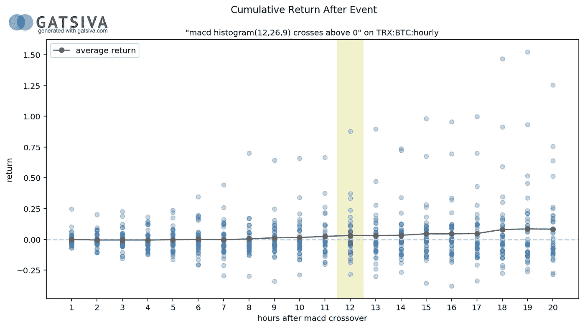*

*Average Return for All MACD Crossover Events By Hour (12th Hour Highlighted)*

*现在把你的头转向左边，让我们水平地而不是垂直地想象第 12 个小时的回报。准备好了吗？开始了。*

*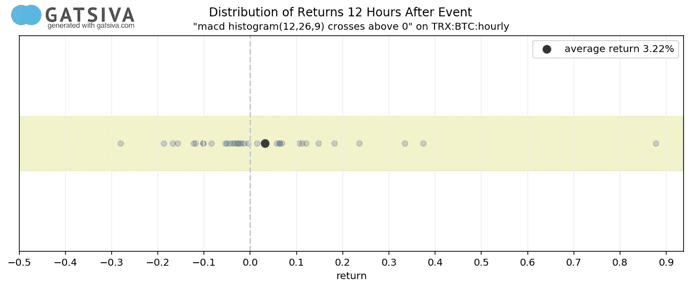*

*MACD Crossover Event Returns — 12th Hour*

*因此，现在我们正在查看 MACD 事件发生后第 12 个小时的完全相同的数据，但为了方便起见，只旋转了 90 度，观察到的回报绘制在水平 X 轴上。*

*我们可以看到，回报率在-30%至近 90%之间，12 小时后的平均回报率约为 3.2%。目前为止没什么新发现。*

*所以我们现在要做的是创造一种方法，通过这种方法，我们可以围绕这些回报建立一些信心带。通过观察这些回报，我们能确定什么，来帮助我们确定或预测未来的回报应该是多少吗？*

***去除异常值***

*现在看看这些回报，我们首先注意到的是右边的异常值。基于离群值进行分析通常不是一个好主意，我们应该在做出任何假设之前“清理”数据。*

> ***为什么要删除离群值？**我们最终要做的是创建置信区间，这是对数据分布的假设。如果我们拥有的数据不是正态分布的，就很难做出我们的区间假设。然而，在 Gatsiva 中，我们计划允许人们在有或没有异常值的情况下进行这种分析。*

*去除异常值的一个简单方法是用一个[盒子和触须](https://en.wikipedia.org/wiki/Box_plot)图表来可视化它们。这个图表将通过绘制结果数据的四分位数来帮助我们了解这些数据发生了什么。超出范围的数据将被视为异常值并被删除。*

*在这种特殊情况下，我们使用标准的 1.5 IQR(四分位间距)来确定异常值。(更多信息见维基百科上的 [IQR](https://en.wikipedia.org/wiki/Interquartile_range) )。*

*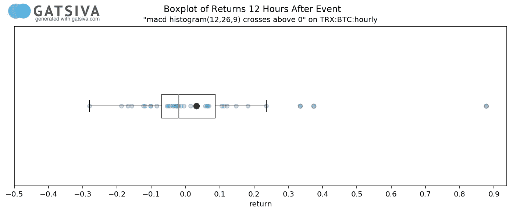*

*Box and Whisker Chart for MACD Crossover Returns — 12th Hour*

*瞧啊。现在我们可以看到，最右边的三个观察值(约 32%、38%和我们的朋友的 88%)被视为异常值——我们可能应该删除它们。这样做了之后，我们现在有了一个清晰的数据集，我们可以尝试从中做出一些假设。*

## ***走向自信***

*所以让我们在这里停下来，看看我们在看什么。*

*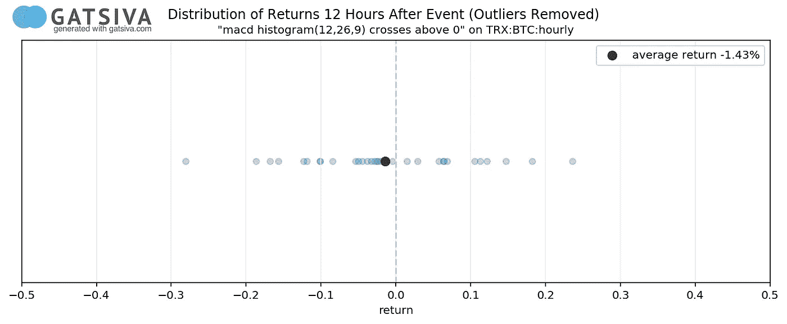*

*MACD Crossover Event Returns — 12th Hour (Outliers Removed)*

*首先要注意的是，我们的平均回报率大幅下降，从 3.22%降至-1.43%。单纯从平均值来看，这三个异常值的影响是显著的。*

*我们也可以计算这些收益的标准差。标准差衡量一个数据集内发生的变化量。虽然上面的图表中没有说明，但当我们说上面观察到的回报率的标准差约为 11.3%时，请相信我们。*

*我们要做的下一件事是检查我们的数据是否正态分布。通过直方图进行快速的视觉检查是一种很好的方法，可以看出我们是否有经典的“钟形曲线”形状。*

*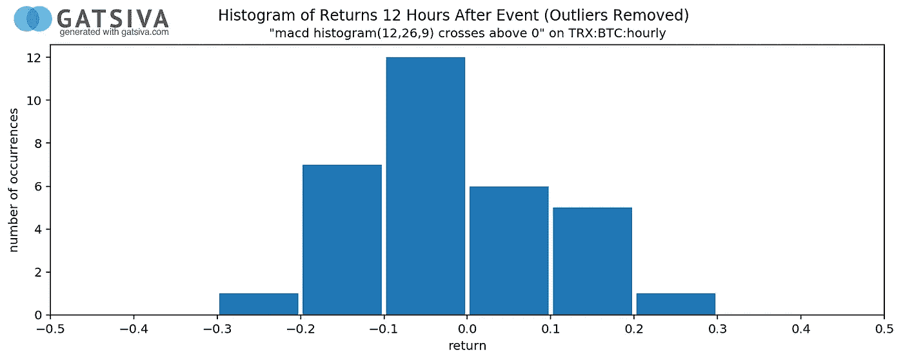*

*Histogram of Returns for MACD Crossover Event — 12th hour*

*看起来不错！我们可以看到，我们看到的是一个相对正态分布，有点偏斜。使用 Python 和 scipy.stats 库 normaltest 函数进行的快速测试给出的 p 值为 0.92，远远高于阈值 0.05。我们可以确信该数据集类似于来自正态分布数据集的数据集。*

*既然我们 12 小时后的数据被确认为正态分布，并且我们知道它们的标准差，那么它们能告诉我们什么呢？*

*首先，正态分布的人口有一些有趣的特性。一个最容易理解的是经验法则。*

*经验法则，也称为三西格马法则，规定对于正态分布，大约 99.7%的数据将落在平均值的大约 3 个标准偏差内，95%的数据将落在前两个标准偏差内，并且只有大约 68%的数据将落在第一个标准偏差内。*

*使用这种方法，让我们把 12 小时的数据分布以同样的方式可视化。*

*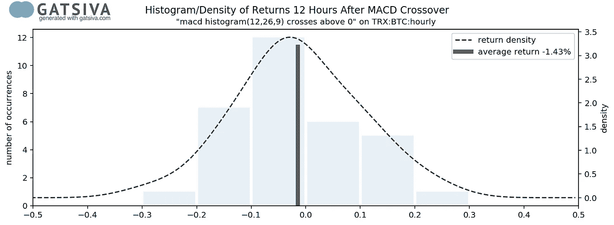*

*Return Density / Histogram for MACD Crossover — 12th hour*

*这里我们的直方图仍然存在，但是移到了背景中，所以不碍事。在此基础上，我们绘制了一条显示收益分布的密度曲线。*

*现在，利用经验法则背后的相同概念，我们可以使用一种称为“百分点函数”或 PPF 的计算技术来计算代表各种置信水平的回报范围。例如，下图中，我们计算了平均值两侧浅灰色边框中表示 75%置信度的返回范围。*

> ***为什么只用 75%？**从历史上看，加密货币的回报波动很大。几乎在任何指标上，95%的信心目标都是一个相当高的目标。在一个人们赌 50%的机会输光所有钱或赚很多钱的世界里，我们认为 75%是一个很好的妥协。也就是说，如果需要，这种分析可以很容易地用更高或更低的置信度界面来生成。*

*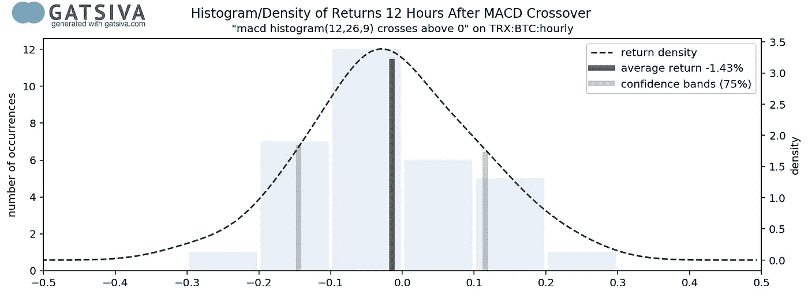*

*75% Confidence Interval on MACD Crossover Event — 12th hour*

*很酷，现在我们有了这些回报的 75%置信区间。我们现在可以看到，如果我们想要有 75%的信心，12 小时后的回报率均值将在-14.5%到 11.5%之间。*

*现在，让我们回到我们的点状图，标记出我们找到的置信度为 75%的点，并用深色阴影表示中间的带。*

*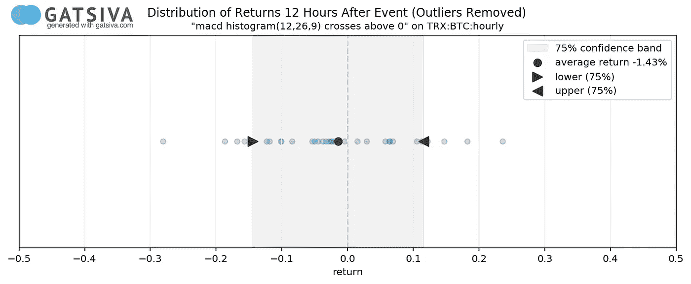*

*75% Confidence Interval on MACD Crossover Event — 12 hour*

*我们现在可以更清楚地看到，根据过去的历史数据，在 MACD 交叉事件后的 12 小时内，我们可以预期对平均回报有 75%的信心。*

*现在，让我们将它翻回到之前的图表，并在我们之前显示的放大回报率的背景下显示该波段。*

*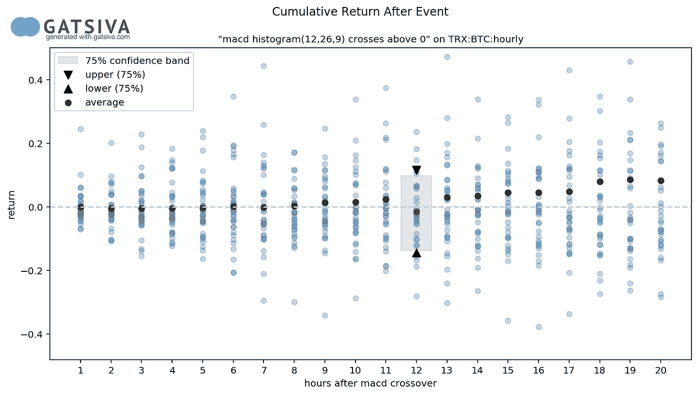*

*MACD Crossover Event 12th Hour Confidence Interval Illustrated*

*所以我们刚刚在第 12 期的小切片上做的所有工作，现在都调整了。离群值消失了，我们重新计算了平均值，并创建了置信区间。*

*现在，如果我们将这一概念应用于所有时期，为我们跟踪的每个小时的回报创建平均值和置信区间，我们可以很容易地创建我们的置信带。我们所要做的就是对 x 轴上的每个周期重复这种计算，去除潜在的点回报，并通过平均值画一条线。*

*在这里，我们会为你做艰苦的工作。*

**

*Finished Confidence Band for MACD Crossover Event on Tronix*

*给你。这是我们的最终产品:利用 12 月 14 日至 1 月 16 日的数据，在 BTC Tronix 以小时为基础定价的 MACD 交叉事件的置信带。*

## ***使用置信带***

*一旦创建了置信带，就可以非常直观地使用它。引起盖茨比追随者共鸣的两种用法是:*

***确定我们是否对事件的积极或消极方向有信心***

*使用上面的例子，我们可以看到，大约 66 小时后，置信带大大高于零。这告诉我们，我们可以有 75%的信心，在 2.5 天左右之后，我们应该期望的平均回报将高于零。此外，波段的宽度可以让您了解您想要分析的事件的可预测性或一致性。在评估潜在机会时，这两种方法都非常有效。*

*此外，跨越零的置信区间可能表明您正在分析的事件几乎没有可预测性。*

***追踪未来事件***

*我们喜欢做的一件事是在之前创建的置信区间内跟踪未来事件的表现。这可以帮助我们了解一笔交易是否可能回到平均水平。*

*例如，在 Tronix 事件发生后不久，我们的推文显示，这四个事件都远远高于平均水平。我们警告说，回到平均水平是可能的，这正是发生了什么。*

*这种分析有助于确定出场点和止损。*

## *了解更多信息*

*您对这篇文章的更多技术细节感兴趣吗？如果是这样，你可以[加入我们的社区](https://discourse.gatsiva.com)来获得 API 的访问密钥，访问代码示例和工具，以及见解。我们正在寻找志同道合的修补者和密码极客给我们反馈，塑造我们的 API，使我们的平台对交易者和爱好者更有价值。*

*如果没有，也没关系。我们的合作者正在帮助我们构建世界级的统计工具，以直接支持加密交易员。如果您仍然希望从我们的见解中受益，包括定期发布的分析，[在 Twitter](https://twitter.com/gatsiva) 上关注我们的定期见解，或者在我们的[网站](https://gatsiva.com)上订阅我们的邮件列表以获取电子邮件更新。*

*最后，如果你喜欢你刚刚读到的:请随意给这篇文章添加书签，鼓掌，或者留下评论！它帮助我们帮助更多的人！*