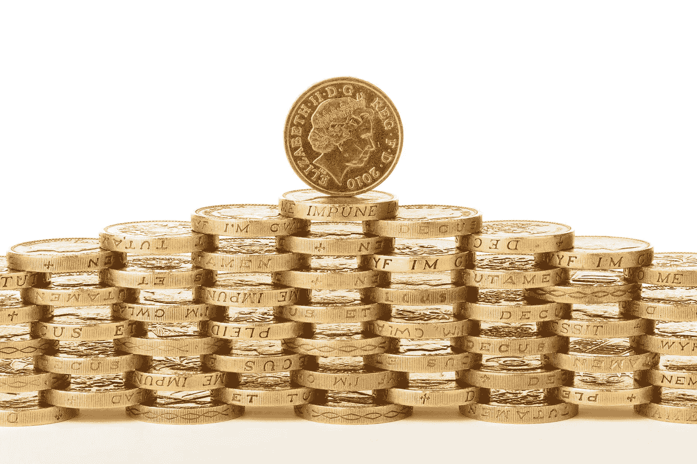

# 交易:赚取收入还是积累财富？

> 原文：<https://medium.com/hackernoon/trading-earning-an-income-or-building-wealth-25578c7f56de>

## 粉碎那些梦想，建立新的梦想

在你的研究中，或者只是随意浏览你的谷歌搜索中关于比特币交易的文章时，你有没有遇到过这样的陈述:

*-如何通过日内交易比特币购买自己的蓝宝*

*——在世界任何地方通过交易谋生*

*-遵循“X”黄金法则，将自己交易到难以置信的财富中*

*- …*

嗯，我有，太多了。

我甚至听到人们说:

> "我今天刚辞职，期待全职交易."

阅读评论，点击诱饵标题和类似的广告让我不寒而栗，因为他们的目标是容易上当受骗的人，只有一个目标，尽可能快地拿走他们的钱。

他们都向人们承诺世界，承诺实现梦想的机会，并告诉你，实现梦想很容易。

> *“任何想卖给你一夜成功或财富的人，对你的成功都不感兴趣；他们对你的钱感兴趣。”—博·贝内特*

我们边缘分析小组对此有另一种看法，我们确实相信交易有可能改善你的生活，但这并不容易，没有金科玉律，也没有安全的方法来实现你的梦想。

通常，在文章的这一点上，我会简单地警告你交易的危险，以及你不应该用你不能失去的钱来交易，但是我会在文章的后面更深入地讨论这个问题。

# 交易:一份理想的工作？

大多数 YouTube 视频或受欢迎的博客会把交易描绘成一种平稳、舒适、快捷的方式，对任何人来说都是如此，即使预算很少，也能赚几百万。

你唯一需要做的事情就是遵循一套规则，阅读类似这样的文章:“我是如何在 30 秒内用一分钱赚到一百万的”。

如果你不相信我，你可以在 YouTube 上输入“如何通过交易致富”，自己去看。

嗯，破门而入，没有简单的致富方法，这些视频是这些人赚钱的方式。那些这样描绘它的人，他们的收入不是来自交易，而是来自卖给你一个梦想。

不管前景有多好，我强烈建议不要相信辞职的梦想，不要整天坐在沙滩上交易。作为一种职业，交易是一种要求非常高的职业，无论是身体上还是精神上，这可能是你做过的最累人的事情，除非你是为了佣金或薪水而交易，否则这不是一种便捷的赚钱方式。

> “如果你不努力工作，你就不可能成为一名优秀的交易者。”——布鲁士·高富拿。

# **赚取收入与积累财富**

对大多数人来说，赚钱和积累财富没有什么区别，甚至更糟，就像我一样，他们认为挣工资是积累财富的唯一途径。

这也是为什么有些人辞去日常工作成为全职交易员，这样他们就可以成为致富故事的主角。

嗯，我要说的是**赚取收入**和**积累财富**是两件**非常不同的**事情。

赚取收入就是让灯亮着。每个人每个月都需要最少的钱来支付所有的账单和所有的生活费用。

因此，你需要一个稳定的每月赚钱的方式，可以是找份工作，个体经营或者创业，但是你需要一个稳定的收入来源。

我已经听到你们中的一些人在想:“交易是一份工作，你想说什么？.."

是的，交易是一份工作，当你为投资银行、对冲基金、独立交易者等交易时。

当你这样交易时，你要么是用你的雇主的薪水交易，要么是用别人的钱交易管理费或利润百分比，但你不是用自己的钱交易收入。

**我们用一个小例子来澄清一下:**

> 假设你有一个诚实的 10，000 美元的初始账户，你过着隐士般的生活，每个月只需要 1，000 美元就能付清所有账单。
> 
> 要想每个月赚到这个数目，你需要持续赚 10%，没有失误，以保持你的交易账户水平。
> 
> 如果你想扩大你的交易账户，这个百分比就会上升。
> 
> 你认为你每月获得那部分利润的机会有多大？

然后考虑到你可能刚开始交易，仍然会犯书中的每个错误。

所以，如果你正在读这篇文章，你正计划换工作，想在一家大公司做交易员，或者你想独立，那么很抱歉打破你的幻想，但如果你还没有工作，你可能永远也不会有机会。

独立交易者的行业是高度管制的，交易者的工作要求是如此之高，如果你还没有开始这个职业，你可能永远不会成功。

所以，如果交易不是一个可行的工作选择，那么它有什么好处呢？

# 嗯，这对积累财富很有好处

如上所述，积累财富与赚取收入完全不同，它是在积累你的资产。

虽然这看起来合乎逻辑，但我们大多数人都会犯以下错误:

## **1。** **不把钱看做资产。**

在深入探讨积累财富之前，我认为最好回到钱的起源，并准确定义什么是钱。

货币，不管是什么形状或形式，都是为了解决需求一致的问题而发明的。

在交换媒介出现之前，人们不得不依靠物物交换系统，用商品或服务交换其他商品或服务。

虽然这可能被一些人视为比当前金融体系更好的体系，但它带来了一个大问题，因为你可能不会得到你需要或想要的那些商品或服务，或者也许你想要那些商品或服务，但你希望在未来得到它们。

让我们用一个例子来解释这一点，假设一个种植小麦的农民有一个好收成，他去市场上卖他的产品。如果没有一个标准的交换媒介，农民将需要用他所有的商品交换其他的商品，然后他需要储存这些商品，在将来用这些商品交换他真正想要的产品。

对于农民来说，不能保证他在未来能够通过用他收到的农作物产品付款来获得他想要的商品和服务。

> 这就是货币被发明的原因；这是一种价值交换手段，每个人都同意这种货币的确切价值。

因此，根据定义，货币只不过是一种将现在生产或交付的劳动力、商品或服务转换为一种商定的价值象征/存储形式的手段，你可以在以后用它来交换其他产品或服务。

这个定义把钱变成了一种资产，一种在不同方之间进行交易的手段。

如上所述，**积累财富**意味着积累你的资产，所以如果金钱是一种资产，拥有更多就是积累财富。但人们容易出错的地方是，他们将这些资产储存在储蓄账户中，让它们堆积起来，以备将来需要。

虽然这看起来是明智之举，但当你的目标是积累财富时，这是你能做的最糟糕的事情之一。

由于不断上升的通货膨胀，我们储存在储蓄账户中的钱年复一年地贬值，所以我们积累这些钱所付出的努力越来越不值。

因此，与其让你的钱坐在那里，不如让那些辛苦赚来的钱发挥作用，有各种方法可以做到这一点 ***** :

-投资于金融市场

-投资房地产

-金融市场交易

-发放贷款并从中获利

- ….

列表并没有结束，也不是每个选项对每个人都是好的，但好消息是，总会有一种方法适合你。

对于我们在 [Edge Analysis Group](https://edgeanalysis.co/) 的人来说，我们觉得交易金融市场是一条路要走，我们开始互相帮助，帮助每个对交易感兴趣的人找到他们的优势。

我想给你一个简短的警告，不要把你所有的积蓄都投入投资。确保你有足够的预留款，如果发生不可预见的事情，你仍然有足够的流动资金。

## **2。** **混淆资产和负债。**

很多人认为拥有一栋他们用抵押贷款买的房子是一种资产，还有他们用贷款买的车和用信用卡买的电视…

如果你每月支付一定的费用来保存这些物品，它们真的是资产吗？

不幸的是，除非你不是人类，否则答案是否定的。只要你不得不不断偿还贷款，它就不是资产。

这是最大也是最常见的错误，它完全扼杀了你积累财富的能力。拥有所有这些东西可能会让你感觉很好，但对于你贷款购买的每一件奢侈品，都是贷方在积累财富，而你在提供财富。

> 如果你买了你不需要的东西，很快你将不得不卖掉你需要的东西—沃伦·巴菲特

所以，如果把你的钱用在工作上看起来是一项艰巨的任务，这个可能会简单一点，不要买你不能预先支付的东西。还清贷款是给贷方一份固定的薪水。

## **3。** **交易的钱你输不起。**

虽然我们在 [Edge Analysis Group](https://edgeanalysis.co/) 相信交易金融市场是一种积累财富的极好方式，我们的目标是帮助每个感兴趣的人找到他们的优势。我们提倡以下警告:**永远不要用你输不起的钱进行交易**。

这听起来像是一个简单的警告，但远非如此。虽然积累财富的巨大机会几乎每天都在出现，但赔钱的机会也是如此。

根据定义，金融市场是一个零和游戏，它是一个和其他市场一样的交易市场，每笔交易总是有两方参与。因此，如果一方在赚钱，那是因为另一方付出了代价。

也就是说，金融市场显然不仅有赔钱的玩家，也有非常成功的人，他们赚了惊人的钱，现在被认为是世界上最富有的人，沃伦·巴菲特和埃德·塞科塔就是最广为人知的例子。

> *“不要冒你输不起的风险，也要冒足够大的风险，这样胜利才有意义”——艾德·塞科塔*

## **财富积累指南**

总的来说，没有你可以遵循的快速致富的固定规则，但是有一些指导方针可以改善你的财务状况，让你踏上积累财富的道路:

1.确保你有稳定的收入来支付每月的所有开销

2.让你的钱发挥作用

3.不要用贷款购买商品或服务

**4。** **不要用你输不起的钱交易**

感谢您阅读本文，如果您想了解我或[边缘分析团队](https://edgeanalysis.co/)，可以通过以下链接联系我们。

[边缘分析网站](https://edgeanalysis.co/)

 [## 优势分析-找到你的优势。

### 技术分析最容易被忽视的特点之一是基本面、心理学和经济学的应用和可靠性

edgeanalysis.co](https://edgeanalysis.co/) 

[边缘分析不和谐](https://discordapp.com/invite/EAaNBGZ)

 [## 为游戏玩家提供无冲突的语音和文本聊天

### 使用现代语音和文字聊天应用程序加快游戏进度。清晰的声音，多服务器和渠道支持，移动…

不和谐. gg](https://discord.gg/EAaNBGZ) 

[我们的推特频道](https://twitter.com/edgeanalysis)

 [## 边缘分析小组(@edgeanalysis) | Twitter

### Edge Analysis Group 的最新推文(@edgeanalysis)。不要为信号提供商付费，成为你自己的…

twitter.com](https://twitter.com/edgeanalysis) 

*本文由 AndyN 撰写；* [*边缘分析组*](https://edgeanalysis.co/) *的内容创建者和得意成员。*