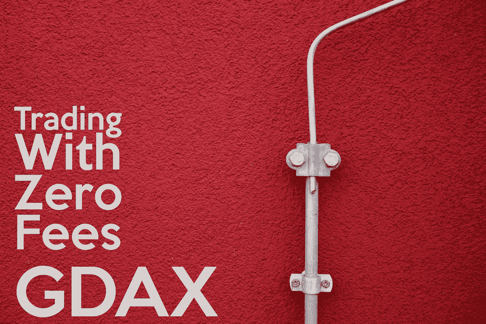
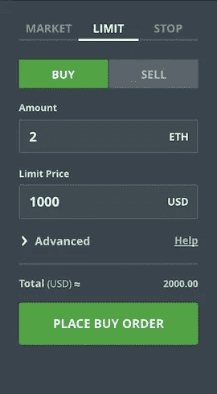
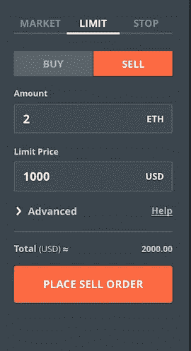

# 如何进行加密货币交易而不收取费用？

> 原文：<https://medium.com/hackernoon/trading-on-coinbase-and-gdax-with-zero-transaction-fees-94e26e5dcdde>

## 理解在比特币基地 Pro 上用美元、欧元和英镑零费用交易 BTC、瑞士联邦理工学院、长期贸易公司的终极指南。

本文是比特币基地专业教程初学者指南的第二部分。如果你没有读过或不熟悉比特币基地专业版——我建议你阅读下面链接的第一部分。

***编辑*** *:比特币基地 Pro 现已推出小费用。然而，与其他具有类似功能的交易所相比，它相对较少。*

 [## 比特币基地交易所比特币基地专业版入门指南，交易 BTC、瑞士联邦理工学院和长期资本公司

### 了解比特币基地自己提供的资产交易平台&节省你的买卖费用…

hackernoon.com](https://hackernoon.com/beginners-guide-to-gdax-an-exchange-of-coinbase-to-trade-btc-eth-and-ltc-e418fd1acd1b) 

在这篇文章中，我们将学习以下内容，这样我们可以避免交易费用和损失。

*   理解交易行话中的制造者和接受者。
*   掌握限价买卖。
*   下限价单做庄家如何规避费用？

Photo by [Dmitri Popov](https://unsplash.com/photos/t7_FXCpUsP0?utm_source=unsplash&utm_medium=referral&utm_content=creditCopyText) on [Unsplash](https://unsplash.com/search/photos/colorful?utm_source=unsplash&utm_medium=referral&utm_content=creditCopyText)

## 理解交易行话中的制造者和接受者。

每当你做交易——无论是买入还是卖出——比特币基地专业交易所或任何其他交易所都会收取交易费。有时，不同的交易所对做市商和接受者的订单会有不同的收费结构

***制定者订单*** 如果你给出一个提议，有人接受了——你就是 ***制定者*** ，接受者就是 ***接受者***

***接单者*** 如果你接受某人的报价，并以他们的价格或市场价买入/卖出，那么你就是接单者*，与你交易的人就是做单者*

> **如果您是制造商，您的订单将被视为制造商订单**
> 
> **当你是接受者时，你的订单被认为是接受者订单**

## **掌握限价买卖。**

**现在我们知道了什么是做市商，什么是接受订单，不同的交易所会有不同的收费结构。**

**比特币基地 Pro 是一个实物交易所，所有制造商订单的费用绝对是 ***零*** *(截至 2018 年 1 月 22 日)。***

**因此，如果我们能够在购买和销售的同时正确下单，就不会产生任何交易费用！万岁！**

**以下是如何设置限价买进和限价卖出，这样你就可以一直出价，而你的订单将被收取 0 交易费。**

****

**ETH Limit Buy at $1000**

*****限价买入*** 是有条件下单。在这里您可以指定数量和价格点，它应该执行。**

**比方说，当前的以太网价格是 1100 美元**

***当 ETH 对美元的价格跌至 1000 美元时购买 2 个 ETH***

**在这种情况下，你提出了一个提议，只有当有人接受时，这个提议才会被执行。**

****

**ETH Limit Sell at $1000**

*****限价出售*** 是一种您指定订单执行数量和价格的订单。**

**订单是你和数量一起提出的条件**

**执行意味着，订单正在履行**

**比方说，现在的价格是 800 美元，当它达到 1000 美元时，你想卖出获利。然后当 2ETH 达到 1000 美元时卖出，ETH 是限价卖出指令。**

> **这就是你如何通过下聪明的限价买入和卖出订单并成为做市商来避免费用的。**

**这不仅适用于 GDAX——也适用于其他交易所，比如[币安](https://www.binance.com/?ref=11705133)、 [KuCoin](https://www.kucoin.com/#/?r=1R8v3) 以及更多支持 Limit 的交易所，Market &停止订单。**

**在我们的下一篇文章中，我们将了解更多关于通过使用大多数交易所提供的重要功能来避免损失的信息。**

*****如果您想了解我的文章和更新，请在*** [***推特***](http://twitter.com/confusedcoin) ***和*** [***中号***](/@vvkr)**T29。****

> **在您学习购买密码货币的同时，您还需要对密码货币交易**负责并纳税**。这里有一篇文章试图**减少混淆，并提供澄清**从加密交易中获得的税收。**

** [## 如何使用 BearTax 对密码货币收益征税

### 迫切需要密码交易员计算他们从比特币基地、比特币基地 Pro、双子座比特币中获得的收益……

hackernoon.com](https://hackernoon.com/how-to-pay-bitcoin-cryptocurrency-tax-reliable-tools-beartax-bfce8bbb81bc)**