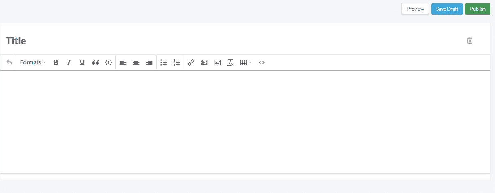

# 传统 CMS vs. Headless:典型的项目之旅

> 原文：<https://medium.com/hackernoon/traditional-cms-vs-headless-typical-project-journey-ac2920cdea1f>

*本文是我们 ButterCMS vs WordPress 系列的一部分*

*   [*第一部:无头 vs 传统*](https://buttercms.com/blog/buttercms-vs-wordpress-headless-cms-vs-traditional-cms)

在本系列的第一篇文章中，我们[解释了 Butter 这样的无头 CMS 和 WordPress 这样的传统 CMS 之间的高级差异](https://buttercms.com/blog/buttercms-vs-wordpress-headless-cms-vs-traditional-cms)。现在我们可以看看一个典型项目旅程的更具体的例子。

假设你已经有了一个使用 React、Node.js、Ruby on Rails 等现代技术构建的网站，你想给它添加一个博客。与使用无头 CMS 相比，使用传统 CMS 时，您会有非常不同的体验。下面，我们来看看是怎么做到的。

# 从发布的第一天开始，你的项目用 WordPress 是什么样的？

让我们来看看如果你使用 WordPress 并且你的站点是基于 Rails 构建的，这个项目会是什么样子。

# 初始设置

首先，你需要决定是否要自己主持。由于这个示例场景涉及到你已经有了一个网站，并且你想要添加一个博客，那么你很可能不得不自己托管 WordPress。最初你的虚拟主机费用可能很低，但是随着你的网站获得更多的流量，费用会增加。此外，自托管意味着你有责任保持 WordPress 的更新，也有责任备份你的数据。

# 定制的

一旦你安装了基本的 WordPress，它会有一个默认的主题，你会想要改变它，使你的博客和你现有网站的外观和感觉相匹配。这意味着要么买一个接近你想要的主题，然后把它拆开，要么从零开始，从头开始构建。这两种途径都涉及到你的开发人员打开 WordPress 的源代码并浏览 WordPress 模板+主题系统。

构建与您现有品牌相匹配的主题的简化流程可能包括以下内容:

*   自定义页眉和页脚以匹配您的网站
*   定制博客主页设计
*   定制博客文章页面设计
*   自定义类别、标签和作者页面设计
*   定制侧轨
*   这可以包括像电子邮件捕获和搜索功能在您的网站上
*   查找、安装和配置插件

# 插件

插件是 WordPress 不可分割的一部分。他们有很多人。例如，这里有一个 WordPress 链接到它的[最流行的插件](https://wordpress.org/plugins/browse/popular/)。如你所见，对于你想添加到你的博客中的任何东西，你都需要找到合适的插件。

让我们举一个简单的例子，假设您希望能够有一个联系表单，一种在您的评论中筛选垃圾邮件的方法，添加 Google analytics(我们稍后将更多地讨论分析)，并在您的博客上有电子商务功能来销售您的产品。

您需要找到、安装、定制和配置您想要添加的任何插件。

对于这些功能，您将添加四个插件:

*   [联系表 7](https://wordpress.org/plugins/contact-form-7/) —这是添加联系表的一个选项。当然，还有许多其他的。您可以通读每个版本的描述、文档和需求，以决定哪一个最适合您。
*   [Akismet 反垃圾邮件](https://wordpress.org/plugins/akismet/)——如果你想给你的 WordPress 博客添加评论功能，但又担心垃圾评论，你可以安装这个插件。
*   [monster insights 为 WordPress 提供的谷歌分析](https://wordpress.org/plugins/google-analytics-for-wordpress/)——由于 WordPress 独立于你现有的网站，你为现有网站设置的任何分析都不一定会转化为你的新博客。这种类型的插件可以在你的博客中添加独立于主页分析的分析
*   如果你想给你的博客添加电子商务功能，你可以使用类似 WooCommerce 的东西。同样，您需要定制和配置它。

开箱即用，这些插件可能不太适合你现有的网站设计。如果是这种情况，您需要进入配置/源代码进行更改，以便一切都无缝融合。

你可能还需要额外的社交分享插件(Twitter、脸书、Instagram 等)。)和 SEO (Yoast)，这也需要一些配置。

# 工程考虑

有了 WordPress 驱动的博客可能需要的定制水平，记住定制不是开发者考虑的唯一变化是很重要的。记住，已经有一个用现代技术建立的网站了。工程团队有一套工具和流程来开发和部署这个主站点。通过加入 WordPress 这样的传统 CMS，工程师们现在还必须考虑:

*   如何部署博客
*   它将如何影响您当前的部署流程？
*   你为博客设置了持续集成吗？
*   您将使用什么测试套件？有吗？
*   你将如何处理博客的备份？
*   你把它放在源代码控制之下吗？插件呢？
*   谁来为 PHP WordPress 代码做未来的修改和代码审查？
*   你将如何处理网址设置？

# 营销考虑

受 WordPress 整合影响的不仅仅是你的工程师。从营销的角度来看，以下是你的团队需要考虑的几个关键因素:

*   如何确保你获得最佳搜索引擎优化
*   WordPress 和 SEO 的关系有点复杂。使用 WordPress 有很多方法可以最大化 SEO，但是你的团队需要寻找最好的插件选项来确保你的博客获得最佳的 SEO
*   确保网站和博客的品牌一致性
*   这又回到了定制，但是如果你想在你的网站和博客之间有一个无缝的品牌体验，你需要做大量的定制
*   如何在博客上重新配置你的分析
*   如果你的主应用或网站有登录和用户账户，你需要决定如何配置所有的分析，因为 WordPress 有自己的认证和用户系统
*   鉴于 WordPress 有不同的认证系统，如何实现端到端的洞察力？
*   如果你的主网站允许用户登录一个账户，那么它就有自己的认证系统。因此，当有人在主网站上登录时，你可以很容易地对他们进行分析。然而，一旦他们转向 Wordpress，情况就不一样了

# 设置后注意事项

一旦你的工程师和营销团队加入进来，并且做了所有的跑腿工作，将一个 WordPress 驱动的博客添加到你的网站上，有一些考虑因素仍然存在:

*   **WordPress 栈所有权:** WordPress 是建立在 PHP 之上的。你的工程团队中有谁懂 PHP？如果没有，谁想学？如果没有人，那么是谁把这个责任推到他们身上呢？
*   **重塑品牌:**假设一年后，你决定重塑你的主网站。你需要与开发者和营销团队合作，确保你的 WordPress 博客定制也更新到这个新的品牌，以保持你的网站和博客的一致性
*   **保持整体一致性:**你对主网站(设计、页眉、页脚)所做的任何微小改变都需要在 WordPress 中单独更改
*   确定谁拥有维护: WordPress 确实需要维护，包括更新和备份。你需要确保这些任务被明确分配给组织中的某个人(或者付钱给第三方来完成)
*   **考虑当流量增加时你将如何扩展:**因为你不仅仅是在你网站的容器内工作，你的 DevOps 团队的任何扩展考虑也需要考虑你的新 WordPress 服务器堆栈

# 从项目启动的第一天起，ButterCMS 的这个项目是什么样的？

既然我们已经仔细观察了一个 WordPress 驱动的博客，让我们看看假设我们有一个现有的 Ruby on Rails 网站，使用 ButterCMS 的项目会是什么样子。

# 初始设置

首先，你需要建立一个 ButterCMS 账户。免费的可以这样做[。](https://buttercms.com/)

然后运行 [Rails 生成器](https://buttercms.com/docs/api-client/rails#BloggingUsingTheGenerator)来创建 URL、应用程序代码和 Rails 模板。请注意，这些模板存在于您现有网站的代码库中。Butter 是一个无头的 CMS，它不控制你的博客的外观和感觉，你的网站控制它。Butter 只是通过内容 API 提供原始内容。

这是一段 60 秒的视频，展示了整个过程:

Butter 为你的内容编辑器提供了和 WordPress 一样的易用体验。

Butter 还提供了内置的 SEO、调度功能等等。没有插件安装和麻烦。

# 工程考虑

现在让我们来看看我们在 WordPress 上做的同样的工程考虑，看看它们在使用 Butter 时是什么样子。

## 你如何部署这个站点？

您部署它的方式与您在当前流程中部署的方式相同。ButterCMS 融入您现有的技术堆栈。您的部署流程保持不变。

## 使用 ButterCMS 对您当前的部署流程有何影响？

并没有。

## 我们需要将它置于源代码控制之下吗？

假设您现有的应用程序使用源代码控制(您确实使用了源代码控制，对吗？；) )，源代码控制自动发生，因为与 Butter 的 API 集成的代码存在于您现有的应用程序中。

## 我们如何确保 URL 设置有意义？

和其余部分一样，这部分很简单，因为它是你的应用程序的一部分，所以你的应用程序控制 URL 的。Butter 旨在让你在 www.yoursite.com/blog[的博客变得非常简单。](http://www.yoursite.com/blog)

# 营销考虑

你的营销团队也会有问题，但是 Butter 让向 CMS 的过渡变得平稳。

## 我们如何优化 SEO？

Butter 允许您直接管理现有模板中的元数据和 SEO，因此您可以轻松地添加标签、描述、元数据和其他信息。Butter 的透明性让你很容易看清自己在做什么。

## 我们需要重新配置我们在博客上的分析吗？

不会。主网站布局中的现有标签会自动转移到您的博客中。此外，如果你的主要网站或应用程序有登录功能和用户帐户，你不需要担心跨一切整合分析。由于博客和网站都是同一个应用程序的一部分，查看你博客的人将通过你现有的用户帐户数据库进行验证。

# 安装后注意事项

*   **品牌重塑:**不是问题。对您的主网站布局/品牌所做的更改会自动应用到您的博客，因为博客模板存在于相同的代码库中。
*   **保持一致性:**不用担心。记住，它是一个应用程序，所以你不需要担心两个独立的东西之间的一致性。
*   **确定谁拥有维护需求:** ButterCMS 是 SaaS，意思是我们为您处理 CMS 平台的维护。
*   **考虑随着流量的增加你将如何扩展:**和上一个问题一样，ButterCMS 会为你处理这个问题，我们把大规模扩展作为首要任务。我们的平台已经满足了超过 10 亿次的请求。

# 结论

在这篇文章中，我们通过两种解决方案带你经历了一个项目的初始阶段(在你现有的网站或应用程序中添加博客):传统的 CMS 如 WordPress 和无头 CMS 如 Butter。您可以在三个关键方面看到这两种解决方案之间的显著差异:

## 用户化

传统的 CMS 是一个庞大的软件。WordPress 有超过 150 万行代码。WordPress 是预定义的，具有紧密耦合的模板、逻辑和数据库。你从每样东西开始——通常比你需要的更多——然后你定制和修改它，使它符合你的需要。

ButterCMS 则相反。你从一个干净的石板开始并建立。您可以使用 Butter 的内容建模来创建您所需要的内容，而不是侵入 CMS 的内部和实际源代码。它就是为此目的而构建的，对您想要管理的内容种类没有任何假设或限制。

## 主办；主持

传统的 CMS 需要你自己下载、托管和维护。作为替代，你可以付费给一个专业的 WordPress 服务来帮你做这件事。

ButterCMS 是作为 API 驱动的服务交付的，不需要您托管或维护任何东西。Butter 托管数据、CMS 仪表板和 API 平台。您只需查询我们的 API，将您的内容放入您的应用程序中。

## 一致性

传统的 CMS 与你现有的网站或应用程序是分开的。你所做的任何改变(品牌等。)需要做两次:在你现有的网站上和在 WordPress 内。此外，你在主网站上的任何登录/用户信息都将与 WordPress 不同，WordPress 有自己的用户和认证系统。

ButterCMS 滑动到您现有的网站或应用程序。对主网站的更改将反映在您的 CMS 中。你也不需要担心你的博客的登录问题:浏览你博客的人将通过你现有的用户账户数据库的认证。

除非你的开发人员有时间并且知道如何流畅地使用传统的 CMS，比如 WordPress，否则使用传统的 CMS 会不可避免地耗费时间，这就要求你真正地定制你的博客。像 Butter 这样的无头 CMS 意味着更短的项目时间表和更轻的开发者和营销团队的负担。

*最初发表于*[*【buttercms.com】*](https://buttercms.com/blog/buttercms-vs-wordpress-a-typical-project-journey)*。*