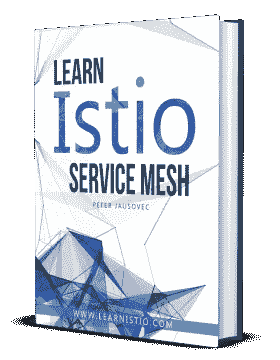

# Istio 服务网格的流量镜像

> 原文：<https://medium.com/hackernoon/traffic-mirroring-with-istio-service-mesh-8731655faf16>


Photo by [Sara Riaño](https://unsplash.com/@sararp?utm_source=medium&utm_medium=referral) on [Unsplash](https://unsplash.com?utm_source=medium&utm_medium=referral)

[](https://gum.co/learnistio)

> *这是节选自使用 Istio* *模块的* ***交通管理—您可以通过注册下载* ***20+页 PDF*** *和支持的 YAML 文件👉*[*www.LearnIstio.com*](http://www.LearnIstio.com)*👈***

除了不同服务版本之间更“传统”的流量路由之外，这可以基于各种传入请求属性，例如 URL 的部分、报头值、请求方法等。，Istio 还支持**流量镜像**。

当您不想**发布**新版本并向用户公开时，可以使用流量镜像，但您仍然希望**部署**新版本并观察其工作原理，收集遥测数据，并将现有服务的性能和功能与新服务进行比较。

你可能会问——部署和发布之间有什么区别？当我们谈论**将**服务部署到生产环境中时，我们只是将可执行代码(二进制代码、容器、代码能够执行所需的任何形式)转移到生产环境中，但是**没有**向它发送任何生产流量。服务是有的，但不是(希望如此！)影响任何在它旁边运行的现有服务。

**发布**一项服务包括获取该已部署的服务，并开始将生产流量路由到该服务。此时，我们转移到生产环境中的代码正在执行，它可能会影响其他服务和最终用户。

在两个版本之间路由流量，进行蓝绿色发布是有帮助的，也是有用的，但是也有风险——如果服务中断或出现故障怎么办？即使服务只接收到 1%的生产流量，它仍然会对大量用户产生负面影响。

流量镜像背后的想法是将用户暴露于潜在错误服务的风险降至最低。我们不是部署、释放流量并将其路由到新服务，而是部署新服务，然后**镜像**发送到服务发布版本的生产流量。

然后，可以**观察接收镜像流量的服务**是否有错误，而不会影响任何生产流量。除了在服务的已部署版本上运行各种测试之外，您现在还可以使用实际的生产流量并增加测试覆盖率，这可以让您更有信心并最大限度地降低发布有问题的服务的风险。

以下是如何使用 Istio 打开流量镜像的一个快速片段:

Mirror traffic to the v1 subset of greeter-service to the v2 subset as well

上面的虚拟服务将 100%的流量路由到 v1 版本，同时也将相同的流量镜像到 v2 版本。要了解这一点，最快的方法是观察 v2 服务的日志，同时向 v1 版本的服务发送一些请求。

您将在网页上看到的响应将来自服务的 v1 版本，但是，您也将看到请求被发送到 v2 版本:

```
$ kubectl logs greeter-service-v2–78fc64b995-krzf7 -c svc -f
> greeter-service@2.0.0 start /app
> node server.jsListening on port 3000
GET /hello 200 9.303 ms — 59
GET /hello 200 0.811 ms — 59
GET /hello 200 0.254 ms — 59
GET /hello 200 3.563 ms — 59
```

[](https://gum.co/learnistio)

> *这是节选自* [***交通管理与 Istio***](https://learnistio.com) *模块—您可以在以下网站注册下载* ***20+页 PDF*** *和支持的 YAML 文件👉*[*www.LearnIstio.com*](http://www.LearnIstio.com)*👈*