# 交通标志分类

> 原文：<https://medium.com/hackernoon/traffic-sign-classification-6e7113d9c4d5>

刚刚结束在 NYU 的一个学期，我想我应该分享我的一个更有趣的家庭作业的结果。顾名思义，这将是在[http://benchmark.ini.rub.de/](http://benchmark.ini.rub.de/)发现的又一个关于交通标志分类比赛的帖子。

关于背景，我目前正在 NYU 大学攻读硕士学位。像那里的许多其他学生一样，我抓住机会参加了由著名教授 Rob Fergus 讲授的计算机视觉课程。

酷，但是是什么让这个作业比其他教授的作业更有趣呢？这项家庭作业是以卡格尔竞赛的形式进行的。你在私人排行榜上的排名越高，你的等级就越高。

对于那些不知道 Kaggle 上的私人排行榜是什么的人来说，Kaggle 比赛中有两个不同的排行榜。公共排行榜和私人排行榜。比赛开始时，所有提交的作品都会显示在公共排行榜上。这个排名是基于你在 50%的测试数据中的得分。比赛结束后，将根据另外 50%的测试数据计算出您的分数，并在私人排行榜上对您进行排名。很明显，你没有被告知哪个排行榜用的是什么数据。这是为了防止您过度拟合测试数据。

获得及格分数的要求是测试数据的准确率至少达到 90%。为了实现这个里程碑，我从一个简单的卷积神经网络和一个天真选择的验证集开始。每个交通标志都有不同的图像，拍摄位置不同，光线也不同。我为每个交通标志取了前三种类型的图像，并将它们移动到不同的目录中作为验证集。

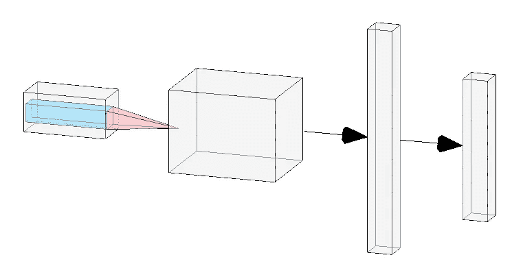

Representation of CNN architecture used. 2 conv layers followed by 2 linear layers. Not sure how people draw their beautiful network architecture diagrams… I used [http://alexlenail.me/NN-SVG/LeNet.html](http://alexlenail.me/NN-SVG/LeNet.html).

```
nclasses = 43class BaseNet(nn.Module):
    def __init__(self):
        super(BaseNet, self).__init__()
        self.conv1 = nn.Conv2d(3, 10, kernel_size=5)
        self.conv2 = nn.Conv2d(10, 20, kernel_size=5)
        self.conv2_drop = nn.Dropout2d() self.fc1 = nn.Linear(500, 50)
        self.fc2 = nn.Linear(50, nclasses) def forward(self, x):
        x = F.relu(F.max_pool2d(self.conv1(x), 2))
        x = F.relu(F.max_pool2d(self.conv2_drop(self.conv2(x)), 2)) x = x.view(-1, 500)
        x = F.relu(self.fc1(x))
        x = F.dropout(x, training=self.training) x = self.fc2(x)
        return F.log_softmax(x)
```

第一个网络由两个卷积层和两个线性层组成。我使用了一个步长调度器，在每 5 个周期后将学习速率衰减 0.1。这个简单的模型令人惊讶地能够在 25 个时期后达到 89%的准确度。

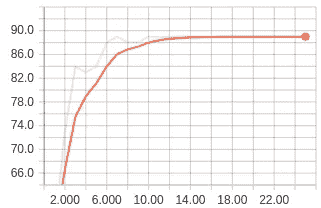

Validation accuracy values after running for 25 epochs.

不幸的是，为更多的时期训练该模型看起来不会有任何好处，因为我们可以从验证损失值的图表中看到，损失值已经稳定下来。

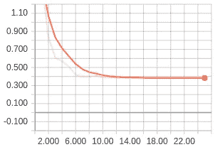

Validation losses for a 25 epoch run on the simple CNN model.

由于这只是害羞的 90%的准确性目标，我想为什么不增加几个卷积层和另一个线性层。见鬼，让我们扔在一些批处理规范化和辍学层，以防止任何过度拟合问题在这个游戏早期。

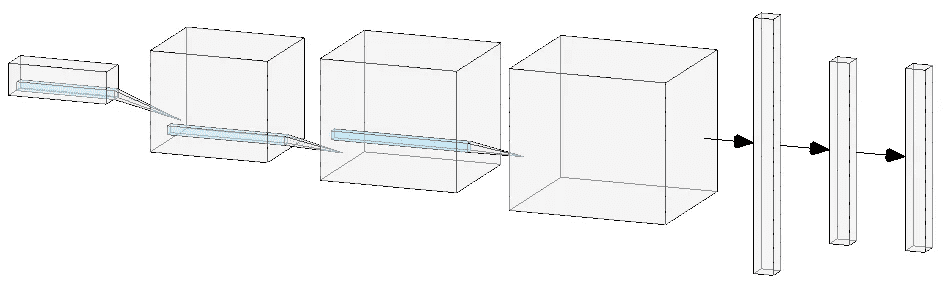

New CNN model with batch normalization and dropouts added between conv layers.

我添加了 2 个 conv 层和 1 个线性层。我还在第二层和第四层 conv 图层后添加了批量归一化和剔除。在第一个和第二个线性图层之后也插入了批量标准化。

```
nclasses = 43class DeepNet(nn.Module):    
    def __init__(self):        
        super(DeepNet, self).__init__()        
        self.conv1 = nn.Conv2d(3, 32, kernel_size=3)           
        self.conv2 = nn.Conv2d(32, 64, kernel_size=3)        
        self.conv_bn1 = nn.BatchNorm2d(64)        
        self.conv2_drop = nn.Dropout2d()

        self.conv3 = nn.Conv2d(64, 128, kernel_size=3)        
        self.conv4 = nn.Conv2d(128, 256, kernel_size=3)        
        self.conv_bn2 = nn.BatchNorm2d(256)        
        self.conv4_drop = nn.Dropout2d()

        self.fc1 = nn.Linear(6400, 512)        
        self.fc1_bn = nn.BatchNorm1d(512)

        self.fc2 = nn.Linear(512, 512)        
        self.fc2_bn = nn.BatchNorm1d(512)

        self.fc3 = nn.Linear(512, nclasses)         def forward(self, x):        
        x = self.conv1(x)        
        x = F.relu(F.max_pool2d(
                  self.conv2_drop(self.conv_bn1(self.conv2(x))), 2))

        x = self.conv3(x)        
        x = F.relu(F.max_pool2d(self.conv4_drop(            
                                self.conv_bn2(self.conv4(x))), 2))

        x = x.view(-1, self.num_flat_features(x))

        x = F.relu(self.fc1_bn(self.fc1(x)))        
        x = F.dropout(x, training=self.training)

        x = F.relu(self.fc2_bn(self.fc2(x)))        
        x = F.dropout(x, training=self.training)

        x = self.fc3(x)        
        return F.log_softmax(x)         def num_flat_features(self, x):        
        size = x.size()[1:]        
        num_features = 1        
        for s in size:            
            num_features *= s        
        return num_features
```

运行这个模型 25 个时期，然后让我达到 96%的验证准确率！这只是一个由一堆卷积层和线性层拼凑而成的模型。它应该让你想知道在网络上可以实现的性能，这些网络已经被证明在像 ImageNet 这样复杂得多的数据集上表现良好。

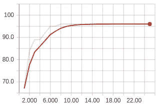

Validation accuracy after 25 epochs with deeper CNN.

现在是拿出大枪的时候了。由于我能够用这样一个简单的网络达到 96%的准确率，我认为没有必要使用像 ResNet152 这样的东西。事实上，我很确定这样规模的网络会有严重的过度拟合问题。我选择了较小的 ResNet18。

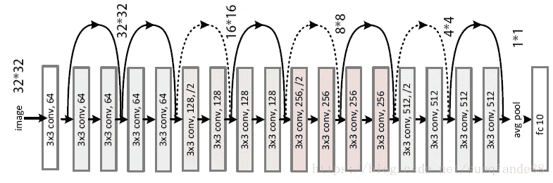

ResNet18, image found on Google images.

```
nclasses = 43class ResNet(nn.Module):    
    def __init__(self):        
        super(ResNet, self).__init__()        
        self.resnet = resnet18()        
        self.resnet.fc = nn.Linear(512, nclasses)         def forward(self, x):        
        x = self.resnet(x)        
        return F.log_softmax(x)
```

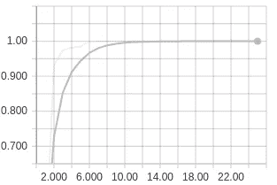

Training accuracy using ResNet18.

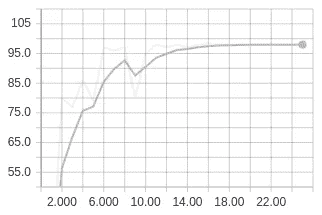

Validation accuracy using ResNet18.

这使我在运行 25 个时期后，对 3870 个交通标志中的 3798 个交通标志进行了 98%的正确分类。正如我们从图表中看到的，训练精度为 100%,因此即使我们运行它更多的时期，我们也可能不会从该模型中获得更多的精度。

由于训练精度为 100%，因此可以安全地假设模型过度拟合了训练集，因此没有达到更高的验证精度。在这一点上，有必要看一看一些被模型错误分类的图片。

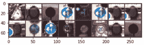

Incorrectly classified images in the validation set.

模型最难处理的图像是光线不好或不一致的图像。我决定使用色彩抖动来随机化训练图像中的亮度。一些分类不正确的图像看起来也偏离了中心，所以我也使用 RandomAffine 将随机旋转、缩放和平移添加到训练图像中。这促使我使用以下转换进行数据扩充:

```
data_transforms = transforms.Compose([    
    transforms.Resize((224, 224)),    
    transforms.ColorJitter(0.8, contrast=0.4),     
    transforms.RandomAffine(15, 
                            scale=(0.8, 1.2), 
                            translate=(0.2, 0.2)),    
    transforms.ToTensor(),    
    transforms.Normalize((0.3337, 0.3064, 0.3171), 
                         (0.2672, 0.2564, 0.2629))
]) validation_data_transforms = transforms.Compose([      
    transforms.Resize((224, 224)),      
    transforms.ToTensor(),    
    transforms.Normalize((0.3337, 0.3064, 0.3171), 
                         (0.2672, 0.2564, 0.2629))
])
```

请注意，我没有对验证图像执行随机转换。我们在训练期间执行变换，以创建训练图像的不同随机变化。这有助于增加我们的训练集大小，从而帮助我们对抗过度拟合。我们不想让我们的模型在验证过程中更难对验证图像进行分类。

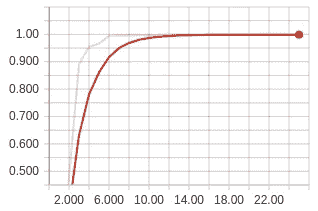

Training accuracy using ResNet18 with data augmentation.

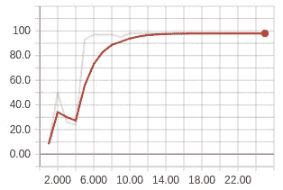

Validation accuracy using ResNet18 with data augmentation.

验证准确率再次达到 98%，尽管这一次它能够获得更多正确分类的图像。该模型能够从 3870 个交通标志中正确分类出 3818 个。为了获得提交的最终模型，我组合了训练集和验证集，以获得更多的训练数据。我加载了能够正确分类 3818 幅图像的模型的模型参数，并训练了 3 个以上的时期。提交这个最终模型给了我 0.99283 分。不算太坏。

包含模型和运行训练的脚本的存储库可以在[https://github . com/AaronCCWong/german-traffic-sign-recognition](https://github.com/AaronCCWong/german-traffic-sign-recognition)找到。