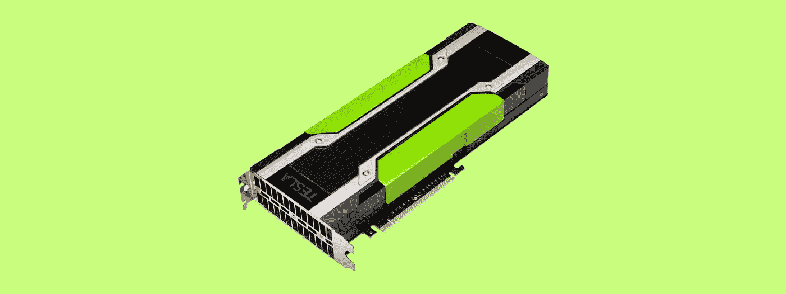
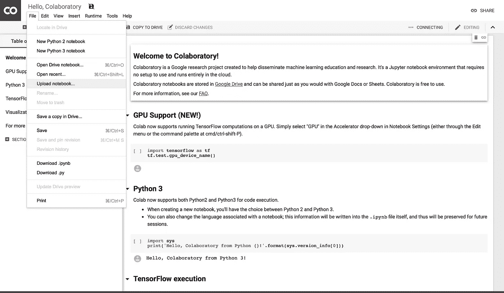
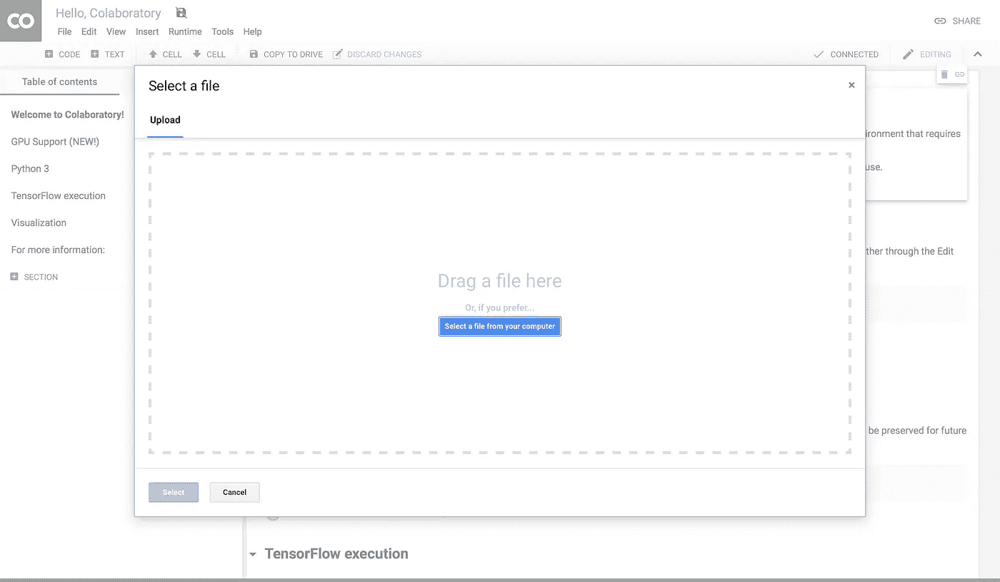
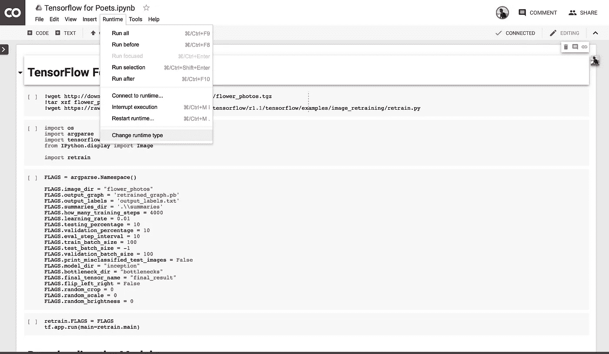
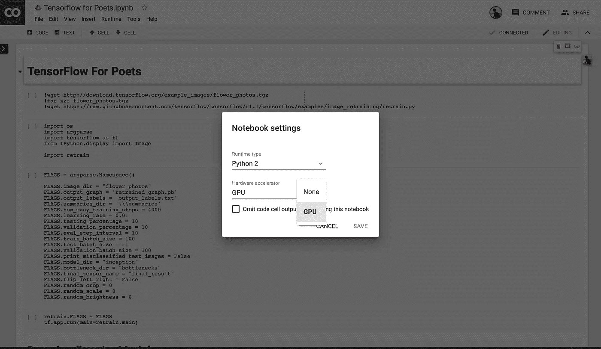

# 在谷歌的 GPU 上免费训练你的机器学习模型——永远免费

> 原文：<https://medium.com/hackernoon/train-your-machine-learning-models-on-googles-gpus-for-free-forever-a41bd309d6ad>



训练你的模型无疑是机器学习中最耗时、最昂贵的部分。在 GPU 上训练您的模型可以让您的速度提高近 40 倍，将 2 天的时间变成几个小时。然而，这通常会让你的钱包付出代价。

前几天，我偶然发现了一个叫做 Google Colab 的伟大工具。我会把 Colab 描述成谷歌文档中的 Jupyter 笔记本。Colab 的目标是成为机器学习项目合作的教育和研究工具。最棒的是，它是完全免费的。

没有使用它的设置。我甚至不需要登录。*(我已经登录了我的谷歌账户)*

最棒的是，你可以无限制地连续访问 k80 GPU 12 小时，这是非常强大的东西。*(12 小时后你会断线，但你可以想用多少次就用多少次)*

我希望我们的重点是在 GPU 和 Colab 上的培训，这样笔记本电脑就非常简单了。

第一步是下载[笔记本](https://gist.github.com/bourdakos1/817611ebfe0d72a027ced9b072ec5c87) *(或者你选择的另一个笔记本)*

然后，前往 [Google Colab](http://g.co/colab) ，登录你的 Google 账户*(或者创建一个，如果你没有的话)*

选择`File` > `Upload notebook...`:



上传您下载的笔记本:



选择`Runtime` > `Change runtime type`:



然后选择`GPU`:



现在，您应该能够像平常一样运行您的笔记本了。唯一的区别是结尾的最后一部分。如果要通过浏览器下载模型或任何其他文件，可以使用他们的 python 库:

```
from google.colab import files
files.download("PATH/TO/FILE")
```

# 最后的想法

这是一个非常短的帖子，但希望它能结束在你可怜的旧笔记本电脑上训练你的模型的痛苦日子💰在 AWS 账单上。

感谢阅读！如果你有任何问题，请随时联系 bourdakos1@gmail.com，通过 [LinkedIn](https://www.linkedin.com/in/nicholasbourdakos) 联系我，或者通过 [Medium](/@bourdakos1) 和 [Twitter](https://twitter.com/bourdakos1) 关注我。

如果你觉得这篇文章很有帮助，给它一些掌声会很有意义👏并分享出来帮别人找！并欢迎在下方发表评论。