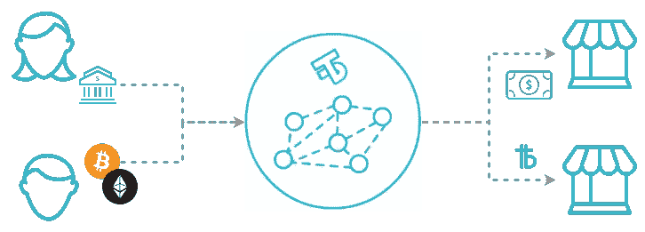

# 交易不可知论:大规模采用加密货币的途径

> 原文：<https://medium.com/hackernoon/transaction-agnosticism-a-path-to-cryptocurrency-mass-adoption-a7e054eea3cc>

自从区块链被发明以来，已经过去了将近十年，它被承诺为旧的货币体系提供一个替代方案，并能够在没有中央第三方的情况下进行无信任的在线交易。该行业已经取得了很大的进步，特别是在最近几年的 ICO 热潮中，然而，除了一些咖啡店和网上商店之外，真正接受加密的商家还远远没有普及。

*举例来说，据*[*coinmap.org*](http://coinmap.org/#/world/9.27562218/34.45312500/2)*统计，全球只有大约 1.3 万个场所在处理加密货币，包括自动取款机。*

[http://coinmap.org/#/world/9.27562218/34.45312500/2](http://coinmap.org/#/world/9.27562218/34.45312500/2)

例如，在加拿大的卡尔加里，有几十台比特币自动取款机，其中一台就在我写这篇文章的地方几百米处，但奇怪的是，这家商店实际上不接受加密支付。这个城市只有少数几个地方接受加密货币。很明显，消费者对加密货币有需求，否则这些商店就不会有出售比特币的自动取款机，并收取大约 15%的加价。

缺乏商家采用真的阻碍了该领域的增长。你可以使用加密货币的地方越多，它的价值就越大，你就越有理由每天或每月消费。参与者越多，价格越稳定，价值越高。

以下是阻碍采用的两个主要问题

# **1。波动性**

这是最大的问题之一，因为商家需要确保他们的资产相对稳定，*今天的一美元就是明天的一美元*因为他们需要能够提前预测费用、支付员工工资、税收和下订单。这对于利润率较低、没有规模经济优势的中小型企业来说尤其如此。小企业主不能等几个月或几年来等待下一次泡沫，以弥补波动带来的损失。

这也是普通消费者的问题。消费者应该能够从这项新技术中受益，而不必在不成熟的市场中承担不必要的风险。大多数人实际上没有时间或精力去参与动荡的加密市场。节省几美元的交易费不值得你在短短几个月内损失 70%的资金，尤其是在第一世界国家，那里恶性通货膨胀或政府集体没收的风险非常低。果汁不值得像他们说的那样压榨。

# **2。技术开销(复杂性)**

商家不仅要知道如何使用加密技术，并为此做出特殊安排，他们可能还要不断地在交易所出售，以保护自己免受波动性的影响。在大多数情况下，对于一小部分可能使用 crypto 支付的人来说，这并不值得。

更重要的是，随着新代币和硬币的数量每天都在激增,“接受加密”实际上对商家来说是相当难以承受的。有超过 1800 种加密资产可供选择，几乎每一种都需要某种特殊的技术集成和实现。其中许多将不得不在不同的交易所出售或使用不同的平台，在回到当地货币或首选货币之前会有很多摩擦。

> 我认识的每个拥有 crypytocurrency 的人都有完全不同的投资组合，所以即使我们想象消费者对 crypytocurrency 达到 100%的饱和，每个走进咖啡店的人都会用不同的货币支付。到一天结束时，咖啡店老板将不得不潜在地处理数百种不同的货币，其中大部分是他们不想要的。

你可以想象一下，如果你要接受几十或几百种货币，你的窗户上需要多少贴纸，而接受这么多货币会有多快失控。(当然，在实现多种加密货币的过程中，窗户上的贴纸是最微不足道的问题，但这是更大问题的一个很好的可视化表示。)**商家应该只需要一张贴纸，上面写着*“此处接受加密货币”*** 。我们迫切需要一个可扩展的解决方案，在许多或几乎无限的货币对中进行交易。

# **解决方案:事务不可知论**

交易不可知论是 Alice 用她想要的任何资产支付 Bob 的能力，以及 Bob 立即收到他喜欢的任何资产作为付款的能力。所以 Bob 甚至不需要知道或关心 Alice 的个人偏好或资产，反之亦然。

实现这一点的一些解决方案可以使用 ***寻路*** 。虽然这可能是未来解决方案的一部分，但它不是一个完整或有效的解决方案。原因在于，在许多情况下，任意**货币 A** 和任意**货币 B** 之间的流动性将非常低，并且即使在找到路径以及一些计算开销之后，仍有很大的滑动机会。

为了通过将任意货币对直接相互交换来实现交易不可知论，您需要确保在 **N^X** 货币对之间有足够的流动性，其中 **N** 是客户可能使用的受支持货币的数量，而 **X** 是商家想要接受的货币。然而，由于你可能希望使用一个可以普遍使用的平台，允许任何个人商户轻松兑换和接受不同的货币，为了安全起见，该平台应该能够处理 **N^(N — 1)** 货币对。

**如果我们从 coinmarketcap.com 的数字来看，至少有 1800 种加密货币，还有更多在路上或尚未上市。对于这一数额，大约 3，238，200 个可能的货币对之间需要足够的流动性**。

随着越来越多的资产进入市场，流动性问题将呈指数增长，因为大多数金融工具将在未来的某个时间点迁移到区块链。如果没有一个解决方案，它将使大多数资产在任何实体类型的情况下，甚至在许多网上商店中无法使用，使整个行业贬值，因为你实际上只能在非常有限的容量内使用硬币或代币。

与传统方式相比，非流动对可能导致交易双方不得不等待很长时间或者为交易支付很高的价格，从而抵消区块链的便宜和/或快速交易的好处。

一个解决方案是使用货币 **X** 作为结算或过渡货币。这样的交易看起来像这样:将 **A** 换成 **X** ，将 **X** 换成 **B** ，将 **B** 发送给商家(当然全部在后端自动完成)。通过这种方式，我们只需确保货币具有流动性**x。**使用过渡货币意味着您只需担心具有 **N-1** 种可能货币对的流动性，这大大减少了流动性问题，因为随着更多货币得到支持，流动性呈线性增长，而不是呈指数增长。

我们在 [TillBilly](https://tillbilly.com) 正致力于通过增加 ***【及时】*** 交易使这一过程更加顺畅，这意味着我们维持流动性池，以允许我们同时下达卖出订单: **A** 对 **X** ，同时下达买入订单: **X** 对 **B** 。因此，即使我们不能立即以合理的价格卖出 **A** ，或者立即买入 **B** ，商家实际上也不需要等待这种情况发生，他们仍然可以及时收到以他们喜欢的货币支付的款项，从而减少了交易所的价格滑动，提高了速度。

Illustration of proposed TillBilly’s Point of Sale Transaction Model

最终，通过“及时”交易，我们可以等待并承担风险，以一个好价格进行互换，而消费者和商家甚至不应该考虑流动性或现代技术的支付形式等问题。人们生活中有更重要的事情需要思考。

显而易见，区块链领域的下一个大动作是令牌化和证券化。交易不可知论为人们选择货币提供了一些有趣的机会。例如，加密货币用户将能够持有资产支持的代币，如由 Smartlands 等公司发行的苹果园支持的代币，甚至是亚马逊股票等。然后你就可以用它去超市买食品，或者去你最喜欢的咖啡店买咖啡。

与传统的股票或大宗商品不同，你将永远具有流动性和可替代性，如果你当月现金短缺，没有必要抛售你的大部分投资。只要在你需要的时候花你需要的钱。这样你可以保留资产的优点，比如稳定、增值。，或者股票分红，而没有变现时的低流动性和手续费引起的摩擦等弊端。

这将为世界各地的人们创造巨大的投资机会，因为这使他们能够拥有广泛和多样化的资产组合，而不像各国货币那样经常受到当地经济或政治的直接影响。与大多数传统的投资形式不同，准入门槛几乎不存在，投资所需的最低金额足以支付交易费用。这种在一个或几个平台内几乎无限的支付类型的可选性肯定会刺激区块链的采用，特别是因为它让用户可以选择使用相对稳定的资产，如菲亚特或商品等，并在它们之间轻松切换。

> crypto 的发展不需要随机的合作关系或接受不同网站上的随机货币，而是一个通用的、货币不可知的支付解决方案，适用于实体商店和网上商店。

*原创作者:* [*Jo*](https://medium.com/u/bfabb3aeb8e2?source=post_page-----a7e054eea3cc--------------------------------) *，社区经理*[*till Billy*](https://tillbilly.com)