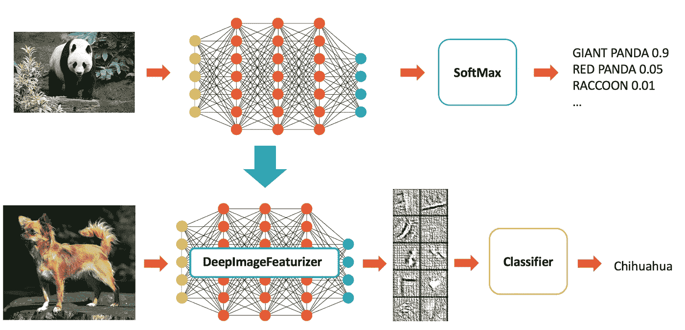
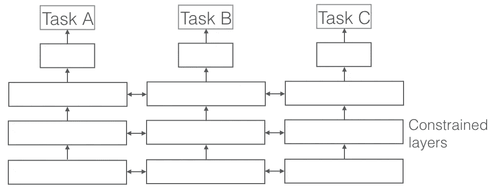

# 自然语言处理中的迁移学习

> 原文：<https://medium.com/hackernoon/transfer-learning-for-natural-language-processing-bb4669d1c1ff>

**迁移学习**旨在利用**源领域**中有价值的知识来帮助**目标领域中的绩效建模。**

# 为什么 NLP 需要迁移学习？

在 NLP 应用中，特别是当我们没有足够大的数据集来解决一个任务(称为 ***目标*任务 T** )时，我们希望从其他**任务 S** 中转移知识，以避免过拟合并提高 T 的性能。

# **两种场景**

将知识转移到语义相似/相同但数据集不同的**任务。**

*   **源任务**-用于二元情感分类的大型数据集
*   **目标任务(T)** -用于二元情感分类的小数据集

将知识转移到一个任务中，该任务在语义上与不同，但共享相同的神经网络结构，因此可以转移神经参数。

*   **源任务** -用于二元情感分类的大型数据集
*   **目标任务(T)** -用于 6 路问题分类的小数据集(例如，位置、时间和数量)

# 移植法

## **参数初始化(INIT)** 。

INIT 方法首先**在 S** 上训练网络，然后直接使用调整后的参数**为 T** 初始化网络。转移后，我们可以固定目标域的参数，即**微调 T.** 的参数

## **多任务学习(MULT)**

另一方面，MULT 在两个领域同时训练**样本。**

Multi Task Learning

## **组合(MULT+初始化)**

我们首先在源域 S 上预训练**参数初始化**，然后**同时训练 S 和 T。**

# **型号性能上**

## **参数初始化(INIT)，** MULT 和 MULT+INIT

*   **语义等价任务**的迁移学习似乎**成功**。
*   对于**语义不同的任务**没有大的改进**。**

# **结论**

NLP 中的神经迁移学习很大程度上取决于源数据集和目标数据集在语义上的相似程度。

# **参考**

[https://arxiv.org/abs/1603.06111](https://arxiv.org/abs/1603.06111)