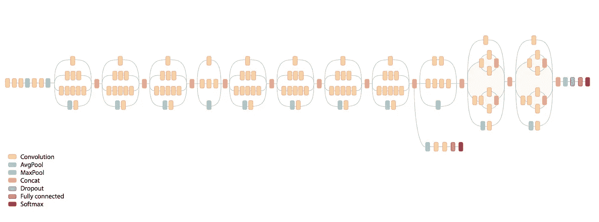
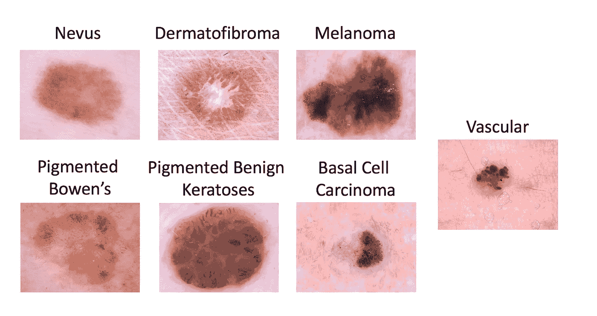
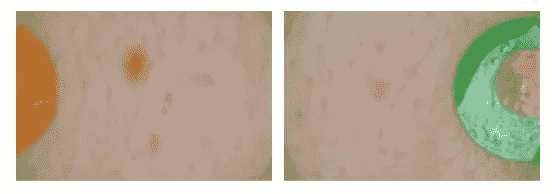
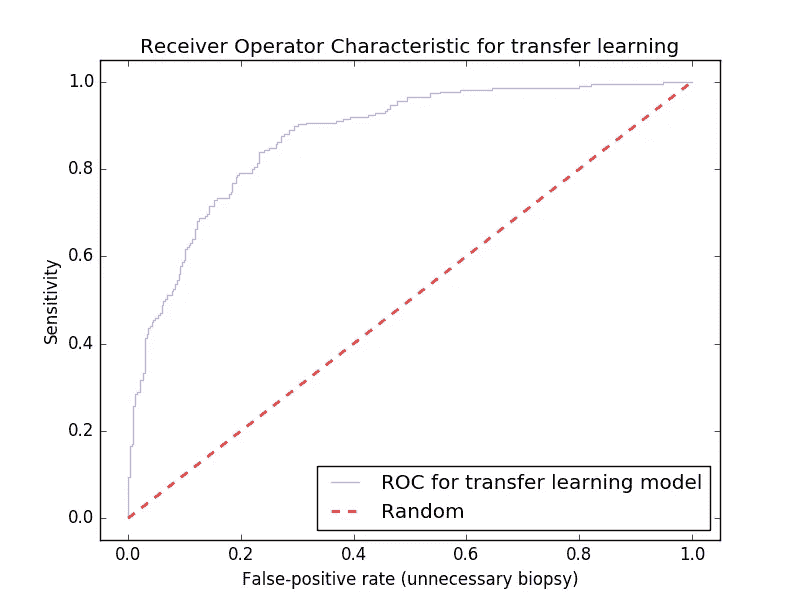
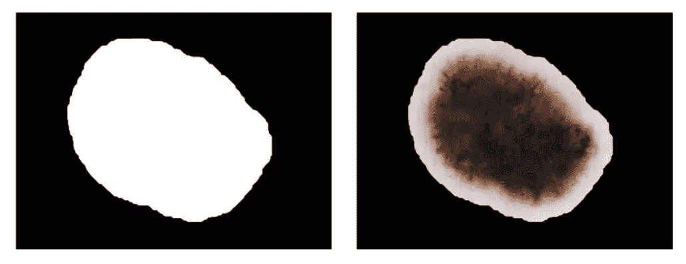
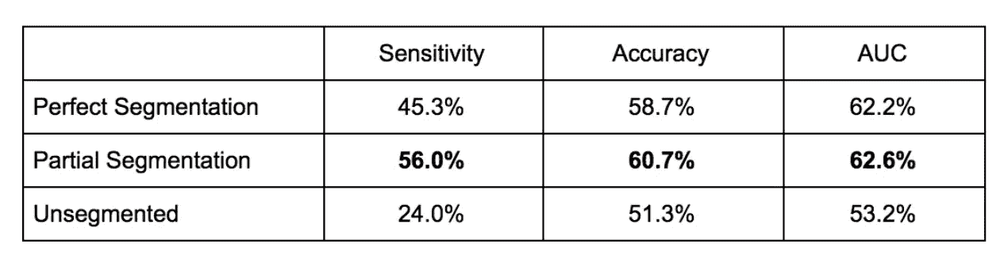
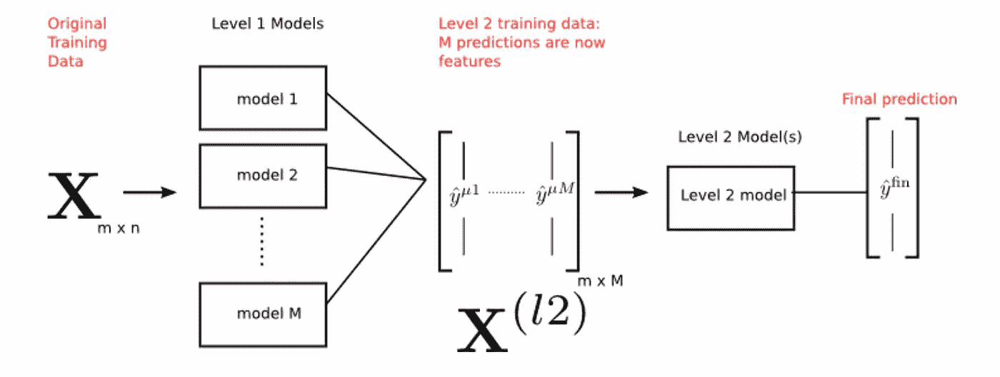

# ISIC 癌症分类挑战#2 的机器学习:AWS 上的深度学习

> 原文：<https://medium.com/hackernoon/transfer-learning-in-the-cloud-for-the-isic-cancer-classification-challenge-e0898bffcc52>

## 使用基于云的基础设施黑色素瘤分类从未如此简单

The Inception V3 architecture we’ll train for this post. [Image source](https://www.packtpub.com/mapt/book/big_data_and_business_intelligence/9781786466587/8/ch08lvl1sec48/inception-v3).

这是一个关于为 ISIC 挑战赛构建基本迁移学习模型的教程。这是我的第一个 ISIC 挑战赛帖子的续集，你可以在这里找到****，但也可以独立阅读。****

**众所周知，过去几年图像分类的技术水平一直由卷积神经网络(CNN)技术主导，这些技术是在数百万的大规模数据集上训练的。然而，在医学成像领域，数据集仍然相对较小。在黑色素瘤分类中，大多数数据集数以千计的样本，一些论文试图用更少的样本进行分类，但在这样小的数据集上训练的分类器很少能很好地推广。成功的黑色素瘤分类系统，如[这个发表在 *Nature*](https://www.nature.com/articles/nature21056) 上的系统，已经采用迁移学习来帮助克服有限的训练规模。**

**迁移学习的工作原理是将在大型数据集上学习到的一些参数用于较小的数据集。在图像识别中，这涉及“冻结”来自预训练 CNN 的一些卷积层的参数，以用作特征提取器，然后针对新问题重新训练网络的最终完全连接层，希望在先前数据集上学习的特征提取将证明对新问题有用。**

**在这篇文章中，我不会过多关注 CNN 和迁移学习背后的理论，但如果你不熟悉，我可以推荐一些资源。相反，我想把重点放在建立和改进迁移学习模式的过程上。首先，我们将讨论 ISIC 挑战本身以及云在构建分类器中可以发挥的作用。然后我们将在 AWS 上重新训练一个典型的迁移学习模型，并对其进行分析。最后，我们还将简单介绍一些技巧，例如可以为您带来顶级性能的堆叠。**

**在这篇文章的后面，我将链接到所有相关的代码，所以如果你已经有了一个 AWS 帐户，你应该能够在几分钟的开发时间内复制这些工作。**

**对于我们的数据集，我们将关注 [ISIC 黑色素瘤分类挑战](https://challenge.kitware.com/#challenge/5aab46f156357d5e82b00fe5)。**

> **如果你对 ISIC 挑战的更多背景感兴趣，比[机器学习](https://hackernoon.com/tagged/machine-learning)更新，或者你只是想看看在没有提到基础设施的情况下，该挑战的基本分类系统会是什么样子，请查看我以前的帖子，在那里我[为 2017 年的挑战](https://hackernoon.com/machine-learning-for-isic-skin-cancer-classification-challenge-part-1-ccddea4ec44a)建立了一个基本的主成分分析+决策树模型。**

**按照这篇文章中的步骤，我假设你已经[创建了一个 AWS 账户](https://aws.amazon.com/premiumsupport/knowledge-center/create-and-activate-aws-account/)，你已经[安装了 AWS CLI](https://docs.aws.amazon.com/cli/latest/userguide/installing.html) ，并且[将凭证作为环境变量](https://docs.aws.amazon.com/cli/latest/userguide/cli-environment.html)导出到本地。甚至不需要本地安装 Tensorflow！一些基本的 AWS 知识在这里是有用的(例如什么是 EC2 和 CloudFormation)，但不是必需的。**

# **数据集**

**ISIC 刚刚发布了他们的 [2018 挑战](https://challenge2018.isic-archive.com/)。今年，分类挑战从关注是否活检(二元分类)转变为包括 7 种不同类型病变的完全多类分类问题。**

****

**The full list of lesion types types to classify in the ISIC dataset. We’ll be focusing on Melanoma vs. non-Melanoma.**

**今年国际标准行业分类挑战的理想指标是七向分类准确性，而不是往年的 AUC。然而，为了保持结果与我之前的帖子一致，**在这篇帖子**中，我仍然只讨论良性与恶性分类。改变结果以获得 7 向精度只需要改变目录结构，我将在后面的文章中描述。提交仍然需要提供黑素瘤相对于 rest 的 AUC 值，但它不再是目标指标。**

# **为什么要在云端训练？**

**在我们进入代码之前，这里有几件事情激发了这种方法(没有特定的顺序):**

1.  **我们将在本帖中使用的迁移学习脚本冻结了 CNN 的所有卷积层，因此它可以在普通 CPU 上完成。然而，微调 CNN 的一些卷积层通常是这种规模的数据集的最佳方法，由于需要训练的参数数量增加，因此需要使用高端 GPU。在下面您将看到的方法中，使用支持 GPU 的实例就像在模板中交换掉`InstanceType`以使用 [P2 实例](https://aws.amazon.com/ec2/instance-types/p2/)而不是`t2.medium`*实例一样简单。请记住，P2 实例非常昂贵！当你用完它们的时候，你需要小心地把它们关掉。***
2.  **如果您需要训练一组模型，或者需要并行运行多个实验(对于 K-folds)，为每个实验旋转一个实例就像重新运行下一节中的少量命令一样简单，但对于云形成堆栈来说名称不同。给每个栈取一个不同的名字也可以让你很容易地管理你的实验和它们相关的基础设施。**
3.  **使用预装了所有主要[深度学习](https://hackernoon.com/tagged/deep-learning)框架的 AMI 将为我们节省大量可能浪费在配置上的时间。当不同的实验需要不同的库或框架时，我们将能够使用相同的代码独立于所有其他实验来支持任何实验。**
4.  **如果你像我一样，不想让你的电脑开几个小时，这种方法会让你开始训练模型，然后走开。**
5.  **使用一个 [CloudFormation](https://aws.amazon.com/cloudformation/) 模板将让我们对我们的基础设施进行版本控制，并将实例转化为一个单一的命令。这也将使获取实例的 IP 变得更加容易。如果我们想要一个像 S3 桶一样的东西来存放我们的模型，那也应该放在这里。**

# **基础设施**

**在这篇文章中，我们将使用 AMI 在 AWS EC2 实例上训练我们的模型。我们还将在 AWS CloudFormation 中模板化我们的所有代码。**

****在你执行下面的代码之前，请记住，因为你正在安装真正的硬件，所以它会从你的 AWS 账户中扣钱。****

**The CloudFormation template we’ll use to start our EC2 instance. Including a CloudFormation mapping for the different AMI `ImageId`s in each region is a best practice I left out of the above template for brevity.**

**我发现这种方法的唯一问题是`ImageId` 参数很难追踪。如果您在寻找另一个地区的特定图像 ID 时遇到问题，请告诉我，我可以帮助您(这实际上是一个非常棘手的过程)。`ImageId`也会定期更新，所以如果这个过时了，请告诉我。**

**下面是设置该模板的方法(假设您的 AWS 凭据存储为环境变量，并且您安装了 AWS CLI):**

**我假设你已经让 [JQ 安装了](https://stedolan.github.io/jq/download/)。它将让我们更容易地在 shell 中解析 JSON，并且安装非常简单。**

**首先在本地安装上述模板，然后执行以下命令:**

**Some commands to spin up our instance and ssh into it.**

# **下载数据**

**我下载数据的过程包括浏览 [ISIC image gallery](https://isic-archive.com/#images) 以了解它，使用 gallery 上的“下载元数据”选项下载数据集的元数据(我使用 gallery 过滤了“SONIC”数据集，原因您将在下面看到)，然后运行几个我自己的脚本来下载图像数据并将其转换为合适的格式。**

**我在 Github 上整合了一个[小仓库，其中包含我用来下载数据集的脚本。我更喜欢这种方法，因为我使用 EC2 盒子来运行我的分类器，除了本地的测试数据之外，我没有太多的用处。另一种方法是从他们的 ISIC 网站下载图片，然后`scp`把它们放到你的 EC2 盒子里，但是这要花更长的时间(而且不能利用多重处理)。](https://github.com/evankozliner/image-downloader)**

## **该数据集中的一个“问题”**

**如果您通过我上面描述的 API 下载图像，您可能需要考虑从“SONIC”数据集中过滤元数据。SONIC 是一个 9000 幅图像的大型数据集，包含儿童中完全良性的葡萄胎。不仅包括声波样本会严重偏向良性病变，而且我在数据集中看到的所有图像似乎都包括这个大的彩色圆圈，分类器将学习诊断为良性。我第一次运行这个分类器时，无意中包含了这个数据集，并在良性/恶性比例为 60/40 的情况下，在 90 年代中期获得了一些可疑的高精度，所以不要犯我的错误。**

****

**Some benign mole images from the “SONIC” dataset. All images in the SONIC dataset look like these and have the same labels. Some preprocessing could make these images valuable, but they’re not useful as they are.**

# **训练分类器**

**当我最初写这篇教程时，我考虑过给它添加一个更复杂的模型，但是已经有很多优秀的教程在做这件事，所以我想把重点放在这里的基础设施上。现在你已经有了一个预装了所有流行的深度学习库的 AMI，你可以进行任何你想做的实验，所以你在神经网络上找到的任何其他教程都应该在这个实例上工作(我在“下一步”中链接了一些)。**

**在本教程的剩余部分，我将向您展示快速迁移学习模型是如何执行的。有一个[图像再训练样本](https://github.com/tensorflow/hub/tree/master/examples/image_retraining),[Tensorflow 提供了一个关于](https://www.tensorflow.org/tutorials/image_retraining)的教程，非常适合快速查看基本的迁移学习结果，但如果你想将迁移学习模型包括在一个集合中，对你的网络进行微调，或者任何超出查看准确度的分析，你需要稍微修改它，或者如果你对 tensor flow 不够了解，可以考虑另一个解决方案，如 Keras。**

**如果您想对模型进行一些更细粒度的分析，我在 Github 上有一个 [Tensorflow fork，我在其中添加了生成 ROC 曲线所必需的日志记录，我在“分析我们的结果”中展示了这些日志记录。分叉整个 Tensorflow 回购在这里并不完全必要，但它确实有助于强调脚本不是我的工作。](https://github.com/evankozliner/tensorflow)**

# **分析您的结果**

**ROC 曲线是衡量我们在数据集不平衡的 2 类分类问题中的性能的一种很好的方法。通常，我们还会对我们的模型在人为增加假阳性率时的表现感兴趣。在 ISIC 挑战中，我们对低假阳性率感兴趣，因为这相当于低不必要的活检率。在我之前关于 ISIC 挑战的文章中，我对 ROC 曲线进行了更深入的研究，但是对于那些不熟悉的人来说，ROC 是不同分类阈值下的真阳性率和假阳性率的曲线图；它是通过选择分类阈值并重新计算模型在测试集上达到的真阳性率和假阳性率来构建的。roc 通常通过其曲线下面积(AUC)来判断。**

****

**This ROC curve for our model on the holdout set. It achieves .86 AUC with no preprocessing techniques applied and achieved an 80% test accuracy with a 60/40 benign/malignant data split. Running this classifier with a large dataset (100k+ images) been known to yield AUCs as high as .96.**

**将这个模型与以前的帖子进行比较并不完全公平，因为它是用更大的数据集训练的，但即使没有任何数据扩充、集成或微调，我们也比以前的模型高出 06 AUC，而且这个模型更容易构建。这个模型仍然有可能没有我上一篇文章中讨论的 PCA 到决策树模型表现得更好，所以在实践中对它进行一些交叉验证是明智的。因为模型需要一些时间来训练，交叉验证是并行运行几个 AWS 实例可以派上用场的另一个地方(您需要使用不同的训练/测试数据集来训练每个实例上的分类器，以完成交叉验证)。**

# **改进您的分类器**

**0.86 的 AUC 还不错，但还算不上世界级，顶级报纸往往在 90 年代中期。增加我们 AUC 的最简单的解决方案是获得更多的图像，但鉴于此，我认为讨论一些接下来的步骤来尝试从分类器中挤出更多的图像可能是好的。我在 m [y 以前的帖子](https://hackernoon.com/machine-learning-for-isic-skin-cancer-classification-challenge-part-1-ccddea4ec44a)中也谈到了一些，我在那里提到的任何技术也将有助于提高 CNN 的得分。**

## **微调**

**微调是在迁移学习的同时重新训练不仅仅是神经网络的最终完全连接层的过程。在图像分类中，除了最终完全连接的层之外，这通常还涉及额外重新训练卷积层。这对于像 ISIC 这样的图像分类问题特别有用，因为 CNN 后来的卷积层倾向于应用更多特定于数据集的特征提取，如果它们来自像 ImageNet 这样的数据集，对我们来说就不太可能有用。**

**如果你对微调一个模型感兴趣，最好不要使用我在这篇文章中使用的脚本，而先使用像 [Keras](https://keras.io/) 这样的高级库。在 Keras 中，取消冻结和微调一些后续卷积层的过程比在 Tensorflow 等框架中更简单。您仍然可以按照我上面描述的方式利用 AWS AMI，但是正如我前面提到的，最好在微调时在类似 P2 实例的东西上训练模型，因为在解冻网络的某些层时，如果没有 GPU，训练将会明显变慢。**

**这里有一个关于如何在 Keras 中实现这一点的[优秀教程系列](https://flyyufelix.github.io/2016/10/03/fine-tuning-in-keras-part1.html)。**

## **预处理**

**除了标准化等标准技术之外，图像分割可能是通常应用于黑色素瘤分类的最有用的预处理技术。分割图像通过去除可能欺骗分类器的噪声来改善 AUC。**

****

**In segmentation a “mask” (left) is found for the image, and the coordinates of the mask are used to “crop” the image (right). Reference: [*Jack Burdick, et all*](https://upcommons.upc.edu/bitstream/handle/2117/105582/analytics3-Marques.pdf?sequence=1&isAllowed=y)*. This helps the classifier by removing background noise on the image.***

****

**Here’s an empirical experiment out of Florida Atlantic University that suggests that partial segmentation is ideal for CNN models. Reference: [*Jack Burdick, et all*](https://upcommons.upc.edu/bitstream/handle/2117/105582/analytics3-Marques.pdf?sequence=1&isAllowed=y)**

**分割本身是一个单独的挑战，这是各种卷积架构被证明是最先进的另一个例子。阈值处理等传统图像分割方法在这里仍然有用，但根据我的经验，当遇到头发等常见的“干扰”时，它们会遇到麻烦。**

## **合奏**

**使用一群学习者是另一种流行的方法。集成学习器通过多个分类器运行新的示例，然后通常通过某种加权投票来组合结果。您将需要单独训练(和交叉验证)集合中的每个分类器，所以这就是使用 AWS 之类的工具旋转任意数量的服务器的能力变得非常有价值的地方。**

**对于如何合奏，你有很大的选择余地；以下是我见过的一些成功的合奏:**

*   **传统的机器学习技术用手工制作的功能和深度学习方法训练，就像我在这篇文章中描述的那样。**
*   **不同深度学习架构的合集(比如 VGG16 和 Inception V3)。**
*   **集成，其中一个分类器在分割图像上训练，另一个在完整图像上训练。**
*   **使用线性近似组合的独立二元分类器的集合。例如使用皮肤角化病对其他分类器以及黑色素瘤对其他分类器。**

**这里有一个很好的关于卷积网络系综的教程。**

**请记住，如果您希望通过组合模型来获得任何信息，您会希望模型在训练集上的结果是不相关的。**

**另一个考虑是[堆码车型](https://www.kdnuggets.com/2017/02/stacking-models-imropved-predictions.html)；这实质上是在训练好的分类器集合的输出上训练另一个分类器。我还没有看到很多论文为 ISIC 滥用这种技术，所以这可能是一个很有希望的领域。**

****

**A diagram from an excellent KD nuggests tutorial on stacking. Written by Burak Himmetoglu of UC Santa Barbara. [Link](https://www.kdnuggets.com/2017/02/stacking-models-imropved-predictions.html)**

**当然，没有人说你不能微调，利用分段图像，*和*合奏；)**

# **结束语**

**如果你已经做到这一步，感谢你的阅读！我希望你知道如何在 AWS 上训练一个基本的深度学习分类器，以及如何用一些更先进的技术来改进它。**

****使用完后，记得删除堆栈，否则您将被收取超出预期时间的费用。****

**如果你在任何地方发现任何错误，请告诉我！我可能还没有尽可能多地校对这本书。**

**如果你自己正在尝试 ISIC 挑战，我很想知道你的结果和你在尝试什么。请通过 Medium、Twitter 或 evankozliner@gmail.com 联系我。我非常期待看到 2018 年的论文:)**