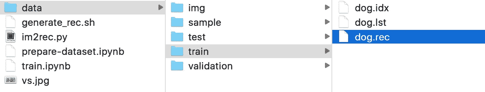
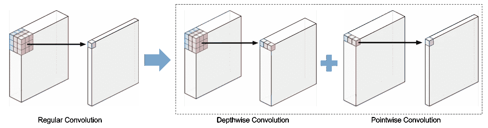
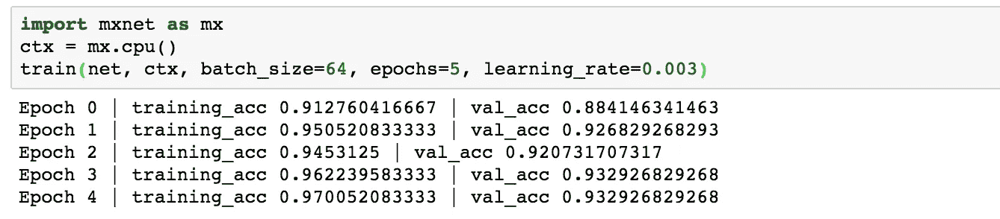
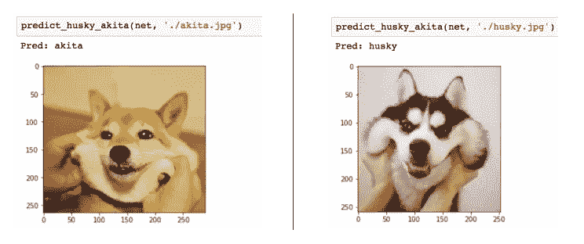

# MXNet 胶子迁移学习

> 原文：<https://medium.com/hackernoon/transfer-learning-with-mxnet-gluon-8203005afafe>

一年前，我开始用 Tensorflow 学习神经网络。旅途并不像我想象的那么顺利。感谢[HybridBlock](https://medium.com/u/592ce2a67248#mxnet.gluon.HybridBlock)让你享受命令式框架和符号式框架的优点。因此，您可以轻松地使用 jupyter 笔记本进行开发和调试，并在将其转换为 symbolic 时享受性能优化。

*   简单的 API 而不牺牲灵活性:与 Pytorch 或 Chainer 不同，您不需要记住每一层的输出大小。API 定义与 Keras 非常相似。您可以轻松扩展和构建自己的`block`。

# 什么是迁移学习

迁移学习是一种重用现有模型的学习表示并将其应用于不同但相关的领域的技术。

之所以要用迁移学习，是因为从零开始训练一个神经网络需要很长的时间和大量的资源。通常我们以两种方式使用迁移学习:

1.  用预训练模型初始化参数
2.  使用预训练模型作为固定特征提取器，建立基于特征的模型

迁移学习作为一个话题本身就可以涉及到很长的讨论。在这篇文章中，我们将主要看使用它来初始化参数。

# 我们开始吧

## 问题定义


husky or akita

给一张我们最喜欢的宠物狗的照片，它是哈士奇还是秋田犬？

为什么会有这个问题？最好研究你感兴趣的问题，数据集应该很容易找到。(他们很可爱，很容易找到他们的照片)

## 先决条件

1.  安装 MXNet: `pip install mxnet`
2.  安装 Jupyter 笔记本:`pip install jupyter`

## 准备数据集

数据来源:关键字哈士奇和秋田的谷歌图片。

数据集将分为 4 个部分:

1.  `sample` : 16 张开发调试图像
2.  `train` : 70%，针对列车模型
3.  `validation` : 15%，用于诊断模型，检测过拟合/欠拟合，如果有多个版本，则选择模型
4.  `test` : 15%，用于评估模型的准确性

MXNet 提供了一个`[im2rec.py](https://github.com/apache/incubator-mxnet/blob/master/tools/im2rec.py)`脚本来生成`rec`文件，它需要一个`lst`文件来指定文件位置和标签。生成 lst 文件和 rec 文件的笔记本可以在[这里](https://github.com/MrXu/transfer-learning-with-gluon/blob/master/prepare-dataset.ipynb)找到。

生成数据集后，您的目录结构将如下所示:



## 建立模型

我们将使用 [MobileNet](https://arxiv.org/abs/1704.04861) 完成迁移学习任务。MobileNet 是一种高效的卷积神经网络架构。它采用 3×3 深度方向 conv 和 1×1 点方向 conv 代替常规卷积层，降低了计算复杂度。



regular convolution vs depthwise separable convolution ([reference](http://machinethink.net/blog/googles-mobile-net-architecture-on-iphone/))

多亏了胶子社区，我们已经在 ImageNet 上对 MobileNets 进行了预训练。让我们用 Jupyter 笔记本来探索一下吧。

```
from mxnet.gluon.model_zoo.vision import mobilenet1_0
pretrained_net = mobilenet1_0(pretrained=True)
print(pretrained_net)
```

一旦你运行它，你会发现这个模型由两个高层模块组成:`features`和`output`。由于 ImageNet 版本的输出形状是 1000，我们需要创建一个输出形状为 2 的模型。

```
net = mobilenet1_0(classes=2)
```

为了重用预训练模型的权重，我们可以直接将其分配给新模型的`features`模块。

```
from mxnet import init
net.features = pretrained_net.features
net.output.initialize(init.Xavier())
```

就是这样~

## 训练模型

在训练模型之前，让我们为 husky & akita 数据集创建数据加载器。我们将使用 MXNet 提供的[图像增强功能](https://mxnet.incubator.apache.org/api/python/image.html)来生成新样本，并帮助避免过拟合。

```
from mxnet.image import color_normalize
from mxnet import imagetrain_augs = [
    image.ResizeAug(224),
    image.HorizontalFlipAug(0.5),  # flip the image horizontally
    image.BrightnessJitterAug(.3), # randomly change the brightness
    image.HueJitterAug(.1)         # randomly change hue
]
test_augs = [
    image.ResizeAug(224)
]def transform(data, label, augs):
    data = data.astype('float32')
    for aug in augs:
        data = aug(data)
    data = nd.transpose(data, (2,0,1))
    return data, nd.array([label]).asscalar().astype('float32')
```

现在我们可以用我们定义的扩充创建一个数据迭代器。

```
from mxnet.gluon.data.vision import ImageRecordDatasettrain_rec = './data/train/dog.rec'
validation_rec = './data/validation/dog.rec'trainIterator = ImageRecordDataset(
    filename=train_rec, 
    transform=lambda X, y: transform(X, y, train_augs)
)
validationIterator = ImageRecordDataset(
    filename=validation_rec,
    transform=lambda X, y: transform(X, y, test_augs)
)
```

让我们定义我们的训练函数。

```
def train(net, ctx, 
          batch_size=64, epochs=10, learning_rate=0.01, wd=0.001): train_data = gluon.data.DataLoader(
        trainIterator, batch_size, shuffle=True)
    validation_data = gluon.data.DataLoader(
        validationIterator, batch_size) net.collect_params().reset_ctx(ctx)
    net.hybridize()

    loss = gluon.loss.SoftmaxCrossEntropyLoss()
    trainer = gluon.Trainer(net.collect_params(), 'sgd', {
        'learning_rate': learning_rate, 'wd': wd})

    train_util(net, train_data, validation_data, 
               loss, trainer, ctx, epochs, batch_size)
```

`train_util`功能可以在这里找到[。一般都是复用的，这里就不贴了。](https://github.com/MrXu/transfer-learning-with-gluon/blob/master/train.ipynb)

有一些要点需要强调:

1.  `hybridize`:将你的命令模型转换成符号模型的函数，计算图为更快的训练而优化。
2.  在这里，我们定义我们的学习率、优化函数和权重衰减

一切就绪后，我们可以开始训练了！

在 5 个时期之后，我们可以看到训练准确度和验证准确度都上升了。



training process

## 试验

所以我们在训练集中达到了`0.97`的精度，但是，我们不能用训练精度来评价一个模型。原因是这个模型可能只是过度拟合了训练数据的分布(有一次我故意过度拟合了训练集，它达到了 99.9%，但它在真实数据集上表现很差)。

为了评估我们模型的性能，我们需要使用我们从未在训练、模型选择或参数微调中使用过的`test dataset`。

```
test_data_loader = gluon.data.DataLoader(testIterator, 64)
test_acc = evaluate_accuracy(test_data_loader, net)
```

测试精度是`0.93`，所以我们的模型没有我们想象的那么好。



# 讨论

> 第一次验证精度达到 0.88，感觉不真实

是的，原因是`husky`是 ImageNet 中的一个现有标签，我们的数据集不是很大

> 训练准确性和验证准确性之间总是有差距

这表明我们过度拟合了我们的模型。我们可以通过增加`weight_decay`来应用更多的正则化，或者我们应该尝试获得更多的训练数据。

# 结论

这篇文章向你展示了使用 MXNet 胶子进行迁移学习是多么简单。当您尝试将这种技术应用到您自己的问题时，它也是一个指南。

还有很多有趣的话题我没有涉及，比如定制 block、构建自己的架构以及在不同的环境中部署模型。我会在以后的文章中尽量涵盖它们。

源代码:[https://github.com/MrXu/transfer-learning-with-gluon](https://github.com/MrXu/transfer-learning-with-gluon)

# 参考

1.  [关于人工智能民主化的重要性](https://blog.keras.io/on-the-importance-of-democratizing-artificial-intelligence.html)
2.  [用于视觉识别的 CS231n 卷积神经网络](http://cs231n.github.io/transfer-learning/)
3.  [MXNet 胶子文档](https://mxnet.incubator.apache.org/api/python/gluon.html)
4.  [https://zhuanlan.zhihu.com/p/28648399](https://zhuanlan.zhihu.com/p/28648399)
5.  [移动网络](https://arxiv.org/abs/1704.04861)
6.  [苹果手机上的谷歌手机](http://machinethink.net/blog/googles-mobile-net-architecture-on-iphone/)