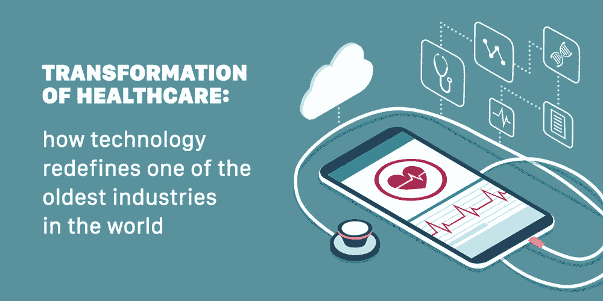

# 医疗保健的未来:人工智能、RPA、物联网和其他如何重新定义行业

> 原文：<https://medium.com/hackernoon/transformation-of-healthcare-how-technology-redefines-one-of-the-oldest-industries-in-the-world-11e4ff3899d>

由于医疗保健是对全世界所有人都至关重要的少数行业之一，难怪它会有巨大的支出甚至更大的投资。据德勤估计，2020 年全球年度医疗支出可能达到 8.7 万亿美元。据[福布斯](https://www.forbes.com/sites/arleneweintraub/2018/07/12/healthcare-vc-investing-could-hit-a-record-high-in-2018/#4487c15165d2)报道，2018 年上半年，风险资本家向医疗保健初创公司注入了 106 亿美元。

这些数字清楚地表明，对于精明的初创公司和愿意为医疗保健目的部署尖端技术的大型企业来说，今天的医疗保健是一个充满机遇的领域。然而，技术在医疗领域的实施在很久以前就开始了，早在 20 世纪 60 年代初。从那时起，医疗保健经历了巨大的转变，无论是在采用的做法和设备方面。这并不是其发展的终点——今天，由于人工智能、RPA 和其他技术的大规模部署，医疗保健行业再次站在变革的边缘。

# 过去的痛点和技术的首次实施

所有行业一直面临的最大难题之一是:

*   大量的文书工作
*   人为错误的可能性很高
*   耗费太多时间的平凡而常规的任务

医学数字化领域的先驱之一是[荷马·沃纳](https://www.forbes.com/sites/michaelmillenson/2012/12/18/the-man-who-brought-computers-into-medicine/#f9d831d7f80c)——美国心脏病专家，他是 20 世纪 50 年代中期第一批使用计算机进行决策支持的人之一。在 20 世纪 60 年代末，Warner 和他的同事们提出了监控系统，成为今天全球使用的标准，在当时是一个真正的突破。

在 20 世纪 80 年代，用于计算机连接的网络技术获得了难以置信的普及。1991 年，电子病历(EMRs)也通过了审查。

自那以后，医疗保健行业一直在稳步向更高效、更准确的流程转变。计算机和其他技术的实现将医学专家从花费在日常工作上的时间中解放出来，并使他们能够专注于更重要的任务。此外，计算机大大降低了出错的可能性，并允许将所有过程保存在一个地方(或网络)。

在过去几年中，世界见证了物联网、人工智能和大数据的兴起。毫无疑问，这些技术极大地影响了医疗保健，并使其更上一层楼。

# 今日医疗保健:机器人助手和疾病预测

现代医疗保健受到以下技术的严重影响:物联网、人工智能、机器学习和大数据。他们每个人都提供独特的解决方案，消除风险，降低出错的可能性，提高工作流程的效率，并有助于医学研究。

## 数据科学

顾名思义，数据科学就是分析数据并从中提取有价值的见解。此外，由于医疗保健涉及大量数据工作，数据科学对行业发展做出了巨大贡献。

## 医学图像处理

在医疗保健领域，图像处理在诊断中起着至关重要的作用。这种疾病发现得越早，成功治愈的机会就越大。这种成像技术的例子包括 X 射线、MRI、计算机断层摄影。

数据科学所做的是，它为医学专家提供了一个进行更准确和全面分析的机会。能够对器官纹理进行分类，找到不明显的疾病指标等。数据科学极大地有助于检测严重的情况，如肿瘤或动脉狭窄。

## 药物创造

根据 Drugs.com 的说法，一种药物可能需要 12 年才能提交申请——想想投入研发的所有资源和资金。但由于数据科学，时间和投资可以大大减少。

在特殊算法的帮助下，数据科学使得预测药物将如何发挥作用以及预期的成功率成为可能。这种方法通过在精心制作的模拟中进行测试，消除了进行实验室实验的必要性。

## 计算机视觉

这项技术提供了准确的分析和检查，并在图像分析领域找到了自己的位置。

我们在上面已经讨论过，数据科学对图像处理有很大的贡献。由于其检测最轻微异常的能力，计算机视觉也用于患者的扫描分析，并提高图像分析的准确性。

然而，这并不是计算机视觉在医疗保健中的唯一应用。例如，一家[高斯外科](http://www.gausssurgical.com/)公司开发了一种能够实时检测病人失血量的软件——这都要归功于计算机视觉。这证明，如果一家公司有一个创新的想法，并使用相应的技术，它可以对医疗保健的未来产生影响。

## 机器学习

人工智能的一个子集，机器学习，能够学习和识别数据中的某些模式，并在此基础上建立预测模型。这项技术广泛应用于金融行业，但在医疗保健领域，它也发挥着至关重要的作用，帮助医疗专家预测和识别可能的疾病，并防止其发展。

机器学习在医疗保健中的部署确实发挥了重要作用，因为许多疾病在第一阶段总是被忽视，将来可能会变得太晚。但是有了精确的预测模型，医生将有更大的机会对抗癌症，而不是治疗已经恶化的疾病。

# 2019 年趋势

我们不能说在 2019-2020 年医疗保健领域会有其他突破性的技术，但现在使用的技术将继续发展。它们包括更先进的聊天机器人，更广泛的预测分析部署等。然而，某些事情将会改变——在下面找到在不久的将来将要推出的创新。

## 医疗物联网

物联网正在慢慢变成 IoMT——医疗物联网。这个术语意味着智能和医疗可穿戴设备的广泛应用，包括心电监护仪。根据 Allied Market Research 的数据，预计到 2020 年，部署的 IoMT 设备数量将在 200-300 亿之间。然而，IoMT 仍然有几个问题需要解决:比如设备之间的安全或有效通信问题。

## AR 和 VR

首先，AR 非常适合教育医学学生，并将他们置于最大限度地接近现实生活的环境中。但这并不是使用这种(或 VR)技术的唯一方式。

在心理学中，对患者使用虚拟现实有助于将他们置于当前环境中无法获得的情境中，从而有助于解锁某些记忆或识别痛点。

至于 AR，它用于识别病人的静脉，并在其上放置数字地图，从而使临床医生更容易识别注射点。

# 科技公司的巨大机遇

对于技术和应用程序开发公司来说，现在是加入这场竞赛并提出可提供给医疗保健行业的创新高效解决方案的最佳时机。随着医疗保健准备采用尖端技术，开发公司的最大问题是创建一个确实有用和有帮助的解决方案。

至于医疗机构和医疗保健公司，他们需要找到一个可靠和值得信赖的开发公司，拥有开发和完成成功的医疗保健相关项目的证明记录。因为医疗保健的目的是为了一个人的福祉，所以根本没有犯错的余地。因此，当医疗代表选择他们的提供商时，开发公司的声誉和经验确实将发挥最大的作用。

在 Dashbouquet 】,我们在开发医疗保健相关应用程序方面拥有丰富的专业知识，我们准备用行动而不是语言来证明这一点。保持联系，了解更多信息——我们随时准备参与下一个大事件。

[*娜塔莉亚·库库什金娜*写的](https://www.linkedin.com/in/natalia-kukushkina-b62397132/)