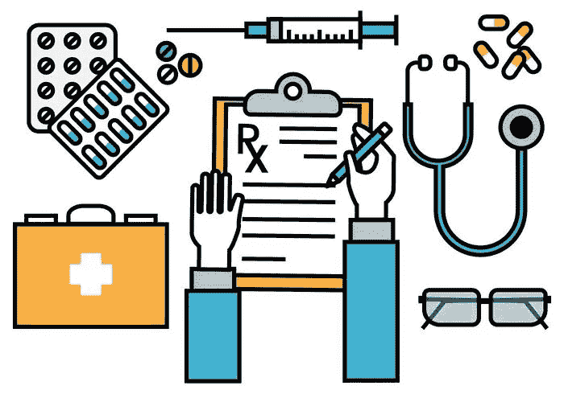

# 转变医疗保健:基于区块链的医疗处方跟踪

> 原文：<https://medium.com/hackernoon/transforming-healthcare-blockchain-based-medical-prescription-tracking-58e7c4b59227>

credtis — google.com

在[区块链](https://hackernoon.com/tagged/blockchain)T2 科技发展的方向中，医疗保健占据了突出的位置。它的突出有许多很好的理由。医疗保健和其他行业的公司已经在试水和开发区块链解决方案。

由包括制药巨头基因泰克和辉瑞公司在内的一些公司支持的[医疗账本](https://www.mediledger.com/)项目，已经成功试点了一个使用区块链追踪药品的项目。他们的目标是追踪从制造商到患者的整个药品供应链。

区块链技术在利用供应链的现实世界应用中取得了巨大成功。鉴于区块链所实现的不可变分布式分类账的本质，使用革命性的新技术进行跟踪的潜力是巨大的。随着医疗保健行业现在高度数字化，并因此遭受数据疲劳，使用基于区块链的系统来跟踪如此庞大的数据量并为该行业提供急需的缓解是有意义的。

**处方跟踪**是部署基于区块链的解决方案的一个非常好的用例。由于数字化的患者信息仍未得到最大限度的利用，导致程序重复，从而导致成本和时间的增加，因此分散式医疗处方跟踪系统有助于简化流程。根据国家抽样调查组织(NSSO)的数据，2000 年至 2014 年间，基于购买力平价(PPP)的人均 GDP 增长了 121%，而平均医疗支出增长了 176%。差不多多了 60 个百分点。据报道，转换到数字设置预计每年节省近 4000 亿美元。

因此，通过实施一个以区块链为中心的数字化解决方案，所有相关方都能在时间、金钱以及更好地组织宝贵的医疗保健数据方面获益。

可以使用 Hyperledger Fabric platform 实施一个涉及通过区块链进行医疗处方跟踪的项目，Hyperledger Fabric platform 是一个开源的企业级许可分布式分类帐技术(DLT)平台，旨在用于企业环境。通过在架构区块链上托管多个节点，可以连接相关各方，即医院、药房、电子药房和患者。基于相同结构链的导频可以通过使用应用程序而被每个所涉及的网络参与者访问；根据相关用户定制实施和设计。此外，在可伸缩性方面，Hyperledger Fabric 平均每秒可以处理 1000 笔交易。

可以为在联网医院工作的医生以及参与的药房和电子药房部署基于网络的应用程序。医生可以通过应用程序上传患者的处方数据，而药房和电子药房可以访问这些数据，并在药房有处方药时向患者发送通知。值得注意的是，在许多情况下，比如长期服用特定药物的人，比如那些开给心脏药物的人，可以被提醒去补充药物。对于患者来说，可以开发并提供 Android/iOS 应用程序。通过这种方式，患者可以查看他们所在地附近的药店以及药品的供应情况。此外，一个加密钱包可以集成到应用程序中，允许患者通过他们的移动应用程序使用代币进行购买。由于患者将有一个干净和简单的方法来访问他们的数字记录，同时具有完全的自主权，他们将拥有自己的完整病史。此外，如果有必要，他们可以接触其他医生，而不必重复传递相关信息的过程。

# 该系统将以下列方式工作:

*   在医院就诊时，相关医生将在诊断后上传患者的处方数据。使用 Fabric 的私有事务功能，此数据的哈希将被添加到区块链中。
*   请记住，患者数据是高度机密的，它将被保密，只有在请求的基础上才能访问，并且只允许相关参与者访问。这将通过实施零知识证明等解决方案来实现。(*在密码学中，零知识证明或零知识协议是一种方法，通过该方法，一方可以向另一方证明她知道值 x，除了她知道值 x 的事实之外，不传递任何信息*
*   医生将能够在他们的许可下查看患者以前的医疗处方，并据此进行治疗。当进行测试、诊断或管理治疗的专家需要从患者病史中了解具体情况(如过敏或现有状况)时，这将特别有用。
*   药房和电子药房将能够结合其库存报告使用这些数据，并根据市场需求生成新的报告。
*   通过该系统收集的数据还可以用于进一步的研究和开发，而不会损害患者的隐私。

# 用例-

*   消除了携带处方的需要
*   减少因处方不明确或无效而被拒绝的订单数量
*   使用户能够从一个平台获得所有处方
*   消除药物滥用
*   真实且经过审核的医疗记录
*   避免药品欺诈

> 因此，正如上述基于区块链的医疗处方跟踪系统所显示的，更好的数据管理可以极大地改善医疗保健行业。在高度数字化的世界里，如此依赖数据驱动的经济，区块链可以让生活变得更轻松。

欲了解更多信息并详细探索解决方案，请联系 [Quillhash 科技](https://www.quillhash.com/)。Quillhash Technologies 正在多个领域广泛开展工作，通过区块链技术提高企业运营和运作的效率。

关于同一主题的进一步讨论和疑问，请加入 quill hash—【https://t.me/quillhash 电报组的讨论

> . . .

*关于作者—*

*Mithil 是一位连续的区块链企业家，他与他人共同创建了“QuillHash ”,这是一家区块链企业服务公司，致力于多个公共和私人区块链，最近被公认为印度最有前途的区块链服务公司之一。Mithil 热衷于研究区块链在多个行业中的使用案例，也是主题演讲人。通过 Quillhash，他的团队为零售、医疗保健、电信、物流和供应链领域的企业构建了解决方案。*

*更多信息，关注 Mithil Thakore 上的*[*Linkedin*](https://www.linkedin.com/in/mithilthakore/)*，*[*Twitter*](https://twitter.com/mithilthakore9)*，*[*Quora*](https://www.quora.com/profile/Mithil-Thakore)*。*

*更多 Mithil Thakore 的文章，请在 medium 上关注他—*

> [米希尔·塔科雷——medium.com](/@mithilthakore9)

参考文献-

[1]来源:[https://www . livemint . com/Opinion/rvuv 41 x 58 smofrixmbg0i/How-lack-of-medical-history-online-is-killing-health care-in . html](https://www.livemint.com/Opinion/RvUV41x58smoFrIxMBQg0I/How-lack-of-medical-history-online-is-killing-healthcare-in.html)

[2]来源:【https://en.wikipedia.org/wiki/Zero-knowledge_proof 