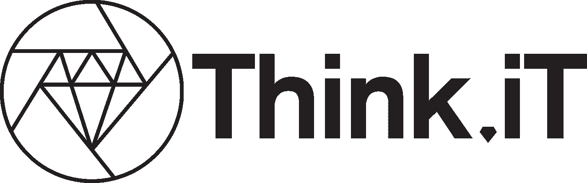
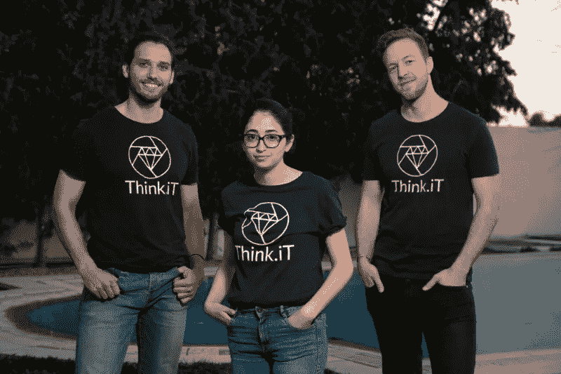
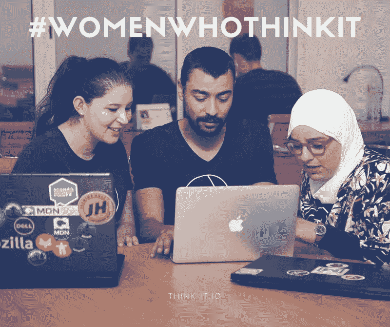

# 将北非转变为思想力量和卓越技术的中心

> 原文：<https://medium.com/hackernoon/transforming-north-africa-into-a-hub-of-mind-power-and-tech-excellence-24e16df2cc0>

六个月前，我们登上了从纽约飞往突尼斯的单程机票，去追寻一个毕生的梦想，那就是将才华横溢的头脑与机遇联系起来。最初是一个雄心勃勃的想法，现在已经成为一个使命驱动的企业，以及北非和萨赫勒地区最具选择性但包容性的人才力量的不断增长的运动。我们正在将该地区转变为一个智力和技术卓越的中心。

我们每个人仍然清楚地记得我们做出决定的那一天。Amal 和 Mehemed 坐在纽约哥伦比亚商学院的 Watson 图书馆，而 Joscha 坐在智利圣地亚哥他办公桌旁的屏幕上。Skype 连接再次失败。经过几个月的研究、头脑风暴和采访，在那个特殊的日子里，我们决定放弃工作和读研，通过创办 Think.iT 来追求我们的激情。

我们知道我们处于一个独特的位置。我们已经形成了异常强大的网络，在微软和亚马逊等领先公司积累了新技术知识，并获得了进入世界主要技术生态系统的机会。在过去的半年里，我们利用这些资源将最优秀的软件工程师培养成技术变革者，并将他们作为分散的团队成员整合到国际工程团队中。

2017 年，Think.iT 已经从一个概念和想法成长为一个真正的组织，并在三个不同的大洲开展业务。

当我们回顾非常多事的 2017 年时，以下是我们工作的五个亮点:

*   下个月，我们的团队将增加到 30 人，其中包括 22 名年轻的工程师，他们收入不错，共同支撑着 100 多名家庭成员；
*   我们与欧盟/美国的初创企业和中小企业建立了多种合作伙伴关系，他们强调对我们的工程师非常满意，并要求更多的思想者加入他们的团队；
*   来自哈佛、哥伦比亚、伯克利、ESADE Barcelona 和莱顿大学等顶级学校的国际知名人士和毕业生几乎不拿薪水就加入了我们的团队，这仅仅是因为他们相信我们的愿景、人才和管理能力；
*   我们的创始人受邀在各种会议和小组讨论会上分享我们的方法，并加入了支持有抱负的人才的全球组织的行列，如 [Atlas Corps](http://www.atlascorps.org/tech.php) 和宝马基金会的责任领导者网络；
*   我们获得了[联合国 SDSN 特别青年奖 2017](http://graduateinstitute.ch/home/about-us/discover-the-institute/le-geneva-challenge/2017-edition/2017-sdsn-youth-special-prize-1.html) ，这是德国政府(EXIST)提供的 12.5 万美元创新赠款，并被哥伦比亚大学 [Tamer 社会企业中心](https://www8.gsb.columbia.edu/news/node/5785)选为投资组合公司(2.5 万美元奖金)；

我们相信运动和革命；一场通过反思教育和获得劳动力的革命。我们将继续围绕教育和自我赋权集中我们的智力、网络和资源，以便在北非培养整整一代技术变革者。我们将通过展示纪律、好奇心和真正的激情，为年轻人提供重新获得教育和机会的途径，这些都是成功和美好生活所需的要素。

我们签署了比我们自己更伟大的东西，我们需要更多有这种信念的杰出人才。如果您想参与其中，我们邀请您伸出援手，与我们合作。

让我们让 2018 有意义！

阿米尔·迈赫梅德-约沙公司

[**成为投资人**](mailto:mehemed@think-it.io?subject=Interested%20in%20investing&body=Hi%20Think.iT%20team%2C%0A%0AI%20would%20like%20to%20receive%20more%20information%20regarding%20a%20potential%20investment%20opportunity.%20You%20can%20reach%20me%20under%20EMAIL%20or%20PHONE.%0A%0ABest%2C%0A)

[**成为招聘伙伴**](mailto:hiring@think-it.io?subject=Interested%20in%20hiring&body=Hi%20Think.iT%20team%2C%0A%0AI%20would%20like%20to%20receive%20more%20information%20regarding%20a%20potential%20hiring%20partnership.%20%0A%0AYou%20can%20reach%20me%20under%20EMAIL%20or%20PHONE.%0A%0ABest%2C%0A)

[**成为团队成员**](https://think-it.io/careers.html)

[**了解更多**](https://think-it.io/)