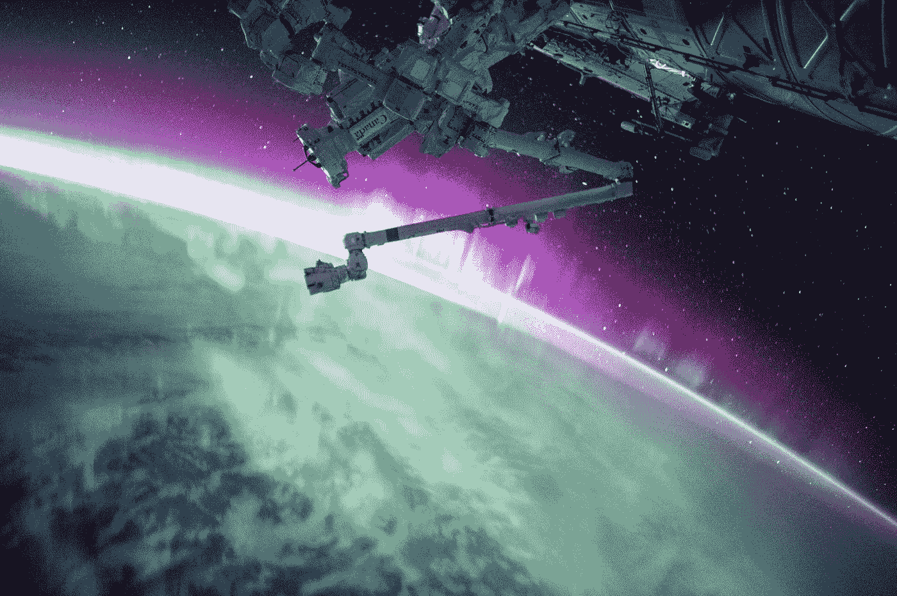
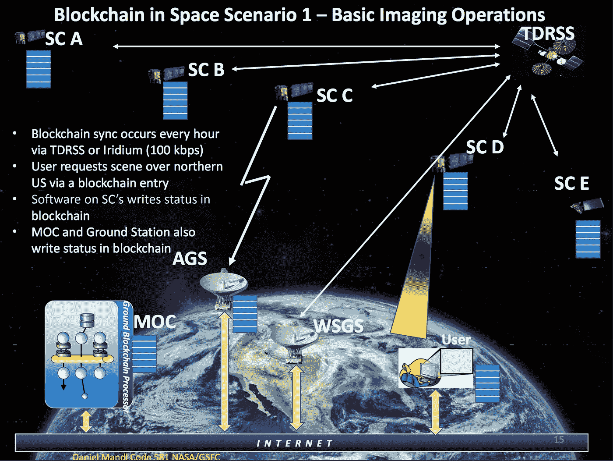
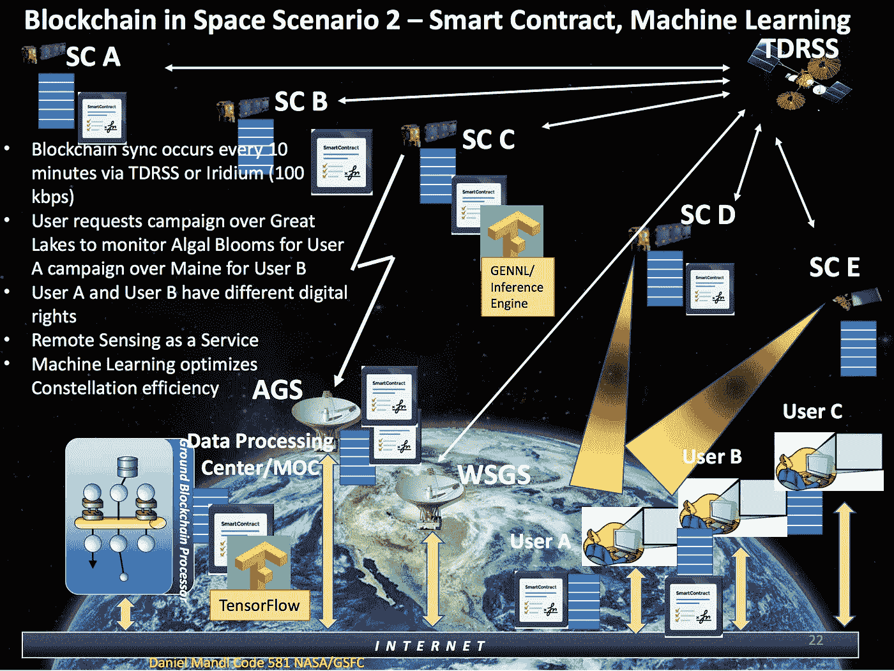

# 用区块链技术改造航天产业

> 原文：<https://medium.com/hackernoon/transforming-space-industry-with-blockchain-technology-747c27601bba>

我们正站在新一轮太空竞赛的边缘，这场竞赛不是由超级大国之间的冷战推动的，而是由相互竞争的私营公司推动的。这是一个令人难以置信的迷人和极其重要的事件，它关系到我们的社会、文明和整个地球的未来。在今天的时代，由于几家私营公司的巨大努力，空间比以往任何时候都更加接近和开放。如今的问题是，没有数百万预算的小型独立公司和初创企业在这场竞争中是否有一席之地，以及它们有哪些选择。

unsplash.com @nasa

互联网作为即时共享和实时传播信息的媒介，以及不受地理/政治限制的特定任务协作方式的出现，为我们参与我们时代的未来发现提供了独特的机会。仅举一例:文件“[比特币](https://hackernoon.com/tagged/bitcoin):点对点电子现金系统”的传播。马歇尔·t·萨维奇(Marshall T. Savage)在他的书《*千禧年计划:用八个简单的步骤殖民银河系》(1992 年首次印刷，1994 年再版，由亚瑟·C·克拉克作序)中介绍了一种“人类激光”形式的合作愿景——一群人同步和谐地工作，创造出一束连贯的意图之光(T7)。这样一种*“人体激光”*促成了[区块链](https://hackernoon.com/tagged/blockchain)技术的传播，这是我们进入下一个人类文明时代的入场券。*

通过在科学和技术领域利用*“人类激光”*的概念，并应用权力下放原则和新的加密经济模型，将允许所有感兴趣的人参与新的太空竞赛和全球其他有趣的项目，而没有以前在全球项目中遇到的任何限制。

将区块链技术的潜力与当前的科学资源相结合，可以激励更多的人参与到征服太空的共同努力中来。通过实施分权原则，我们可以在新兴的科学和商业项目中利用秘密经济和私人资金的动力，以加速太空探索。

**我们面临的三大挑战:**

*1。开发空间以创造新的商业机会和市场
2。提高全球航天工业的可用性，帮助小公司在市场上更具竞争力。加速探索和利用宇宙的进程*

无论是国有企业还是私营企业，它们都在与抑制其潜力的问题作斗争。它可以是有限的资金或利益冲突，共同的问题是缺乏合格的工作人员和巨大的运营成本。

如今，国际航天工业受到两个主要问题的困扰，这两个问题阻碍了整个工业的发展:

*1。安全问题，主要存在于国家之间
2。私营和国有公司之间的利益*

第一个问题是对各国领导人支持的外交关系与合作的关注。第二个问题正在通过商业部门和科学界开源技术的发展得到解决。公众永远无法获得空间技术，也无法获得空间技术。新的主体很难进入太空探索和技术行业，无论是公司、组织还是科学界。整个行业都围绕着最大的“玩家”，其他任何人都很难参与进来，主要是因为此类项目的巨大运营成本。如今，以低成本或“启动”的方式为这样的应用程序创建软件是不可能的。我的拙见是，宇宙产业的初创企业比科幻小说强不了多少，更不用说绝对缺乏人才和专门的工作人员。

今天，大多数空间项目是由政府管理和/或资助的。这些项目往往受到其利益影响，新的研究或技术创新受到低预算的限制。

# **新兴空间项目融资的新途径**

在互联网公司和我们今天所知的互联网初创企业时代的开端，新兴公司在传统风险投资模式的基础上工作(现在仍在工作)。大多数时候，公司由创始人所有，工作团队的成员拥有公司的股份，这激励他们尽可能地工作。由于风险投资模式，创造力和创新项目可能会出现，但仅此并不能保证成功。

另一方面，需要大量研发资金的长期项目，如太空探索项目，不太适合由风险投资模式提供资金。风险投资模式支持的许多技术将被标记为不起作用，因为它们需要更多的时间和资本投资才能取得成功并满足市场预期。例如，我们可以使用传统的卫星研发过程，这可能需要很多年。一旦融资准备就绪，完成 R&D 需要很多时间(甚至几年)，但只有当他们在市场上发布技术时，团队才能请求更多阶段的资金。

代币形式的筹资，或者更准确地说是 ICO 模式(首次发行硬币)提供了一种为新项目或正在进行的项目融资的渐进方式。有了足够的资金，项目可以聚集最优秀的人才，提高业务的整体效率和灵活性，并更加关注长期的研发。这在空间技术的情况下尤为如此，在这种情况下，最初的挫折是预料之中的，必须将很大一部分资金分配给研发。传统的风险投资基金不愿意接受这样的风险，这就是为什么要考虑新的加密经济基金模式。加密经济融资模式的一大优势是可以利用智能合约作为释放和分配资金的一种方式。实施智能合约将使我们能够改善资金管理，并增加投资者的信任，因为利用这一技术还使我们能够根据设定的路线图和规划精确设定资金的归属和释放。

# **建筑创新& DSM**

区块链技术及其优势没有逃过美国宇航局和其他太空机构的注意，如欧空局，他们考虑将其应用于自己的应用和架构创新。在分布式航天器任务(DSM)的情况下，利用区块链技术具有巨大的潜力，DSM 可以被想象为几个航天器之间的“中继”或协调的联合任务。根据美国宇航局的说法，人工智能(A.I .)与区块链技术一起可以广泛地创建“天基传感器网络”及其高效管理。

欧空局并不落后，几个月前[发布了一项调查](http://www.esa.int/About_Us/Digital_Agenda/Beyond_Bitcoin_Leveraging_the_Blockchain_for_Space_4.0)，在他们正在进行的和未来的任务中使用区块链技术。它还[发布了一份 PDF 演示文稿](http://esamultimedia.esa.int/docs/corporate/Distributed_Ledger_Technology_Leveraging_Blockchain_for_ESA_s_Success_Final_Annex.pdf)，作为对区块链技术基础的总结，以及其在欧空局内部应用的例子。该文档主要致力于更快、更高效的支付以及智能合同应用，从而简化公共采购流程、审计流程、记录保存、数据可追溯性、访问权限或投票。值得一提的是，与 NASA 相比，ESA 没有提到区块链技术在飞行软件架构中的直接应用或应用示例，如前面提到的 DSM。

# **在航天工业中利用区块链技术的例子**

虽然目前金融科技领域和加密货币受到了大量关注，但这些技术的巨大潜力在于航天工业的创新，如重要任务数据验证，智能采购智能合同的使用，优化供应链和信息管理的目标，其中应用范围可以从虚拟航天器(配置和一致性检查)到通信管理(硬件和文件)。由于还没有真正的概念或工作证明架构，这只是一种推测和理论。这并不意味着这是一部科幻小说。我个人认为，这项技术具有巨大的潜力，可以帮助未来的航天初创企业进入航天工业市场，特别是在 R&D 的首次商业、开源航天应用。

下面我将阐述在航天工业发展中利用区块链技术的三个想法，摘自戈达德航天中心(NASA)的报告。

**1。基本成像操作**

*   用户通过区块链入口输入图像请求、位置和时间范围
*   资产提供可用性，包括飞越时间、地面站的查看时间和预先安排的冲突
*   首先可用的资产根据需要安排图像时间和下行链路时间
*   操作错误、停机等。都记录在区块链
*   区块链记录了完成时间、到地面站的下行时间和成功发布数据到用户指定位置的时间。

Bitcoin, Blockchains and Efficient Distributed Spacecraft Mission Control NASA Dan Mandl Code 581

**2。智能合同和管理活动**

*   用户提交 smart contract 来完成一系列带有条件的图像(例如，在一个生长季节内每周一天的光谱测量来创建时间序列)
*   资产根据用户根据数据权限自行安排和路由数据和数据产品
*   当资产无法使用或发生故障时，用户提供备份映像计划
*   用户提供所需的时间限制和位置
*   在区块链记录成功和失败的已完成成像操作的审计跟踪

Bitcoin, Blockchains and Efficient Distributed Spacecraft Mission Control NASA Dan Mandl Code 581

**3。智能合约，机器学习优化星座**

用户提交 smart contract 来完成一系列带有条件的图像(例如，在一个生长季节内每周一天的光谱测量来创建时间序列)

*   资产根据用户根据数据权限自行安排和路由数据和数据产品
*   机器学习基于学习的方法分配星座资源，以优化图像输出并最小化用户成本
*   用户提供所需的时间限制和位置
*   在区块链记录成功和失败的已完成成像操作的审计跟踪机器学习使用审计跟踪来持续学习和改进
    *例如，正在进行的实验(Ichoku、Mackinnon、Mandl 等人)从任何角度观察火灾并识别其辐射类型，类似于从任何角度识别人脸。*

# **我们可以为航天工业的光明未来采取的措施**

我必须承认，从我记事起，这个话题就是我的软肋。我认为我对区块链技术的深入研究是一个涉足这一领域的绝佳机会。即使区块链技术仍然没有得到很好的认可和普及(尽管它现在已经存在了 10 年)，我也把这看作是“暴风雨前的寂静”，以寻找机会的形式。我也认为将区块链技术应用于航天工业是一个巨大的投资机会。有很多信息图表将区块链描述为几个行业的游戏规则改变者，但没有一个提到航天工业，即使 NASA 或 ESA 要求提交利用这些技术的提案。为未来的太空活动和研究筹集资金的倡议正在被提出，比如 Space decoll，但这对于公众来说仍然是未知领域。

我个人认为，在 Space Decentral 这样的平台下，将研究和实验项目结合在一起有很大的价值。在我看来，加密经济模型和 DAO 概念(去中心化自治组织)的实施是长期项目融资的一种很好的方式，这种方式预计不会在短期内盈利，并且被风险投资视为无用，尽管它们可能是有用的。

具体的商业产品的概念是完全不同的一章。就像 SpaceX 通过利用可重复使用的火箭来降低将货物运送到太空的成本一样，区块链技术可以帮助我们降低软件开发和测试的成本。

另一个可能的未来概念也是软件空间站的概念。尽管这是一个非常抽象的图像，但它可以呈现特定的成群设备，例如轨道上的立方体卫星，作为一个由组件、传感器、相机和分析仪组成的网络，通过区块链为公众、大学和私营开发公司分配公共访问权限，作为开发自己的软件或空间应用的平台。这个领域正是我在未来的区块链项目中想要得到的。

# **结论**

虽然今天的航天工业由亿万富翁控制，但我相信我们每个人都有一席之地。首次火星飞行、月球基地和私人空间站的时代已经来临。这是新企业和商业机会的巨大空间。非常大。你不会相信它有多么巨大，令人难以置信的大。尽管这个行业的起步非常困难，但利用新的筹资和融资方式，我们可以在管理资金和公司透明度方面实现更高的效率，这极大地增加了投资者的信任，更不用说利用基础设施实施的令牌动态了。

我相信我在这篇文章中描述的仅仅是我们未来所能期待的冰山一角。区块链技术迄今只展示了一个“杀手级应用”，那就是加密货币。

我们必须考虑到这一点:我们仍然在开始，它只取决于我们的想象力和创造力，我们为更美好的未来做出了多少贡献。

***资源:***

[https://www . science direct . com/science/article/pii/s 0016328709000755？via % 3 di hub
https://sensor web . NASA . gov/bit coin % 20 block chains % 20 and % 20 Distributed % 20 satellite % 20 management % 20 control % 209-15-17 V12 . pdf
https://sed.gsfc.nasa.gov/tech_products/580/dsm/
https://sed.gsfc.nasa.gov/tech_products/580/
http://www . ESA . int/About _ Us/Digital _ Agenda/Beyond _ bit coin _ Leveraging _ the _ block chain _ for _ Space _ 4.0](https://www.sciencedirect.com/science/article/pii/S0016328709000755?via%3Dihub)
[https://spacechain.com/SpaceChain-0319-1.0-EN.pdf【T11](https://spacechain.com/SpaceChain-0319-1.0-EN.pdf)