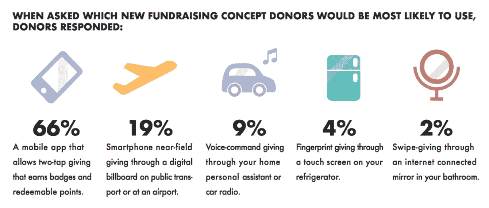

# 通过慈善移动应用改变慈善格局

> 原文：<https://medium.com/hackernoon/transforming-the-philanthropic-landscape-through-charity-mobile-apps-b789a5908d8e>

一个好的事业可以促使人们向慈善机构、非营利组织和非政府组织(NPO 和 NGO)捐款。慈善捐赠的格局受到了数字筹款的影响。越来越多的慈善机构正在通过数字平台探索在线捐赠策略，以寻找新的捐赠者，接触更年轻的受众，开展更具吸引力的筹款活动，并节省时间和金钱。技术可以帮助慈善机构增加捐款，寻找新的捐助者，并扩大他们的活动范围。

# 人们如何捐款:快速统计

基于对全球 4084 名捐赠者的调查结果，2017 年全球捐赠趋势报告是一个独特的年度研究项目，研究捐赠者如何偏好捐赠并参与他们最喜爱的事业和慈善组织。 [94%的受访者同意](https://gallery.mailchimp.com/feb87794e3b3c6cb0d7949bdf/files/d9fede24-402d-48b6-9ce5-51429de9c88e/gg_report_english_9.7.17.pdf.pdf)为了在数字时代保持相关性，非营利和非政府组织必须在慈善应用程序开发上投入财力和人力资源。

人们用于捐赠的渠道和捐赠频率:

*Source: givingreport.ngo*

捐赠者最有可能使用的筹款概念:

*Source: giving report.ngo*

按性别和原因分列的捐赠:

*Source: givingreport.ngo*

# 管理筹款活动

在决定开发一款慈善捐赠 app 之前，除了成本本身，还有几件事需要考虑。

与捐助者沟通。如果沟通很重要，那么一个平台必须提供捐赠者的联系信息。确保网站收集对通信的同意也很重要。捐赠者也可能希望收到他们的交易收据以确认捐赠。

提供数据。慈善机构需要清楚他们需要从捐赠者那里得到什么信息，以及这些信息将如何以及何时被使用。一些较大的网站可以创建定制的数据报告，提供捐赠者的交易旅程。检查这些报告需要多快很重要，因为有些报告的周转时间比其他报告长。此外，检查所提供的数据是否采用了易于使用的格式。

信息透明。关于慈善机构的信息——包括其运作方式和地点——应该清晰、准确，并且在其平台上易于访问。支持者也会想检查一个网站接受捐赠的资格和它的法律地位，所以这些信息也应该是可用的。

监控和接收付款。财务团队需要将付款的接收和对账纳入现有的内部流程。有些付款可能是每周一次，而有些可能是每月一次，甚至在慈善活动结束时进行。慈善机构在考虑接收款项的时间框架时，应考虑其长期财务计划和预算。如果一笔固定的钱有一个最终目标，那么当目标达到时，就有必要调整活动。

更新页面或内容。慈善平台的管理功能很重要，因为这将决定定期更新和管理页面需要多少资源。如果有多名员工访问页面，慈善机构将需要了解他们如何登录，以及组织内不同的人应该拥有什么样的权限级别。

有些活动会自动更新。一旦捐赠完成，捐赠者就可以被添加到捐赠者列表中，并且捐赠可以触发对实时捐赠跟踪器的更新。

[PCI 合规性](https://squareup.com/guides/pci-compliance)对于任何通过信用卡接受捐赠的非营利组织来说都至关重要。PCI 合规性是一组要求，确保所有通过信用卡接受付款或捐赠的实体安全地处理、存储和传输卡信息。合规可确保捐赠者的支付信息安全可靠。如果组织不遵守这些重要的指导方针，他们可能会被罚款。

让捐赠者保持匿名。更先进的网站为捐赠者提供了匿名的选择，对公众和慈善机构都是如此。这可能对处理敏感问题的筹款活动有用。

全球捐赠。如果捐款来自国外，那么支付系统应该能够接受不同的货币和外国信用卡或借记卡。一些网站允许捐赠者直接捐赠外币。

# 典型的捐赠之旅

转账的过程会看平台本身是慈善机构还是私人公司。在线筹款平台旨在收集捐赠者的资金，并将其存入安全的银行账户(这可能是也可能不是单独指定的信托账户，但资金应该可以明确识别)。然后，这些捐款被转移到慈善机构，减去相关费用。

基本原则是，捐赠者通过输入他们的信用卡或借记卡号码来取款或使用他们的数字钱包，从而向他们选择的慈善机构捐款。这笔捐款扣除行政和其他费用后由平台清算。

*   信用卡处理。在线捐赠表格应接受所有主要的信用卡(万事达卡、维萨卡等。).
*   直接借记处理。通过借记付款，捐赠者可以输入他们的银行账户信息，资金将直接存入慈善机构，无需手续费。直接借记适用于希望建立定期捐赠的捐赠者。这种方法非常受忙碌的捐赠者的欢迎，也非常方便，特别是当人们携带现金越来越少，而他们的 Android 和 iOS 设备越来越多的时候。
*   数字钱包处理。数字钱包是集成到慈善平台的银行系统。他们允许支持者一键捐款。

# 最佳慈善捐赠应用

借助在线解决方案，慈善机构可以专注于吸引支持者，让他们成为更大事业的一部分。因此，捐赠者可以认同任何一家慈善机构的愿望，通过慈善手机应用程序提供的功能，将日常活动转化为捐赠。

## 慈善里程

“慈善里程”是一款用于向慈善机构捐款的应用程序，可在 Android 和 iOS 上使用，它鼓励用户每天通过散步、跑步或骑自行车作为日常锻炼的一部分来为慈善机构筹集资金。用户可以从九个不同的慈善机构中进行选择，然后该应用程序会跟踪他们的距离，只要用户在脸书或 Twitter 上分享他们的活动，就会从企业赞助商那里为每英里捐款。这款创新、易用的应用程序对消费者、慈善机构和企业都有好处，激励用户锻炼，并为企业提供一种与消费者联系的真正独特的方式。非盈利性的技术新闻报道了慈善万里行，强调了它的优点和缺点。

## 共享主题

通过[联合国世界粮食计划署来对抗全球饥饿。](http://www1.wfp.org/)这个概念很简单:用户只需点击手机上的应用程序，然后支付 50 美分，就可以喂养一个孩子一天。当人们选择通过应用程序捐赠时，数千名营养不良的[人也将获得一顿饭。](https://www.wfp.org/news/news-release/sharethemeal-app-hits-first-target-now-raises-funds-children-mothers-and-mums-be-s)该应用在全球范围内推出，并因其设计和创新获得了多项奖项。谷歌将 ShareTheMeal 评为 2015 年最佳应用之一。

## 硬币

硬币 Up [收集数字零钱](https://www.hi-techchic.com/coin-up-the-mobile-donation-app-review/)并将其投入到用户关心的事业中。用户只需连接一张借记卡或信用卡，然后根据地点、工作领域或名字选择慈善机构。之后，在关联卡上进行的每笔交易都被四舍五入到最接近的美元，剩下的零钱被投入慈善基金。例如，4.50 美元的拿铁咖啡将被四舍五入为 5.00 美元，剩下 0.50 美元用于用户选择的事业。用户可以设定每个月的捐款限额，从 5 美元开始。Coin Up 从捐给慈善机构的资金中收取少量运营费用。联合创始人兼首席执行官 Leena Patidar 表示，该应用程序旨在鼓励用户全年递增捐款，并为非营利组织提供更好的方式来联系 Y 一代捐赠者。Android 和 iOS 设备上都有 Coin Up。所有捐赠都可以免税。

> 如果慈善机构不在移动环境中招募自己，他们真的会错过捐款…这是一个非常简单的改变方式。
> 
> 首席执行官琳娜·帕蒂达尔。

一条改变人生的新闻:凯特·温丝莱特和莱昂纳多·迪卡普里奥一起建立了一个慈善机构，筹集 30 万英镑来支付 29 岁的杰玛·纳托尔卵巢癌的治疗费用，此前她在网上看到了[的筹款页面](https://www.gofundme.com/teamgemma)。[杰玛现在已经没有癌症了](http://www.dailymail.co.uk/news/article-5352967/Kate-Winslet-reveals-helped-woman-cancer.html#ampshare=http://www.dailymail.co.uk/news/article-5352967/Kate-Winslet-reveals-helped-woman-cancer.html)。如果她不需要在网上做广告，这位女演员和男演员(以及更多人)的天赐帮助是不可能的，让 Gemma 的女儿失去了母亲。

# 以合理的价格制作自己的慈善应用程序

由于科技的进步，给予现在变得简单、快速，而且几乎毫不费力。捐赠者正在寻找为慈善事业捐款的方式，并愿意通过在线渠道捐款。想要支持任何事业的非政府组织、非营利组织和个人都可以利用在线捐赠来筹集资金。由于人们可能会在社交网络上分享捐款呼吁或将捐款表格的链接发送给朋友，因此在线平台可以接触到地方、国家甚至国际层面的捐助者。

数字筹款可以增加组织和个人的捐款，前提是活动对目标受众有吸引力或至关重要。在 [SteelKiwi](https://steelkiwi.com) ，我们可以为你创建一个运行良好的慈善应用程序，帮助你向那些需要帮助的人传播信息。

我们为非营利组织" Kimetrica 建立了一个平台，并继续与该组织合作。如果您正在寻找一个可靠的合作伙伴，[请联系我们](https://steelkiwi.com/contacts/)，告诉我们您对在线捐赠平台的愿景，我们的销售代表将很快与您联系！