# 从 React Web 过渡到 React 本地开发

> 原文：<https://medium.com/hackernoon/transitioning-from-react-web-to-react-native-development-c8e6df57a92e>

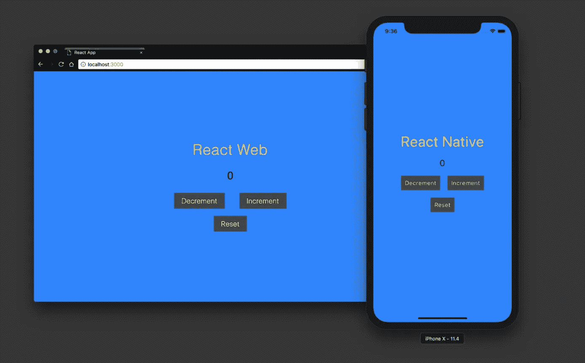

在过去的几个月里，我一直在使用 [React](https://hackernoon.com/tagged/react) Native，这是对我更熟悉的 React web 应用程序开发的一种改变。现在我已经有了使用 React Native 的经验，我将解释一下 React Native 与 React for web 有何不同，以及在使用 React Native 进行开发时会遇到什么情况。

# 反应

先简单说一下 React。React 是一个用于构建用户界面的 JavaScript 库。它最初由[脸书](https://hackernoon.com/tagged/facebook)于 2013 年发布。React 使用虚拟 DOM 的概念来表示当应用程序状态改变时，用户界面应该是什么样子。

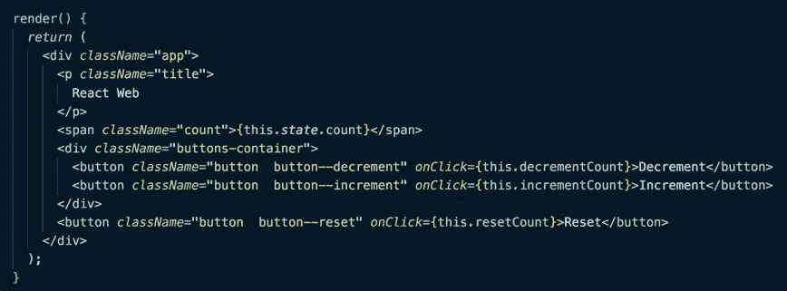

Code screenshot of a React component’s render method

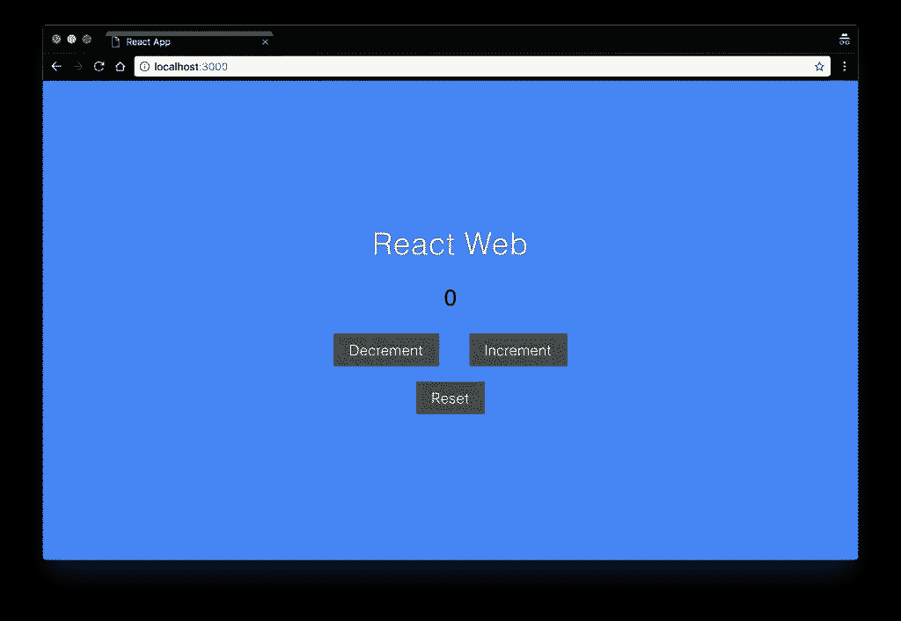

Check out this sick React web app I built

# 反应自然

React Native 是一个移动框架，用于使用 JavaScript 构建移动应用。不出所料，它使用 React 库来构造 UI 组件以及定义应用程序的业务逻辑。它最初是在 2015 年由脸书发布的。React Native development 提供的一个新特性是标准的 Native development 所没有的，那就是它的 live reload 特性，该特性可以在对代码进行更改后快速重新编译并提供绑定的 javascript 文件。这个特性在 web 上已经存在一段时间了，但是在移动开发领域，它还是一个新概念。

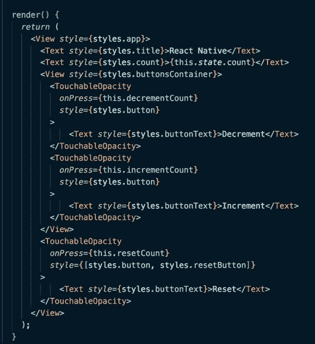

Code screenshot of a React Native component’s render method

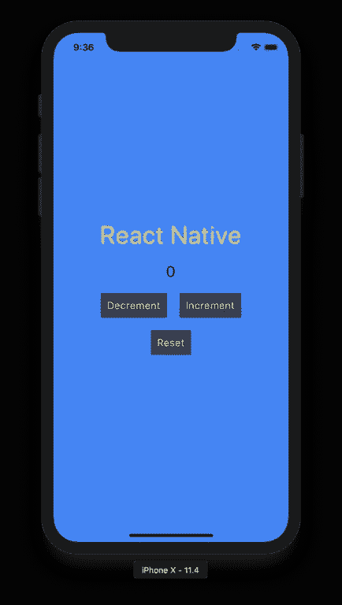

Check out this sick React Native app I built

# 类似

## 都用…反应！

使用 React on web 和 React Native 构建的应用程序的 ui 都将具有相同的一般 JavaScript 结构和`props`、`state`，以及所有标准的 React 组件生命周期方法。您可以在 React Native 中使用与 React 在 web 上相同的状态管理库(例如 Redux)。

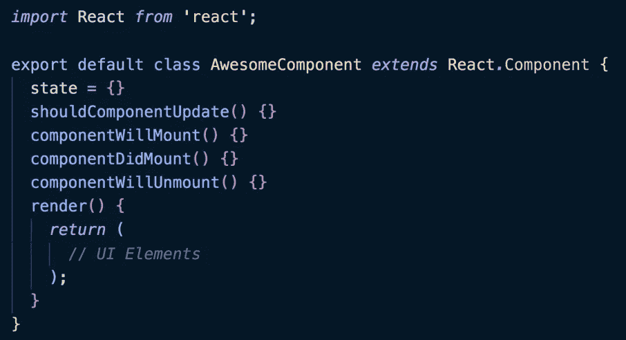

In React Native, you can find all the standard React lifecycle methods you’ve learned to love in React

## JSX

React Native stills 在组件的 render 方法中使用 JSX 作为模板语言来定义 UI。尽管 React Native 中使用的基本组件不是 DOM 元素，如`
`，但您仍然可以使用相同的语法，因为它都是 JSX。

## 浏览器调试

React Native 中的 JavaScript 代码通常在设备的 JavaScript 引擎上进行解析，该引擎称为 JavaScript 内核。然而，如果您在移动模拟器上启用调试模式，您将能够通过浏览器的 JS 引擎运行 JavaScript，因此您将能够访问 Chrome 调试工具等工具。这允许您使用`console.log()`语句并在浏览器的控制台中读取输出。您还可以检查正在进行的 XHR 请求，如果您正在使用 Redux，您也可以利用 [Redux Devtools](https://github.com/zalmoxisus/redux-devtools-extension) 。

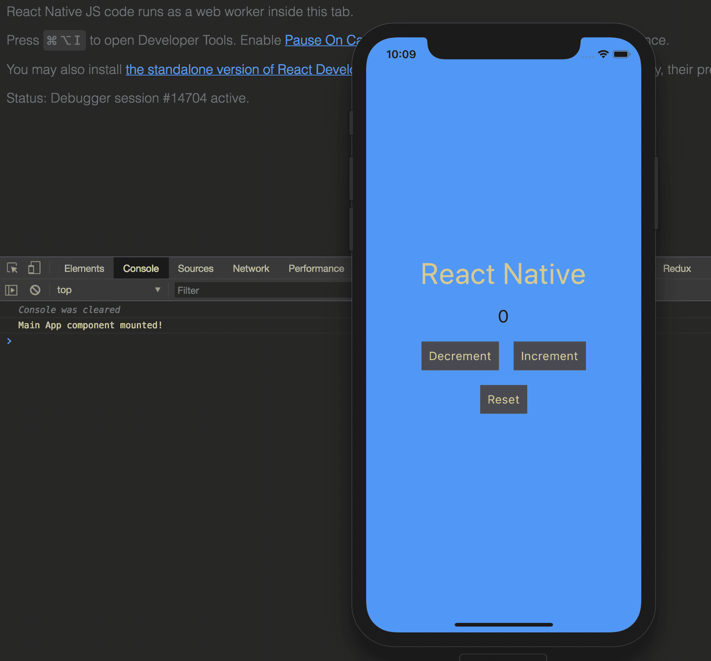

You can use a brower’s debugging tools with React Native when operating the app in “debug mode”

## package.json

JavaScript 依赖关系都可以用`yarn`或`npm`来管理，你会看到所有这些可爱的依赖关系都被记录在一个`package.json`文件中。这允许您利用 NPM 提供的所有包，因此像`lodash`、`date-fns`和`immutable`这样的流行依赖项可以在 React 本地项目中使用。然而，任何依赖于 HTML、SVGs 或浏览器画布的依赖项都不能与 React Native 一起使用。

# 差异

## 基础组件

React native 附带了一组内置组件，可用于在页面上呈现 UI 元素。这些不同于标准的`
`、`
`、`<input>`以及其他在 web 上与 React 一起使用的 DOM 元素。React 的一些原生内置组件包括`<Text>`、`<View>`、`<TextInput>`和`<Image>`。当然还有许多其他的组件，也有一些第三方组件可以从 NPM 下载。

## 式样

在 React Native 中，样式不是用 CSS 完成的，但是语法非常相似。要在 React Native 中应用样式，需要创建一个`[StyleSheet](https://facebook.github.io/react-native/docs/stylesheet)`对象，并将其应用于组件的`style`属性。`StyleSheet`对象中使用的属性和值类似于 CSS 中的内容，但是命名使用了 camelCase，并且 React 原生样式中还缺少许多功能，这些功能在常规 CSS 中也可以找到。

**网络造型:**

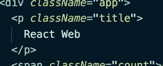

A class name is associate with a DOM element

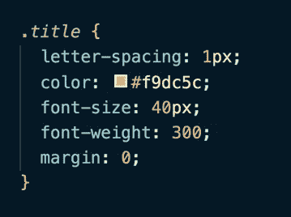

CSS targets the element via a classname and assigns a set of properties and values to the associated element

**本地风格:**

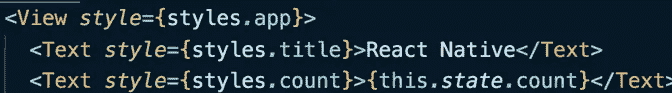

A style object is assigned to a component’s style attribute

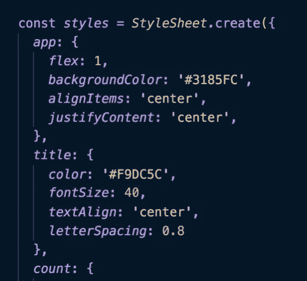

The style object is created using the StyleSheet module

## 路线和导航

React Native 在应用程序中实现原生导航有两种流行的选择:[React Navigation](https://reactnavigation.org/)&[React Native Navigation](https://wix.github.io/react-native-navigation/#/)。如果你问我的话，我会说是非常棒的原创名字。就个人而言，React 原生导航是我更喜欢的解决方案，因为它使用与 iOS 和 Android 相关的实际原生导航 API，而 React 导航的实现完全是用 JavaScript 完成的。

老实说，当处理复杂的嵌套路由和样式导航相关的元素并不总是显而易见时，在 Native 上合并导航可能会很痛苦。路由 React web 应用程序要简单得多。

## 平台特定代码

React Native 可以检测应用程序运行在哪个平台上(iOS 或 Android)，并基于该平台提供不同的代码集。这可以通过将 React 组件分成以`ios.js`和`android.js`结尾的文件来完成，也可以使用 React Native 附带的平台模块来完成。

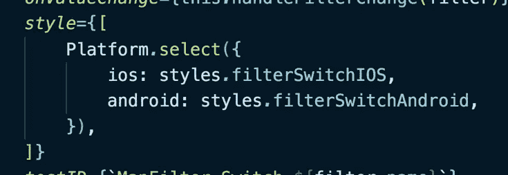

The Platform module is used to serve a different set of styles for iOS and android

## JavaScript 运行时

React Native 通过设备的 *JavaScript 内核*运行其 JavaScript，除非应用程序运行在调试模式下，在这种情况下，浏览器的 JavaScript 引擎会解析 JavaScript。

在 2 个不同的线程上反应本机运行。*主*线程负责呈现 UI 和接收用户手势，而 *JavaScript* 线程负责定义 UI 的结构以及处理应用程序的业务逻辑。

React Native 架构非常有趣，你可以在 YouTube 上找到许多脸书开发者关于 React Native 内部工作的精彩演讲。如果你有兴趣了解更多，这里有两个值得一看的演讲:[一个](https://www.youtube.com/watch?v=7rDsRXj9-cU)，[两个](https://www.youtube.com/watch?v=plTTFqbEiEE)。

# 个人观点

好了，说实话:为网络开发比为移动开发更令人愉快。React Native 没有像围绕 web 应用程序的社区那样大的开发人员社区，所以该工具对 React Native 来说不太好也就不足为奇了。在 React Native 中调试代码有时会很困难，这可能会导致一些挫折。

虽然 React Native 可以说是跨平台移动应用程序的最佳工具，但我希望渐进式 web 应用程序继续流行，并最终允许响应式 Web 应用程序包含原生移动功能。当那一天到来时，开发人员将能够开发一个响应迅速的 web 应用程序，通过浏览器 API 包含一些本地移动功能，并且只需担心一个代码库！

在此之前，React Native 是快速开始用 JavaScript 构建应用程序的好方法🚀。

如果你觉得这篇文章很有趣，并且对前端开发感兴趣，可以考虑在 [**Twitter**](https://twitter.com/RobertCooper_RC) 、 [**Github**](https://github.com/robertcoopercode) 或 [**LinkedIn**](https://www.linkedin.com/in/robert-cooper/) 上关注我。