# 🚘在大联盟旅行。下一跳:逐步引导识别可驾驶区域

> 原文：<https://medium.com/hackernoon/traveling-the-ml-next-hop-step-by-step-guide-to-recognize-drivable-area-f48c1e1bb76d>

我们很自豪地发布“监管下的乡村道路”数据集，分享我们的研究，作为如何为可驾驶区域建立语义分段模型的教程，并提供[源代码](https://github.com/supervisely/supervisely/tree/master/tutorials/02_unet_inference)，以便您将了解如何与[监管下](https://supervise.ly/)建立、下载和使用自定义模型。所以你也可以很容易地复制下面的所有步骤。

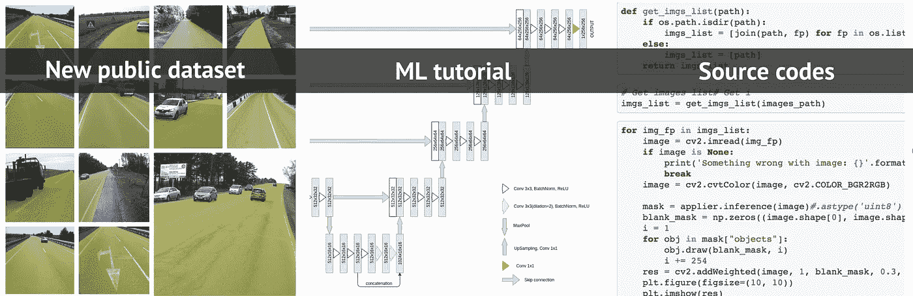

## 动机

自动驾驶行业今天非常庞大，公司投资硬件、软件和标记的数据。不仅是自动驾驶汽车，还有机器人——送东西的快递员、道路质量检测和其他应用程序。

这篇文章的主要目的是为自动驾驶行业最常见的任务——可驾驶区域识别——提供尽可能最快的指导。

**我们想要的是……**

*   获取训练数据，在数据转换/处理程序上花费尽可能少的时间
*   选择一个模型，像网络一样的东西，训练并运行它
*   在 jupyter 笔记本中可视化结果
*   作业:通过利用公共数据集和更复杂的神经网络架构，尝试改进我们最初的解决方案

**我们不想要的是…**

*   花几个小时下载几十亿字节的带注释的图像，并将它们从一种格式转换成另一种格式
*   了解数据格式吗
*   尝试各种 github repos，直到我们找到正确的一个——实际工作的语义分段模型的实现

既然我们的偏好已经定义好了，让我们考虑解决这个任务的整体方法。有两个重要的挑战需要应对:

1.  在一个环境中完成整个研究是非常理想的。在这种情况下，将没有必要做不必要的数据转换，并在不同的工具和 github repos 之间切换
2.  虽然我们可以使用公共数据集(城市景观或地图)来提取可驾驶区域分割掩膜，但我们的数据集最好是轻量级、简单易用的。

因此，在 [Supervise.ly](https://supervise.ly/) 平台内完成所有工作解决了第一个挑战。为了解决第二个问题，我们发布了“超级乡村公路”数据集。

本教程的所有步骤都将在没有任何编码的监督下完成。高级计划如下:您将向您的帐户添加“超级乡村道路”数据集，使用 DTL(数据转换语言)创建增强的训练数据集，训练 NN 并将其应用于测试图像，然后您可以下载 NN 权重并在 [jupyter 笔记本](https://github.com/supervisely/supervisely/tree/master/tutorials/02_unet_inference)中运行推理。

让我们开始吧！

## 第一步。将“超级乡村公路”数据集添加到您的帐户。

城市景观和地图数据集主要是关于城市环境的。但是有很多情况下，自动驾驶汽车必须在乡村道路上行驶:自动收割机、卡车和农业机器人。不能直接使用上述数据集执行此任务的另一个原因是，许多类(如“路肩”)被标记为中性。这导致对乡村道路上可行驶区域的不准确预测。

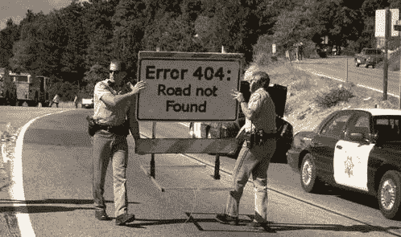

我们在 [DeepSystems](https://deepsystems.ai) 有一个关于这个主题的项目，我们很高兴与社区分享我们的内部数据集和一些实验。我们相信这一贡献将对许多研究人员有用。我们发布了 1000 张带标签的图片和 500 张测试图片。我们试图保留标签图像的多样性。

要获取该数据集，只需进入“导入”->“数据集库”页面，选择“监管乡村道路”数据集，并将结果项目的名称定义为“乡村道路标签”。仅此而已。

以下是一些带有标签的图片示例:

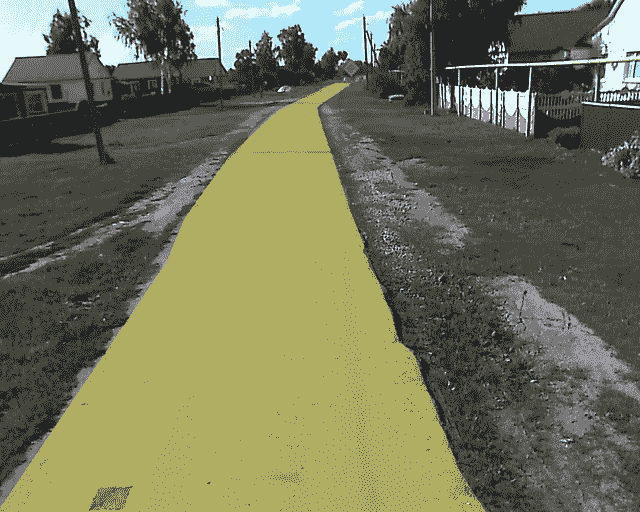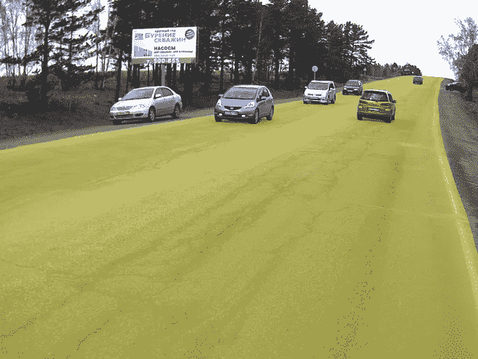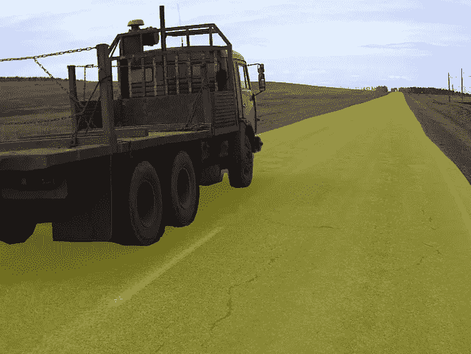

## 第二步。准备训练数据集

在 Supervisely 里面我们有一个特殊的模块叫做 DTL(数据转换语言)。它允许合并数据集，进行类映射，过滤对象和图像，当然还可以对数据进行各种扩展。

你只需要把数据操作堆在一起。因此，你可以建立自定义的计算图形(类比是神经网络层的图形)，每个你的图像和它的注释将通过这个图形，结果将被保存到新的项目。在大多数情况下，自动增强会显著提高精确度。

我们为您准备了 DTL 查询。只需进入“DTL”页面，复制并粘贴 json 文件([链接到 github](https://github.com/supervisely/supervisely/blob/master/tutorials/02_unet_inference/dtl_for_training.json) )，然后按“开始”按钮。作为 DTL 查询的结果，将创建具有 12k 图像的新项目。它将包含原始图像，翻转版本，以及其他一些增强:随机作物，亮度，对比度和颜色转换，以及模糊。这个例子说明了使用我们的平台准备训练数据集是多么简单快捷。

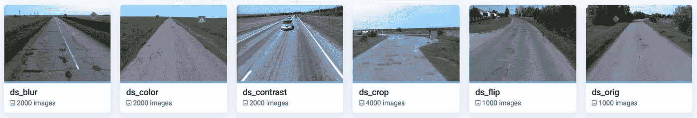

您将在下面找到应用转换的详细描述。

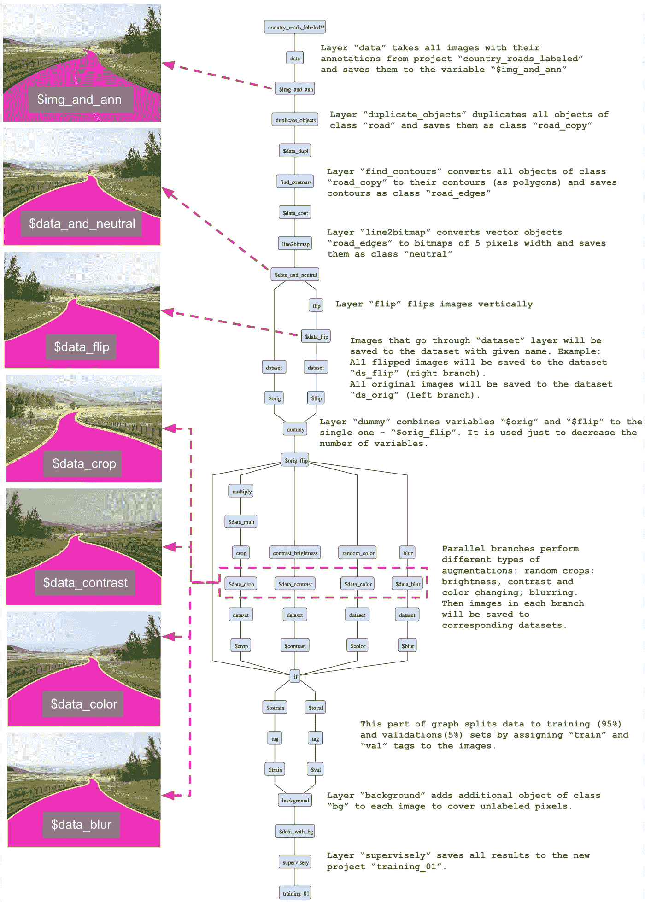

## 第三步。用于语义分割训练神经网络

在训练 NN 之前，你必须将带有 GPU 的计算机连接到你的帐户。转到“集群”页面，然后单击“添加节点”按钮。然后在你的计算机上执行以下命令。

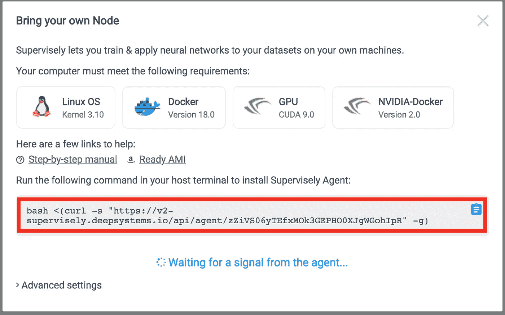

Docker 图像将被拉，并且超级代理(我们的任务管理器)将在您的计算机上启动。它会自动连接您的 PC 到您的帐户，您将能够使用您的 GPU 进行所有 NN 相关的任务(训练/推理/部署)。源代码也可以在我们的[公共 git repo](https://github.com/supervisely/supervisely) 中获得。

让我们训练分割神经网络来识别可驾驶区域。只需进入“神经网络”->“模型动物园”页面，选择“UNet V2 (VGG 重量)”并点击“添加模型”按钮。此型号将添加到您的帐户中。然后单击模型附近的“Train”按钮，选择训练项目“training_01”，将结果 NN(最新检查点)的名称定义为“nn_roads”，从模板中选择训练配置(从模型动物园添加模型后，它会自动添加)，然后按“Start training”按钮。在我们有大量截图的文档中找到例子[在这里](https://docs.supervise.ly/neural-networks/examples/unet_lemon/)。

训练后，模型“nn_roads”将出现在您的模型列表中。在培训期间，您可以实时监控指标:

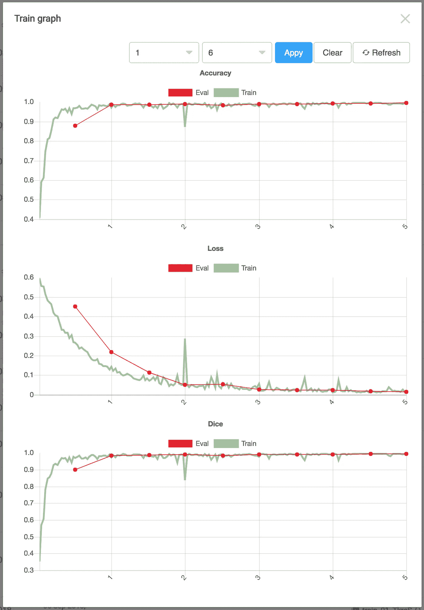

## 第四步。可视化预测

让我们将测试图像从“导入”->“数据集库”->“监督乡村道路[测试]”添加到您的帐户，作为项目“乡村道路测试”。

现在，您可以按下模型(您刚刚训练过的模型)旁边的“测试”按钮，选择“country_roads_test”项目，定义将包含测试图像和神经网络预测的结果项目的名称，然后按下“开始推断”按钮。以下是对测试图像进行神经网络预测的几个例子:

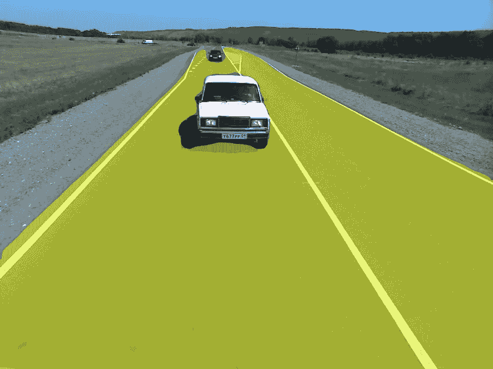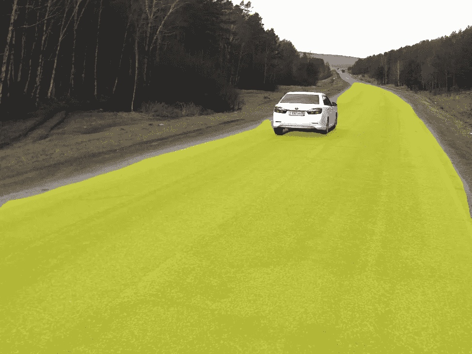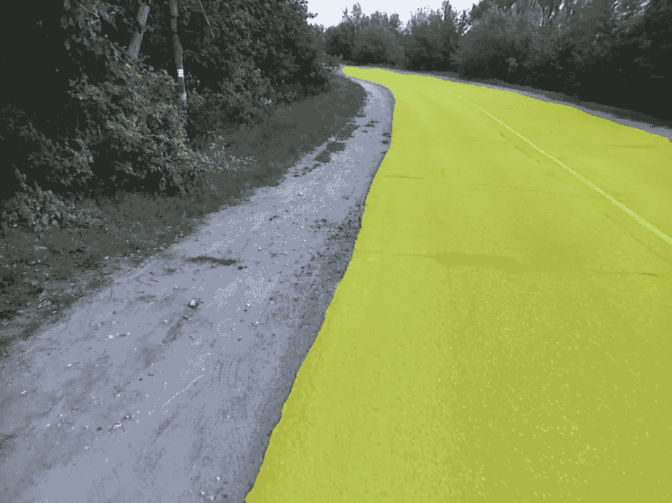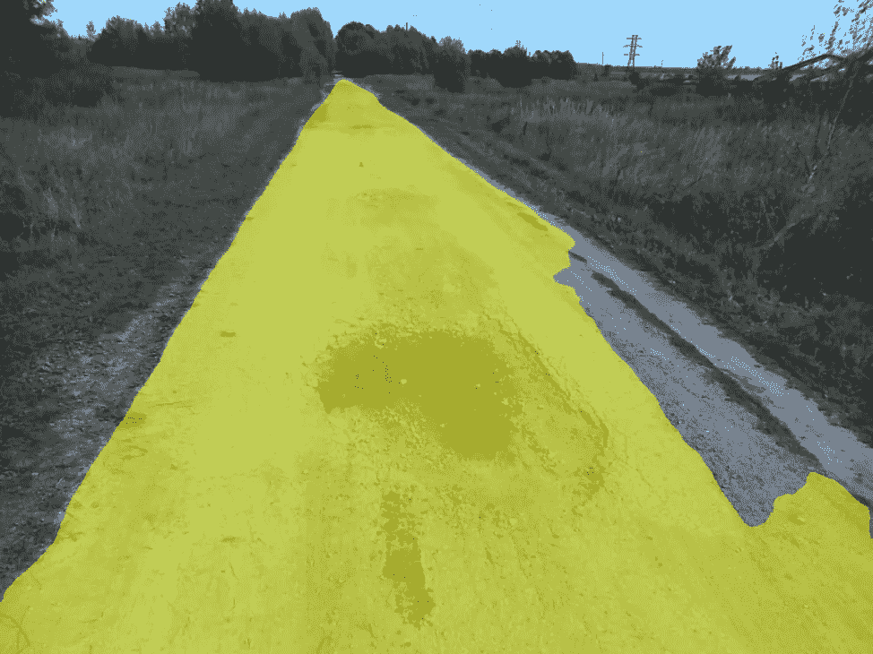

## **第五步。下载最终模型并以您想要的方式使用它(例如 jupyter 笔记本)**

这个想法是，你可以使用 Supervisely 进行大量的研究实验，而不需要任何编码。但是如何在生产中使用模型呢？选项 1。部署为 API(我们在之前的[文章](https://hackernoon.com/can-you-solve-a-person-detection-task-in-10-minutes-74fba061194c)中描述了整个过程)。在本教程中，我们将向您展示另一种方式——选项 2:您可以下载 NN 权重，然后使用我们的源代码在 [jupyter 笔记本](https://github.com/supervisely/supervisely/blob/master/tutorials/02_unet_inference/src/02_unet_inference.ipynb)中运行它。笔记本包含推理的例子。

默认情况下，模型存储在您的机器上。只需点击“上传到主管”按钮，然后点击“下载”按钮([链接到文档](https://docs.supervise.ly/neural-networks/my-models/my-models/))。因此，tar 归档文件将被下载。

这里是我们的 github 的[链接，并附有本教程的示例。只需按照](https://github.com/supervisely/supervisely) [readme.md](https://github.com/supervisely/supervisely/tree/master/tutorials/02_unet_inference) 中的说明操作即可(只需将模型解压到某个目录并运行 docker 容器即可)。

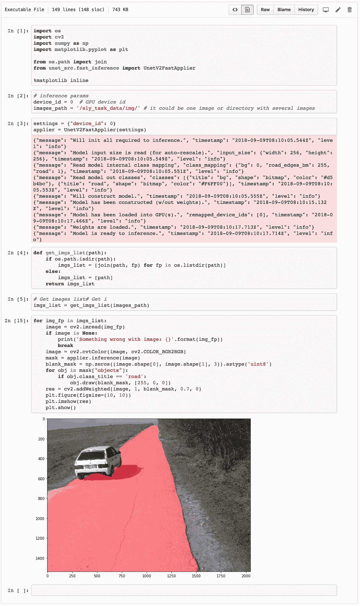

## 结论

在这篇文章中，我们展示了如何从头开始构建可驾驶的区域分割模型。

虽然，这项任务让你了解了自动驾驶公司正在做什么，但生产就绪型解决方案需要克服更多挑战。

*   **来自不同数据集的多类对象。**在更复杂的场景中，我们必须建立一个能够分割多类对象的模型，如汽车、行人、自行车、路标等。实际上，构建“多类数据集”需要时间&努力，因为需要标注/合并/过滤/清理来自不同来源的数据。
*   **阶层失衡问题。**在多类设置中，一些对象被低估。例如，在道路场景中，自行车远没有汽车频繁出现。这使得训练一个神经网络来实现对稀有类对象的所需精度水平变得具有挑战性。
*   **持续模型改进。**生产级解决方案应稳定，能够以适当的方式识别“边缘情况”图像。因此，我们需要首先识别这些“边缘情况”图像，然后标记它们，最后重新训练模型。所描述的过程是连续的，有时被称为主动学习。尽可能自动化是非常可取的。

如有任何问题，欢迎在我们的公共[松弛](https://supervise.ly/slack)中提问。我们很乐意帮助您！

我们将在接下来的帖子中解决上述挑战。同时，如果你觉得这篇文章有趣，给它一些👏，让更多的人可以看到它！